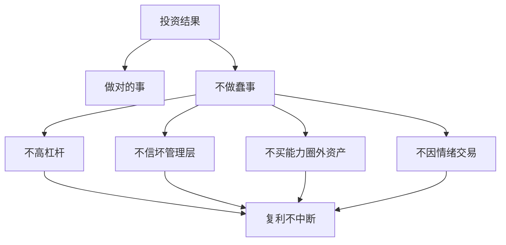

## 查理芒格思维筑基课: 定律2: 避免愚蠢定律 - 投资先减少毁灭性错误

### 作者
digoal

### 日期
2026-05-19

### 标签
避免愚蠢 , 毁灭性错误 , 投资禁区 , 长期复利 , 杠杆风险 , 诚信风险 , 能力圈 , 追涨风险 , 风险控制 , 芒格思想

----

## 背景

> 面向对象: 投资者  
> 核心问题: 为什么长期赢家常常不是最聪明的人，而是少犯大错的人？  
> 先说结论: 投资里很多收益来自不做蠢事: 不碰过度杠杆、不跟骗子合作、不买看不懂的资产、不用高价格透支好公司。

## 一张图先看懂

## 求真讲法

### 它到底说了什么

这条定律说: 长期投资不要求每天都聪明，但要求尽量不犯会毁掉本金、信誉和判断力的大错。

芒格式智慧经常表现为“不做”: 不参与看不懂的热潮，不因为市场涨跌改变原则，不为一点额外收益承担毁灭风险。

### 它是怎么来的

它从有限理性和复利公理推出。人会错，所以要减少错误暴露；复利怕中断，所以要先避开致命错误。

### 它依赖哪些假设

| 假设 | 含义 |
|---|---|
| 大错代价非线性 | 亏50%要赚100%回本 |
| 很多错误可提前避免 | 杠杆、欺诈、复杂性、追涨有明显信号 |
| 少犯大错能显著提高长期结果 | 复利需要生存 |

### 常见误解

| 误解 | 更准确的理解 |
|---|---|
| 避免愚蠢就是保守 | 它让你有资格在好机会重仓 |
| 不犯错就等于不行动 | 是不做低质量行动 |
| 错误都能靠止损解决 | 有些错误在发现前已造成永久损害 |

## 求存讲法

### 它有什么用

它形成投资禁区清单。禁区比机会清单更重要，因为机会错过了还有下一次，毁灭性错误可能没有下一次。

### 它怎么迁移到投资流程

| 禁区 | 触发条件 |
|---|---|
| 诚信问题 | 财务造假、利益输送、重大隐瞒 |
| 致命杠杆 | 低谷时可能被迫融资或卖资产 |
| 无法理解 | 价值完全依赖复杂假设 |
| 价格疯狂 | 好公司被买成坏赔率 |

### 它的适用范围和边界

适用于所有长期投资者。边界是: 避免愚蠢不能替代寻找优秀机会，否则会变成只防守不进攻。

### 正例: 怎么用它提升能力

投资者发现一家高增长公司，但现金流长期为负、应收账款激增、管理层频繁调整口径。他选择放弃。即使股价短期上涨，这仍是高质量决策。

### 反例: 前提不成立会怎样

投资者为了提高收益使用高杠杆买入周期股。行业下行时被强制平仓，失去等待恢复的能力。失败点是忽视了毁灭性错误的非线性代价。

## 思考

1. 你的投资禁区是否写下来？
2. 哪些收益机会其实是在出售生存权？
3. 你最容易犯的“聪明人错误”是什么？

## 最后记住

1. 长期复利先要求活着。
2. 不做蠢事是主动策略。
3. 禁区清单能保护判断力。

## 参考资料

- Charlie Munger, *Poor Charlie's Almanack*.
- Warren Buffett, Berkshire Hathaway Shareholder Letters.
- 本文参考本地 `buffett` 技能资料中的风险行为与复利笔记。
  
#### [PostgreSQL 解决方案集合](../201706/20170601_02.md "40cff096e9ed7122c512b35d8561d9c8")
  
  
#### [德哥 / digoal's Github - 公益是一辈子的事.](https://github.com/digoal/blog/blob/master/README.md "22709685feb7cab07d30f30387f0a9ae")
  
  
#### [About 德哥](https://github.com/digoal/blog/blob/master/me/readme.md "a37735981e7704886ffd590565582dd0")
  
  

  
