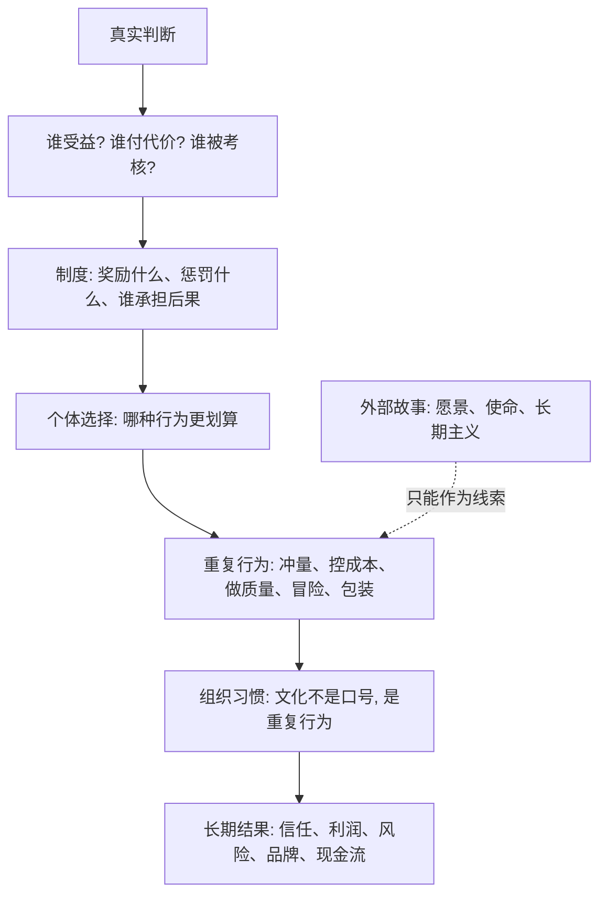

## 查理芒格思维筑基课: 激励超级力量定律: 顺着奖励看真实行为

### 作者
digoal

### 日期
2026-05-19

### 标签
激励超级力量 , 奖励结构 , 真实行为 , 查理芒格 , 代理问题 , 管理层激励 , KPI , 组织文化 , 投资尽调 , 制度设计

----

## 背景

> 面向对象: 大学生、产品经理、运营经理、有投资需求的人  
> 核心问题: 为什么有些组织口号很好听，长期行为却总是朝着相反方向走？  
> 先说结论: 激励是改变行为的超级力量。人们不一定按口号行动，却很容易按奖励、惩罚、晋升、奖金、股权、排名和问责方式行动。想看真实行为，先顺着奖励走一遍。

## 一张图先看懂



## 求真讲法

### 它到底说了什么

“激励超级力量定律”说的是: 激励不是普通因素，而是能持续、系统、放大地改变人和组织行为的力量。

激励不只是钱。它包括奖金、提成、晋升、股权、排名、流量、面子、权力、资源、惩罚、免责、退出机制和声誉。一个组织嘴上说重视什么，不如看它实际奖励什么；一个人说自己相信什么，不如看他做某事能得到什么、犯错由谁买单。

所以这条底层规律可以写成一句话:

**不要先听故事判断行为，要先看奖励结构推演行为。**

### 它是怎么来的

经济学、管理学和投资实践都反复观察到: 人会对收益和成本作出反应。激励一旦进入制度，就不再只是一次选择，而会变成重复行为。

一个简单例子:

```text
口号: 我们重视长期客户价值
奖励: 销售奖金只按当月签单额发放
问责: 退款、投诉、续费率不影响奖金
行为: 夸大承诺、拉低匹配度客户、先签再说
结果: 短期收入上升, 长期留存和口碑下降
```

这里的关键不是“销售人品不好”，而是制度把短期签单奖励得太明确，把长期后果约束得太弱。激励会把普通人的普通选择，放大成组织的长期路径。

### 它依赖哪些假设

| 假设 | 含义 | 如果不成立会怎样 |
|---|---|---|
| 人会响应收益和成本 | 行为会受奖励、惩罚和风险承担方式影响 | 激励分析就失去基础 |
| 重复考核会塑造习惯 | 被长期奖励的行为会沉淀成文化 | 口号会比制度更重要，但现实很少如此 |
| 指标会替代目标 | 人会追求被衡量、被奖励的数字 | KPI 可能把组织带偏 |
| 代理问题普遍存在 | 决策者和出资人、用户、员工的利益可能不一致 | 只听代理人叙事会误判 |
| 激励有副作用 | 奖励 A 可能牺牲 B | 好制度要同时看正向效果和扭曲行为 |

这些假设不是说人一定自私，而是说制度会改变行为概率。好人放进坏制度，也可能做出坏结果；普通人放进好制度，更容易持续做正确的事。

### 常见误解

| 误解 | 更准确的说法 |
|---|---|
| 激励就是钱 | 钱很重要，但晋升、排名、声誉、权力和免责也是激励 |
| 有价值观就不用激励 | 价值观要靠制度保护，否则长期容易被短期奖励侵蚀 |
| 高激励一定好 | 激励方向错，强激励会更快放大错误行为 |
| 看激励就是怀疑人 | 看激励是理解环境，不是预设人坏 |
| 指标越清楚越好 | 指标清楚但目标错，会让组织高效地跑偏 |

## 求存讲法

### 它有什么用

这条规律的实际作用，是帮你穿透故事，看清行为会被什么力量牵引。

很多判断都可以从一句话开始:

```text
顺着奖励走一遍。
```

也就是问:

```text
谁因为这个行为得到好处？
谁因为错误承担代价？
谁掌握信息，谁承担风险？
谁有权决策，谁为结果买单？
短期数字好看时，长期伤害会不会被隐藏？
```

这比单纯听口号更可靠。因为口号描述希望，激励描述约束。

### 它怎么迁移到熟悉领域

| 场景 | 口号或表面现象 | 顺着奖励看 |
|---|---|---|
| 学习 | 学校说重视素质 | 考核到底奖励理解、创造，还是刷题和排名？ |
| 产品 | 团队说用户第一 | 晋升奖励留存和满意度，还是只奖励上线速度？ |
| 运营 | 活动说服务用户 | 奖励复购和口碑，还是奖励短期新增？ |
| 创业 | 公司说长期主义 | 融资压力、现金流和股权结构是否允许长期投入？ |
| 投资 | 管理层说回报股东 | 薪酬、持股、并购、分红和回购是否一致？ |

### 它的适用范围和边界

适用范围:

- 判断公司管理层和员工行为。
- 设计产品、运营、销售、客服和研发指标。
- 分析平台机制、学校制度、企业文化、投资代理问题。
- 识别“嘴上长期主义，制度短期主义”的组织。

边界也要说清楚:

- 激励不是唯一原因。能力、文化、法律、资源、历史路径也会影响行为。
- 激励分析必须基于事实，不能凭空猜测动机。
- 好激励不能保证好结果。方向正确，还需要能力和外部条件。
- 激励会被人适应。制度设计后还要观察是否出现刷指标、规避责任和副作用。

### 正例: 怎么用它提升能力

假设你是运营经理，发现团队做活动越来越频繁，新增人数很好看，但复购率下降、投诉变多。

如果只看表面，你可能会说“团队不够重视用户质量”。顺着奖励看，会发现更深的问题:

| 当前指标 | 被奖励的行为 | 被牺牲的东西 |
|---|---|---|
| 活动新增人数 | 大量拉新、强刺激、重补贴 | 用户质量和毛利 |
| 当月成交额 | 追求短期转化 | 长期复购和信任 |
| 活动曝光量 | 制造话题和标题 | 品牌稳定性 |

更好的激励可以改成:

| 新指标 | 奖励的行为 | 更接近的目标 |
|---|---|---|
| 30/90 天留存 | 拉来真正适合的用户 | 长期价值 |
| 复购率和退款率 | 真实交付和匹配 | 信任 |
| 毛利贡献 | 控制补贴依赖 | 可持续增长 |
| 用户投诉率 | 避免夸大承诺 | 品牌质量 |

这样团队不会只问“怎样把数字做大”，而会问“怎样让好用户留下来并持续创造价值”。

### 反例: 前提不成立会怎样

假设一个投资者听到某公司管理层反复讲“我们以股东回报为核心”，于是买入股票。但他没有检查激励结构。

后来发现:

| 被忽略的激励 | 实际情况 | 后果 |
|---|---|---|
| 薪酬指标 | 奖金主要按收入规模和并购规模发放 | 管理层追求做大，不追求做强 |
| 股权绑定 | 管理层持股很少 | 股价长期下跌对个人影响有限 |
| 资本配置 | 高价并购能扩大管理资产 | 商誉和债务风险上升 |
| 问责机制 | 并购失败几年后才暴露 | 决策者未及时承担代价 |
| 信息披露 | 强调收入，不强调自由现金流 | 投资者误判利润质量 |

几年后，公司规模变大，股东回报却变差。失败不是因为“管理层说谎”四个字就能解释完，而是激励结构长期把行为推向了错误方向。

## 一个顺着奖励看的检查清单

```text
判断行为前 12 问

1. 这个系统口头上说奖励什么？
2. 它实际用钱、晋升、资源、排名奖励什么？
3. 做短期好看但长期有害的事，会不会被奖励？
4. 做长期正确但短期难看的事，会不会被惩罚？
5. 谁掌握决策权，谁承担后果？
6. 谁能从我的误判中获益？
7. 指标是否容易被刷、被包装、被转移成本？
8. 奖励的是规模、速度、利润、现金流，还是长期质量？
9. 管理层、员工、客户和股东的利益是否一致？
10. 历史行为是否和口号一致？
11. 如果完全不听故事，只看激励，我会得出什么判断？
12. 这个激励会产生哪些副作用？
```

这份清单最重要的不是找到坏人，而是找到会持续生产行为的制度力量。

## 思考

激励的可怕之处在于，它常常不需要命令。只要奖励结构摆在那里，人们就会自己调整行为，甚至会给这种行为找到漂亮理由。

如果一个组织奖励短期收入，它会慢慢长出短期文化；如果奖励真实留存，它会慢慢长出交付文化；如果奖励冒险但不惩罚失败，它会慢慢积累尾部风险；如果奖励诚实反馈，它才可能形成学习能力。

可以继续追问:

1. 我所在的组织，真正奖励的是解决问题，还是制造好看的数字？
2. 我自己的学习和投资环境，奖励的是长期进步，还是短期刺激？
3. 如果某家公司说长期主义，我能否在薪酬、持股、现金流和资本配置中看到证据？
4. 哪些指标正在把团队带向错误方向？
5. 如果我重新设计一个制度，怎样让正确行为更容易、错误行为更昂贵？

## 最后记住

1. 激励是超级力量，因为它会持续、重复、系统地塑造行为。
2. 口号说明愿望，奖励结构说明行为大概率会走向哪里。
3. 看企业、团队和合作对象，先问谁受益、谁承担后果、谁被考核。
4. 错误指标会让好人做出坏结果，正确制度会让普通人更容易做对事。
5. 投资和创业中，顺着奖励看，往往比顺着故事听更接近真相。

## 参考资料

- Adam Smith, "The Wealth of Nations", 1776.
- Ronald H. Coase, "The Nature of the Firm", 1937.
- Steven Kerr, "On the Folly of Rewarding A, While Hoping for B", 1975.
- Michael C. Jensen and William H. Meckling, "Theory of the Firm: Managerial Behavior, Agency Costs and Ownership Structure", 1976.
- Michael C. Jensen, "Value Maximization, Stakeholder Theory, and the Corporate Objective Function", 2001.
- Charles T. Munger, "Poor Charlie's Almanack", 2005.
- Daniel Kahneman, "Thinking, Fast and Slow", 2011.
  
#### [PostgreSQL 解决方案集合](../201706/20170601_02.md "40cff096e9ed7122c512b35d8561d9c8")
  
  
#### [德哥 / digoal's Github - 公益是一辈子的事.](https://github.com/digoal/blog/blob/master/README.md "22709685feb7cab07d30f30387f0a9ae")
  
  
#### [About 德哥](https://github.com/digoal/blog/blob/master/me/readme.md "a37735981e7704886ffd590565582dd0")
  
  

  
