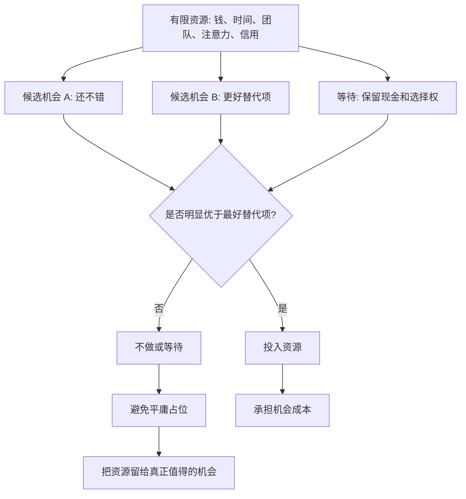

## 查理芒格思维筑基课: 机会成本定律: 不够好就是不够好

### 作者
digoal

### 日期
2026-05-19

### 标签
机会成本 , 不够好 , 资源配置 , 查理芒格 , 投资筛选 , 产品排期 , 创业选择 , 替代项 , 长期复利 , 决策标准

----

## 背景

> 面向对象: 大学生、产品经理、运营经理、有投资需求的人  
> 核心问题: 为什么很多选择明明不差，最后却拖慢了人生、产品、创业和投资的长期结果？  
> 先说结论: 资源有限时，判断标准不能停在“它还可以”，而要追问“它是否足够好，值得我放弃最好替代项”。不够好就是不够好，因为平庸选择会占用最稀缺的时间、资本、注意力和机会窗口。

## 一张图先看懂



## 求真讲法

### 它到底说了什么

“机会成本定律”说的是: 一个选择的真实成本，不只是你花出去的钱和时间，还包括你因此放弃的最好替代选择。

“不够好就是不够好”是这条定律在现实决策里的锋利表达。它不是说一个东西很差，而是说它没有好到值得占用你的稀缺资源。

一只股票可能不贵，一个项目可能能赚钱，一个岗位可能待遇不错，一个功能可能有人要。但如果它占用了你本可以投向更好机会的资金、团队、时间和注意力，它就仍然可能是坏选择。

所以这条底层规律可以写成一句话:

**选择不是和零比较，而是和你能选择的最好替代项比较。**

### 它是怎么来的

机会成本来自经济学中最基本的稀缺性。人、企业和投资者都不可能同时拥有所有机会。

```text
你选择一只普通股票
  = 放弃持有现金等待更好价格
  = 放弃买入更高质量公司
  = 放弃降低风险的指数基金
  = 放弃研究更懂的机会
```

查理·芒格式决策的挑剔，正来自这种比较方式。他不是只问“这个东西有没有优点”，而是问“它和我能找到的最好选择相比，是否足够好”。

这会把很多“还不错”的选择筛掉。因为在长期复利中，平庸不是中性，它会占位。

### 它依赖哪些假设

| 假设 | 含义 | 如果不成立会怎样 |
|---|---|---|
| 资源有限 | 资金、时间、注意力、团队不能无限投入 | 如果资源无限，就不必挑剔 |
| 选择之间互相排斥 | 做 A 会减少做 B 的能力 | 如果完全不冲突，机会成本较低 |
| 替代项可比较 | 至少能在目标、风险和期限上比较 | 如果目标混乱，就不知道什么算更好 |
| 好机会稀缺 | 真正值得重投的机会不多 | 如果好机会无限，等待价值下降 |
| 平庸会占位 | 一般机会会消耗资源和心智 | 不筛选就会被“还可以”填满 |

这些假设说明，“不够好就是不够好”不是完美主义，而是资源管理。它要求你把最稀缺的资源放到最值得的地方。

### 常见误解

| 误解 | 更准确的说法 |
|---|---|
| 不够好就是不做任何事 | 它要求提高门槛，不是停止行动 |
| 必须永远等最完美机会 | 现实中没有完美，要找风险收益明显占优的机会 |
| 只看收益最高的选项 | 还要比较风险、流动性、能力圈、期限和不可逆性 |
| 机会成本只适用于投资 | 产品排期、职业选择、创业方向、学习计划都适用 |
| 平庸选择没坏处 | 平庸选择最大的坏处是占用资源和注意力 |

## 求存讲法

### 它有什么用

这条规律的实际作用，是帮你拒绝“看起来还行”的低质量占位。

很多人不是被明显坏选择拖垮，而是被大量中等选择填满:

```text
不差但不增长的岗位
有用户但不解决核心痛点的功能
有收入但损害品牌的活动
不亏但长期跑输的股票
能做但不匹配资源的创业方向
```

它们的共同点是: 短期都能给你一个理由继续做，长期却让你失去更好的选择权。

### 它怎么迁移到熟悉领域

| 场景 | “还不错”陷阱 | “不够好就是不够好”的问法 |
|---|---|---|
| 学习 | 每门课都学一点 | 哪个能力最能复利，最该优先投入？ |
| 职业 | 岗位稳定但成长慢 | 它是否值得占用未来三年的成长窗口？ |
| 产品 | 小需求很多 | 哪个问题最影响留存、付费和核心价值？ |
| 运营 | 活动都有一点效果 | 哪个活动带来高质量用户和长期信任？ |
| 创业 | 市场都能讲故事 | 哪个切入点最匹配团队资源和现金流？ |
| 投资 | 标的看起来都不贵 | 哪个资产最值得占用本金和耐心？ |

### 它的适用范围和边界

适用范围:

- 资源有限且选择很多的场景。
- 长期结果受复利影响的决策。
- 需要排优先级的产品、运营、投资、创业和职业选择。
- 平庸机会很多、真正好机会稀缺的环境。

边界也要说清楚:

- 早期探索可以低成本多试，但不能重仓平庸选择。
- 学习新领域时，低质量尝试可以作为样本，但要控制时间和成本。
- 不够好不是情绪判断，要有目标、替代项和评价标准。
- 有些基础任务必须做，即使它不“优秀”，因为它是系统运行成本。

### 正例: 怎么用它提升能力

假设你是产品经理，团队下个季度只能做一个大项目。候选项有三个:

| 候选项 | 看起来的好处 | 机会成本视角 |
|---|---|---|
| 做一个展示型新功能 | 容易宣传，老板喜欢 | 可能不提升留存和付费 |
| 优化核心流程 | 不够炫，但影响所有用户 | 可能提升激活、留存和转化 |
| 接一个大客户定制 | 立刻有收入 | 可能拖慢主线产品，增加维护负担 |

“还不错”的团队可能三个都想做，最后每个都做一半。“不够好就是不够好”的团队会先问:

```text
哪个项目最接近当前最重要瓶颈？
哪个项目的收益能复用到最多用户？
哪个项目会增强长期竞争力？
哪个项目如果不做，代价最大？
```

如果核心流程是最大瓶颈，那么展示型功能和定制项目即使不差，也可能不够好。把资源集中到核心流程上，才更符合机会成本定律。

### 反例: 前提不成立会怎样

假设一个投资者买入一堆“看起来便宜”的股票。每只股票都有一点理由: 市盈率低、分红还行、跌了很多、有人推荐。他觉得分散后风险不大。

问题在于，他忽略了“不够好就是不够好”:

| 被忽略的前提 | 实际情况 | 后果 |
|---|---|---|
| 资源有限 | 本金被十几只普通股票占用 | 真正好机会出现时没现金 |
| 替代项可比较 | 有更高质量、更确定的公司 | 平庸组合拖慢复利 |
| 平庸会占位 | 每只都要关注和解释 | 注意力被分散 |
| 好机会稀缺 | 他把普通机会当作必须参与 | 降低选择标准 |
| 目标要清楚 | 他没有明确追求现金流、成长还是低风险 | 组合变成杂货篮 |

几年后，组合没有大亏，却长期跑输更好的替代项。表面上看，他没有犯大错；实际上，最大的错误是让平庸长期占位。

## 一个“不够好就不做”清单

```text
投入资源前 12 问

1. 我现在最稀缺的资源是什么？
2. 这个机会会占用多少资金、时间、团队和注意力？
3. 我能选择的最好替代项是什么？
4. 它是否明显好于最好替代项？
5. 如果不做它，我会失去什么？
6. 如果做了它，我会错过什么？
7. 它能否增强长期复利？
8. 它是否在我的能力圈内？
9. 它的风险是否可理解、可承受、可补偿？
10. 我是因为它足够好才做，还是因为不想空着？
11. 现金、等待和保留选择权是否更好？
12. 什么证据出现时，我应该停止投入？
```

这份清单的核心，是让资源从“还可以”流向“真正值得”。

## 思考

“不够好就是不够好”最难的地方，是它要求你拒绝有优点的东西。

拒绝明显坏选择不难，拒绝有一点好处、有一点收益、有一点希望的选择才难。因为它们给人安全感: 至少我在行动，至少我没有错过，至少它看起来有道理。

但长期看，资源真正的敌人常常不是坏机会，而是太多中等机会。它们不一定让你立刻失败，却会让你没有精力、现金和耐心等到真正值得的机会。

可以继续追问:

1. 我现在最大的资源占用，是否来自一堆“还不错”的选择？
2. 如果把最好替代项摆上桌，当前选择还足够好吗？
3. 我是在做战略选择，还是在用忙碌掩盖取舍困难？
4. 我的投资组合里，哪些标的只是“不差”，但并不真正值得？
5. 如果我少做一半事情，是否反而能把最重要的事做得更好？

## 最后记住

1. 机会成本是被放弃的最好替代项。
2. 资源有限时，“还不错”不等于“值得做”。
3. 平庸选择会占用资金、时间、注意力和机会窗口。
4. 不够好就是不够好，不是完美主义，而是高质量取舍。
5. 投资、创业和产品决策中，把资源留给明显优于替代项的机会。

## 参考资料

- Friedrich von Wieser, "Natural Value", 1889.
- Lionel Robbins, "An Essay on the Nature and Significance of Economic Science", 1932.
- Paul A. Samuelson and William D. Nordhaus, "Economics", multiple editions.
- Charles T. Munger, "Poor Charlie's Almanack", 2005.
- Warren E. Buffett, Berkshire Hathaway shareholder letters.
- Benjamin Graham, "The Intelligent Investor", revised editions.
- Richard P. Rumelt, "Good Strategy Bad Strategy", 2011.
  
#### [PostgreSQL 解决方案集合](../201706/20170601_02.md "40cff096e9ed7122c512b35d8561d9c8")
  
  
#### [德哥 / digoal's Github - 公益是一辈子的事.](https://github.com/digoal/blog/blob/master/README.md "22709685feb7cab07d30f30387f0a9ae")
  
  
#### [About 德哥](https://github.com/digoal/blog/blob/master/me/readme.md "a37735981e7704886ffd590565582dd0")
  
  

  
