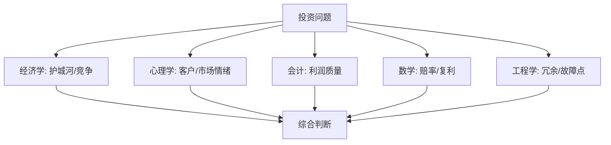

## 查理芒格思维筑基课: 定律3: 多元思维模型定律 - 用模型格栅看企业

### 作者
digoal

### 日期
2026-05-19

### 标签
多元思维模型 , 模型格栅 , 企业价值 , 跨学科分析 , 经济学 , 心理学 , 会计分析 , 数学概率 , 工程思维 , 芒格思想

----

## 背景

> 面向对象: 投资者  
> 核心问题: 怎样避免用单一视角误判公司？  
> 先说结论: 多元思维模型不是知识收藏，而是把经济学、心理学、会计、数学和工程学放进同一张判断网，交叉检验企业价值。

## 一张图先看懂

## 求真讲法

### 它到底说了什么

它说: 一个企业不能只用一个学科解释。投资者要建立模型格栅，让每个重要结论都被多个角度检查。

例如，品牌公司不仅要看毛利率，还要看消费者心理、渠道经济、广告效率、库存质量和定价权。

### 它是怎么来的

它从“世界是多因果系统”推出。既然企业价值由多种力量共同决定，单一模型就必然漏掉关键因果。

### 它依赖哪些假设

| 假设 | 含义 |
|---|---|
| 不同学科看到不同风险 | 会计看现金流，心理学看行为 |
| 模型之间能互相纠偏 | 低估值模型可被行业衰退模型修正 |
| 模型要服务判断 | 不是背术语，而是解释现实 |

### 常见误解

| 误解 | 更准确的理解 |
|---|---|
| 模型越多越好 | 有用且能落地的模型才重要 |
| 多模型会让决策复杂化 | 好模型最终会压缩关键变量 |
| 财务模型最客观 | 财务常是结果，不是全部原因 |

## 求存讲法

### 它有什么用

它减少“单点自信”。当多个模型都支持同一结论，投资判断更稳；当模型互相冲突，就说明需要降仓位或继续研究。

### 它怎么迁移到投资流程

| 步骤 | 模型 |
|---|---|
| 判断生意 | 护城河、规模经济、网络效应 |
| 判断人 | 激励、代理问题、诚信 |
| 判断数字 | 现金流、ROIC、负债 |
| 判断价格 | 内在价值、机会成本、安全边际 |
| 判断心理 | 市场情绪、从众、恐慌 |

### 它的适用范围和边界

适用于深度研究。边界是: 不能为了显得全面而无休止分析，最后必须形成可执行结论。

### 正例: 怎么用它提升能力

投资者研究一家软件公司: 用经济学看转换成本，用会计看递延收入和现金流，用心理学看客户粘性，用数学看净收入留存对复利的影响。结论更可靠。

### 反例: 前提不成立会怎样

投资者只看高增长收入，忽略获客成本、续费率和现金流。后来增长放缓，估值崩塌。失败原因是模型单一。

## 思考

1. 你的投资清单里是否覆盖心理学和激励？
2. 哪个模型最容易被你过度使用？
3. 如果多个模型冲突，你会降低信心还是强行解释？

## 最后记住

1. 模型格栅是防盲区工具。
2. 单一指标不能承载复杂判断。
3. 好模型要能解释现金流和行为。

## 参考资料

- Charlie Munger, *Poor Charlie's Almanack*.
- 本文参考本地 `buffett` 技能资料中的多元思维模型笔记。
  
#### [PostgreSQL 解决方案集合](../201706/20170601_02.md "40cff096e9ed7122c512b35d8561d9c8")
  
  
#### [德哥 / digoal's Github - 公益是一辈子的事.](https://github.com/digoal/blog/blob/master/README.md "22709685feb7cab07d30f30387f0a9ae")
  
  
#### [About 德哥](https://github.com/digoal/blog/blob/master/me/readme.md "a37735981e7704886ffd590565582dd0")
  
  

  
