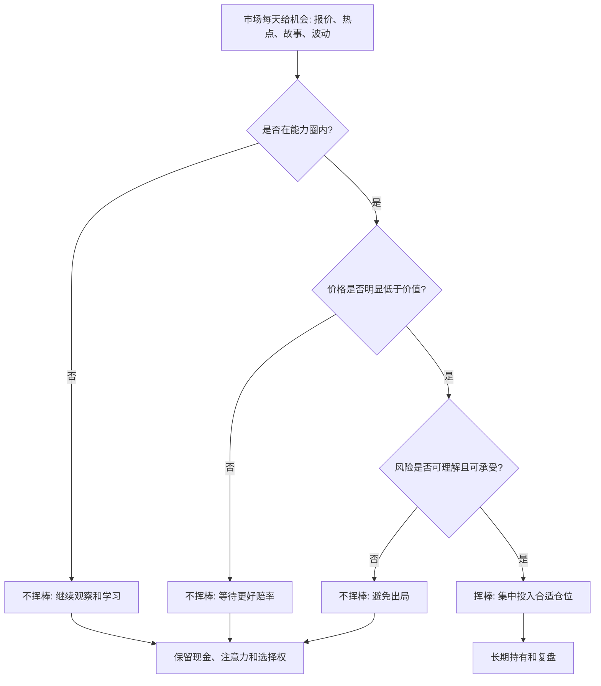

## 查理芒格思维筑基课: 坐等挥棒定律: 好投资来自少数高确定性机会

### 作者
digoal

### 日期
2026-05-19

### 标签
坐等挥棒 , 高确定性机会 , 投资耐心 , 查理芒格 , 巴菲特 , 能力圈 , 安全边际 , 现金选择权 , 机会成本 , 长期投资

----

## 背景

> 面向对象: 大学生、产品经理、运营经理、有投资需求的人  
> 核心问题: 为什么投资和创业里，很多收益不是来自频繁行动，而是来自长期等待后的少数关键动作？  
> 先说结论: 投资不像考试，不是每道题都必须作答；更像棒球手等好球。真正好的机会很少，优势来自看懂、等到、敢于在高确定性机会出现时挥棒，而不是为了缓解焦虑不停交易。

## 一张图先看懂



## 求真讲法

### 它到底说了什么

“坐等挥棒定律”来自巴菲特和芒格常用的棒球类比。投资者不需要像棒球比赛那样面对每个球都必须判断是否挥棒。市场每天给报价，但你可以一直等，直到一个自己看得懂、价格合适、风险可承受的好球出现。

它的核心不是懒惰，而是选择权。普通投资者常常以为“多行动才有机会”，但在投资里，频繁行动会带来交易成本、判断疲劳、情绪波动和犯错概率。真正值得重仓的机会通常很少。

所以这条底层规律可以写成一句话:

**不是每个机会都要抓，最重要的是等到少数真正符合能力圈、赔率和安全边际的机会。**

### 它是怎么来的

这条规律来自几个现实约束。

第一，人的判断能力有限。一个人不可能看懂所有行业、所有公司、所有资产。

第二，机会质量差异很大。大多数机会只是看起来热闹，少数机会才同时具备“看得懂、价格好、风险低、收益空间足够”。

第三，错误有代价。频繁行动会让人更容易追热点、被情绪牵引、把普通机会当成好机会。

可以用一个简化表理解:

| 机会类型 | 看得懂 | 价格合适 | 风险可承受 | 动作 |
|---|---|---|---|---|
| 圈外热门机会 | 否 | 不确定 | 不确定 | 不挥棒 |
| 好公司但太贵 | 是 | 否 | 可能可承受 | 等待 |
| 便宜但基本面恶化 | 部分 | 看似合适 | 不可承受 | 避开 |
| 圈内高赔率机会 | 是 | 是 | 是 | 挥棒 |

坐等挥棒的难点在于: 不行动看起来很无聊，但它保留了现金、注意力和心理稳定性。

### 它依赖哪些假设

| 假设 | 含义 | 如果不成立会怎样 |
|---|---|---|
| 好机会稀缺 | 真正值得重投的机会不多 | 如果好机会到处都是，就不必等待 |
| 投资者可以选择不行动 | 市场不会强迫你每天交易 | 如果必须每天下注，策略会不同 |
| 能力圈有边界 | 只在看得懂的地方才有优势 | 如果什么都看不懂，等待也无法转化为行动 |
| 现金和耐心有价值 | 等待能保留未来选择权 | 如果等待没有选择权价值，现金会被低估 |
| 少数大机会能贡献主要回报 | 长期结果常由少数高质量决策决定 | 如果每笔机会贡献相同，集中等待价值下降 |

这些假设说明，坐等挥棒不是消极保守，而是承认高质量机会稀缺，并把资源留给真正值得的时刻。

### 常见误解

| 误解 | 更准确的说法 |
|---|---|
| 坐等挥棒就是永远不买 | 它是等到条件满足再买，不是拒绝行动 |
| 等待会错过所有机会 | 等待会错过普通机会，但能保留资源抓真正好机会 |
| 高确定性就是没有风险 | 高确定性是风险可理解、赔率有优势，不是零风险 |
| 只要等得久就会成功 | 等待必须配合研究、能力圈和价格纪律 |
| 好机会出现时自然会知道 | 需要长期准备，否则机会来了也看不懂 |

## 求存讲法

### 它有什么用

这条规律的实际作用，是帮你抵抗“必须行动”的冲动。

市场、社交媒体和身边朋友会不断制造行动压力:

```text
这个板块又涨了。
别人又赚钱了。
这个概念很火。
这个公司马上要反转。
现在不买就晚了。
```

坐等挥棒会让你先问:

```text
这是我的能力圈吗？
我能解释价值来源吗？
价格是否给了安全边际？
如果判断错，损失是否可承受？
有没有更好的替代项？
```

如果答案不够好，不挥棒就是正确动作。

### 它怎么迁移到熟悉领域

| 场景 | 乱挥棒 | 坐等挥棒 |
|---|---|---|
| 学习 | 什么热门学什么 | 等到和长期目标强相关的基础能力，持续投入 |
| 产品 | 谁声音大就做谁的需求 | 等到关键瓶颈明确，再集中资源解决 |
| 运营 | 每个热点都追 | 只追和用户、品牌、转化真正匹配的机会 |
| 创业 | 看到风口就进 | 等到团队能力、切入点、现金流和需求匹配 |
| 投资 | 每天交易、追涨杀跌 | 等到圈内、低估、高赔率、可承受风险的机会 |

### 它的适用范围和边界

适用范围:

- 投资、创业、产品排期、职业选择等高机会成本决策。
- 好机会稀缺、错误代价较高、等待有选择权价值的场景。
- 需要能力圈、价格纪律和风险控制的长期决策。

边界也要说清楚:

- 早期学习和探索阶段，适度试错有价值，不能把等待当成逃避反馈。
- 坐等挥棒不是拖延。等待期间要研究、跟踪、建立标准。
- 高确定性不等于确定无疑。任何投资都要承认不确定性。
- 当机会真的满足条件时，长期等待必须转化为果断行动，否则等待没有意义。

### 正例: 怎么用它提升能力

假设你长期研究消费品公司，理解品牌、渠道、提价能力、库存和现金流。某家优秀公司因为短期成本上升和市场恐慌，股价大幅下跌。

你没有因为价格下跌马上买，也没有因为恐慌马上排除，而是用坐等挥棒清单检查:

| 检查项 | 观察结果 | 判断 |
|---|---|---|
| 能力圈 | 公司商业模式、渠道和财务你长期跟踪 | 看得懂 |
| 商业价值 | 品牌、需求和现金流没有根本恶化 | 价值仍在 |
| 价格 | 当前价格隐含很悲观预期 | 赔率改善 |
| 风险 | 成本压力可能持续，但不至于毁掉公司 | 可承受 |
| 替代项 | 比手中其他机会更清楚、更便宜 | 值得挥棒 |

这时你才投入合适仓位。关键不是“跌了就买”，而是等到自己看得懂的好公司，在价格和赔率都合适时再出手。

### 反例: 前提不成立会怎样

假设一个投资者每天都看行情，看到热门行业轮动很快，于是频繁换仓。他每次都有理由: 政策支持、资金流入、技术突破、朋友赚钱。

他的问题不是不努力，而是破坏了坐等挥棒的前提:

| 被破坏的前提 | 实际情况 | 后果 |
|---|---|---|
| 能力圈有边界 | 每个热点都参与 | 多数机会看不懂 |
| 好机会稀缺 | 把每天波动都当机会 | 标准降低 |
| 现金和耐心有价值 | 满仓频繁交易 | 好机会出现时没资源 |
| 少数大机会贡献主要回报 | 追求每次都赚 | 交易成本和错误累积 |
| 可以选择不行动 | 把不交易看成错过 | 被市场情绪牵着走 |

几年后，他交易很多，收益却一般，还积累了焦虑和坏习惯。失败不是因为市场没有机会，而是他没有等到自己真正能打的球。

## 一个挥棒前检查清单

```text
挥棒前 12 问

1. 这个机会是否在我的能力圈内？
2. 我能用自己的话讲清楚它怎样创造价值吗？
3. 当前价格是否明显低于保守估计的价值？
4. 主要风险是什么？我是否真正理解？
5. 如果判断错，损失是否可承受？
6. 这个机会是否明显优于最好替代项？
7. 我是否因为别人赚钱而想行动？
8. 我是否只是为了缓解空仓焦虑？
9. 如果市场三年不给更高报价，我还愿意持有吗？
10. 有没有反方证据能推翻我的判断？
11. 仓位是否和确定性、风险和流动性匹配？
12. 如果不挥棒，我失去的是机会，还是保住选择权？
```

这份清单的核心，是把行动门槛提到足够高，让资源留给少数真正值得的机会。

## 思考

坐等挥棒最难的地方，不是研究，而是忍受“不动”的压力。

人天生喜欢行动，因为行动让人感觉自己在掌控局面。但投资中，很多行动只是焦虑的出口，不是理性的结果。真正的高手不是永远不动，而是在大多数时候不动，在少数时刻动得很清楚。

可以继续追问:

1. 我最近一次行动，是因为机会足够好，还是因为我无法忍受等待？
2. 我的投资标准是否清楚到能让我拒绝大多数机会？
3. 我是否把市场每天的报价误认为每天都必须作答的考题？
4. 如果一年只允许我做三次投资，我会如何改变研究和决策？
5. 我现在的现金、注意力和耐心，是否为真正好机会保留了空间？

## 最后记住

1. 投资不是每个球都要打，市场不会因为你不交易就判你出局。
2. 好投资常来自少数圈内、高赔率、风险可承受的机会。
3. 不行动不是空白动作，它保留现金、注意力、耐心和选择权。
4. 等待不是拖延，等待期间要持续研究、建立标准、跟踪事实。
5. 真正的难点是: 大多数时候不挥棒，少数好球出现时敢挥棒。

## 参考资料

- Warren E. Buffett, Berkshire Hathaway shareholder letters.
- Charles T. Munger, "Poor Charlie's Almanack", 2005.
- Benjamin Graham, "The Intelligent Investor", revised editions.
- Howard Marks, "The Most Important Thing", 2011.
- Seth A. Klarman, "Margin of Safety", 1991.
- Philip E. Tetlock and Dan Gardner, "Superforecasting", 2015.
- Daniel Kahneman, "Thinking, Fast and Slow", 2011.
  
#### [PostgreSQL 解决方案集合](../201706/20170601_02.md "40cff096e9ed7122c512b35d8561d9c8")
  
  
#### [德哥 / digoal's Github - 公益是一辈子的事.](https://github.com/digoal/blog/blob/master/README.md "22709685feb7cab07d30f30387f0a9ae")
  
  
#### [About 德哥](https://github.com/digoal/blog/blob/master/me/readme.md "a37735981e7704886ffd590565582dd0")
  
  

  
