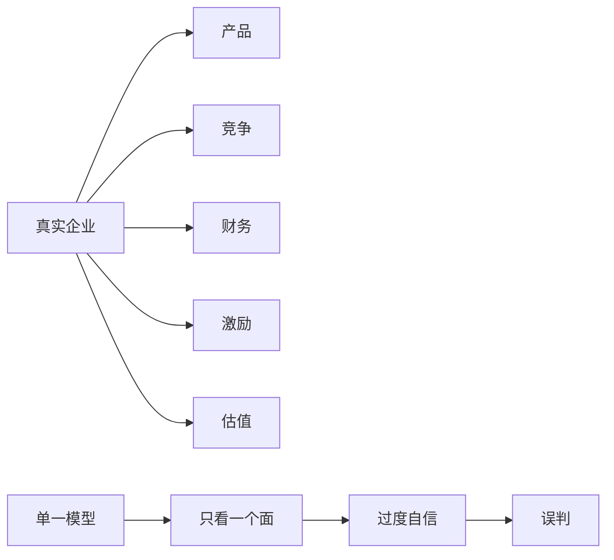

## 查理芒格思维筑基课: 定律4: 锤子人定律 - 只有一个模型会把机会看歪

### 作者
digoal

### 日期
2026-05-19

### 标签
锤子人定律 , 单一模型 , 投资盲区 , 过度自信 , 专业偏见 , 多模型校验 , 企业分析 , 估值风险 , 能力圈 , 芒格思想

----

## 背景

> 面向对象: 投资者  
> 核心问题: 为什么专业背景越强，有时越容易投资失误？  
> 先说结论: 当投资者只有一个强模型时，会把所有问题都解释成那个模型能解释的样子。芒格称这种危险为“手里只有锤子，看什么都像钉子”。

## 一张图先看懂



## 求真讲法

### 它到底说了什么

锤子人定律说: 模型本来是工具，但当你只有一个工具，它会变成偏见。宏观派可能把一切归因于利率，技术派可能把一切归因于产品，会计派可能把一切归因于报表。

### 它是怎么来的

它从多因果公理推出。真实企业由多重因素决定，单一模型只能解释一部分，却容易让人误以为解释了全部。

### 它依赖哪些假设

| 假设 | 投资含义 |
|---|---|
| 每个模型都有盲区 | 护城河模型可能低估估值风险 |
| 人偏爱熟悉工具 | 越擅长的模型越容易滥用 |
| 市场问题常跨学科 | 单一专业不足以完整判断 |

### 常见误解

| 误解 | 更准确的理解 |
|---|---|
| 专精越强越不会错 | 专精会提升深度，也会制造盲区 |
| 锤子人是知识少的人 | 知识多但模型单一也可能是锤子人 |
| 多听观点就能解决 | 关键是内化不同模型，而非收集观点 |

## 求存讲法

### 它有什么用

它提醒投资者检查自己的默认解释。每次得出结论后，问一句: 如果我不用最熟悉的模型，还能如何解释这个现象？

### 它怎么迁移到投资流程

```text
原始结论 -> 换模型重看 -> 找冲突证据 -> 调整信心和仓位
```

| 默认模型 | 需要补充的问题 |
|---|---|
| 低估值 | 为什么市场给低估值？是否价值陷阱？ |
| 高增长 | 增长是否创造自由现金流？ |
| 好产品 | 公司是否有定价权和资本回报？ |
| 宏观顺风 | 公司是否能把顺风转成股东回报？ |

### 它的适用范围和边界

适用于所有需要跨学科判断的投资。边界是: 反锤子人不是否定专业能力，而是给专业能力配上约束。

### 正例: 怎么用它提升能力

一位财务出身投资者看到低市净率银行，不急着买，而是补充研究资产质量、负债稳定性、监管周期和管理层风控激励。

### 反例: 前提不成立会怎样

技术背景投资者因产品领先买入公司，却忽略商业化能力和估值。产品确实好，但股东回报很差。失败原因是把技术优势等同于投资价值。

## 思考

1. 你最熟悉的那把“锤子”是什么？
2. 哪些投资错误来自过度相信自己的专业？
3. 你是否能用三个模型解释同一个投资结论？

## 最后记住

1. 熟悉模型最容易被滥用。
2. 专业能力要配合跨模型校验。
3. 一个模型解释不了整个企业。

## 参考资料

- Charlie Munger, *Poor Charlie's Almanack*.
- 本文参考本地 `buffett` 技能资料中的多元模型和能力圈笔记。
  
#### [PostgreSQL 解决方案集合](../201706/20170601_02.md "40cff096e9ed7122c512b35d8561d9c8")
  
  
#### [德哥 / digoal's Github - 公益是一辈子的事.](https://github.com/digoal/blog/blob/master/README.md "22709685feb7cab07d30f30387f0a9ae")
  
  
#### [About 德哥](https://github.com/digoal/blog/blob/master/me/readme.md "a37735981e7704886ffd590565582dd0")
  
  

  
