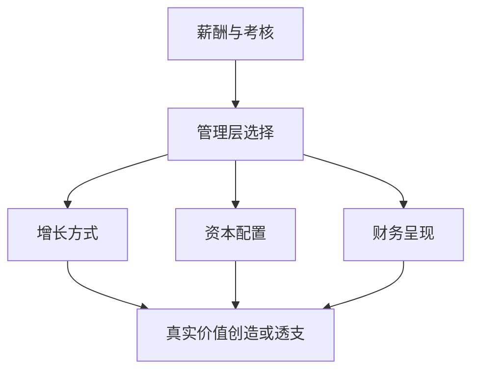

## 查理芒格思维筑基课: 定律5: 激励超级力量定律 - 顺着奖励看真实行为

### 作者
digoal

### 日期
2026-05-19

### 标签
激励超级力量 , 管理层行为 , 薪酬制度 , 销售激励 , 资本配置 , 公司治理 , 财务质量 , 代理成本 , 股东回报 , 芒格思想

----

## 背景

> 面向对象: 投资者  
> 核心问题: 怎样透过公司话术判断真实经营方向？  
> 先说结论: 激励是商业系统里的强力方向盘。管理层、销售、渠道、客户分别被什么奖励，长期就会把公司推向哪里。

## 一张图先看懂

## 求真讲法

### 它到底说了什么

这条定律说: 要理解公司，先理解激励。收入增长、并购、回购、费用资本化、渠道压货，很多行为背后都有激励。

投资者不能只问管理层“想做什么”，更要问“他们因为什么被奖励”。

### 它是怎么来的

它由“激励塑造行为”公理推出。芒格认为激励能让人的行为发生巨大偏移，甚至让聪明人合理化不合理行为。

### 它依赖哪些假设

| 假设 | 含义 |
|---|---|
| 人会响应利益 | 奖金、股价、职位、声誉都会影响行为 |
| 指标会被优化 | 被考核什么，就会被“做出来”什么 |
| 激励错配会累积 | 短期冲量会变成长远代价 |

### 常见误解

| 误解 | 更准确的理解 |
|---|---|
| 管理层持股越多越好 | 持股结构、期限和考核同样重要 |
| 增长目标代表进取 | 也可能代表牺牲质量 |
| 好文化可抵消坏激励 | 长期坏激励会腐蚀文化 |

## 求存讲法

### 它有什么用

它帮助识别财务数字背后的动机。看到异常增长时，投资者要查薪酬指标、销售政策、并购口径和回款质量。

### 它怎么迁移到投资流程

| 公司行为 | 激励追问 |
|---|---|
| 大并购 | 是否为了规模和管理层权力？ |
| 高回购 | 是否真的低估，还是为了EPS？ |
| 高增长 | 是否牺牲回款和客户质量？ |
| 降本增效 | 是否损害长期产品力？ |

### 它的适用范围和边界

适用于管理层评估、金融、医药、软件、消费和渠道驱动公司。边界是: 激励是解释线索，仍需财务和经营数据验证。

### 正例: 怎么用它提升能力

投资者发现公司CEO奖金与三年ROIC、自由现金流和客户留存绑定，而非单年收入。再结合实际资本配置，判断管理层更可能重视长期价值。

### 反例: 前提不成立会怎样

公司高管奖金绑定收入增速，销售部门放宽信用政策冲业绩。利润表变好，现金流变坏。投资者只看收入，忽略激励，最终踩雷。

## 思考

1. 你的持仓公司最核心的考核指标是什么？
2. 管理层是否会因伤害长期价值而获得短期奖励？
3. 哪些指标最容易被人为优化？

## 最后记住

1. 激励是行为方向盘。
2. 先看制度，再听故事。
3. 好激励要和长期股东价值一致。

## 参考资料

- Charlie Munger, *Poor Charlie's Almanack*.
- Warren Buffett, Berkshire Hathaway Shareholder Letters.
- 本文参考本地 `buffett` 技能资料中的管理治理和资本配置笔记。
  
#### [PostgreSQL 解决方案集合](../201706/20170601_02.md "40cff096e9ed7122c512b35d8561d9c8")
  
  
#### [德哥 / digoal's Github - 公益是一辈子的事.](https://github.com/digoal/blog/blob/master/README.md "22709685feb7cab07d30f30387f0a9ae")
  
  
#### [About 德哥](https://github.com/digoal/blog/blob/master/me/readme.md "a37735981e7704886ffd590565582dd0")
  
  

  
