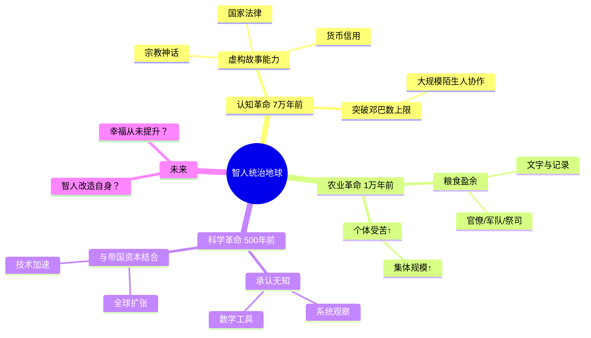

## 《人类简史》读书笔记: 从动物到上帝
  
### 作者  
digoal  
  
### 日期  
2026-05-19 
  
### 标签  
读书笔记 , 人类简史
  
----  
  
## 背景 
  
---
书名: 《人类简史：从动物到上帝》
作者: 尤瓦尔·赫拉利（Yuval Noah Harari）
出版年份: 2011（希伯来语）/ 2014（英语）/ 2014（中文）
笔记日期: 2025-05-19
豆瓣链接: https://book.douban.com/subject/25985021/
豆瓣评分: 9.1
标签: [历史, 人类学, 社会学, 科普, 思想]
---

# 《人类简史》读书笔记

> **一句话**：智人统治地球，靠的不是力气，不是智商，而是讲故事的能力。
> **适合谁读**：对"我们是谁、从哪里来、要去哪里"这类大问题感兴趣的人；知识碎片化、想建立整体框架的读者
> **阅读难度**：⭐⭐☆☆☆（叙事流畅，无学术门槛）
> **推荐指数**：⭐⭐⭐⭐☆

---

## 一、时代坐标：这本书从哪里来？

2011年，一位以色列希伯来大学的中世纪史学者，将自己给本科生上的公开课整理成书，取名《人类简史》（希伯来语原名直译为"人类史简编"）。这门课叫"人类历史导论"，没人抢着开，赫拉利主动请缨，因为他想做一件当时学界几乎没人敢做的事——**从宏观视野讲述整个人类的故事**。

那是一个学术专业化极度细分的时代：历史学家写某个王朝的某个政策，人类学家研究某个部落的某种习俗，生物学家解析某段基因序列。没人愿意，也没人敢把这些拼在一起说"人类到底是怎么回事"。赫拉利的胆量，正是这本书受欢迎的起点。

书出版后在以色列沉寂了两年。转机来自2015年——马克·扎克伯格把它列入年度阅读书单，比尔·盖茨随后力荐，《人类简史》迅速成为硅谷科技精英的"圣典"，在《纽约时报》畅销榜上连续出现182周。一本历史学者写的通俗大历史，成了21世纪最畅销的非虚构书之一。

这背后有个时代背景：互联网打破了知识边界，但也制造了信息过载。人们渴望有人替他们"做综合题"——不是更多的事实，而是一套能理解一切的框架。赫拉利恰好提供了这个。

```
时间轴：
石器时代 ────────认知革命────► 农业革命 ───► 帝国与宗教 ──► 科学革命 ────► 工业革命 ────► 当代
（13.5万年前）  （7万年前）   （1万年前）   （5000年前）   （500年前）    （200年前）    （至今）
                  ↑
           赫拉利的分析起点
           "虚构故事"的出现
```

---

## 二、核心命题：作者在说什么？

### 命题一：智人成功的秘密是"集体虚构"

赫拉利提出了一个颠覆性的论断：智人之所以能从众多人类物种中脱颖而出，并不是因为脑子最大，也不是因为工具最精巧，而是因为我们是唯一能够**相信不存在之物**的动物。

狮子、黑猩猩也有语言，也能沟通。但它们只能说"小心，狮子！"。智人却能说"狮子是我们部落的守护神"。**神、国家、金钱、人权**——这些东西在自然界根本不存在，它们是集体想象的产物，赫拉利称之为"虚构故事"（Fictions）或"主体间现实"（Intersubjective Reality）。

这个能力让智人得以突破邓巴数（Dunbar's Number）的限制。黑猩猩群落上限约150只，因为社会关系只能靠"相互认识"维系。而智人通过共同相信一个故事——比如"我们都是同一个神的子民"——可以组织起数百万人的协作，修建金字塔，打赢战争，建立帝国。

> **这不是说神和国家是"谎言"，而是说它们是"有效的共同信念"——有效到足以重塑现实。**

### 命题二：农业革命是"史上最大的骗局"

赫拉利有一个令人不安的论断：农业革命对普通人来说，其实是一次**生活质量的大倒退**。

狩猎采集者每天工作约4-5小时，饮食多样，基本不生传染病，身体素质良好。而农民每天劳作十几小时，饮食单调（大量依赖小麦、水稻），更容易生病，平均寿命反而更短。

那为什么人类还转向了农业？赫拉利的答案很反直觉： **不是人类驯化了小麦，而是小麦驯化了人类**。小麦通过让人类为它播种、除草、灌溉，将自己的基因扩散到了全球。从基因传播的角度看，小麦是地球上最成功的植物之一。而人类个体，不过是它繁殖策略的工具。

农业革命的真正赢家，是那些控制粮食的统治阶层——他们靠"多余的粮食"供养军队、官僚和祭司，建立起了等级制度和文明。

### 命题三：历史无方向，但有一个趋势——走向统一

赫拉利认为，人类历史没有"进步的方向"，也没有"道德的目的地"，但确实存在一个可观察的大趋势： **世界在不断融合为一个整体**。

过去数千年，人类从无数分散的小部落，逐渐被三种"通用语言"整合起来：货币（让陌生人之间可以交易）、帝国（让不同民族被同一政治体系管辖）、宗教（让人们相信相同的超自然力量）。

这个趋势并非出于善意，也非理性设计，而是竞争与扩张的副产品。但最终结果是：今天的世界，是有史以来人类最接近"单一文明"的时刻。

---

## 三、论证地图：作者怎么说服你的？



赫拉利的论证方式是**思想实验 + 跨学科综合 + 反常识结论**。他很少做第一手研究，而是把生物学、人类学、经济学、历史学的成果串联起来，用一个统一的叙事框架解释。

他最擅长的是**提出颠覆直觉的问题**，然后用显而易见的证据给出新答案：
- "为什么智人是唯一剩下的人类物种？" → 因为我们消灭了其他物种
- "农业革命是文明进步吗？" → 对多数个体来说是退步
- "帝国是邪恶的吗？" → 是，但也是文化融合的主要推动力

---

## 四、前提假设与边界：什么情况下这不成立？

### 假设一：语言和虚构能力是智人独有的

这是全书最核心的前提。但近年来动物认知研究显示，黑猩猩、乌鸦等动物的社会学习能力远比我们想象的复杂。赫拉利所说的"虚构故事"能力，边界并非那么清晰。

### 假设二：史前人类比农业时代更幸福

赫拉利引用了大量考古证据，但"幸福感"极难量化。他对"狩猎采集生活更轻松"的描述，依赖于有限的人类学田野调查，代表性存疑。Guardian哲学家盖伦·斯特劳森（Galen Strawson）批评他"忽略了幸福研究"，言之有据。

### 假设三：历史规律可以从宏观尺度总结

神经科学家达沙纳·纳拉扬（Darshana Narayanan）在《当代事务》杂志上指出，赫拉利书中存在"大量实质性错误"——他以科普语气呈现的某些"规律"，在学界实为争议性结论。

**这本书的边界**：它不是严格的历史学著作，而是一部**智识冒险**——适合打开视野，不适合作为专业论文的引用来源。读它的方式，应该是"受到启发后去深挖"，而不是"相信里面的每一个结论"。

---

## 五、思想谱系：这本书在哪个传统里？

赫拉利本人明确承认，《枪炮、病菌与钢铁》的贾雷德·戴蒙德是他最重要的影响源。这两本书都属于 **宏观历史学（Big History）** 传统——用跨学科的大视野解释人类命运。

```
思想谱系：

马克思（历史唯物主义）
    │
    ├── 汤因比（文明兴衰论）
    │
贾雷德·戴蒙德（地理决定论）
    │
    └──► 尤瓦尔·赫拉利（"虚构故事"驱动论）
                │
                ├── 《未来简史》（Homo Deus）
                └── 《今日简史》（21 Lessons）

同时代对话对象：
- 斯蒂芬·平克（《人性中的善良天使》）：同样悲观中带有乐观
- 尼尔·弗格森（《文明》）：西方视角，但也强调制度力量
```

赫拉利的独特性在于：他不像戴蒙德那样强调地理与环境，而是更强调**文化与认知**（"虚构故事"）作为历史驱动力。这让他更接近于社会建构主义，但又用进化生物学的语言包装，因此兼具可读性与表面的科学感。

---

## 六、我学到了什么？

**收获一："主体间现实"是理解现代世界的钥匙**

读这本书之前，我把"真实的"和"虚构的"当作对立。读完之后，我意识到这个世界有第三种存在——既不是客观物理事实，也不是个人主观想象，而是"集体共同相信的东西"：货币、法律、国家、品牌、信用。它们不是骗局，因为只要够多人相信，它们就会产生真实的后果。这个洞见彻底改变了我看"社会规则"的方式。

**收获二：进步叙事需要警惕**

我们习惯于认为历史是线性进步的：从原始到文明，从野蛮到人道。赫拉利强迫你反问：对谁的进步？按照什么标准？农业革命对农民是退步，工业革命初期的工人苦不堪言。"文明进步"往往是对统治者有利的叙事，不是人人受益的现实。

**收获三：幸福是一个被遗忘的问题**

全书最后的追问——技术让我们更幸福了吗？——才是赫拉利真正想说的。他没有给出答案，但他把这个问题尖锐地摆在面前：我们知道怎么让GDP增长，怎么延长寿命，但我们不知道怎么让人真的更幸福。这个问题在21世纪越来越紧迫。

---

## 七、举一反三：这个框架还能用在哪？

赫拉利的"虚构故事"框架，其实是一把万用钥匙：

**理解品牌与营销**：耐克的钩子标志为什么值几百亿美元？因为足够多的人相信它代表某种价值。它是"虚构的"，但经济效应是真实的。

**理解组织管理**：一家公司的"使命愿景价值观"就是一套虚构故事。员工共同相信它，可以产生比金钱激励更强大的凝聚力——也可能制造虚伪的企业文化。

**理解政治动员**：民族主义、爱国主义，都是19世纪才被"发明"的现代故事。理解它们是建构的，并不意味着它们不重要——恰恰相反，越是建构的东西，越需要主动维护。

---

## 八、批判与反思

**赫拉利的最大问题：自信过头**

《纽约客》的Ian Parker一语中的：这本书"在相对的批评忽视中繁荣"，因为它的涉猎范围太宽，没有哪位专家能全面评判它。这是一种聪明的防御机制——也是一种知识上的投机。

历史学家和人类学家是批评最多的群体。他们不满的不是结论本身，而是赫拉利用科普的口吻呈现学界尚无定论的问题，缺乏必要的学术谦逊。

**时代局限：民族主义没有消退**

书中有一个著名的预言失误：赫拉利在书中写道，进入21世纪，民族主义正在快速失去地盘。然而2016年之后，民粹主义和民族主义的强势回归让他自己也不得不在后续文章中承认预判有误。

**幸福议题处理得太潦草**

全书花了大量篇幅讲"集体虚构如何改变世界"，但最后关于幸福的追问，仅占十几页。这是最值得深挖的部分，却被草草收尾。这也是为什么《人类简史》读完后让人兴奋而又隐隐空虚的原因——它更擅长解构，而不擅长重建。

---

## 九、金句与记忆点

1. **"历史上最大的骗局"** — 指农业革命。不是说农业是谎言，而是说它被我们神话化了。普通农民并没有因为文明进步而活得更好。

2. **"智人统治世界，不是因为最聪明，而是因为唯一会集体虚构"** — 这一句颠覆了进化论的通俗理解：力量和智力不是决定因素，协作能力才是。

3. **"小麦驯化了人类，不是人类驯化了小麦"** — 换个主语，历史就变了。基因扩散的视角，彻底反转了"人定胜天"的傲慢。

4. **"金钱是人类最成功的故事"** — 素不相识的两个人，因为都相信同一张纸有价值，就可以交易。没有任何其他虚构故事有这么强的跨文化穿透力。

5. **"我们知道如何制造更多财富，却不知道如何制造更多幸福"** — 现代文明的核心悖论。经济学可以测量GDP，但无法测量意义感。

6. **"主体间现实"（Intersubjective Reality）** — 赫拉利给"集体虚构"起的学术名字。既不是客观事实，也不是主观幻觉，而是存在于集体信念之间的东西——法律、宗教、货币、国家都属于此类。

7. **"历史研究的悖论：越深入某个历史时期，就越难以解释为什么会那样发展"** — 赫拉利自己说的。这句话其实在提醒读者：他的宏大叙事，是以牺牲精确度为代价的。

---

## 十、延伸阅读

**向前走——读赫拉利自己的续集：**
- 《未来简史》（Homo Deus）：如果说《人类简史》是"我们从哪来"，这本是"我们往哪去"。AI、基因工程、数据主义——更激进，也更争议。

**向上走——更严肃的大历史视野：**
- 《枪炮、病菌与钢铁》贾雷德·戴蒙德：赫拉利的直接灵感来源，论证更严谨，但可读性稍低。地理决定论的经典之作。

**向左走——对赫拉利的反驳：**
- 《人性中的善良天使》史蒂芬·平克：同样是宏观历史，但得出截然相反的结论——人类其实越来越不暴力，越来越人道。和赫拉利一起读，可以形成张力。

**向右走——更深的人类起源：**
- 《人类的起源》理查德·利基：古人类学家视角，比赫拉利更审慎，但关于智人扩张和其他物种灭绝的部分可相互印证。

**向深走——"虚构故事"背后的认知科学：**
- 《思考，快与慢》丹尼尔·卡尼曼：人类认知偏误的系统解析。赫拉利说人类会集体"相信故事"，卡尼曼从心理机制解释了为什么我们这么容易被故事说服。

---

*笔记写于 2025-05-19 | 基于公开资料、豆瓣书评及学术评论综合整理*
  
  
#### [PostgreSQL 解决方案集合](../201706/20170601_02.md "40cff096e9ed7122c512b35d8561d9c8")
  
  
#### [德哥 / digoal's Github - 公益是一辈子的事.](https://github.com/digoal/blog/blob/master/README.md "22709685feb7cab07d30f30387f0a9ae")
  
  
#### [About 德哥](https://github.com/digoal/blog/blob/master/me/readme.md "a37735981e7704886ffd590565582dd0")
  
  

  
