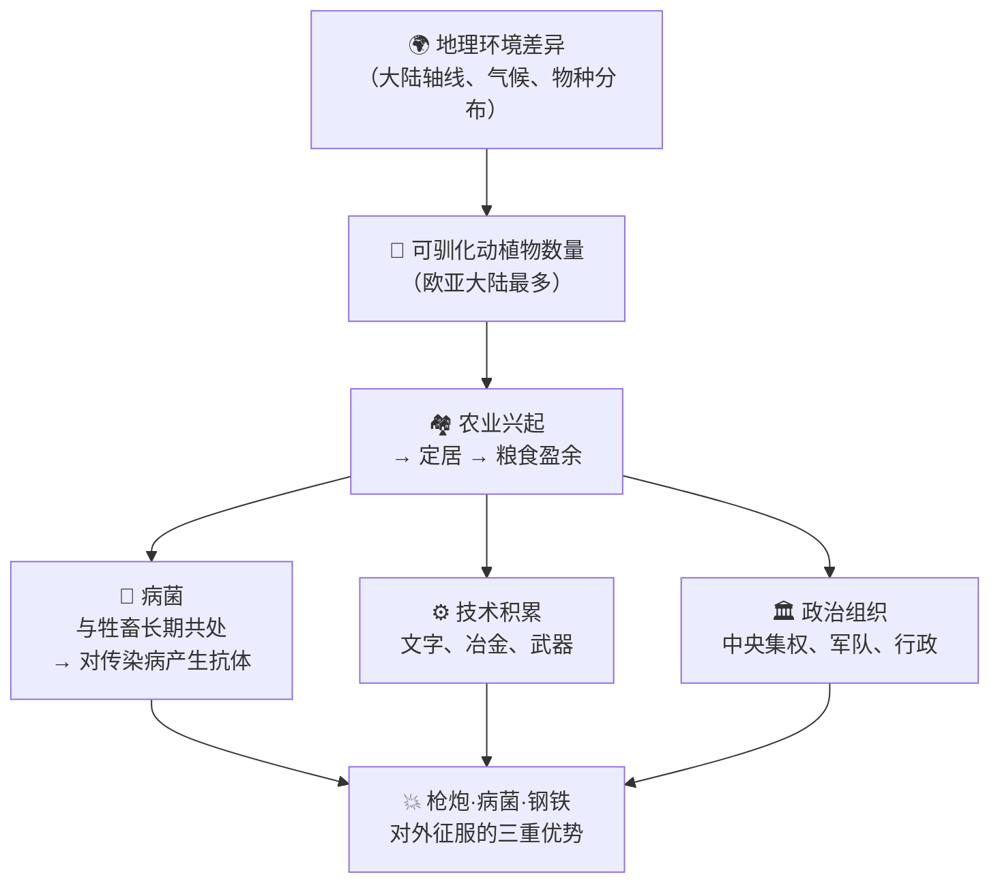

## 《枪炮、病菌与钢铁》读书笔记: 人类社会的命运
  
### 作者  
digoal  
  
### 日期  
2026-05-19 
  
### 标签  
读书笔记 , 枪炮、病菌与钢铁
  
----  
  
## 背景 
  
---
书名: 《枪炮、病菌与钢铁：人类社会的命运》  
作者: [美] 贾雷德·戴蒙德（Jared Diamond）  
原作名: Guns, Germs, and Steel: The Fates of Human Societies  
出版年份: 1997（中信出版集团中文版 2022年1月）  
译者: 王道还、廖月娟  
笔记日期: 2026-05-19  
豆瓣链接: https://book.douban.com/subject/35714810/  
豆瓣评分: 9.0  
标签: [人类学, 历史, 地理决定论, 文明, 科普]  
---

# 《枪炮、病菌与钢铁》读书笔记

> **一句话**：你以为是人种决定了文明高下，但戴蒙德用624页告诉你——决定命运的，是你出生在哪块大陆。  
> **适合谁读**：对文明起源、历史不平等感兴趣的普通读者；想破除"西方优越论"迷思的人；大历史爱好者。  
> **阅读难度**：⭐⭐⭐☆☆（逻辑严密但叙事流畅，不需要专业背景）  
> **推荐指数**：⭐⭐⭐⭐⭐  

---

## 一、时代坐标：这本书从哪里来？

1972年，生理学家贾雷德·戴蒙德在新几内亚岛的田野考察中，遇到了当地政治家亚力（Yali）。这位来自"落后"地区的男人向他提出了一个让他此后二十五年都无法忘怀的问题：

> **"为什么你们白人制造了那么多货物，再运来这里？而我们黑人几乎没有属于自己的东西？"**

这个问题戳穿了一层伪装得很好的傲慢：大多数西方人给出的默认答案，是"因为我们更聪明、更勤奋、文化更优越"。这本质上是种族优越论的变种，只是换了更体面的外壳。

1997年，戴蒙德出版了《枪炮、病菌与钢铁》，给出了他的系统性回答。彼时，冷战刚刚结束，"历史终结论"大行其道，西方文明优越感达到高峰。戴蒙德的书像一盆冷水——他说，你们之所以"赢了"，根本原因不在于你们的基因或文化，而在于你们恰好生活在那块大陆上。

这个答案同时得罪了两拨人：种族主义者（因为书否定了"天生优越"），以及部分左翼学者（因为书似乎将殖民侵略解释为"自然而然"）。正是这种四面树敌的气质，让这本书成为二十世纪末最具争议的非虚构著作之一。

```
时间轴：一个问题的漫长旅程

1972年 ────────────► 1997年 ────────────► 1998年 ───────────► 今天
  │                    │                    │                  │
亚力在新几内亚       出版本书            获普利策奖         被译成
提出那个问题         历时25年           英国科普图书奖      38种语言
```

---

## 二、核心命题：作者在说什么？

### 观点一：种族不是答案，地理才是

戴蒙德全书的核心一句话是： **"各族群的历史循着不同的轨迹开展，那是环境而非生物差异造成的。"**

他的论证起点是：各大洲的人类在认知能力上并无本质差异。新几内亚人能在极端复杂的生态环境中生存，需要的智力水平绝不亚于任何文明社会的成员。真正造成差距的，是各大陆在出发条件上的巨大不对等——而这个不对等，来自地理。

### 观点二：农业是一切的源头

戴蒙德指出，文明分叉的关键节点，是**粮食生产的出现**。农业让人类能够生产剩余粮食，剩余粮食养活了专职工匠、士兵、官员、书记员，这才有了技术积累、中央政治组织和文字。

而欧亚大陆的农业之所以领先，是因为那里恰好拥有最多可驯化的植物和动物：小麦、水稻、大麦、牛、马、猪、羊……这不是文化选择的结果，而是生物地理学上的偶然馈赠。

### 观点三：大陆轴线决定了传播速度

这是全书最精妙也最被低估的论点。欧亚大陆的轴线是**东西走向**，意味着沿纬度传播的农作物、牲畜和技术，会在气候相似的地区快速扩散，几乎不遇阻碍。

反观美洲和非洲，大陆轴线是**南北走向**，南北传播需要跨越截然不同的气候带和生态区。一颗种子从墨西哥传到秘鲁，要翻过沙漠、热带雨林和高原——每一步都是巨大的屏障。

这一个地理事实，几乎独立地解释了为什么欧亚文明能快速积累并向外扩张。

---

## 三、论证地图：作者怎么说服你的？



**核心案例：卡哈马卡之战（1532年）**

西班牙征服者皮萨罗率168名士兵，俘虏了印加皇帝阿塔瓦尔帕，并击溃了其8万大军。这个令人瞠目的结果，戴蒙德用三重优势来解释：

- **钢铁**：西班牙人拥有钢制盔甲和长剑，印加人只有铜器和布甲；
- **枪炮**：马匹和火器带来的机动力和震慑力；
- **病菌**：天花在1520年已提前"侵入"美洲，杀死了大批印加领导者，瓦解了组织能力。

这三者叠加，不是偶然，而是数千年地理差异积累下来的必然结果。

---

## 四、前提假设与边界：什么情况下这不成立？

戴蒙德的论证链条足够强悍，但并非无懈可击。它暗含了至少三个关键假设：

**假设一：可驯化物种的多寡是固定的、人无法改变的。**

经济史学家乔尔·莫基尔（Joel Mokyr）指出，植物驯化从来不是一成不变的——问题在于人类愿不愿意投入足够长的时间去改良。若给予充分时间，美洲的本土植物未必不能驯化成高产作物。戴蒙德对这一反事实的处理不够充分。

**假设二：地理是决定性因素，文化、制度、个人意志是次要变量。**

批评者（尤其是人类学家贾森·安特罗西奥）指出，这个框架几乎抹去了人类的主体性。殖民侵略不是"地理的自然延伸"，而是有人做了选择、有人设计了制度、有人执行了屠杀。将征服"自然化"，有为殖民主义开脱之嫌——哪怕戴蒙德主观上无此意图。

**假设三：该框架能解释所有文明格局。**

事实上，戴蒙德自己也承认，他的理论对"同等农业条件下为何某些文明后来居上"的解释力较弱。中国、印度和欧洲都在欧亚大陆，起点相似，但近代命运迥异——这个"大分流"问题，戴蒙德的框架几乎无能为力。

---

## 五、思想谱系：这本书在哪个传统里？

戴蒙德并非横空出世。地理决定论是一个源远流长的思想传统：孟德斯鸠早在18世纪便提出气候影响人的性格和制度，布罗代尔在《地中海》中将地理视为"长时段"的历史主角。

但戴蒙德的创新在于，他将这一传统从人文历史学带入了自然科学：用生物地理学、进化论、流行病学为地理决定论搭建起实证骨架，使之摆脱了此前过于思辨的面貌。

```
思想谱系：地理决定论的演进

孟德斯鸠（18世纪）       布罗代尔（20世纪中）       戴蒙德（1997）
"气候决定性格"      →    "地理是长时段历史"    →    "地理决定农业
（哲学推论）            （史学叙事）                 决定文明"（跨学科实证）
```

他的影响同样深远：《枪炮、病菌与钢铁》重新激活了地理作为历史解释工具的合法性，间接催生了经济学家阿西莫格鲁（2024年诺贝尔经济学奖得主）等人对制度与地理关系的深入研究。讽刺的是，阿西莫格鲁的研究结论恰恰部分挑战了戴蒙德：制度，而非地理，才是解释持续繁荣与贫困的关键变量。

---

## 六、我学到了什么？

读这本书，最震撼我的不是那些具体的论据，而是它提供的一种**思维姿势**：把你认为理所当然的不平等，放进足够长的时间轴里重新审视。

**收获一：警惕"成功者叙事"的陷阱。**

我们太习惯用结果来反推原因：谁赢了，就说明谁"更优秀"。戴蒙德提醒我——在大多数人类历史的决定性时刻，胜负早在一万年前就被大陆的地理禀赋写好了剧本。个体努力和文化选择当然重要，但在那个量级的历史面前，我们不过是在微调细节。这种清醒，是反骄傲也是反自怨的解药。

**收获二：跨学科的视角，是理解复杂问题的钥匙。**

戴蒙德同时是生理学家、鸟类学家、地理学家、历史学家。他能把病菌传播、农作物驯化和政治组织形式串联成一条逻辑链，正是因为他拒绝在学科边界处停步。这本书本身就是一个方法论宣言：真正的大问题，从不老实待在某一个学科的格子里。

**收获三：解释≠辩护。**

戴蒙德被许多批评者误读为"为欧洲殖民主义辩护"。但解释一件事为什么发生，和为这件事的道德后果背书，是完全不同的两件事。历史的结构性原因解释了征服"如何可能"，但殖民者的暴行依然是选择，依然应当被追责。两者并不矛盾——只有理解这一点，我们才能既看清历史的结构，又不放弃道德判断。

---

## 七、举一反三：这个框架还能用在哪？

戴蒙德的核心思维方式，是把 **"优势"追溯到更深层的起始条件**，而不是停留在表面的成功故事。这个思路在很多场景下都有用：

**理解企业竞争：** 一家公司今天的市场优势，有多少是来自早期的资源禀赋（资金、地域、人脉），有多少是真正的能力积累？如果起点不同，成功还能复制吗？

**理解个人成长：** 一个人的"努力结果"，有多大程度上预先被家庭背景、教育资源、出生城市决定了？这不是虚无主义，而是让我们在评价他人时多一分同情，在评价自己时少一分自得。

**理解国家政策：** 为什么有些国家的发展援助效果很差？也许问题不在于"这些人不努力"，而在于他们的初始地理、制度条件根本没有被充分考虑进方案里。

---

## 八、批判与反思

坦白说，读完这本书，我有一种"被宏大叙事说服"之后的隐隐不安。

戴蒙德的论证太流畅了，流畅到有时候会让人忘记它在某些地方跳过了多少复杂性。中国为什么在宋代之后没有走向工业革命？奥斯曼帝国、莫卧儿帝国同在欧亚大陆，为什么近代命运与欧洲如此不同？这些关键例外，书中的处理都稍显草率。

更根本的不安来自"地理决定论"本身的政治后果。当我们说"欧洲人征服美洲是因为地理决定的"，是不是在不知不觉间，把殖民主义的血腥变成了某种"自然规律"，从而消解了道德问责的可能？戴蒙德自己说这不是他的意图，但他控制不了读者怎么用这套框架。

此外，2024年诺贝尔经济学奖授予阿西莫格鲁等人，理由正是他们的研究证明**制度**比地理更能解释长期繁荣与贫困。这在某种程度上是对戴蒙德框架的学术修正——地理是重要的历史起点，但不是全部故事。

---

## 九、金句与记忆点

1. **"亚力的问题"** ：一个来自新几内亚的政治家的发问，比任何宏大理论都更直击人心。问题本身就是这本书存在的理由。

2. **"能驯化的动物都是相似的，驯化不成的动物各有各的原因。"** ——14种大型哺乳动物被人类驯化，剩下148种统统失败，不是人类不努力，是这些动物天性里有不可跨越的障碍（领地攻击性、繁殖速度太慢等）。

3. **东西轴线 vs 南北轴线**——这是全书最值得记住的地理概念。一块大陆的主轴方向，决定了文明传播的阻力。

4. **"枪炮、病菌与钢铁"不是三个独立因素，而是同一条因果链上的三个端点。** 最深处的根，是地理；最表面的果，是征服。

5. **征服不是终点，而是起点。** 欧洲人带去美洲的病菌，在某些地区杀死了90%的原住民——这个数字比任何武器都更能说明"病菌"两个字的分量。

6. **解释不等于辩护。** 这是阅读本书时必须牢记的一条防火线。

---

## 十、延伸阅读

1. **《崩溃：社会如何选择成败兴亡》——贾雷德·戴蒙德**
   *戴蒙德的"续篇思路"，从文明崛起转向文明衰亡，重点关注环境破坏与社会决策。两书合读，才能看到他思想的全貌。*

2. **《国家为什么会失败》——达龙·阿西莫格鲁 & 詹姆斯·罗宾逊**
   *对戴蒙德框架最重要的学术挑战。核心论点：制度（包容性 vs 榨取性）才是解释持续繁荣或贫困的关键变量，地理只是背景。两书放在一起读，是极好的思想对话。*

3. **《人类简史》——尤瓦尔·赫拉利**
   *同样是大历史视角，但赫拉利更关注"想象共同体"与认知革命，与戴蒙德的物质—地理视角形成互补。*

4. **《第三种黑猩猩》——贾雷德·戴蒙德**
   *本书的前传。戴蒙德在这里已经开始探讨人类进化的独特性，包含了《枪炮》一书的早期思考雏形。*

5. **《文明的冲突》——塞缪尔·亨廷顿**
   *从"文明"而非"地理"解读世界格局的代表作，与戴蒙德形成有趣的范式对立，读完可以自己判断哪个框架更有解释力。*

---

*笔记写于 2026-05-19 | 基于豆瓣读书、学术评论、知乎长评及公开资料综合整理*
  
  
#### [PostgreSQL 解决方案集合](../201706/20170601_02.md "40cff096e9ed7122c512b35d8561d9c8")
  
  
#### [德哥 / digoal's Github - 公益是一辈子的事.](https://github.com/digoal/blog/blob/master/README.md "22709685feb7cab07d30f30387f0a9ae")
  
  
#### [About 德哥](https://github.com/digoal/blog/blob/master/me/readme.md "a37735981e7704886ffd590565582dd0")
  
  

  
