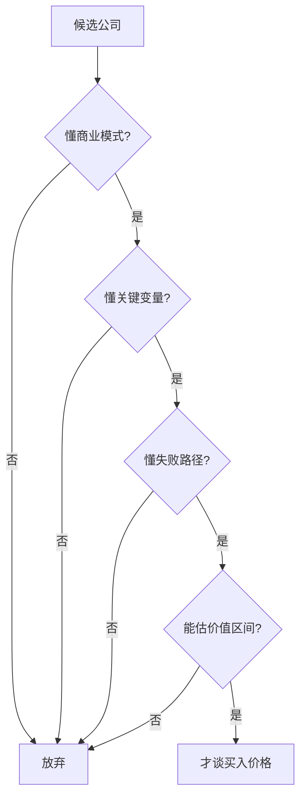

## 查理芒格思维筑基课: 定律6: 能力圈定律 - 只在能判断的地方下注

### 作者
digoal

### 日期
2026-05-19

### 标签
能力圈定律 , 商业模式 , 关键变量 , 失败路径 , 估值区间 , 投资筛选 , 仓位管理 , 圈外风险 , 长期投资 , 芒格思想

----

## 背景

> 面向对象: 投资者  
> 核心问题: 怎样判断一个投资机会是否在自己的能力圈内？  
> 先说结论: 能力圈不是“听过这个行业”，而是能解释商业模式、关键变量、竞争威胁和反证条件。圈外机会再诱人，也不是你的机会。

## 一张图先看懂

## 求真讲法

### 它到底说了什么

能力圈定律说: 投资者只应在自己能可靠判断的范围内下注。能力圈以“能否判断”为标准，不以“是否热门”或“是否熟悉名字”为标准。

### 它是怎么来的

它由“能力边界比大小更重要”公理推出。投资要估未来现金流，若无法理解驱动现金流的机制，估值就只是猜测。

### 它依赖哪些假设

| 假设 | 含义 |
|---|---|
| 不同人能力圈不同 | 没有通用机会 |
| 能力圈可验证 | 能写出变量、风险、反证 |
| 圈外下注风险更高 | 自信不能替代理解 |

### 常见误解

| 误解 | 更准确的理解 |
|---|---|
| 买大公司就在能力圈内 | 大不等于懂 |
| 看很多研报就是懂 | 复述观点不等于判断能力 |
| 能力圈固定不变 | 学习和反馈能扩大它 |

## 求存讲法

### 它有什么用

它让投资者少看很多无效机会，把研究深度集中在少数能判断的行业和公司上。

### 它怎么迁移到投资流程

| 能力圈问题 | 合格答案 |
|---|---|
| 公司怎样赚钱 | 能用一段话说清 |
| 为什么能持续赚钱 | 有明确护城河解释 |
| 什么会毁掉它 | 有可跟踪失败指标 |
| 值多少钱 | 能给保守区间 |

### 它的适用范围和边界

适用于个股选择和仓位大小。边界是: 在能力圈内也会错，所以还需要安全边际。

### 正例: 怎么用它提升能力

投资者只覆盖自己长期研究的消费和互联网基础设施，放弃复杂生物科技。错过一些大牛股，但减少了无法判断的风险。

### 反例: 前提不成立会怎样

投资者因为“大家都在买”进入复杂衍生品，却不懂合约风险和流动性。亏损后无法判断是短期波动还是永久损失。

## 思考

1. 你的能力圈是由行业定义，还是由关键变量定义？
2. 你能否写出每个持仓的反证条件？
3. 哪些机会应该被你明确标记为圈外？

## 最后记住

1. 圈外机会不是你的机会。
2. 能解释失败路径，才算开始理解。
3. 能力圈内下注，仍要安全边际。

## 参考资料

- Warren Buffett, Berkshire Hathaway Shareholder Letters.
- Charlie Munger, *Poor Charlie's Almanack*.
- 本文参考本地 `buffett` 技能资料中的能力圈笔记。
  
#### [PostgreSQL 解决方案集合](../201706/20170601_02.md "40cff096e9ed7122c512b35d8561d9c8")
  
  
#### [德哥 / digoal's Github - 公益是一辈子的事.](https://github.com/digoal/blog/blob/master/README.md "22709685feb7cab07d30f30387f0a9ae")
  
  
#### [About 德哥](https://github.com/digoal/blog/blob/master/me/readme.md "a37735981e7704886ffd590565582dd0")
  
  

  
