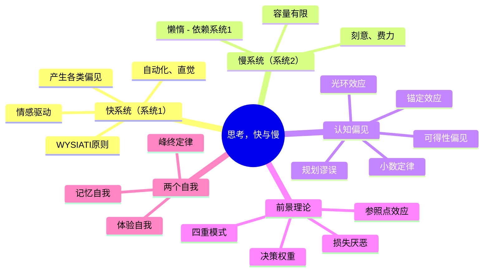

## 《思考，快与慢》读书笔记
  
### 作者  
digoal  
  
### 日期  
2026-05-19 
  
### 标签  
读书笔记 , 思考，快与慢
  
----  
  
## 背景 
  
---
书名: 《思考，快与慢》  
作者: 丹尼尔·卡尼曼（Daniel Kahneman）  
出版年份: 2011（英文原版）/ 2012（中信出版社中文版）  
笔记日期: 2025-05-20  
豆瓣链接: https://book.douban.com/subject/10785583/  
豆瓣评分: 8.0（24918人评价）  
标签: [行为经济学, 认知心理学, 决策科学, 诺贝尔奖, 思维偏见]  
---

# 《思考，快与慢》读书笔记

> **一句话**：你以为自己在理性决策，其实是你的直觉系统在替你做主——而它经常出错。  
> **适合谁读**：想了解自己为何做出糟糕决定的人；投资者、管理者、政策制定者；对行为经济学感兴趣的任何人。  
> **阅读难度**：⭐⭐⭐☆☆（后半部分涉及概率与统计，稍有挑战）  
> **推荐指数**：⭐⭐⭐⭐☆  

---

## 一、时代坐标：这本书从哪里来？

2011年，卡尼曼出版这本书的时候已经77岁了。距离他和老搭档阿莫斯·特沃斯基（Amos Tversky）在1969年开始合作研究，整整过去了40多年。这是一本"集大成之作"——他花了一辈子做的事情，终于在这一本书里讲清楚了。

故事的起点是一个被传统经济学奉为圭臬的假设： **人是理性的**。古典经济学里的"理性人"（homo economicus）会精确计算得失、最大化自身利益，不受情绪干扰。这个假设支撑了整个经济学大厦将近200年。

但卡尼曼和特沃斯基不信这一套。他们是心理学家，整天在实验室里观察真实的人怎么做决策——结果发现，真实的人和理论上的"理性人"相差十万八千里。人们对损失的恐惧远超对同等收益的渴望；人们对于概率的直觉往往是错的；人们的判断会被无关因素（比如刚才看到的一个数字）悄悄影响。

1979年，他们发表了著名的**前景理论**（Prospect Theory），正式向传统经济学的理性人假设宣战。这篇论文后来成为经济学史上被引用最多的论文之一，并让卡尼曼在2002年获得诺贝尔经济学奖（特沃斯基已于1996年去世，无缘同享）。

《思考，快与慢》可以理解为卡尼曼对自己一生学术发现的通俗化总结，也是他写给普通读者的一封"认识你自己"的邀请函。

```
时间轴：卡尼曼的思想历程
─────────────────────────────────────────────────────────
1969    │ 与特沃斯基开始合作研究认知偏见
1974    │ 发表《不确定下的判断：启发式与偏见》
1979    │ 前景理论（Prospect Theory）正式发表
1996    │ 特沃斯基因癌症去世
2002    │ 卡尼曼获诺贝尔经济学奖（心理学家史无前例）
2011    │ 出版《思考，快与慢》，横扫全球畅销榜
2024    │ 卡尼曼辞世，享年90岁
─────────────────────────────────────────────────────────
```

---

## 二、核心命题：作者在说什么？

### 命题一：你的大脑里住着两个系统

卡尼曼用"系统1"和"系统2"这对概念贯穿全书。这不是解剖学意义上的两个脑区，而是两种**思维模式**的比喻：

**系统1（快思考）** ：自动运行、无需意识介入、快速、依赖情感和直觉。当你看到一张愤怒的脸时，立刻感到不适——这是系统1；当你开车走熟悉的路，脑子想着别的事——这是系统1。

**系统2（慢思考）** ：需要主动调用注意力、费力、缓慢、适合逻辑推理。当你做一道复杂的数学题、在嘈杂环境里集中注意力——这是系统2。

问题在于：系统2很懒。它是个耗能的家伙，能省力就省力。于是大部分时候，它直接采信系统1的判断，不做深究。更糟糕的是，系统1自信满满，从不知道自己在犯错——它奉行的是"眼见即为事实"（WYSIATI: What You See Is All There Is）原则，看到什么就相信什么，不主动寻找反面证据。

### 命题二：我们充满了系统性偏见

卡尼曼用大量篇幅列举了人类判断的系统性错误，其中最重要的有：

- **锚定效应**：第一个出现的数字会悄悄影响你后续的判断，哪怕它完全无关。
- **可得性偏见**：越容易想到的事，你就觉得它越常见（飞机失事死亡率低于车祸，但飞机失事更令人印象深刻）。
- **光环效应**：对一个人的整体好感会自动渗透到对他每个具体特征的评价。
- **小数定律**：人们过度相信小样本的规律性，忘记了随机波动的存在。
- **规划谬误**：几乎所有人都对自己的计划过于乐观，低估时间和成本。

### 命题三：损失比收益更痛——前景理论的核心

这是卡尼曼最重磅的学术贡献，用一个直觉来理解： **失去100块的痛苦，大约是得到100块快乐的两倍**。

这意味着人的决策不是绝对的，而是相对于"参照点"的。同样面对50%的概率，你在"可能赚100"还是"可能少损失100"的框架下，很可能做出不同的选择——尽管数学上完全等价。

这一发现直接颠覆了传统经济学的理性人假设。

### 命题四：两个自我的战争——体验自我 vs. 记忆自我

书的最后一部分是卡尼曼对"幸福"的研究，也是全书中最有哲学趣味的部分。

他区分了两种"自我"： **体验自我**（living self，每时每刻真实的感受）和**记忆自我**（remembering self，事后对经历的回忆和评价）。

关键发现：我们做决策依据的是记忆自我，但记忆自我的评分规则非常奇怪——它遵循"峰终定律"（Peak-End Rule）：只记住体验的**高峰**和**结尾**，过程的长短几乎被忽略。

这意味着：一次漫长的、还算愉快的假期，如果结尾很糟糕，你的记忆自我会把整个假期判为"糟糕"；而一次短暂但结尾不错的旅行，你会觉得"太值了"。我们以为自己在为体验自我做选择，其实一直在取悦记忆自我。

---

## 三、论证地图：作者怎么说服你的？



卡尼曼的论证方式是**实验心理学传统**——每个观点后面都跟着一个或多个精心设计的实验，让读者亲身体验认知错误的产生，然后再给出解释。这种写法非常聪明：你在读书的过程中，就会意识到自己也掉进了同样的陷阱，那种"被抓个现行"的感觉让人印象深刻。

不过需要注意：书中部分引用的早期心理学研究，特别是第4章关于 **启动效应（Priming）** 的研究，后来在心理学的复现危机中未能成功复现。卡尼曼本人在2017年公开承认，他对那些研究的信任过于轻率。这不是小问题——它涉及全书方法论的可靠性。

---

## 四、前提假设与边界：什么情况下这不成立？

**假设一：实验室结论可以推广到真实生活**

书中大量实验是在受控环境下进行的，被试通常是大学生。但现实决策场景（买房、择业、婚姻）有着复杂的社会、情感、时间压力，简单推论需要谨慎。

**假设二：人类的非理性是系统性的、可以预测的**

这个假设是行为经济学的基石，但批评者（如吉尔德·吉仁泽尔，Gerd Gigerenzer）指出：很多时候，直觉其实是在做**生态理性**（ecological rationality）——在特定环境下，"快捷方式"的判断其实是有效的。卡尼曼对直觉的整体负面评价可能过于强调偏见。

**假设三：慢思考就更好**

书中有些章节暗示慢思考（系统2）才是理性的保证。但专家的直觉（象棋大师、消防队员）恰恰是通过大量训练把系统2的判断内化成了系统1。在有规律的环境中，直觉完全可以信赖。

**总结**：这本书的核心洞见是可信的，但如果将其作为"人类总是愚蠢的"的证据，则走偏了。卡尼曼自己也承认，直觉有效与否取决于学习环境是否有规律可循。

---

## 五、思想谱系：这本书在哪个传统里？

```
赫伯特·西蒙（有限理性）
        ↓
卡尼曼 & 特沃斯基（启发式与偏见 / 前景理论）
        ↓
    ┌───┴────┐
理查德·泰勒    罗伯特·席勒
（助推理论）  （行为金融学）
    ↓
2017诺贝尔经济学奖
```

卡尼曼师承赫伯特·西蒙（"有限理性"的提出者），站在认知心理学的立场上向古典经济学的理性人假设发起冲击。他的工作孵化了整个现代行为经济学：理查德·泰勒（凭"助推"理论获2017年诺贝尔奖）、罗伯特·席勒（行为金融学）、丹·艾瑞里（可预见的非理性）都深受其影响。

这本书也和纳西姆·塔勒布（《黑天鹅》）有深厚的精神联系——两人都强调人类对不确定性的系统性错判，尽管侧重点不同。

---

## 六、我学到了什么？

读这本书最大的收获，不是记住了哪些偏见的名字，而是得到了一个**看待自己思维的新视角**——意识到"我以为的理性判断，很可能只是系统1换了一件理性的外衣"。

**收获一：慢下来，不是软弱，是元认知**

每当我感到"这个决定很显然""答案很明确"的时候，恰恰应该停下来问：是系统1在替我做主吗？这是我个人最直接的行为改变——在重要决策前，刻意给自己设置一个"冷却期"。

**收获二：损失厌恶解释了太多人类的痛苦**

投资者死守亏损股票（怕锁定损失）、人们困在不幸福的关系里（怕失去已有的）、企业不敢转型（怕放弃既有市场）——卡尼曼给这些行为背后的心理提供了统一的解释。理解损失厌恶，不是为了彻底消除它，而是为了在它最危险的时候识别它。

**收获三：记忆自我的专制值得警惕**

"峰终定律"让我重新思考如何评价一段经历。很多时候我们对旅行、工作、关系的整体评价，被结尾的那一刻过度主导了。知道这一点，我会更努力地关注**当下正在发生的体验**，而不只是事后如何讲述它。

---

## 七、举一反三：这个框架还能用在哪？

**投资决策**：理解损失厌恶和心理账户，可以帮助投资者识别"该止损却不止"的自我欺骗。卡尼曼的框架是理解行为金融学的最佳入门。

**产品设计**：理解锚定效应（定价策略的基础）、可得性偏见（用户如何评估风险）和峰终定律（用户体验的关键时刻设计），对产品经理来说极其实用。

**公共政策**：书中提到的"助推"（Nudge）概念，即通过改变选项架构来引导人们做更好的决策，而非靠禁止或惩罚。这已经成为英国、美国等国政府行为洞察团队的核心工具。

---

## 八、批判与反思

我有两个核心不认同：

**一、书太厚了，重复太多。**
几位豆瓣读者的批评有其道理——这本书的内核可以用更精炼的方式表达。卡尼曼将几十年的研究拼装成一本"百科全书式"的畅销书，不可避免地带来了篇幅虚胖的问题。后半段关于概率与决策权重的章节，密度陡增，让普通读者感到疲惫。

**二、对直觉的评价过于负面。**
卡尼曼全书的基调是：系统1容易出错，系统2才是靠谱的。但吉仁泽尔等人的研究表明，在不确定性高、信息不完整的真实世界中，简单的启发式策略往往比复杂的分析模型更强健。直觉不总是敌人，有时候它是经验和进化的结晶。

**还有一个时代局限：**
书中部分关于"启动效应"的实验在后来的复现危机中失败了，卡尼曼本人也公开承认了这一点。这提醒我们：即使是诺贝尔奖得主、即使是已经被几百万人"验证"的畅销书，其中的具体结论也需要保持审慎态度。科学是不断修正的。

---

## 九、金句与记忆点

1. **"眼见即为事实"（WYSIATI）** —— 系统1构建了一个连贯的故事，哪怕信息本来是残缺的。这是所有直觉偏误的根源。

2. **"当你对某事感到自信，这不是证明你是对的，只是证明你的系统1构建了一个连贯的故事。"** —— 自信是叙事流畅性的产物，而非正确性的证明。

3. **"损失的痛苦大约是等值收益快乐的两倍。"** —— 损失厌恶是理解人类非理性行为的钥匙。

4. **"专家直觉：只在有规律的环境中才值得信赖。"** —— 不是所有直觉都值得怀疑，但要先问：这个环境有可供学习的规律吗？

5. **"我们并不是在为体验自我做选择，而是为记忆自我做选择。"** —— 峰终定律支配了我们如何评价自己的人生。

6. **"规划谬误"** —— 所有人都低估了自己计划的时间和成本，除非强制采用"外部视角"。

7. **"回归均值不是因果，是统计。"** —— 第一次表现特别好/差，第二次往往会"回到正常"，这不是奖励/惩罚的结果，而是随机波动的本质。

---

## 十、延伸阅读

**《助推》（Thaler & Sunstein）** —— 卡尼曼的继承者，将行为经济学的洞见直接应用到政策设计，讲如何通过"选择架构"让人更理性。

**《不确定世界的理性选择》（Hastie & Dawes）** —— 学术味更重，但对判断与决策研究的梳理更为系统，适合想深入的读者。

**《黑天鹅》（塔勒布）** —— 和本书共享"人类对不确定性理解很差"这一核心直觉，但塔勒布更关注极端事件的影响，风格更尖锐、更有挑衅性。

**《超越智商》（斯坦诺维奇）** —— 对系统1/系统2框架的深化，提出了"理性障碍"的概念，探讨为何聪明人也会做蠢事。

**《清醒地活》（Michael Singer）** —— 从东方哲学视角来看"不被思维控制"，与卡尼曼的科学路径形成有趣的呼应，可以对照阅读。

---

*笔记写于 2025-05-20 | 基于豆瓣页面、学术书评及深度思考整理*
*作者卡尼曼已于2024年3月27日辞世，享年90岁——他用一生告诉我们，思考并不像我们以为的那样可靠。*
  
  
#### [PostgreSQL 解决方案集合](../201706/20170601_02.md "40cff096e9ed7122c512b35d8561d9c8")
  
  
#### [德哥 / digoal's Github - 公益是一辈子的事.](https://github.com/digoal/blog/blob/master/README.md "22709685feb7cab07d30f30387f0a9ae")
  
  
#### [About 德哥](https://github.com/digoal/blog/blob/master/me/readme.md "a37735981e7704886ffd590565582dd0")
  
  

  
