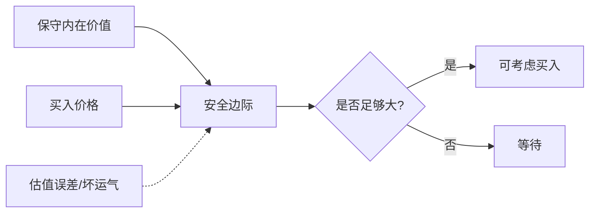

## 查理芒格思维筑基课: 定律7: 安全边际定律 - 给错误和坏运气留空间

### 作者
digoal

### 日期
2026-05-19

### 标签
安全边际 , 保守估值 , 价格折扣 , 认知误差 , 估值风险 , 内在价值 , 风险补偿 , 价值陷阱 , 投资纪律 , 芒格思想

----

## 背景

> 面向对象: 投资者  
> 核心问题: 为什么估值正确还不够，必须买得足够便宜？  
> 先说结论: 安全边际是对认知错误、预测误差和意外冲击的补偿。没有安全边际，正确分析也可能因为价格过高而失败。

## 一张图先看懂

## 求真讲法

### 它到底说了什么

安全边际说: 不要按乐观估值买入，要在保守价值下方留出折扣。因为你可能高估增长、低估竞争、误判管理层或遇到宏观冲击。

### 它是怎么来的

它由有限理性和价格价值分离公理推出。既然估值是区间而非精确数字，买入价格就必须给错误留空间。

### 它依赖哪些假设

| 假设 | 含义 |
|---|---|
| 估值不精确 | 未来现金流只能估计 |
| 意外会发生 | 周期、监管、竞争会改变条件 |
| 价格可偏离价值 | 市场偶尔给出折扣 |

### 常见误解

| 误解 | 更准确的理解 |
|---|---|
| 低市盈率就是安全边际 | 价值陷阱可能更危险 |
| 好公司不需要安全边际 | 好公司也可能价格过高 |
| 安全边际越大越好 | 过度等待可能错过高确定性机会 |

## 求存讲法

### 它有什么用

它把估值变成风险控制工具。确定性越低，要求折扣越大；无法估值，就不应假装有安全边际。

### 它怎么迁移到投资流程

| 确定性 | 需要的安全边际 |
|---|---|
| 宽护城河、现金流稳定 | 较小但仍需折扣 |
| 普通优秀公司 | 中等折扣 |
| 周期或不确定公司 | 大折扣 |
| 无法估值 | 不投资 |

### 它的适用范围和边界

适用于现金流可估资产。边界是: 安全边际不是保证盈利，它只能提高赔率。

### 正例: 怎么用它提升能力

投资者保守估算某公司的价值为100元，只在70元附近分批买入。后来增长低于预期，但因为买入价低，仍保住合理回报。

### 反例: 前提不成立会怎样

投资者以极高估值买入优秀公司。公司十年经营很好，但估值回落抵消了业绩增长，投资回报平庸。失败点是没有安全边际。

## 思考

1. 你给每个持仓设定了多大安全边际？
2. 你的安全边际来自价格低，还是来自幻想高增长？
3. 哪些公司你其实无法估值？

## 最后记住

1. 安全边际承认未来不可知。
2. 便宜不等于有安全边际。
3. 好公司也要看价格。

## 参考资料

- Benjamin Graham, *The Intelligent Investor*.
- Warren Buffett, Berkshire Hathaway Shareholder Letters.
- 本文参考本地 `buffett` 技能资料中的安全边际与估值笔记。
  
#### [PostgreSQL 解决方案集合](../201706/20170601_02.md "40cff096e9ed7122c512b35d8561d9c8")
  
  
#### [德哥 / digoal's Github - 公益是一辈子的事.](https://github.com/digoal/blog/blob/master/README.md "22709685feb7cab07d30f30387f0a9ae")
  
  
#### [About 德哥](https://github.com/digoal/blog/blob/master/me/readme.md "a37735981e7704886ffd590565582dd0")
  
  

  
