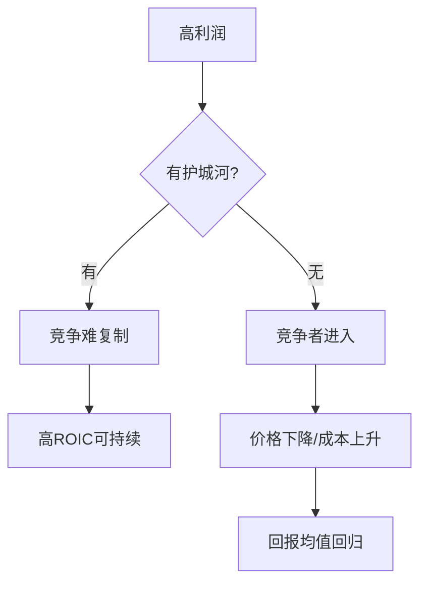

## 查理芒格思维筑基课: 定律8: 护城河定律 - 好公司要能挡住竞争

### 作者
digoal

### 日期
2026-05-19

### 标签
护城河 , 竞争优势 , 高ROIC , 品牌定价权 , 转换成本 , 网络效应 , 低成本优势 , 有效规模 , 长期复利 , 芒格思想

----

## 背景

> 面向对象: 投资者  
> 核心问题: 为什么现在赚钱的公司，不一定是长期好公司？  
> 先说结论: 护城河是企业长期超额收益的保护结构。没有护城河，高利润会吸引竞争，竞争会把回报压回平庸。

## 一张图先看懂

## 求真讲法

### 它到底说了什么

护城河定律说: 投资者要找的不是短期高利润，而是竞争者有钱、有才、有动力仍难以复制的经济优势。

常见护城河包括品牌、低成本、转换成本、网络效应和有效规模。

### 它是怎么来的

它由多因果系统和复利公理推出。复利需要长期高资本回报，而长期高回报需要竞争保护。

### 它依赖哪些假设

| 假设 | 含义 |
|---|---|
| 竞争会追逐高回报 | 超额利润会吸引进入者 |
| 某些优势难复制 | 品牌、网络、规模和习惯可形成壁垒 |
| 护城河会变化 | 技术、监管、消费偏好会侵蚀优势 |

### 常见误解

| 误解 | 更准确的理解 |
|---|---|
| 知名品牌都有护城河 | 有定价权才更接近护城河 |
| 技术领先就是护城河 | 若易被复制，领先只是暂时优势 |
| 护城河一旦存在就永久 | 护城河可能变窄甚至消失 |

## 求存讲法

### 它有什么用

它帮助投资者判断企业能否长期复利。没有护城河的公司，估值再便宜也可能只是价值陷阱。

### 它怎么迁移到投资流程

| 护城河类型 | 检查问题 |
|---|---|
| 品牌 | 能否提价而不大量流失客户？ |
| 低成本 | 竞争者投入巨资能否追上成本结构？ |
| 转换成本 | 客户换供应商痛不痛？ |
| 网络效应 | 用户增加是否提高所有用户价值？ |
| 有效规模 | 市场是否只能容纳少数玩家？ |

### 它的适用范围和边界

适用于长期个股投资。边界是: 护城河强不等于估值合理，也不等于管理层一定会创造价值。

### 正例: 怎么用它提升能力

一家支付网络连接消费者、商户和银行，网络越大越有用，竞争者即使有资金也难以重建两端网络。投资者可把网络效应纳入长期估值。

### 反例: 前提不成立会怎样

一家制造企业当前利润率高，但产品无差异，竞争者扩产后价格战爆发。投资者误把周期高点利润当护城河，最终亏损。

## 思考

1. 你的持仓护城河来自哪里？
2. 如果竞争者投入十倍资金，能否复制它？
3. 护城河是在变宽、稳定，还是变窄？

## 最后记住

1. 高利润需要护城河保护。
2. 护城河看复制难度，不看口号。
3. 护城河也要持续监测。

## 参考资料

- Warren Buffett, Berkshire Hathaway Shareholder Letters.
- Charlie Munger, *Poor Charlie's Almanack*.
- 本文参考本地 `buffett` 技能资料中的商业护城河笔记。
  
#### [PostgreSQL 解决方案集合](../201706/20170601_02.md "40cff096e9ed7122c512b35d8561d9c8")
  
  
#### [德哥 / digoal's Github - 公益是一辈子的事.](https://github.com/digoal/blog/blob/master/README.md "22709685feb7cab07d30f30387f0a9ae")
  
  
#### [About 德哥](https://github.com/digoal/blog/blob/master/me/readme.md "a37735981e7704886ffd590565582dd0")
  
  

  
