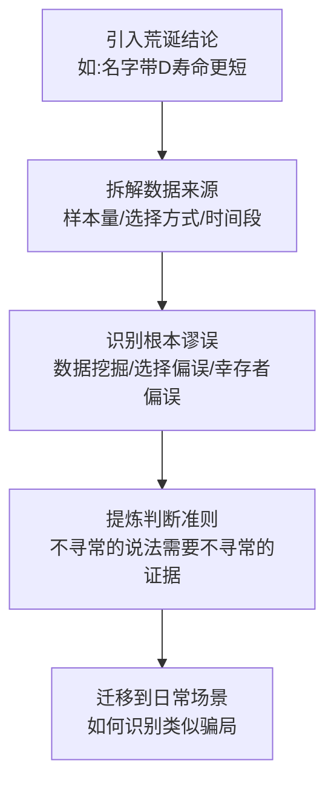
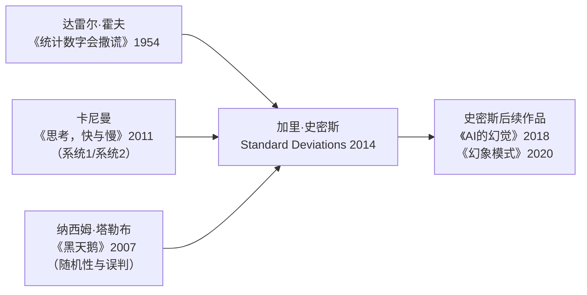

## 《简单统计学》读书笔记  
  
### 作者  
digoal  
  
### 日期  
2026-05-19  
  
### 标签  
读书笔记 , 简单统计学  
  
----  
  
## 背景  
  
---
书名: 《简单统计学》  
原作名: Standard Deviations: Flawed Assumptions, Tortured Data, and Other Ways to Lie with Statistics  
作者: [美] 加里·史密斯（Gary Smith）  
译者: 刘清山  
出版社: 九州出版社 / 后浪  
出版年份: 2025-4（原版2014）  
笔记日期: 2025-05-20  
豆瓣链接: https://book.douban.com/subject/37528384/  
标签: [统计学, 批判性思维, 大数据, 认知偏误, 科普]  
---

# 《简单统计学》读书笔记
## ——数据时代的防骗手册，也是一堂思维训练课

> **一句话**：这不是一本教你"怎么算"的书，而是一本教你"怎么想"的书——在数据泛滥的时代，学会怀疑比学会计算更重要。
>  
> **适合谁读**：对统计数字半信半疑的普通人；被"研究表明"轰炸得精疲力竭的职场人；想培养批判性思维的学生；以及所有在朋友圈转发健康报道之前想先核实一下的人。
>  
> **阅读难度**：⭐⭐☆☆☆（无需数学基础，能加减乘除就够了）
>  
> **推荐指数**：⭐⭐⭐⭐☆

---

## 一、时代坐标：这本书从哪里来？

2014年，大数据概念正处于狂热顶点。《连线》杂志宣告"数据将取代理论"，谷歌的流感趋势预测模型被奉为神话，各路"数据科学家"如雨后春笋般涌现。世界相信：只要数据足够多，真相就会自动浮现。

就在这股潮流席卷一切的时候，加里·史密斯——一个在耶鲁和波莫纳学院教了几十年统计学的老教授——写了一本泼冷水的书。他的核心判断是： **数据越多，被数据骗到的概率反而越高。**

这本书的问题意识非常清晰：我们正处于"大数据悖论"之中。计算机算力的爆炸让研究者可以在海量数据里随意"挖掘"，而只要挖得足够深，任何荒诞的结论都能找到统计支持。名字里带字母"D"的棒球运动员寿命更短？亚裔美国人在每月4号更容易心脏病发作？上午喝一整壶咖啡能延年益寿但每天两杯咖啡会致癌？这些全都是真实发表过的"学术研究成果"。

史密斯的写作背景还有一个重要脉络：他是诺贝尔经济学奖得主詹姆斯·托宾的学生，在耶鲁读博、任教七年。他亲眼看着同行们如何制造出貌似严谨实则荒诞的统计结论。这本书，某种程度上是他对学术界坏风气的一次公开清算。

在他身后，有一个更古老的传统：达雷尔·霍夫1954年的《统计数字会撒谎》（How to Lie with Statistics）。史密斯是这一传统在大数据时代的继承者与升级版。

---

## 二、核心命题：作者在说什么？

### 观点一：人类天生是"模式狂"，而统计数据最擅长喂养这种天性

史密斯认为，人类的认知系统内置了两个危险倾向：第一，我们极容易被"模式"吸引，并且总会为模式寻找解释；第二，一旦形成某个假设，我们就会无意识地寻找支持它的证据，同时忽略反对的证据（这在心理学里叫"确认偏误"）。

统计数据偏偏是喂养这两种倾向的完美饲料。大量数据里总能找到某种规律——哪怕那个"规律"完全是随机产生的。就像一个人对着谷仓墙壁乱打一通枪，然后在弹孔最密集的地方画上靶心——这就是"德克萨斯神枪手谬误"（Texas Sharpshooter Fallacy）。数据挖掘的本质，往往正是这种事后绘制靶心的行为。

### 观点二：相关性≠因果性，但这个错误永远不会过时

书中最核心、反复出现的论点： **两件事同时发生，不等于一件事导致另一件事。** 史密斯举了大量案例：

- 冰淇淋销量和溺水率高度相关（共同原因：夏天天热）
- 参加体育运动的孩子更自信（选择偏误：本来就自信的孩子才更愿意参加运动）
- 卓越公司有共同的"成功特质"（幸存者偏误：失败的公司也有这些特质，只是没人研究它们）

这个道理人人都听过，但史密斯的贡献在于：他用大量真实案例展示，即便是一流学者、顶级期刊，也会一而再地犯这个错误。问题不在于我们不知道这个原则，而在于我们在具体情境中总是忘记它。

### 观点三：数据骗局分两种——蓄意的和无意的，后者更危险

蓄意的统计造假当然存在：广告商篡改坐标轴让微小差异看起来天壤之别，政客挑选对自己有利的基准年份……但史密斯更担心的是无意的自我欺骗。

当研究者真心相信某个理论，他在数据收集、指标选择、时间段划定上的每一个"小决定"，都可能在无意识中朝着支持假说的方向倾斜。这不是造假，这是人类认知的正常工作方式——只是在统计研究的情境下，它的破坏力极其惊人。史密斯援引罗纳德·科斯的名言： **"如果你折磨数据的时间足够长，它终将认罪。"**

---

## 三、论证地图：作者怎么说服你的？

书的结构是围绕常见统计谬误，一章一个主题展开，每章都是"案例→揭秘→原则"的三段式：

书中主要覆盖的谬误清单：

| 谬误类型 | 典型案例 | 识别要点 |
|---|---|---|
| 数据挖掘 / 德克萨斯神枪手 | 棒球球员名字与寿命 | 先有理论，再找数据 |
| 幸存者偏误 | 卓越公司的共同特质 | 看看失败案例有没有同样特质 |
| 选择偏误 | 体育运动与孩子自信 | 是什么人选择了参与？ |
| 相关非因果 | 冰淇淋与溺水率 | 是否存在共同的"隐藏变量"？ |
| 均值回归 | 运动员状态忽高忽低 | 极端表现之后往往趋于平均 |
| 图形欺骗 | 被截断坐标轴夸大的差异 | 检查0基点、坐标比例 |
| 小样本陷阱 | 某村庄肾癌发病率极低/极高 | 样本越小，随机噪音越大 |
| 发表偏误 | 咖啡与各种疾病的矛盾研究 | 阴性结果不容易发表 |

史密斯的论证方式刻意通俗，他不用公式，只用故事。这是优点也是局限（后面批判部分会谈）。核心数据很少、案例却极丰富，让人读来畅快——但有时会让人觉得：这些案例是不是也经过了某种"挑选"？

---

## 四、前提假设与边界：什么情况下这不成立？

**假设一：读者能够识别"不寻常"的说法**
史密斯反复强调"不寻常的说法需要更坚实的证据"，但判断一个说法是否"不寻常"，本身就需要相当的领域知识。普通读者很难知道某个医学发现是突破还是噪音。这本书能训练怀疑的态度，但无法替代领域判断力。

**假设二：理论先于数据才是正确顺序**
史密斯的核心立场是：先有理论，再用数据检验。但在某些真正的科学突破中，数据先行的探索性研究恰恰是发现新理论的起点。他的批评更适用于社会科学和医学，而非基础物理或天文。

**假设三：统计谬误主要是认知问题，不是制度问题**
书中对"为什么谬误不断重演"的解释以认知偏误为主，但"发表或灭亡"的学术激励机制、商业资助的系统性影响，在书中着墨不多。这是这本书相对表浅的地方。

**边界**：这本书更像是"统计思维的疫苗"，而不是"统计分析的工具箱"。它能让你不被愚弄，但并不能教你如何自己做出好的统计研究。

---

## 五、思想谱系：这本书在哪个传统里？

史密斯的思想根植于**行为经济学**对人类认知局限的研究，同时继承了霍夫式的大众统计教育传统。他和塔勒布都关注随机性被系统性低估的问题，但史密斯更温和、更实用主义，塔勒布则更激进、更哲学。

在中国读者熟悉的语境里，这本书和《魔鬼经济学》有一种奇特的张力：《魔鬼经济学》以惊人的统计发现为卖点，而《简单统计学》恰恰批评了其中一个核心案例——"堕胎合法化降低犯罪率"的论断，指出其统计方法存在严重问题。

---

## 六、我学到了什么？

读完这本书，我最大的收获不是某个具体知识点，而是**一种新的阅读反应**：每次看到"研究表明""数据显示""专家指出"，脑子里会自动弹出几个问题：

**样本是怎么来的？** 受访者自愿参与还是随机抽取？调查在哪里进行？ 

**控制了哪些变量，忽略了哪些？** 看似相关的两件事，有没有可能共享一个我们没有测量的隐藏因素？

**这个结论被重复验证过吗？** 单一研究，尤其是小样本的单一研究，可信度极低。

**谁资助了这个研究？** 资金来源不一定代表数据造假，但会提示我们留意可能的立场偏向。

改变了我的一个认知是：我以前觉得"被顶刊发表"是可靠性的强有力背书。看完本书才意识到，发表偏误（positive publication bias）让大量"发现了某种效应"的研究进入文献，而"没有发现效应"的重复实验往往石沉大海。这直接解释了为什么同一种食物，今天说致癌，明天说防癌——因为两种研究都在做，但只有"有结果"的那批更容易见刊。

---

## 七、举一反三：这个框架还能用在哪？

史密斯书中的核心工具 —— **"先问理论，再看数据；先检查来源，再信结论"** —— 几乎可以迁移到任何需要处理信息的场景：

**投资决策**：某只股票过去五年年均涨幅30%，这是选股能力还是幸存者效应？在同期，有多少基金因为亏损而被清盘，从而从统计中消失？

**管理实践**：某套管理方法在A公司大获成功，就说明这套方法普适有效吗？还是A公司本来就处于行业上行期，加上团队本身优秀，任何方法都会成功？

**健康建议**：某项研究说每天冥想20分钟可以降低焦虑30%——被测试的是自愿参与者还是随机群体？30%相对于什么基准？测量焦虑的指标是主观自报还是客观指标？

---

## 八、批判与反思

这本书有一个根本性的矛盾： **它用大量案例来论证"不要轻信案例"** 。史密斯批评别人挑选支持自己立场的数据，但他自己挑选的几十个案例，都恰好是能被他的框架漂亮解释的。那些更复杂、难以判断的案例呢？

此外，史密斯的语气有时过于自信。他批判了《魔鬼经济学》里的堕胎研究、《基业长青》里的成功企业研究，这些批评有道理，但他的反驳同样依赖自己挑选的数据和论证方式——如果套用他自己的标准，他的结论也需要接受同样严格的审视。

**时代的局限性**也值得一提：这本书写于2014年，AI驱动的数据分析和大型语言模型带来的新型统计风险（如幻觉、训练数据偏差、模型自我确认）在书中几乎未被触及。史密斯后来在《AI的幻觉》（2018）中补上了这一课。

总体而言，这是一本极好的**入门级批判性思维训练书**，但不宜当作统计学的终点，而应当作起点。读完之后，你会更善于发现问题，但要真正解决问题，还需要更扎实的方法论学习。

---

## 九、金句与记忆点

**① "如果你折磨数据的时间足够长，它终将认罪。"**
——诺贝尔经济学奖得主罗纳德·科斯。这句话是全书的灵魂，揭示了数据挖掘的本质危险。

**② 德克萨斯神枪手谬误**
先打枪，再画靶心。先看数据，再"发现"规律。这是大数据时代最普遍也最隐蔽的统计陷阱。

**③ "不寻常的说法，需要不寻常的证据。"**
这是史密斯提供给读者最实用的一条准则——遇到让你惊讶的结论，惊讶本身就是提高证据标准的信号。

**④ 幸存者偏误：你看到的，恰恰是活下来的那批**
研究成功公司的共同特质，就像研究战场幸存者身上的弹孔分布，然后以此为据加固不需要加固的部位。

**⑤ 均值回归：极端之后往往趋于平均**
运动员状态大爆发之后往往表现平平，不是因为媒体采访带来了"诅咒"，而是因为极端值本来就不可持续。我们总爱为正常的统计现象找非凡的原因。

**⑥ "相关性不是因果性"——但更难的是识别隐藏变量**
冰淇淋和溺水率的相关，背后藏着"夏天"这个隐藏变量。真实世界里的隐藏变量往往不那么显眼。

**⑦ 发表偏误：阴性结果的沉默**
"咖啡致癌"和"咖啡防癌"的研究都存在，但只有言之凿凿的"发现"更容易发表，而这正是为什么你总能在新闻里看到相互矛盾的营养学报道。

---

## 十、延伸阅读

**① 达雷尔·霍夫《统计数字会撒谎》（How to Lie with Statistics, 1954）**
本书的精神前辈，更薄、更轻快，70年后依然适用。是入门中的入门。

**② 丹尼尔·卡尼曼《思考，快与慢》（Thinking, Fast and Slow, 2011）**
从认知心理学深挖人类判断错误的根源，与本书形成绝佳互补——史密斯告诉你错在哪儿，卡尼曼告诉你为什么错。

**③ 加里·史密斯《幻象模式》（The Phantom Pattern Problem, 2020）**
本书的续集与升级版，专注于大数据和机器学习时代的模式幻觉，更切合当下。

**④ 菲利普·E·特洛克《超级预测》（Superforecasting, 2015）**
和本书互补——在识破坏预测之后，好的预测应该怎么做？特洛克给出了具体方法。

**⑤ 内奥米·奥雷斯克斯、埃里克·康韦《贩卖怀疑的商人》（Merchants of Doubt, 2010）**
本书谈的多是无意的统计误用，这本书则展示了蓄意的科学操纵是如何运作的——从烟草到气候变化，两本书合读，构成对"数据操控"的完整图景。

---

*笔记写于 2025-05-20 | 基于公开资料与深度思考整理*
*原书英文版出版于2014年，中文版（后浪·九州出版社）出版于2025年4月*
  
  
#### [PostgreSQL 解决方案集合](../201706/20170601_02.md "40cff096e9ed7122c512b35d8561d9c8")
  
  
#### [德哥 / digoal's Github - 公益是一辈子的事.](https://github.com/digoal/blog/blob/master/README.md "22709685feb7cab07d30f30387f0a9ae")
  
  
#### [About 德哥](https://github.com/digoal/blog/blob/master/me/readme.md "a37735981e7704886ffd590565582dd0")
  
  

  
