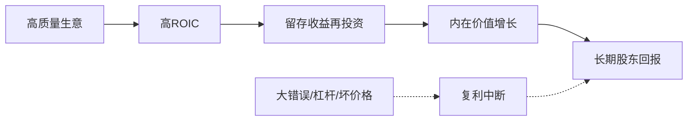

## 查理芒格思维筑基课: 定律9: 复利定律 - 时间奖励高质量，惩罚大错误

### 作者
digoal

### 日期
2026-05-19

### 标签
复利定律 , 高质量生意 , 留存收益 , 再投资回报 , 护城河 , 长期持有 , 资本回报率 , 杠杆风险 , 股东价值 , 芒格思想

----

## 背景

> 面向对象: 投资者  
> 核心问题: 怎样让时间成为投资朋友，而不是敌人？  
> 先说结论: 复利需要优质资产、合理价格、持续再投资和不被迫退出。时间只奖励好生意和好纪律，不奖励坏生意的长期持有。

## 一张图先看懂

## 求真讲法

### 它到底说了什么

复利定律说: 长期收益来自收益再产生收益。对股票投资来说，关键是企业能否把留存收益以高回报再投资，投资者能否不因波动被迫离场。

### 它是怎么来的

它由“长期结果由复利决定”公理推出。数学上，年化差异会被时间放大；商业上，护城河决定高回报能否持续。

### 它依赖哪些假设

| 假设 | 含义 |
|---|---|
| 企业能再投资 | 留存收益不是被浪费 |
| 护城河保护回报 | 高ROIC不被竞争迅速压低 |
| 投资者能长期持有 | 不因杠杆或情绪中断 |

### 常见误解

| 误解 | 更准确的理解 |
|---|---|
| 买了不卖就是复利 | 坏公司长期持有是反向复利 |
| 增长越快越好 | 低回报增长会毁灭价值 |
| 复利不需要估值 | 高价格会压低长期收益率 |

## 求存讲法

### 它有什么用

它帮助投资者识别“时间的朋友”: 高ROIC、低资本消耗、强护城河、好管理层、合理价格。

### 它怎么迁移到投资流程

| 复利要素 | 检查指标 |
|---|---|
| 质量 | ROIC、毛利率、现金转换 |
| 持久性 | 护城河趋势、客户留存 |
| 再投资 | 增量资本回报 |
| 生存 | 负债、流动性、周期压力 |

### 它的适用范围和边界

适用于长期权益投资。边界是: 周期股、衰退行业和高杠杆公司可能无法成为复利资产。

### 正例: 怎么用它提升能力

投资者持有一家资产轻、品牌强、能持续小幅提价的公司。公司把利润用于高回报扩张和低估回购，内在价值多年增长。

### 反例: 前提不成立会怎样

投资者长期持有一家资本开支沉重、无定价权的企业，以为时间会修复一切。结果利润被再投资需求吃掉，股东回报很差。

## 思考

1. 你的持仓是在复利，还是只是在波动？
2. 企业留存收益是否真的创造了更多价值？
3. 哪些风险会打断你的复利过程？

## 最后记住

1. 时间只奖励高质量资产。
2. 复利需要不中断。
3. 增长必须创造股东价值。

## 参考资料

- Warren Buffett, Berkshire Hathaway Shareholder Letters.
- Charlie Munger, *Poor Charlie's Almanack*.
- 本文参考本地 `buffett` 技能资料中的复利和财务指标笔记。
  
#### [PostgreSQL 解决方案集合](../201706/20170601_02.md "40cff096e9ed7122c512b35d8561d9c8")
  
  
#### [德哥 / digoal's Github - 公益是一辈子的事.](https://github.com/digoal/blog/blob/master/README.md "22709685feb7cab07d30f30387f0a9ae")
  
  
#### [About 德哥](https://github.com/digoal/blog/blob/master/me/readme.md "a37735981e7704886ffd590565582dd0")
  
  

  
