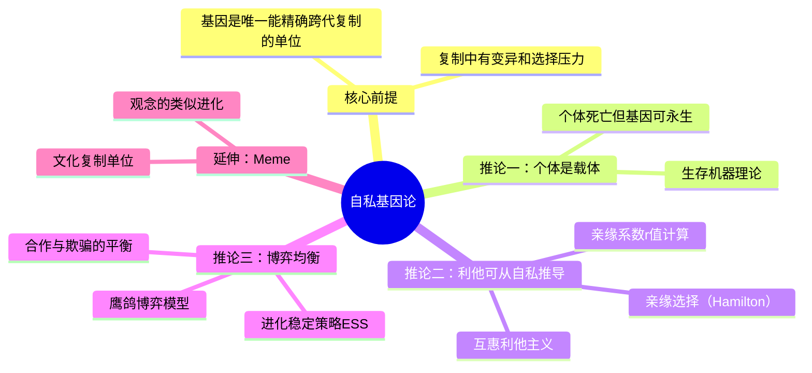

## 《自私的基因》读书笔记  
  
### 作者  
digoal  
  
### 日期  
2026-05-19  
  
### 标签  
读书笔记 , 自私的基因  
  
----  
  
## 背景  
  
---
书名: 《自私的基因》The Selfish Gene
作者: 理查德·道金斯（Richard Dawkins）
译者: 卢允中 / 张岱云 / 陈复加 / 罗小舟
出版社: 中信出版社
出版年份: 1976（原著）/ 2012（中信版）
笔记日期: 2025-05-20
豆瓣链接: https://book.douban.com/subject/11445548/
标签: [进化论, 基因, 演化生物学, 科普, 利他主义, meme]
---

# 《自私的基因》读书笔记

> **一句话**：基因才是进化的主角，我们只是它们的"生存机器"——但理解这一点，恰恰让我们有机会超越它。
> **适合谁读**：对"人性本善还是本恶"有困惑的人；想搞懂进化论底层逻辑的人；对互联网文化、传播学、行为经济学感兴趣的人。
> **阅读难度**：⭐⭐⭐☆☆
> **推荐指数**：⭐⭐⭐⭐⭐

---

## 一、时代坐标：这本书从哪里来？

1973年，牛津大学实验室因矿工罢工频繁停电，年仅35岁的动物行为学家理查德·道金斯被迫中断对蟋蟀的研究，开始提笔写书"自娱"。他没有预料到，这本书会成为20世纪科学史上争议最持久、影响最深远的科普著作之一。

彼时，达尔文的进化论已经一百多年，但关于"自然选择究竟作用于哪个层次"，生物学界仍有激烈争论。主流观点倾向于"群体选择"——即生物的利他行为是为了种群整体利益而演化出来的。然而，1960年代，乔治·威廉斯（George C. Williams）和W·D·汉密尔顿（W.D. Hamilton）相继提出异议：真正被选择的，既不是物种，也不是个体，而是**基因**。

道金斯的贡献，是把这个学术圈内尚显晦涩的"基因中心论"，用无与伦比的文学才华翻译成大众语言——配上大量动物行为案例，配上充满挑衅感的书名，送到了全世界读者手中。

```
时代坐标轴
─────────────────────────────────────────────────────────
1859   达尔文《物种起源》：自然选择作用于个体
  │
1960s  威廉斯、汉密尔顿：自然选择更应聚焦基因层次
  │
1976   道金斯《自私的基因》：向大众普及"基因中心论"
  │
1989   第二版：新增"好人终会出头"等章节
  │
2006   三十周年纪念版：Meme概念影响互联网文化研究
  │
今天   基因组计划完成，kin selection理论成为主流
─────────────────────────────────────────────────────────
```

---

## 二、核心命题：作者在说什么？

### 命题一：基因才是自然选择的真正单位

这是全书最颠覆直觉的一刀。

我们通常以为，进化是关于物种的，或者至少是关于个体的——强壮的狮子活下来，瘦弱的被淘汰。道金斯说：不对，这只是表象。真正被"选择"的，是**基因**。

逻辑链条是这样的：
- 基因（DNA片段）是唯一真正能跨代复制的东西
- 个体会死，物种会灭绝，但成功的基因可以在时间长河中"永生"
- 任何促进自身被复制的基因，都会在演化中胜出
- 生物个体，只是基因为了延续自身而"建造"的临时容器——道金斯称之为" **生存机器** "（survival machine）

这个视角的妙处在于：它不是说"基因有意识地自私"，而是说，在漫长演化中，**凡是行为上看起来自私的基因（即有利于自身复制的基因）都活了下来，其他的都消失了**。所谓"自私"，是演化的结果，不是意图。

### 命题二：利他行为可以用自私基因来解释

这是本书最精彩的推论。

如果基因是自私的，为什么动物界有那么多"利他行为"？父母为后代牺牲，蚂蚁为蚁后赴死，小鸟发出警报叫声提醒同伴？

道金斯引入汉密尔顿的**亲缘选择理论**（kin selection）：基因不会傻傻地只关心"这个个体"，它关心的是"任何携带同一份基因的个体"。父母与子女共享50%基因，兄弟姐妹之间也是50%，表亲之间12.5%……

所以，一只鸟为兄弟姐妹冒险发警报，如果因此帮助多个兄弟存活，其"共享基因"的净存续就是正收益的。行为在个体层面看是"无私的"，在基因层面却是彻底"自私的"。

这个逻辑优美而冷酷： **爱，只是基因的生存策略**。

### 命题三：Meme——文化也有自己的"自私基因"

书的最后一章，道金斯提出了改变了信息传播学的新概念： **Meme（模因）** 。

他认为，基因不是唯一能"自私地复制"的东西。文化也有类似的复制单位——一首歌、一个观念、一种习俗。它们在人脑之间传播，成功传播的就留下，失败的就消失。这和基因的演化逻辑如出一辙。

如今"Meme"已经成为互联网表情包文化的专用词汇。但道金斯的原意远比这深刻：他是在暗示，**基因不是唯一的复制器，而进化也不仅仅属于生物学**。

---

## 三、论证地图：作者怎么说服你的？



道金斯的论证方式极具特色，他不依赖枯燥数据，而是用**思想实验+动物行为案例**组合出击：

- **大鱼小鱼的清洁站**：小鱼为大鱼剔牙、清理寄生虫，大鱼不吃掉小鱼——这不是仁慈，而是互惠利他主义的博弈均衡。吃掉小鱼的大鱼会死于寄生虫，不合作的小鱼会被惩罚。代代筛选，只留下合作的基因。

- **布谷鸟的寄生**：布谷鸟将蛋产在其他鸟巢中，宿主鸟竟然认养并哺育布谷鸟雏鸟，甚至在布谷鸟幼鸟将其亲生子推出鸟巢后依然喂养。这说明"亲代本能"是可以被寄生的——基因的"生存程序"是可以被欺骗的。

- **进化稳定策略（ESS）** ：道金斯引入约翰·梅纳德·史密斯的博弈论框架，说明种群内部的行为策略会趋向某种均衡。如果全是"鸽派"，"鹰派"就会入侵；如果全是"鹰派"，内耗太大谁都活不好。最终，种群会稳定在一个鹰鸽混合比例上。

这些例子的共同点是： **用具体的、可量化的逻辑，消解了我们对"情感"的浪漫想象**。

---

## 四、前提假设与边界：什么情况下这不成立？

道金斯的论证建立在几个关键假设上，值得仔细审视：

**假设一：基因是离散的、可独立被选择的单位**
现代基因组学告诉我们，基因组的运作比道金斯想象的更加复杂——基因之间存在大量上位效应（epistasis），一个基因的表现高度依赖其他基因的背景。真正"独立自私"地运作的基因，在现实中可能极为罕见。

**假设二：行为由基因决定的程度足够强**
道金斯从未宣称"基因决定一切"，但批评者指出，人类行为受文化、学习、语言、制度的影响极大，将人类社会行为直接类比动物行为，可能过度简化了文化的力量。

**假设三："自私"这个词是中性的**
这是最大的误解来源。道金斯自己在晚年也承认，用"自私"这个词是一个"危险的好主意"——它吸引了眼球，但也造成了无数人将基因的"选择结果"误读为"道德处方"，甚至用来为人类的自私行为辩护。

**书的适用边界**：本书最精准的适用场景，是解释**动物行为的演化起源**。一旦延伸到"人类社会应该怎么运作"，就需要额外引入文化演化、制度设计等维度。

---

## 五、思想谱系：这本书在哪个传统里？

```
达尔文（1859）
自然选择作用于个体
       │
       ▼
威廉斯（1966）        汉密尔顿（1964）
反对群体选择          亲缘选择理论
       │                    │
       └──────────┬─────────┘
                  ▼
          道金斯（1976）
          基因中心论的大众普及
          +Meme概念的提出
                  │
       ┌──────────┴─────────┐
       ▼                    ▼
  斯蒂芬·平克          丹尼尔·丹尼特
  进化心理学            哲学延伸
  《白板》等            《达尔文的危险思想》
       │
       ▼
  史蒂文·平克、罗伯特·赖特等
  "新达尔文主义"公共知识分子群体
```

道金斯本质上是一个**科普翻译者+原创贡献者**的双重角色。他将威廉斯和汉密尔顿的学术思想带给大众，同时贡献了"生存机器"和"Meme"两个影响深远的原创概念。

值得一提的是，古尔德（Stephen Jay Gould）是道金斯最著名的学术对手，他坚持"间断平衡论"，反对过度强调基因层面的选择。两人的辩论贯穿了1980-2000年代的演化生物学公共讨论，堪称那个时代最精彩的学术擂台。

---

## 六、我学到了什么？

读这本书有一种奇特的体验：读的过程中会有些沮丧，读完之后却感到某种奇异的自由。

**收获一：一把看穿"表面利他"的解剖刀**

从此看待任何"自我牺牲"的行为，我都会多问一层：这个行为在基因层面上真的是无私的吗？父母为孩子付出一切，不只是爱，也是基因的精密计算。这不是在否定爱，而是在理解爱的更深根源。这把刀用在自己身上同样有效——我的某些"慷慨"，究竟有多少是真正超越基因本能的？

**收获二：用博弈论理解社会稳定**

进化稳定策略（ESS）让我对社会现象有了新的解读框架。为什么合作能够在自私个体之间演化出来？不是因为道德，而是因为重复博弈中，合作策略往往比纯粹背叛策略表现更好。道金斯在书中总结的"以牙还牙"（Tit for Tat）策略后来在阿克塞尔罗德的计算机竞赛中获胜，这不是巧合。

**收获三：最后那句话改变了我的自我认知**

书末道金斯写道："我们，唯独我们，能够反抗自私的复制者的暴政。"这句话至关重要。他不是在说"你注定是自私的"，而是说"你有能力理解自己的基因程序，并选择不完全服从它"。这是一种非常独特的人文主义——不是否认人的生物属性，而是在承认它之后，强调意识的超越性。

---

## 七、举一反三：这个框架还能用在哪？

**场景一：理解互联网传播规律**
Meme理论直接预言了病毒式传播的逻辑。一条信息之所以被大量转发，不是因为它"真实"，而是因为它具备了让人忍不住传播的特征（情绪激发、身份认同、稀缺感）。这是一种"传播适应性"，和基因的"生存适应性"同构。

**场景二：理解组织内部的"基因竞争"**
一家公司里，各个部门争夺预算和资源，可以用ESS框架分析：什么样的"行为策略"能在公司这个生态中长期存活？纯粹内耗的部门最终会被淘汰，但完全合作又容易被搭便车。均衡点往往在中间某处。

**场景三：看待慈善与公益**
用亲缘选择和互惠利他的视角，"陌生人之间的慈善"其实是最难用生物学解释的现象之一——它跨越了血缘，也超出了直接互惠的范围。道金斯本人也承认，Meme层面的文化演化可能在这里扮演了关键角色。

---

## 八、批判与反思

**最大的问题：书名造成了一场持续50年的误读**

道金斯自己在晚年承认，他后悔用了"自私"这个词。许多人没读过书，凭书名就得出"基因自私所以人天生自私所以自私是合理的"这个三段论，然后用它为自己的道德懒惰背书。这本书是对人类认知的一次测试：你是从它的逻辑出发，还是只从书名寻找自我合理化？

**学术层面的局限：表观遗传学的挑战**
近年来表观遗传学（epigenetics）的发展显示，环境可以影响基因的表达方式，甚至这种影响可以跨代传递。这在一定程度上动摇了"纯粹基因决定论"的图景，让"基因是最终单位"的命题变得更加复杂。

**群体选择的卷土重来**
多层次选择理论（multilevel selection）近年来在E.O.威尔逊等人的推动下重新获得关注。自然选择可能同时在基因、个体、群体多个层次上运作，而不是像道金斯坚持的那样只在基因层次。这场争论至今未有定论。

**道金斯本人的局限**
道金斯是一个极其优秀的论争者，但他有时候过于自信、过于好斗，倾向于把复杂问题简化为两极对立。他对宗教的攻击（《上帝的错觉》）也让许多人混淆了他作为科学家与公共知识分子的两个身份，进而对他的科学著作产生无谓的偏见。

---

## 九、金句与记忆点

1. **"我们都是生存机器——机器人载体，被盲目地编程以保存自私基因。"**
   → 冷酷，但精准。这不是悲观主义，是换个视角看见自己的生物底层。

2. **"基因在时间上是不朽的。"**
   → 个体会死，但成功的基因可以穿越亿年。你体内有些DNA可能比恐龙还古老。

3. **"唯独我们，能够反抗自私复制者的暴政。"**
   → 全书最人文主义的一句话。理解进化不是为了臣服它，而是为了超越它。

4. **"Meme是一个在文化传播中的信息单元，通过模仿而复制。"**
   → 这个词1976年被发明，2023年成为了全球最通用的互联网词汇。先见之明。

5. **"亲缘系数决定利他程度。"**
   → 为什么你愿意为兄弟冒险，但未必愿意为陌生人？数学给了你一个答案：r=0.5 vs r≈0。

6. **"一个基因能够在许多不同的个体中找到自己的拷贝。"**
   → 这解释了为什么自然界中"家族"比"个体"更像进化的真实单位。

7. **"好人终会出头"（Nice guys finish first）**
   → 道金斯后来专门为此拍了BBC纪录片。在重复博弈中，合作策略长期胜过背叛策略。

---

## 十、延伸阅读

| 书目 | 推荐原因 |
|------|---------|
| 《扩展的表现型》（道金斯）| 本书的学术升级版，深入讨论"基因的长臂"概念，是真正的硬核 |
| 《自私的基因》的反驳：《进化：一个观念的历史》| 了解多层次选择理论，听听反方意见 |
| 《合作的进化》（罗伯特·阿克塞尔罗德）| 博弈论视角下合作如何从自私中演化，与道金斯观点互补 |
| 《白板》（斯蒂芬·平克）| 进化心理学的当代综合，人性本能的更宽广图谱 |
| 《达尔文的危险思想》（丹尼尔·丹尼特）| 哲学家视角下的进化论，探讨道金斯理论的更深哲学含义 |

---

*笔记写于 2025-05-20 | 基于维基百科、知乎长评、学术书评与深度思考整理*
*本笔记为个人学习研究用途，所有核心观点均属道金斯原著，笔记为二次解读与批评性分析*
  
  
#### [PostgreSQL 解决方案集合](../201706/20170601_02.md "40cff096e9ed7122c512b35d8561d9c8")
  
  
#### [德哥 / digoal's Github - 公益是一辈子的事.](https://github.com/digoal/blog/blob/master/README.md "22709685feb7cab07d30f30387f0a9ae")
  
  
#### [About 德哥](https://github.com/digoal/blog/blob/master/me/readme.md "a37735981e7704886ffd590565582dd0")
  
  

  
