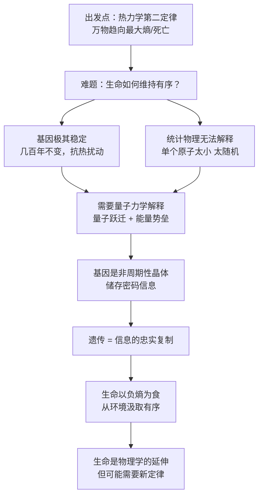

## 《生命是什么》读书笔记: 活细胞的物理观 
  
### 作者  
digoal  
  
### 日期  
2026-05-19  
  
### 标签  
读书笔记 , 生命是什么  
  
----  
  
## 背景  
  
---
书名: 《生命是什么——活细胞的物理观》  
作者: 埃尔温·薛定谔（Erwin Schrödinger）  
译者: 张卜天  
出版社: 商务印书馆  
出版年份: 2018（原著1944）  
笔记日期: 2026-05-20  
豆瓣链接: https://book.douban.com/subject/1317485/  
标签: [物理学, 生命科学, 哲学, 分子生物学, 跨学科]  
---

# 《生命是什么》读书笔记

> **一句话**：一位量子物理学家用外行的天真，问出了专业生物学家从未敢问的问题，并因此改变了整个20世纪。  
> **适合谁读**：对科学史感兴趣的人、想理解"熵"这个概念的普通读者、思考生命与秩序关系的哲学爱好者  
> **阅读难度**：⭐⭐⭐☆☆  
> **推荐指数**：⭐⭐⭐⭐⭐  

---

## 一、时代坐标：一本战时流亡者的演讲稿

1943年，正是二战最惨烈的年头。而在爱尔兰都柏林的三一学院，一场不寻常的讲座正在进行——台上站着的，是被纳粹吞并的奥地利流亡到此的物理学家薛定谔，他正在用英语（并非母语）向数百名听众讲述一个问题： **生命，到底是什么？**

薛定谔此时已因波动方程（薛定谔方程）荣获1933年诺贝尔物理学奖，是量子力学的奠基者之一。但他偏偏选择在这个时刻，跨出了物理学的舒适区，闯入了生物学的领地。

这种"闯入"本身就值得玩味。上世纪30年代末，生物学正经历一场转变——从描述性科学向机制科学演进，遗传学家摩尔根的果蝇实验让科学家开始从基因的角度理解遗传，但基因是什么、它如何保持稳定、突变怎样发生，这些问题仍是谜团。

薛定谔的问题意识来自物理学的核心张力： **热力学第二定律说万物趋向无序，但生命偏偏维持着极度的有序。这如何可能？**

演讲次年（1944年）整理出版成书，不足10万字，却成了20世纪科学史上影响最深远的小册子之一。

```
时间轴：

1926年  薛定谔提出波动方程，量子力学成形
  │
1933年  薛定谔获诺贝尔物理学奖
  │
1943年  都柏林演讲：《生命是什么》
  │
1944年  出版成书
  │
1953年  沃森 & 克里克发现DNA双螺旋结构
  │        ↑
  └────── 克里克致信薛定谔："我们都受了您那本小书的影响"
  │
1965年  分子生物学蓬勃兴起
```

---

## 二、核心命题：薛定谔在说什么？

这本书的核心不是一个答案，而是三个彼此咬合的洞见。

### 洞见一：基因是"非周期性晶体"——生命的密码本

在1943年，大多数人认为基因是蛋白质。薛定谔提出了一个截然不同的图像：遗传信息被编码在某种**非周期性晶体**（aperiodic crystal）结构中。

普通晶体（如食盐、雪花）是周期性重复的，规律美丽，但携带的信息量极少——就像一首只会循环同一小节的乐曲。而"非周期性晶体"则不同：它的原子排列方式千变万化，可以像一部长篇小说一样，在微小的空间里储存海量信息。

薛定谔把它比作"密码本"（code-script）——遗传性状的全部蓝图，就藏在这本密码书里。

这个概念在今天看来显然是在描述DNA。沃森和克里克发现双螺旋之后，克里克主动写信告诉薛定谔，他们发现的正是薛定谔所预言的那种结构。一个物理学家在对生物学一知半解的情况下，凭借物理直觉，竟然预言了DNA的存在形式——这是科学史上最迷人的跨学科预言之一。

### 洞见二：生命以负熵为生——对抗宇宙的衰退

热力学第二定律告诉我们：孤立系统的熵（混乱程度）只会增加，宇宙整体走向无序。那么，生命体为何能维持如此精密的有序？

薛定谔的回答是： **生命不是孤立系统**。它通过与环境的物质和能量交换，不断"吸取负熵"来抵消自身不断产生的熵增。

用更直白的话说：我们吃饭、呼吸、排泄，不仅仅是在补充能量，更是在把"无序"外包给环境，让自己保持有序。生命是一台精密的"有序泵"，把宇宙的无序吸纳进来，把自身的无序排放出去。

> 生命有机体的特殊能力： **吞噬负熵，维持有序**。

这个观点后来影响了普里高津的耗散结构理论（1977年诺贝尔化学奖），也是今天复杂系统科学的基础观念之一。

### 洞见三：生命需要新物理学——但或许不存在

薛定谔在书末留下了一个开放性的挑战：生命现象是否完全能被已知的物理学解释？他倾向于认为，可能存在某种"超越现有物理定律"的新原理，专门用于解释生命的有序性。

这个猜测今天看来是错的——生命并不需要新物理定律，分子生物学和信息论已经提供了充分的工具框架。但薛定谔提出问题的方式，召唤了整整一代物理学家投身生物学研究，其提问本身的价值远超答案。

---

## 三、论证地图：薛定谔如何一步步说服你



薛定谔的论证路径非常优雅：他从物理学家最熟悉的热力学出发，发现生命是个"异类"，然后用量子力学来解释这个异类，最后用"负熵"这个概念统一了整个图景。

论证的核心证据是德尔布吕克（Max Delbrück）的实验——通过高能辐射诱导基因突变，估算出基因大小约为原子的1000倍，这个尺寸意味着无法用经典统计力学解释其稳定性，必须动用量子效应。

---

## 四、前提假设与边界：什么情况下这不成立？

**假设一：生命的本质可以被物理学还原**

薛定谔默认"生命最终是物质的有序排列"，这个还原论假设今天仍有争议。意识、主观体验（qualia）等现象是否能被物理学完全解释，至今没有定论。

**假设二：负熵是生命的核心特征**

这个洞见深刻，但并不完整。批评者指出，薛定谔的分析缺少了一个关键概念——**信息**。香农（Claude Shannon）在同一时代建立的信息论，以及后来的控制论，提供了更精确的框架。负熵固然重要，但生命更核心的特征或许是**信息的自我复制与传递**。

**假设三：量子效应是遗传稳定性的原因**

这个预测的前半部分（基因是大分子，承载遗传信息）被证实了；但后半部分（量子跃迁是基因突变的根本机制）到今天仍有争议，量子生物学是一个尚未成熟的领域。

这本书的边界在于：它是一部**激发性作品**，而非一部严格的科学论文。它的价值不在于给出了正确答案，而在于用正确的问题打开了一扇门。

---

## 五、思想谱系：这本书站在哪个传统里？

薛定谔在物理学与生物学之间架了一座桥，但他其实也站在更长的思想传统上：

- **玻尔兹曼 / 麦克斯韦**：统计力学与热力学，薛定谔的"熵"概念直接来源于此
- **德尔布吕克**：量子物理学家转型研究遗传学，是薛定谔的重要参照
- **魏斯曼 / 孟德尔**：遗传学传统，薛定谔从这里借来了"遗传性状稳定传递"的问题

薛定谔的这本书，直接影响了：
- **沃森 & 克里克**（1953年，DNA双螺旋）
- **莫里斯·威尔金斯**（诺贝尔奖得主，同样受此书启发）
- **普里高津**（耗散结构理论，开放系统与负熵）
- **量子生物学**这个新兴学科

```
思想影响脉络：

玻尔兹曼（热力学熵）───────┐
德尔布吕克（量子遗传）─────┤
孟德尔（遗传学）──────────┤
                        ↓
              薛定谔《生命是什么》（1944）
                        │
           ┌────────────┼────────────┐
           ↓            ↓            ↓
     DNA双螺旋      耗散结构      量子生物学
   （Watson/Crick） （普里高津）  （现代研究）
```

---

## 六、我学到了什么？

读这本书，有三件事让我久久无法平静。

**第一件：问题比答案更重要。**

薛定谔在生物学上的许多具体猜测后来被证明是错的，或者不完整的。但他这本书的历史地位，恰恰不建立在答案的正确性上，而建立在**问题的正确性**上。他问出了"基因如何在热扰动中保持稳定"这个问题，就足够改变历史。这提醒我，在任何领域，识别出"真正的问题"是一种比给出答案更稀缺的能力。

**第二件：跨界的天真，是一种力量。**

薛定谔自己承认，他对生物学是外行。但正因为是外行，他不被学科的既有框架束缚，可以用物理学家的眼睛去看一个生物学问题。他的"天真"让他能提出"这难道不违反热力学第二定律吗？"这种生物学家可能从来不会问的问题。有时候，**不懂，反而是一种认知优势**。

**第三件："负熵"是一个理解世界的框架。**

我开始用"熵"和"负熵"来理解许多事情：为什么城市需要不断投入资源才能维持（否则会衰退）？为什么人际关系需要持续经营（否则会疏远）？为什么组织需要不断学习（否则会僵化）？生命以负熵为生，但何止是生命——一切有秩序的系统，都需要对抗熵增。

---

## 七、举一反三：这个框架还能用在哪？

**负熵框架的迁移应用：**

1. **组织管理**：一个公司就是一个开放系统。停止从外部汲取信息、人才和资源（负熵），就会走向官僚化和衰退（熵增）。"活力"不是玄学，而是系统的负熵水平。

2. **个人成长**：人的认知系统也是如此。持续学习、输入新信息，是在维持思维的有序性；停止输入，思维会逐渐僵化——这不是比喻，而是有热力学基础的类比。

3. **社会文明**：文明是人类对抗熵增的集体尝试。城市、制度、文化，都是在更大尺度上维持有序的"负熵机器"。当这些机器停止运作，文明就会衰退——历史上每一次文明崩溃，都可以在这个框架里找到某种呼应。

---

## 八、批判与反思

这本书有三个值得警惕的地方。

**一、"负熵"概念的滥用**

在中国，"生命以负熵为生"已经成为一句被过度引用的金句，甚至被贴上各种成功学、心灵鸡汤的标签。薛定谔的原意是严谨的热力学概念，但在传播过程中被稀释成了"人要有活力"这种没有实质内容的口号。**能量满满不等于负熵，勤奋也不等于有序**。

**二、缺失了信息论**

薛定谔写作时，香农的信息论尚未问世（1948年才发表）。这导致书中的框架虽然有直觉上的正确性，但缺少了一个关键齿轮： **生命的本质更接近"信息的自复制"，而不仅仅是"有序的维持"** 。今天的分子生物学证明，DNA最重要的特征不是它的物理稳定性，而是它携带的信息及其忠实复制的机制。

**三、意识问题的悬而未决**

书的后半部分《心灵与物质》讨论意识问题，薛定谔借鉴了东方哲学（特别是吠檀多传统）来尝试回应心身问题。这部分在今天看来更接近哲学冥想，而非科学论证。意识问题至今仍是"困难问题"（hard problem），薛定谔的尝试是真诚的，但并没有真正解决它。

---

## 九、金句与记忆点

1. **"生命以负熵为生。"**
   ——生命不是在消耗能量，而是在消耗有序性，向环境排放无序。这一句话把生命的物理本质说清楚了一半。

2. **"遗传物质是一种非周期性晶体。"**
   ——在DNA被发现前9年，薛定谔用物理直觉画出了遗传物质的轮廓。这是科学史上最精彩的跨学科预言之一。

3. **"每一个过程、事件、发生着的事，都意味着它所在的那部分世界的熵在增加。"**
   ——这是热力学第二定律最有诗意的表达。宇宙在走向死亡，而我们是其中短暂的有序。

4. **"有机体能够以令人惊异的规则性运作，远超任何无机物，而且比无机物持久得多。"**
   ——生命的奇异之处不在于它能活动，而在于它能**持久地**按规则活动。

5. **"我们必须努力找到一种新的物理定律。"**
   ——薛定谔的这个猜测是错的，但它召唤了整整一代科学家，这个错误比许多正确答案更有价值。

6. **"染色体纤丝是密码本，同时又是执行密码规定的行政机关。"**
   ——信息与执行合一：这对理解基因如何同时携带蓝图、又参与表达，是一个绝妙的比喻。

---

## 十、延伸阅读

1. **《双螺旋》——詹姆斯·沃森**
   亲历者视角的DNA发现过程，读完之后再回头看《生命是什么》，会明白薛定谔的种子如何生长成参天大树。

2. **《熵：一种新世界观》——里夫金 & 霍华德**
   将熵的概念延伸到社会与文明尺度，是《生命是什么》的一个通俗版延续。

3. **《自私的基因》——理查德·道金斯**
   从"信息复制子"的角度重新定义生命，可以看作是对薛定谔"遗传密码本"概念的深化与推进。

4. **《耗散结构》——伊利亚·普里高津**
   直接受薛定谔启发，将开放系统和负熵思想发展为严格的物理理论，获1977年诺贝尔化学奖。

5. **《生命是什么》（剑桥大学出版社原版）**
   如有能力，建议对照英文原版阅读。薛定谔文字优美，译本质量参差不齐，商务印书馆张卜天译本相对可靠。

---

*笔记写于 2026-05-20 | 基于公开资料与深度思考整理*
*这是一本97页的小书，但它承载的问题，足够人类再想一百年。*
  
  
#### [PostgreSQL 解决方案集合](../201706/20170601_02.md "40cff096e9ed7122c512b35d8561d9c8")
  
  
#### [德哥 / digoal's Github - 公益是一辈子的事.](https://github.com/digoal/blog/blob/master/README.md "22709685feb7cab07d30f30387f0a9ae")
  
  
#### [About 德哥](https://github.com/digoal/blog/blob/master/me/readme.md "a37735981e7704886ffd590565582dd0")
  
  

  
