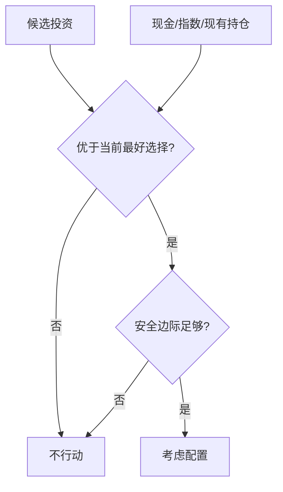

## 查理芒格思维筑基课: 定律10: 机会成本定律 - 不够好就是不够好

### 作者
digoal

### 日期
2026-05-19

### 标签
机会成本定律 , 不够好 , 组合管理 , 资本配置 , 现金选择权 , 替代收益 , 投资门槛 , 持仓比较 , 长期回报 , 芒格思想

----

## 背景

> 面向对象: 投资者  
> 核心问题: 为什么芒格式投资者经常显得很挑剔？  
> 先说结论: 因为资本、时间和注意力都有限，每个“还不错”的机会都在占用本可投向更好机会的资源。不够好，就是不够好。

## 一张图先看懂

## 求真讲法

### 它到底说了什么

机会成本定律说: 评价投资不能孤立地问“它好吗”，而要问“它是否比其他可行选择更好”。这会自然提高买入门槛。

### 它是怎么来的

它由“机会成本是真实成本”公理推出。资本一旦投入普通机会，就放弃了未来更好机会和现金选择权。

### 它依赖哪些假设

| 假设 | 含义 |
|---|---|
| 资源有限 | 不可能买下所有机会 |
| 机会质量分布不均 | 少数机会远优于多数 |
| 等待有价值 | 现金保留选择权 |

### 常见误解

| 误解 | 更准确的理解 |
|---|---|
| 有收益就值得 | 要看相对替代项 |
| 满仓才有效率 | 低质量满仓是低效 |
| 卖出必须因为持仓变坏 | 也可能因为出现显著更好机会 |

## 求存讲法

### 它有什么用

它帮助投资者控制组合质量。每个新增持仓都应提高组合整体质量，而不是增加复杂度。

### 它怎么迁移到投资流程

| 决策 | 机会成本问法 |
|---|---|
| 买入 | 它比我已有持仓更值得吗？ |
| 持有 | 继续持有是否优于可替代选择？ |
| 加仓 | 加这里是否比加最好公司更好？ |
| 持现金 | 等待是否比勉强买入更好？ |

### 它的适用范围和边界

适用于组合管理和仓位选择。边界是: 不要因追求完美替代项而永远无法行动。

### 正例: 怎么用它提升能力

投资者把所有候选公司与组合中最强的三家公司比较。只有当新公司在质量、价格或分散风险上明显更优时才买入。

### 反例: 前提不成立会怎样

投资者买入十几家“也还行”的公司，结果精力分散、组合质量下降，错过真正懂且赔率更好的核心机会。

## 思考

1. 你的每个持仓是否打败现金和指数？
2. 你的组合里哪些公司只是“舍不得卖”？
3. 你是否用机会成本决定仓位？

## 最后记住

1. 投资是相对选择。
2. 不够好就是不够好。
3. 现金也参与比较。

## 参考资料

- Charlie Munger, *Poor Charlie's Almanack*.
- Warren Buffett, Berkshire Hathaway Shareholder Letters.
- 本文参考本地 `buffett` 技能资料中的机会成本和集中投资笔记。
  
#### [PostgreSQL 解决方案集合](../201706/20170601_02.md "40cff096e9ed7122c512b35d8561d9c8")
  
  
#### [德哥 / digoal's Github - 公益是一辈子的事.](https://github.com/digoal/blog/blob/master/README.md "22709685feb7cab07d30f30387f0a9ae")
  
  
#### [About 德哥](https://github.com/digoal/blog/blob/master/me/readme.md "a37735981e7704886ffd590565582dd0")
  
  

  
