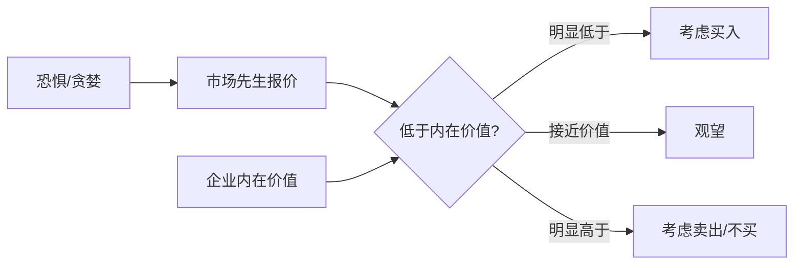

## 查理芒格思维筑基课: 定律11: 市场先生定律 - 把市场当仆人，不当老师

### 作者
digoal

### 日期
2026-05-19

### 标签
市场先生 , 市场报价 , 内在价值 , 市场情绪 , 恐慌买入 , 狂热卖出 , 独立判断 , 价值投资 , 价格波动 , 芒格思想

----

## 背景

> 面向对象: 投资者  
> 核心问题: 怎样在市场波动中保持独立判断？  
> 先说结论: 市场每天给你报价，但没有义务给你真理。投资者要利用市场的情绪报价，而不是用报价替代价值判断。

## 一张图先看懂

## 求真讲法

### 它到底说了什么

市场先生定律说: 市场价格是一个情绪化合伙人每天给出的报价。你可以接受，也可以忽略，但不应把它当作价值本身。

### 它是怎么来的

它由“价格不等于价值”公理推出。短期价格受情绪、资金和叙事影响，内在价值受长期现金流影响。

### 它依赖哪些假设

| 假设 | 含义 |
|---|---|
| 市场短期会情绪化 | 恐慌和狂热会制造错价 |
| 企业价值相对更稳定 | 不会每天随股价大变 |
| 投资者可拒绝报价 | 不交易也是选择 |

### 常见误解

| 误解 | 更准确的理解 |
|---|---|
| 市场下跌证明我错了 | 只有基本面恶化才证明 thesis 变坏 |
| 市场总是错的 | 多数时候市场相当有效 |
| 逆向就是对的 | 逆向必须基于价值判断 |

## 求存讲法

### 它有什么用

它帮助投资者在恐慌中检查价值，而不是检查心情；在狂热中检查价格，而不是追随兴奋。

### 它怎么迁移到投资流程

| 市场状态 | 投资者动作 |
|---|---|
| 恐慌下跌 | 判断内在价值是否受损 |
| 狂热上涨 | 判断价格是否远超价值 |
| 横盘无聊 | 更新基本面，不强迫交易 |
| 舆论一致 | 寻找被忽略的反证 |

### 它的适用范围和边界

适用于公开市场投资。边界是: 市场下跌有时确实反映基本面恶化，不能机械逆向。

### 正例: 怎么用它提升能力

市场因短期宏观恐慌抛售优质公司，投资者检查现金流、负债和护城河，确认内在价值未变后分批买入。

### 反例: 前提不成立会怎样

投资者把所有下跌都当市场先生发疯，但公司真实护城河已被技术替代。失败点是把市场先生定律当成无条件抄底。

## 思考

1. 你最近一次交易是由价格波动触发，还是由价值变化触发？
2. 市场报价何时帮了你，何时控制了你？
3. 你能否在不看股价时说明持仓价值？

## 最后记住

1. 市场是报价系统，不是真理系统。
2. 情绪报价只有结合价值才有意义。
3. 忽略市场也是一种能力。

## 参考资料

- Benjamin Graham, *The Intelligent Investor*.
- Warren Buffett, Berkshire Hathaway Shareholder Letters.
- 本文参考本地 `buffett` 技能资料中的市场先生和内在价值笔记。
  
#### [PostgreSQL 解决方案集合](../201706/20170601_02.md "40cff096e9ed7122c512b35d8561d9c8")
  
  
#### [德哥 / digoal's Github - 公益是一辈子的事.](https://github.com/digoal/blog/blob/master/README.md "22709685feb7cab07d30f30387f0a9ae")
  
  
#### [About 德哥](https://github.com/digoal/blog/blob/master/me/readme.md "a37735981e7704886ffd590565582dd0")
  
  

  
