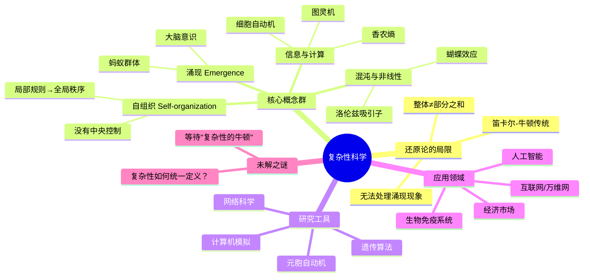

## 《复杂：穿越奇异而迷人的涌现科学》读书笔记: 秩序从哪里来 
  
### 作者  
digoal  
  
### 日期  
2026-05-19  
  
### 标签  
读书笔记 , 复杂  
  
----  
  
## 背景  

---
书名: 《复杂：穿越奇异而迷人的涌现科学》    
原作名: Complexity: A Guided Tour  
作者: 梅拉妮·米歇尔（Melanie Mitchell）  
译者: 唐璐  
出版年份: 2009（英文原版）/ 2018（中文版）  
出版社: 湖南科学技术出版社  
笔记日期: 2026-05-20  
豆瓣链接: https://book.douban.com/subject/30171338/  
丛书: 第一推动丛书·综合系列  
获奖: 2010年 Phi Beta Kappa 科学图书奖  
标签: [复杂系统, 涌现, 自组织, 圣塔菲研究所, 跨学科, 计算科学]  
---

  
  
> **一句话**：蚂蚁没有大脑，但蚁群有智慧——这本书就是要告诉你，"整体大于部分之和"这句老话背后，藏着一门严肃的科学。
>  
> **适合谁读**：对世界运作方式好奇的人；想了解AI、生物、经济背后共同逻辑的人；认为"还原论够用了"但又隐约觉得哪里不对的人。
>  
> **阅读难度**：⭐⭐⭐☆☆（没有公式，但需要慢下来思考）
>  
> **推荐指数**：⭐⭐⭐⭐⭐

---

## 一、时代坐标：这本书从哪里来？

1984年，新墨西哥州圣塔菲，高原沙漠里的一座小城。来自物理学、生物学、经济学、计算机科学等完全不同领域的24位科学家聚在一起，讨论一个他们各自在各自的领域里都觉得"特别奇怪"的现象：**简单的规则，怎么会产生出极度复杂的行为？**

蚂蚁单个看是蠢的，蚁群却能建造通风系统完善的蚁穴。神经元是没有意识的化学反应，大脑却能思考宇宙。市场上每个人都在自私地追求利益，却能形成某种涌现出的"价格机制"。

他们觉得，这些现象之间一定有某种共同的深层逻辑。于是，圣塔菲研究所（Santa Fe Institute，简称 SFI）诞生了。这是人类科学史上第一个以"跨学科研究复杂系统"为使命的研究机构。

梅拉妮·米歇尔的入场方式带着一点戏剧性：1989年，她的博士导师——写出《哥德尔、艾舍尔、巴赫》的道格拉斯·侯士达（Douglas Hofstadter）——被邀请去洛斯阿拉莫斯参加一个关于"涌现计算"的会议。侯士达太忙，就把这个机会给了她。那次会议改变了她的职业轨迹：她在那里遇见了一大群和自己痴迷着同样问题的人，发现了圣塔菲研究所，并花了此后多年时间在那里工作、研究。

《复杂》这本书，写于2009年——SFI成立25周年之际。它不是一个旁观者写的科普读物，而是一个**内部人的导览**：米歇尔亲历了这个领域最重要的发展，她带你走的这条路，是她自己真实走过的。

```
时间轴：复杂性科学的诞生与本书的背景

1600s ──→ 笛卡尔·牛顿·还原论主导
                │
1948 ──────→ 香农信息论：信息可以被测量
                │
1960s-70s ──→ 混沌理论、蝴蝶效应、分形几何
                │
1984 ──────→ 圣塔菲研究所创立
                │
1989 ──────→ 米歇尔进入SFI，遗传算法、细胞自动机
                │
2009 ──────→ 《复杂》出版，一次完整的领域梳理
```

---

## 二、核心命题：作者在说什么？

### 命题一：还原论有根本性的局限

这是全书最重要的底色。

笛卡尔说，理解一个系统，就是把它拆开，研究每一个零件。三百年来，这种方法极为成功：我们用它理解了行星运动、化学反应、遗传密码。还原论让人类从无知走向现代科学文明。

但米歇尔的问题是：你能把神经元研究得再透彻，也无法从神经元的性质里**推导出**意识的存在。你研究透了市场中每一个理性人的决策规则，也无法**预测出**2008年金融危机。某些系统的整体性质，在它的部件里根本不存在——这不是信息不够的问题，而是方法论的根本局限。

还原论的死角，就是复杂性科学的起点。

### 命题二：涌现是宇宙最普遍的现象之一

书里有一个例子让我印象极深：用计算机模拟蚂蚁的行为，每只蚂蚁只有一条规则——"如果遇到食物，带回家；如果没遇到，随机游走；遇到同伴，分享信息素"。就这三条规则，运行一段时间后，屏幕上会出现精美的觅食路径，甚至能找到从蚁穴到食物的最短路线。

没有一只蚂蚁知道"最短路线"是什么概念。这个智慧，**涌现**于整体，不存在于任何个体。

米歇尔把这种现象的共同特征归纳为几点：
- **去中心化控制**：没有大脑，没有指挥官
- **局部交互产生全局秩序**：个体只响应局部信息
- **非线性**：整体效果不是部分效果的简单叠加
- **自组织**：秩序从内部生长出来，不是外部施加

这种模式，出现在蚁群、神经网络、免疫系统、互联网、进化过程、金融市场……无处不在。

### 命题三：复杂性科学还没有"它的牛顿"

这是本书最诚实的地方，也是它最珍贵的地方。

热力学有卡诺，进化论有达尔文，力学有牛顿。复杂性科学呢？到2009年为止——甚至到今天——它仍然**没有一个统一的数学框架**。"复杂性"这个词本身都有40多种不同定义（物理学家赛斯·劳埃德曾统计过）。

米歇尔没有假装这个问题不存在。她直接告诉读者：这是一门仍在建设中的科学，它的边界模糊，它的方法论还在争议，它迄今没有找到类似热力学那样能统一全领域的数学语言。

这种坦诚，让这本书比那些夸大其词的"科学革命"叙事，高出了整整一个维度。

---

## 三、论证地图：作者怎么说服你的？



书分五个部分，逻辑递进：

**第一部：背景与历史** — 打地基。讲什么是复杂系统，什么是信息、计算、进化，引入核心概念。

**第二部：计算机中的生命与进化** — 米歇尔的主战场。遗传算法（模拟进化来解决问题）和自我复制程序，展示计算与生命的深层联系。

**第三部：大规模计算** — 细胞自动机（Conway 的"生命游戏"在此登场），展示极简规则如何产生无限复杂的模式。

**第四部：网络思维** — 六度分隔、无标度网络、幂律分布，网络科学如何重新理解世界的连接结构。

**第五部：结论** — 诚实地盘点这门学科的现状与未来。

论证方式以**案例驱动**为主：蚂蚁、大脑、免疫系统、互联网、股市……每一个核心概念都有一个具体的"活物"对应。这是米歇尔的聪明之处，也是她从侯士达那里继承的风格——用直觉先点亮你，再给你概念。

---

## 四、前提假设与边界：什么情况下这不成立？

### 假设一：复杂系统之间存在共同的底层规律

这是全书最大的赌注。米歇尔假设，蚂蚁群落、免疫系统、市场和互联网，它们的"复杂性"是同一种东西，可以用统一的语言描述。

这个假设**至今未被证明**。批评者认为，不同领域的"涌现"可能只是表面相似，深层机制完全不同，强行统一可能是类比的错觉，而非科学的发现。二十年后，那个"复杂性的卡诺"还没有出现，这个疑问仍悬在空中。

### 假设二：计算机模拟足以揭示真实系统的规律

书中大量使用计算机模拟（遗传算法、细胞自动机）来展示复杂行为。但模拟和现实之间存在一道难以跨越的鸿沟：模型总是简化的，真实世界的变量远比模型复杂。一个在计算机里表现良好的蚂蚁模型，并不一定真正解释了蚂蚁的行为机制。

### 假设三："去中心化"是一种普适优越的组织方式

书里暗含一种观点：去中心化的、自组织的系统往往比有中央控制的系统更鲁棒、更有适应力。这在自然系统中有大量证据支持，但在人类社会和工程系统中并不总是成立。有些复杂任务恰恰需要强有力的中央协调（想想航空管制、核电站安全）。

---

## 五、思想谱系：这本书在哪个传统里？

米歇尔的思想来源非常清晰，可以梳理出三条线：

**侯士达线**（自上而下的意义追问）：她的导师道格拉斯·侯士达在《哥德尔、艾舍尔、巴赫》里探讨意识与自指，对涌现有深刻的哲学直觉。米歇尔继承了这种对"意义如何从符号中涌现"的好奇心，她的博士论文本身就是研究计算机如何做类比（Copycat程序）。

**圣塔菲线**（跨学科的系统研究）：SFI的核心人物——约翰·霍兰（遗传算法发明者）、斯图尔特·考夫曼（自组织与生命起源）、克里斯·兰顿（人工生命）——都深刻影响了她。这本书本质上是SFI二十五年研究成果的一次平民化导览。

**维纳-香农线**（信息与控制论）：整个复杂性科学都站在信息论（香农，1948年）和控制论（维纳，1940年代）的肩膀上。复杂系统中的"信息流动"是理解其行为的关键工具。

```
思想谱系简图：

维纳（控制论）──→ 系统论 ──→ 圣塔菲研究所
香农（信息论）──↗             ↑
                        霍兰（遗传算法）
侯士达（GEB）──→ 米歇尔·Copycat ──→ 《复杂》
达尔文（进化论）──→ 演化计算 ──↗
洛伦兹（混沌）──→ 非线性动力学 ──↗
```

在它之后，巴拉巴西的《链接》（网络科学）、圣菲研究所后续的大量研究，都站在这本书铺垫的基础上。

---

## 六、我学到了什么？

### 收获一：学会用"涌现"的眼光看世界

读完这本书之后，我发现自己开始用一种不同的眼光看待很多事情。城市的交通堵塞不是某一辆车的错，而是整个交通系统在某个临界点的相变。公司文化不是CEO讲几次话能塑造的，它是数百次微小互动涌现出的结果。网络舆论的走向不是某个人操控的，它有自己的动力学。

一旦接受"整体性质不能还原为部分性质之和"，你就会对那些试图用"找到关键人物/关键节点来控制系统"的管理思路产生本能的怀疑。

### 收获二：复杂不等于不可理解

这本书破除了一个误解：复杂系统之所以"复杂"，不是因为我们懒，研究不够努力，而是因为它们的复杂性是**本质性的**——不可简化，只能在系统层面上理解。但这不代表放弃理解。恰恰相反，承认这一点，才是真正开始理解的第一步。

### 收获三：科学的边界比我以为的更模糊

米歇尔在书末的坦诚打动了我：这门科学还没有统一的数学语言，还没有找到最深层的普遍规律，还在建设中。一个科学家愿意如此诚实地描述自己领域的局限，是一种很高贵的品质。与那些吹嘘"万物皆可解释"的科普读物相比，这种谦逊反而让我更信任她的判断。

---

## 七、举一反三：这个框架还能用在哪？

**管理与组织设计**：与其设计一个精密的自上而下的控制系统，不如设计好"局部交互规则"——明确的激励机制、信息流通方式、反馈渠道——让组织的整体智慧自然涌现。字节跳动扁平化的OKR体系，某种程度上是在刻意模拟去中心化的复杂系统逻辑。

**理解互联网与社交媒体**：无标度网络的特性（少数节点拥有绝大多数连接）直接解释了为什么信息传播呈现"赢者通吃"的格局，以及为什么互联网对随机攻击有极强的韧性，对定向攻击极度脆弱。这是理解平台经济和网络效应的基础工具。

**个人学习**：知识也是一个复杂系统。孤立地背诵知识点（还原论视角），不如让概念之间产生连接、碰撞、涌现——这正是卡片笔记法、费曼学习法背后的直觉。大脑理解一件事，不是靠储存，而是靠连接。

---

## 八、批判与反思

**它的野心超过了它的成就。** 书中隐含的信念是：复杂性科学终将找到统一理论，就像热力学统一了热现象。但截止今天，这个"统一"仍遥遥无期。沃尔弗拉姆（Wolfram）的《一种新科学》试图用细胞自动机统一一切，被米歇尔本人也批评为过度自信。领域内至今没有公认的核心定理。

**计算隐喻可能是一种认知枷锁。** 书里大量使用"计算"作为理解生命和社会的框架（信息处理、算法、程序）。这在1990-2000年代非常流行，但它自带一种简化倾向：把无限丰富的现实削足适履，装进"输入-处理-输出"的盒子里。大脑真的是一台计算机吗？我持保留意见。

**2009年之后，AI改变了格局。** 本书出版时，深度学习革命尚未到来。今天，GPT、AlphaFold等系统展现出的"涌现能力"为这本书提供了惊人的现实注脚——同时也带来了新的困惑：大型语言模型里涌现出的能力，是不是复杂性科学所说的"涌现"？米歇尔本人在她2025年的论文中仍在研究这个问题，这本书的问题意识，比书的年龄更年轻。

---

## 九、金句与记忆点

**1. "涌现和自组织行为是如何产生的？——这是复杂性科学的核心问题。"**
> 整本书都是在回答这一个问题的不同侧面。

**2. "如果系统有组织的行为不存在内部和外部的控制者或领导者，则称之为自组织。"**
> 秩序不需要有人设计，它可以自发生长。这是对我们惯常直觉的最大挑战。

**3. 还原论的信念：整体可以通过理解部件来完全理解。复杂性科学的发现：在很多情况下，这根本行不通。**
> 不是哲学观点，而是科学结论。

**4. 无标度网络对随机故障有极强韧性，但对定向攻击极度脆弱。**
> 这一发现直接应用于互联网安全、疫情传播、金融危机的理解。

**5. 生命游戏（Conway's Game of Life）：四条规则，无限复杂性。**
> 用最小的规则展示了涌现的威力，是整本书最震撼的演示之一。

**6. "我们仍在等待复杂性科学的卡诺。"**
> 一句话概括了这个领域的现状：方向对了，但统一理论尚未到来。

**7. 幂律分布无处不在：城市人口、网页链接数、地震能量、词语频率……**
> 一旦你认识了幂律，你会在世界各处认出它的脸。

---

## 十、延伸阅读

**1. 《哥德尔、艾舍尔、巴赫》—— 侯士达**
理解《复杂》的精神来源必读。侯士达用音乐、艺术和数学探讨自指和涌现，是米歇尔的思想母体。难度高，但值得啃。

**2. 《链接》（Linked）—— 巴拉巴西**
网络科学的大众入门经典，聚焦于无标度网络，是《复杂》网络章节的最佳扩展阅读。更新、更聚焦。

**3. 《规模》（Scale）—— 杰弗里·韦斯特**
同为SFI作品，专注于幂律与规模的关系：为什么城市、公司、生命体都遵循相似的数学规律？与《复杂》高度互补。

**4. 《混沌》（Chaos）—— 詹姆斯·格雷克**
复杂性科学的另一个根：混沌理论的科普经典，文学性极强，与本书第二章形成完美互读。

**5. 《人工智能：写给思考中的人类》—— 梅拉妮·米歇尔**
本书作者2019年的新作，把复杂性科学的视角应用于当代AI，是《复杂》在AI时代的续集。

---

*笔记写于 2026-05-20 | 基于公开书评、作者访谈及原书框架整理，结合个人理解，非原文摘抄*
  
  
#### [PostgreSQL 解决方案集合](../201706/20170601_02.md "40cff096e9ed7122c512b35d8561d9c8")
  
  
#### [德哥 / digoal's Github - 公益是一辈子的事.](https://github.com/digoal/blog/blob/master/README.md "22709685feb7cab07d30f30387f0a9ae")
  
  
#### [About 德哥](https://github.com/digoal/blog/blob/master/me/readme.md "a37735981e7704886ffd590565582dd0")
  
  

  
