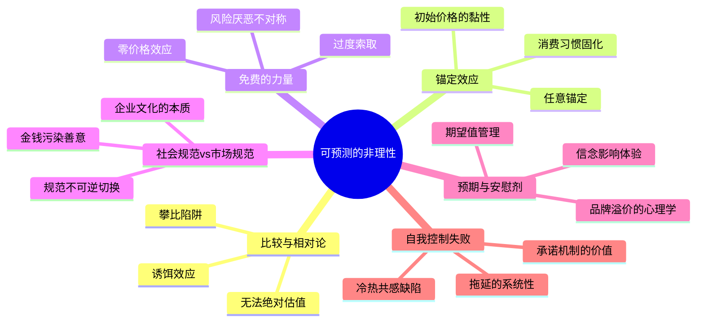

## 《怪诞行为学》读书笔记: 可预测的非理性 
  
### 作者  
digoal  
  
### 日期  
2026-05-19  
  
### 标签  
读书笔记 , 怪诞行为学  
  
----  
  
## 背景  

---
书名: 《怪诞行为学：可预测的非理性》  
作者: 丹·艾瑞里（Dan Ariely）  
出版年份: 2008（中文版2010）  
笔记日期: 2025-05-20  
豆瓣链接: https://book.douban.com/subject/4929844/  
原作名: Predictably Irrational: The Hidden Forces That Shape Our Decisions  
标签: [行为经济学, 心理学, 决策, 非理性, 消费行为]  
---

  

> **一句话**：我们不是偶尔非理性，而是系统性地、可预测地非理性——而且对此毫不自知。
> **适合谁读**：对"人为什么做蠢事"感到好奇的每一个人；产品经理、营销人、政策制定者必读。
> **阅读难度**：⭐⭐☆☆☆（案例驱动，轻松易读）
> **推荐指数**：⭐⭐⭐⭐☆

---

## 一、时代坐标：这本书从哪里来？

2008年，全球金融危机刚刚爆发。数以百万计的人用超出自己偿还能力的贷款买房，华尔街银行家们做出了一个又一个在事后看来匪夷所思的决策。主流经济学的"理性人"假设受到前所未有的质疑：如果人是理性的，这一切怎么会发生？

就在这个节点，《怪诞行为学》横空出世，成为当年最畅销的商业书之一。

作者丹·艾瑞里的人生轨迹本身就是一个关于"非理性研究"的起源故事。18岁时，他因一场爆炸事故全身70%面积遭受三度烧伤，在医院度过了漫长的三年。穿着特制紧身衣、头戴面罩的他，被迫成为外部世界的旁观者，开始以局外人的眼光观察人类行为——包括护士撕绷带时快撕还是慢撕对疼痛的影响（护士们选择快撕，但艾瑞里后来用实验证明慢撕更人道），这成了他行为经济学研究的第一个问题。

这本书诞生于一个重要的学术背景之下：卡尼曼（Kahneman）和特沃斯基（Tversky）早在1970年代就用"前景理论"打开了行为经济学的大门，2002年卡尼曼摘得诺贝尔经济学奖，将这一领域推向主流视野。艾瑞里站在这些巨人的肩膀上，用更接地气、更有故事性的方式，把行为经济学带给了大众读者。

```
时间轴：行为经济学崛起之路
──────────────────────────────────────────
1970s  卡尼曼 & 特沃斯基：前景理论、启发式偏差
  │
1980s  理查德·塞勒：心理账户、禀赋效应
  │
2002   卡尼曼获诺贝尔经济学奖 → 行为经济学进入主流
  │
2008   艾瑞里《怪诞行为学》出版 → 大众科普引爆
  │
2017   塞勒获诺贝尔经济学奖 → 领域最终确立
──────────────────────────────────────────
```

---

## 二、核心命题：作者在说什么？

全书围绕一个核心反命题展开：**人不是理性的，但人的非理性是有规律的、可以预测的。**

这并不是在说"人很蠢"。艾瑞里的意思更深刻：我们大脑在做决策时有固定的"操作系统漏洞"，这些漏洞不随着教育程度、智力水平或经验积累而消失，它们深植于人类认知的底层结构。

### 命题一：比较是一切估值的基础，而比较对象是可以被操纵的

你觉得一杯咖啡值20元，并不因为它真的值20元，而是因为你把它和某个参照物做了比较。艾瑞里用"价格诱饵"实验演示了这一点：《经济学人》提供三档订阅——电子版59美元、印刷版125美元、印刷+电子版125美元。大多数人选了第三档，因为相比同等价格的印刷版，"多赠"电子版显得很划算。但当去掉中间那个"纯印刷版"选项，大多数人转而选了最便宜的电子版。

那个没人选的中间选项，不是用来被选的，而是用来改变你对其他选项的感知的。这就是"诱饵效应"。**我们的价值判断，从来不是绝对的，而是相对的——而相对的参照点，往往由别人决定。**

### 命题二：第一个"锚"会长久地控制你的决策

艾瑞里让麻省理工的学生先看一下自己社保号末两位，然后对一批商品（红酒、巧克力等）进行出价。结果令人惊愕：社保号末两位越大的学生，出价越高，且两者高度相关。一个完全随机、毫不相关的数字，居然决定了他们愿意付多少钱。

这就是"任意锚定"（Arbitrary Coherence）：第一个接触到的数字会成为锚，后续决策都以此为基准调整，但调整往往不足。这意味着，一件商品的"市场价"本身就可能是一个由历史偶然性锁定的锚，而非什么供需均衡的客观真相。

### 命题三："免费"激活了大脑里完全不同的决策回路

艾瑞里做过一个经典实验：一颗好时巧克力定价1美分，一颗瑞士莲定价15美分。大多数人选瑞士莲——性价比更高。然后把价格各降一美分：好时免费，瑞士莲14美分。结果大多数人抢好时。

那1美分的差距足以让人做出完全相反的决定，因为"免费"激活的不是理性计算，而是某种原始的贪婪冲动——拿到"免费"的东西感觉像是赚到了，而买任何东西（哪怕只有1美分）都要承担"选错了"的心理风险。

### 命题四：社会规范与市场规范是两套完全不兼容的操作系统

这是全书最深刻的洞见之一。我们同时生活在两个世界里：在社会规范的世界里，人们互相帮忙搬沙发，不求金钱回报，因为这是友情和互助；在市场规范的世界里，一切都有价格，人们按照金钱激励做事。

关键在于：**一旦市场规范入侵了社会规范的领域，社会规范就会退出，而且很难再回来。** 美国律师协会曾要求律师们以优惠价为退休老人提供法律服务，几乎没有人响应；但当组织方改口说"免费提供服务"，大批律师踊跃参与。加入了钱的那一刻，这件事就从"帮忙"变成了"打折服务"，人们开始计算值不值。

---

## 三、论证地图：作者怎么说服你的？



艾瑞里的论证方式是严格的**实验主义**——每一章都用一个或几个精心设计的对照实验来支撑观点。这是这本书最大的优势，也是它后来遭受质疑的最大弱点（详见第八部分）。

几个特别有力的实验：

**星巴克实验**：人们之所以愿意为星巴克付高价，不仅仅因为咖啡真的更好，而是因为第一次消费时设置的高价"锚"，让他们在内心建立了"星巴克=高档咖啡"的认知，此后每次买都在强化这个锚定，形成"任意的一致性"消费习惯。

**性唤起实验**：艾瑞里让加州大学伯克利分校的男大学生在"冷静"和"性唤起"两种状态下回答是否会做某些不道德或危险的事情。结果显示，处于"热"状态的人对危险行为的接受程度远高于冷静状态，而且他们完全无法预测自己在另一种状态下会如何行动。

---

## 四、前提假设与边界：什么情况下这不成立？

### 假设一：实验室里的大学生代表了"人类"

艾瑞里的实验大多在麻省理工和加州大学伯克利分校进行，被试主要是美国大学生。行为经济学批评者长期指出，西方受过高等教育的年轻人，在很多心理指标上并不代表人类整体（学界称之为"WEIRD"问题：Western, Educated, Industrialized, Rich, Democratic）。不同文化背景的人对"免费"和"锚定"的反应可能有显著差异。

### 假设二：这些效应在现实中和实验室里一样强

实验室控制了所有无关变量，现实决策中会有更多信息、更多时间、更强的个人利益驱动。当一个真实的购房者花几百万买房时，他是否真的像实验里那样被随机锚定？可能部分成立，但效应量会缩水。

### 假设三：知道偏见就能克服偏见

艾瑞里暗示，理解了这些非理性模式，我们可以设计更好的制度和工具来"修复"它们。但认知偏见的顽固之处在于，即使你知道它的存在，它依然会影响你。光读完这本书，并不能让你变得更理性——这是艾瑞里自己在后续作品中也承认的局限。

---

## 五、思想谱系：这本书在哪个传统里？

艾瑞里是卡尼曼-特沃斯基传统的继承者，但他做了一件重要的事：**把严肃的行为经济学研究翻译成了大众可以阅读的故事**。

```
卡尼曼 & 特沃斯基（1970s）
认知偏差 & 前景理论
       │
理查德·塞勒（1980s-2000s）
心理账户 & 助推（Nudge）
       │
丹·艾瑞里（2008）         罗伯特·西奥迪尼（1984）
怪诞行为学（大众科普）  ←→  影响力（社会心理学视角）
       │
马尔科姆·格拉德威尔
（故事化社会科学的另一路径）
```

这本书对后来的产品设计、用户体验、公共政策产生了深远影响。理查德·塞勒和卡斯·桑斯坦的《助推》（Nudge）与它几乎同期出版，共同构建了"用行为科学改善决策"的政策思想基础。英国政府、美国政府都相继成立了"助推团队"，将这些实验室发现应用于公共政策。

---

## 六、我学到了什么？

读完这本书，改变我最深的不是某个具体实验，而是一种元认知的升级：**我们的偏好不是自然生长的，它是被建构出来的。**

从小到大，我以为自己"喜欢什么"、"觉得什么值多少钱"是一种内在的、真实的感受。艾瑞里告诉我，这种感受相当程度上是外部锚定和比较的产物。这让我开始更警惕那些"第一印象"——它们不只是印象，更像是隐形的合同，签下去之后很难撤回。

第二个收获是关于社会规范与市场规范的区分。我意识到，很多人际关系的破裂，很多公司文化的衰败，恰恰是因为错误地把市场规范引入了本该由社会规范运作的领域。当一个领导开口闭口"绩效"、"KPI"，而从不谈使命感和荣誉感时，他其实是在悄悄将社会规范逐出团队，而这个过程一旦开始，就很难逆转。

第三个收获更私人：我发现自己经常是"拖延"那章的完美受害者。艾瑞里的实验表明，给学生设置自主截止日期比统一截止日期效果更差——人们会把截止日期设得太晚。而我每次"等状态好了再……"的想法，正是对这个偏见的身体力行。他建议的解法是"承诺机制"——主动设置让违约变得代价高昂的外部约束——这是我读完这本书后真正改变了一点点行为的地方。

---

## 七、举一反三：这个框架还能用在哪？

### 产品设计
"免费增值"（Freemium）模式的心理学基础就是艾瑞里说的"零价格效应"。Spotify 免费版、微信基础功能，都在利用"免费"建立用户习惯锚。一旦用户习惯形成，付费升级变得顺理成章——此时"任意的一致性"开始发力。

### 职场与团队管理
给员工发奖金（市场规范）有时不如给他们一个公开表扬（社会规范）。谷歌为员工提供免费餐厅、按摩室，表面上看是成本，实际上是在强化社会规范，让员工把对公司的情感从"雇佣关系"升级为"共同事业"。当然这也可能是一种更高明的操控。

### 个人消费决策
下次你觉得某样东西"性价比很高"，先停一秒问自己：我是在和什么比？这个比较对象是谁放在那里的？如果你找不到答案，很可能正被一个精心设计的"诱饵"操控。

---

## 八、批判与反思

这本书有两个层面的问题值得认真对待。

**第一，可重复性危机的阴影。**

2021年，艾瑞里的另一项著名研究（关于签名位置影响诚实行为的实验）被发现数据造假，他不得不撤稿。这件事让人不得不重新审视他其他研究的可信度。虽然《怪诞行为学》中的核心实验（锚定、免费、社会规范）大多由其他研究者独立重复验证过，但作为读者，我们应该对那些"令人惊艳的实验结果"多一分怀疑——科学界的"如果不惊艳，就发不了文章"的发表偏见，正是行为经济学领域存在大量无法重复的研究的重要原因。

**第二，"怎么"多于"为什么"。**

这本书最擅长的是告诉你"人会这样做"，但很少深挖"为什么人的大脑会这样运作"。这是整个行为经济学大众化写作的通病：现象描述丰富，机制解释薄弱。真正的神经科学、进化心理学解释被简化成了"非理性是本能"这样的口号。批评者认为，没有"为什么"的"怎么"，只是一张地图，而不是对地形的真正理解。

**第三，文化语境的局限性。**

书中大量实验基于美国文化背景。"免费"在某些文化中甚至可能引发警惕而非贪婪；"社会规范vs市场规范"的切换在集体主义文化中的运作方式可能与个人主义文化大相径庭。艾瑞里用美国数据得出"人类普遍规律"的野心，可能需要更多跨文化研究支撑。

---

## 九、金句与记忆点

**1. "我们从不孤立地看待事物，而是相对地看待事物，并将它们与其他事物相比较。"**
→ 这是整本书的第一性原理。所有的偏见和陷阱都从这里派生。

**2. "一旦社会规范与市场规范发生碰撞，社会规范就会退出，而且很难再重建。"**
→ 提醒管理者：用钱管人，要比用情感管人的长期成本高得多。

**3. "免费不仅仅是一种价格，它是一种情感的触发器。"**
→ "FREE"这个词激活的不是计算，而是一种更古老的神经回路。

**4. "我们在两种不同的理性状态下做出的选择，感觉上像是出自完全不同的两个人。"**
→ 关于冷热共感缺陷——我们在冷静时无法预测激动时的自己，反之亦然。

**5. "自我认知的幻觉是最顽固的非理性之一——我们知道别人容易受锚定影响，但坚信自己不会。"**
→ 读这本书的最大风险，是读完后自以为免疫了这些偏见。

**6. "承诺机制的价值，在于我们可以在理性清醒时，为非理性的未来自己预设规则。"**
→ 这是本书少有的真正可操作的建议：用外部约束绕过内在的意志力失效。

---

## 十、延伸阅读

**《思考，快与慢》— 丹尼尔·卡尼曼**
这本书是《怪诞行为学》的学术基础。卡尼曼用"系统一（快思考）"和"系统二（慢思考）"的框架，从神经科学和心理学层面解释了为什么人会非理性。如果说艾瑞里给你看了各种漏洞，卡尼曼解释了漏洞的操作系统代码。

**《助推》— 理查德·塞勒 & 卡斯·桑斯坦**
行为经济学的政策应用。如果你看完艾瑞里想知道"那政府和公司能用这些知识做什么"，这本书是直接答案。塞勒因此获得了2017年诺贝尔经济学奖。

**《影响力》— 罗伯特·西奥迪尼**
从社会心理学视角拆解说服和从众，与《怪诞行为学》互为印证，但更侧重人际影响机制。互推的好，就是这两本同时看会有叠加效果。

**《无价》— 威廉·庞德斯通**
专注于价格心理学，把艾瑞里的锚定和相对论理论在"定价策略"这一具体场景下深挖到了极致。如果你做产品定价，这本书比《怪诞行为学》更有直接参考价值。

**《错误的行为》— 理查德·塞勒**
行为经济学的自传式历史，读起来像一部学科成长史。你会看到这些改变世界的理论是如何在主流经济学家的嘲笑声中慢慢立足的。

---

*笔记写于 2025-05-20 | 基于公开资料与深度思考整理*
*本笔记不代表对书中所有实验结果的背书，部分内容已结合近年学界反思作出说明*
  
  
#### [PostgreSQL 解决方案集合](../201706/20170601_02.md "40cff096e9ed7122c512b35d8561d9c8")
  
  
#### [德哥 / digoal's Github - 公益是一辈子的事.](https://github.com/digoal/blog/blob/master/README.md "22709685feb7cab07d30f30387f0a9ae")
  
  
#### [About 德哥](https://github.com/digoal/blog/blob/master/me/readme.md "a37735981e7704886ffd590565582dd0")
  
  

  
