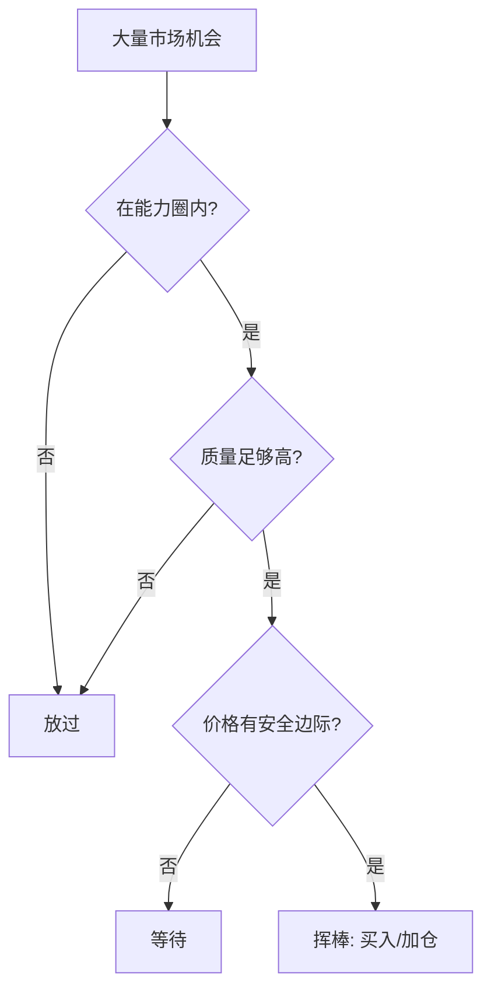

## 查理芒格思维筑基课: 定律12: 坐等挥棒定律 - 好投资来自少数高确定性机会

### 作者
digoal

### 日期
2026-05-19

### 标签
坐等挥棒 , 耐心等待 , 高确定性机会 , 能力圈 , 安全边际 , 现金选择权 , 行动偏误 , 集中投资 , 投资纪律 , 芒格思想

----

## 背景

> 面向对象: 投资者  
> 核心问题: 为什么优秀投资者可以长时间不行动？  
> 先说结论: 投资不是棒球三振出局。你可以等待自己看得懂、赔率好、价格合适的机会，再集中行动。多数时候不行动，是为了少数时候行动得更有分量。

## 一张图先看懂



## 求真讲法

### 它到底说了什么

坐等挥棒定律说: 投资者不必回应每个市场机会。真正值得下注的机会很少，等待不是懒惰，而是保持资本和注意力的选择权。

### 它是怎么来的

它由能力圈、机会成本和安全边际共同推出。既然资本有限、圈内机会稀少、价格经常不合适，那么高质量等待就是理性策略。

### 它依赖哪些假设

| 假设 | 含义 |
|---|---|
| 市场会反复给机会 | 不必强迫今天成交 |
| 少数机会贡献多数回报 | 频繁交易未必提高收益 |
| 投资者能忍受无聊 | 等待需要心理纪律 |

### 常见误解

| 误解 | 更准确的理解 |
|---|---|
| 等待就是看空 | 等待是没有合适赔率 |
| 不交易就是没效率 | 错误交易才是真低效 |
| 重仓就是赌博 | 在能力圈内、高赔率、可承受风险下集中才合理 |

## 求存讲法

### 它有什么用

它减少行动偏误。投资者不用为了显得勤奋而交易，而是把精力放在建立候选清单、等待价格、准备现金和更新基本面。

### 它怎么迁移到投资流程

```text
平时: 研究和维护观察名单
下跌: 检查是否进入买入区间
机会明确: 集中行动
机会不明: 继续等待
```

| 阶段 | 任务 |
|---|---|
| 无机会 | 学习、估值、排除公司 |
| 接近机会 | 预设价格和仓位 |
| 真机会 | 快速执行 |
| 执行后 | 跟踪 thesis 而非股价 |

### 它的适用范围和边界

适用于主动投资者。边界是: 如果投资者没有研究能力和纪律，长期定投低成本指数可能更合适。

### 正例: 怎么用它提升能力

投资者多年跟踪几家高质量公司，一直嫌价格太高。市场恐慌时，其中两家公司跌入保守买入区间，他能迅速买入，因为功课早已完成。

### 反例: 前提不成立会怎样

投资者每天寻找交易机会，持仓不断更换，税费和错误累积，最终错过真正熟悉公司的大机会。失败点是把行动频率误认为投资能力。

## 思考

1. 你的观察名单是否已经准备好买入价格？
2. 你不行动时是在等待，还是没有标准？
3. 真机会出现时，你敢不敢足够行动？

## 最后记住

1. 投资没有必须挥棒的规则。
2. 等待是为了高质量行动。
3. 少数好机会值得比多数普通机会更多资本。

## 参考资料

- Charlie Munger, *Poor Charlie's Almanack*.
- Warren Buffett, Berkshire Hathaway Shareholder Letters.
- 本文参考本地 `buffett` 技能资料中的耐心、机会成本和能力圈笔记。
  
#### [PostgreSQL 解决方案集合](../201706/20170601_02.md "40cff096e9ed7122c512b35d8561d9c8")
  
  
#### [德哥 / digoal's Github - 公益是一辈子的事.](https://github.com/digoal/blog/blob/master/README.md "22709685feb7cab07d30f30387f0a9ae")
  
  
#### [About 德哥](https://github.com/digoal/blog/blob/master/me/readme.md "a37735981e7704886ffd590565582dd0")
  
  

  
