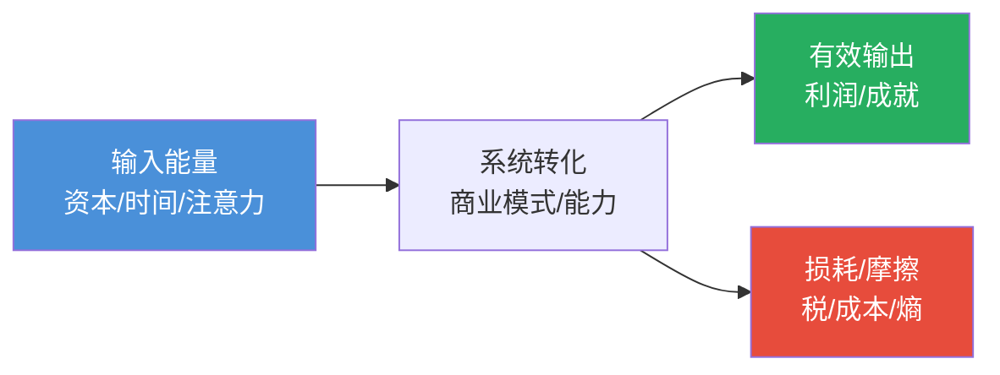
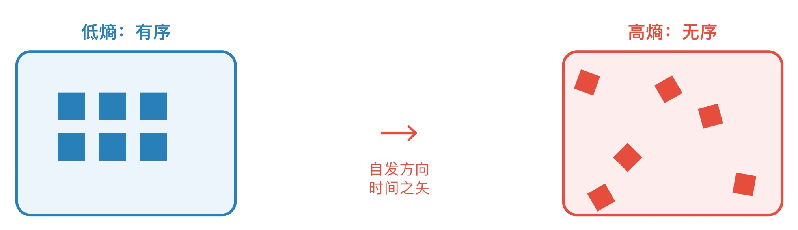
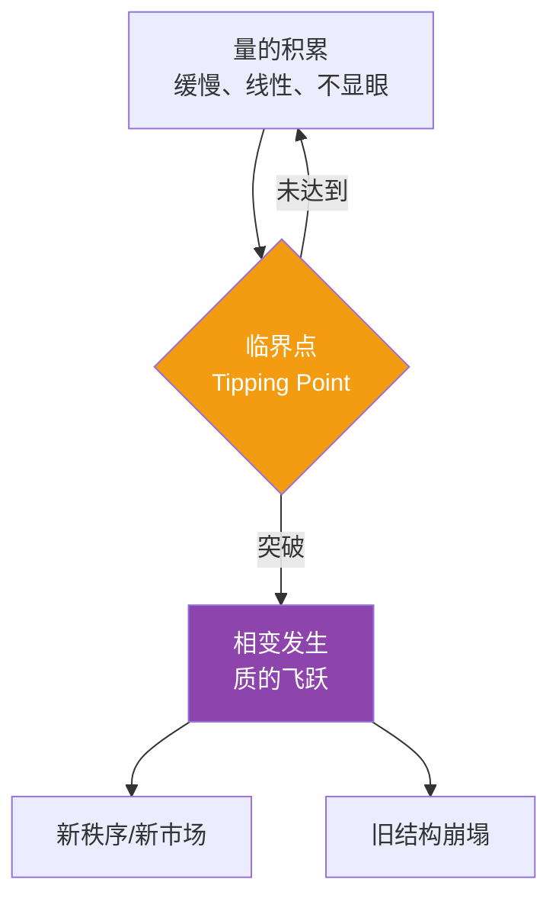
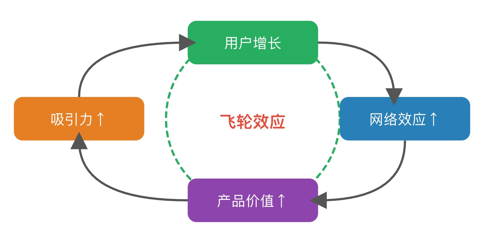
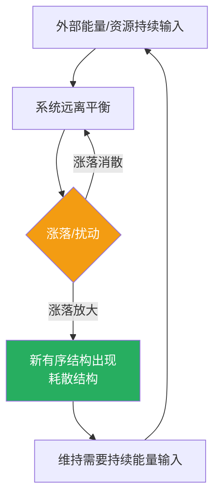

## 思维筑基课: 常用物理学公理
  
### 作者  
digoal  
  
### 日期  
2026-05-19  
  
### 标签  
能量守恒 , 熵增定律 , 相变理论 , 惯性定律 , 正反馈共振 , 不确定性原理 , 耗散结构  
  
----  
  
## 背景
  
> 表象千变万化，规律一以贯之——掌握物理学的底层公理，才能在混沌中看清方向、判断真伪、预言未来。

---

## 🔍 求真讲法：为什么物理学规律能解释社会与投资？

### 背景与动机

牛顿看苹果落地，发现了万有引力；但他晚年把积蓄全投入南海公司，亏损惨重。他说：
> *"我能计算天体的运动，却无法计算人类的疯狂。"*

这句话揭示了一个悖论——**物理规律本身是客观的，但人们往往忘记把它迁移到社会领域**。

物理学的价值不只在于解释原子和星球，更在于它提供了一套**经过几百年验证的思维框架**：
- 守恒定律：世界没有免费的午餐
- 熵增定律：无序是宇宙的默认方向
- 相变理论：质变往往来自量变的积累
- 非线性动力学：小扰动可能引发巨变

掌握这些公理，你看到的不再是"涨了跌了、热了冷了"，而是**系统的能量分布、耗散方向和临界点**。

---

## 🛠️ 求存讲法：七大物理公理及其跨领域应用

---

### ① 热力学第一定律：能量守恒

**核心公理**：能量不会凭空产生，也不会凭空消失，只能从一种形式转换为另一种形式。

$$\Delta U = Q - W$$

**生活应用**：
- ✅ **正例**：健身不能"无中生有"减脂——消耗的卡路里必须来自某处（饮食或脂肪储存）
- ✅ **正例**：创业的"时间精力"是有限总量，ALL IN 一件事，必然放弃其他
- ❌ **反例**：相信"躺赚"、"零成本高回报"——违反能量守恒，必有隐藏代价（风险、时间、信誉）

**投融资应用**：
> 市场上任何超额收益，背后必然对应某种**被定价的风险**。没有人能长期免费获取超额回报——如果看起来有，要么是你承担了你没意识到的风险，要么是别人在亏损补贴你。

---

### ② 热力学第二定律：熵增原理

**核心公理**：孤立系统的熵（无序度）总是自发增加，永远不会自发减少。

<svg viewBox="0 0 600 200" xmlns="http://www.w3.org/2000/svg" font-family="sans-serif">
  <!-- 左：低熵有序 -->
  <rect x="20" y="40" width="160" height="120" rx="10" fill="#EBF5FB" stroke="#2980B9" stroke-width="2"/>
  <text x="100" y="30" text-anchor="middle" font-size="13" fill="#2980B9" font-weight="bold">低熵：有序</text>
  <rect x="50" y="70" width="20" height="20" fill="#2980B9"/>
  <rect x="80" y="70" width="20" height="20" fill="#2980B9"/>
  <rect x="110" y="70" width="20" height="20" fill="#2980B9"/>
  <rect x="50" y="100" width="20" height="20" fill="#2980B9"/>
  <rect x="80" y="100" width="20" height="20" fill="#2980B9"/>
  <rect x="110" y="100" width="20" height="20" fill="#2980B9"/>
  <!-- 箭头（修正换行逻辑） -->
  <text x="300" y="110" text-anchor="middle" font-size="28" fill="#E74C3C">→</text>
  <text x="300" y="130" text-anchor="middle" font-size="11" fill="#E74C3C">自发方向</text>
  <text x="300" y="144" text-anchor="middle" font-size="11" fill="#E74C3C">时间之矢</text>
  <!-- 右：高熵无序 -->
  <rect x="420" y="40" width="160" height="120" rx="10" fill="#FDEDEC" stroke="#E74C3C" stroke-width="2"/>
  <text x="500" y="30" text-anchor="middle" font-size="13" fill="#E74C3C" font-weight="bold">高熵：无序</text>
  <rect x="430" y="55" width="15" height="15" fill="#E74C3C" transform="rotate(20,437,62)"/>
  <rect x="520" y="80" width="15" height="15" fill="#E74C3C" transform="rotate(-15,527,87)"/>
  <rect x="460" y="110" width="15" height="15" fill="#E74C3C" transform="rotate(45,467,117)"/>
  <rect x="545" y="130" width="15" height="15" fill="#E74C3C" transform="rotate(10,552,137)"/>
  <rect x="440" y="140" width="15" height="15" fill="#E74C3C" transform="rotate(-30,447,147)"/>
  <rect x="490" y="60" width="15" height="15" fill="#E74C3C" transform="rotate(60,497,67)"/>
</svg>
    
  

**生活应用**：
- ✅ **正例**：房间不打扫自然变乱——维持秩序需要**持续输入能量**（时间、精力、资源）
- ✅ **正例**：企业不创新自然衰败——组织的熵增是默认趋势，管理就是**持续做功对抗熵**
- ❌ **反例**：以为"维持现状"不需要代价——实际上静止即是退步，因为环境在熵增

**投融资应用**：
> 任何商业护城河都在被时间侵蚀。行业格局、技术优势、品牌溢价都是**局部低熵岛屿**，维持它们需要持续的资本和创新输入。当一家公司停止投入，熵增会让它回归平均。

---

### ③ 相变理论：量变引发质变

**核心公理**：系统在某个临界点（相变点）前后，行为发生根本性突变。水在100°C变为蒸汽，不是线性过渡。

**生活应用**：
- ✅ 学语言：前几个月毫无进展感，某天突然能听懂大段——这是语言神经网络的相变
- ✅ 健身：连续3个月看不到体型变化，第4个月突然被人说"你变了"——肌肉蛋白合成的阈值效应
- ❌ 反例：以为"没有效果"就是真的没有效果，放弃在临界点之前

**投融资应用**：
> 最大的机会往往隐藏在**相变前夕**——互联网1999年、移动互联网2009年、AI 2022年，外表平静，内部能量已在积聚。识别相变信号（用户渗透率、技术成熟曲线、监管松绑）比追逐已发生的涨幅价值高10倍。

---

### ④ 牛顿第一定律：惯性原理

**核心公理**：物体保持静止或匀速直线运动状态，直到有外力作用为止。

**生活应用**：
- ✅ 习惯惯性：坏习惯不主动改变不会自动消失；好习惯一旦建立，维持成本很低
- ✅ 职业惯性：大多数人沿着第一份工作的轨道一直走——改变轨迹需要"外力"（危机、导师、机遇）
- ❌ 反例：以为"时间会改变一切"——时间只是量的积累，方向改变需要力

**投融资应用**：
> 市场趋势有惯性。"不要对抗趋势"是最被忽视的投资原则之一。牛市惯性、行业成长惯性、龙头地位惯性，都是现实存在的。改变惯性需要真实的"力"——政策转向、技术颠覆、黑天鹅事件。

---

### ⑤ 反馈与共振：正反馈循环

**核心公理**：当系统的输出被反馈回输入端并放大，形成正反馈，系统呈指数增长或崩溃。

<svg viewBox="0 0 600 280" xmlns="http://www.w3.org/2000/svg" font-family="sans-serif">
  <!-- 正反馈循环 -->
  <circle cx="300" cy="140" r="80" fill="none" stroke="#27AE60" stroke-width="2" stroke-dasharray="6,3"/>
  <rect x="240" y="50" width="120" height="40" rx="8" fill="#27AE60"/>
  <text x="300" y="75" text-anchor="middle" font-size="13" fill="white">用户增长</text>
  <rect x="380" y="120" width="120" height="40" rx="8" fill="#2980B9"/>
  <text x="440" y="145" text-anchor="middle" font-size="13" fill="white">网络效应↑</text>
  <rect x="240" y="195" width="120" height="40" rx="8" fill="#8E44AD"/>
  <text x="300" y="220" text-anchor="middle" font-size="13" fill="white">产品价值↑</text>
  <rect x="80" y="120" width="120" height="40" rx="8" fill="#E67E22"/>
  <text x="140" y="145" text-anchor="middle" font-size="13" fill="white">吸引力↑</text>
  <!-- 箭头 -->
  <path d="M 360 70 Q 430 70 430 120" stroke="#555" stroke-width="2" fill="none" marker-end="url(#arrow)"/>
  <path d="M 440 160 Q 440 215 360 215" stroke="#555" stroke-width="2" fill="none" marker-end="url(#arrow)"/>
  <path d="M 240 215 Q 140 215 140 160" stroke="#555" stroke-width="2" fill="none" marker-end="url(#arrow)"/>
  <path d="M 140 120 Q 140 70 240 70" stroke="#555" stroke-width="2" fill="none" marker-end="url(#arrow)"/>
  <defs>
    <marker id="arrow" markerWidth="8" markerHeight="8" refX="4" refY="4" orient="auto">
      <path d="M0,0 L8,4 L0,8 Z" fill="#555"/>
    </marker>
  </defs>
  <text x="300" y="148" text-anchor="middle" font-size="15" fill="#E74C3C" font-weight="bold">飞轮效应</text>
</svg>
  
  

**生活应用**：
- ✅ 复利：金融上的正反馈——本金生利，利再生利，时间越长越恐怖
- ✅ 马太效应：强者愈强——资源、人脉、机会都向头部集中
- ❌ 反例：正反馈也可以是负向的——债务螺旋、恶性循环、泡沫崩溃

**投融资应用**：
> 最好的商业模式就是正反馈飞轮——亚马逊的低价→流量→供应商→更低价；微信的用户→内容→用户。**找到飞轮，就找到了护城河的本质**。反之，识别负反馈螺旋（坏资产→资金链紧张→抛售→更低价）是风险管理的核心。

---

### ⑥ 不确定性原理：观测影响系统

**核心公理**（海森堡）：你无法同时精确测量粒子的位置和动量——观测行为本身改变了被观测的系统。

$$\Delta x \cdot \Delta p \geq \frac{\hbar}{2}$$

**生活应用**：
- ✅ 面试：你观察候选人，候选人也在表演给你看——你观察到的不是"真实状态"
- ✅ 调研：用户访谈中，用户说的不是他们真实的行为——观察行为比询问态度更准确
- ❌ 反例：以为数据是客观的——采集数据的方式、问卷措辞，都在影响结论

**投融资应用**：
> 市场一旦被广泛观测，规律就会消失。当所有人都知道某个"价值洼地"，溢价立刻消失。**真正的α来自别人还没观测到的地方**——早期市场、冷门行业、被误解的公司。

---

### ⑦ 耗散结构理论：开放系统的自组织

**核心公理**（普里戈金）：远离平衡态的开放系统，通过持续与外界交换能量和物质，可以自发形成高度有序的结构。

**生活应用**：
- ✅ 城市：城市是一个耗散结构——需要持续的能源、食物、人才输入，才能维持高度有序
- ✅ 个人成长：人的技能体系是耗散结构——持续学习输入才能维持竞争力，停止输入即退化
- ❌ 反例：封闭系统无法产生新秩序——保守主义的代价是慢性熵死

**投融资应用**：
> 最有价值的企业是高效的耗散结构——它们持续吸收人才、资本、数据，将其转化为产品和护城河。评估一家公司，不只看当下利润，更要看它的**能量摄入效率**（人才密度、研发投入、生态建设）。

---

## 📊 七大公理速查对照表

| 物理公理 | 核心思想 | 生活迁移 | 投融资迁移 |
|---|---|---|---|
| **能量守恒** | 没有免费的午餐 | 所有收获背后有代价 | 超额收益对应隐藏风险 |
| **熵增定律** | 无序是默认方向 | 维持秩序需持续投入 | 护城河需持续维护 |
| **相变理论** | 临界点突变 | 坚持到阈值之前不要放弃 | 识别行业相变前夕 |
| **惯性定律** | 状态保持到外力介入 | 习惯和轨迹有强惯性 | 顺势而为，识别真实外力 |
| **正反馈共振** | 输出放大输入 | 复利/马太效应 | 寻找飞轮商业模式 |
| **不确定性原理** | 观测改变系统 | 数据不等于真相 | α来自被低估的角落 |
| **耗散结构** | 开放系统自组织 | 持续输入才能有序 | 评估企业能量摄入效率 |

---

## 💡 思考：值得深究的问题

1. **能量守恒与"睡后收入"**：被动收入真的"被动"吗？背后对应的是什么形式的能量输入？

2. **熵增与组织管理**：为什么所有大公司都会官僚化？有没有能对抗组织熵增的结构设计？

3. **相变识别**：如何在事前而非事后，识别一个行业正在接近相变点？有哪些可观测的先行指标？

4. **观测悖论**：当你把"不确定性原理"应用到市场分析，你分析行为本身是否也在改变市场？

5. **耗散结构的极限**：城市、公司、国家作为耗散结构，有没有"规模上限"？超过上限会发生什么？

---

## 📚 延伸阅读

- 《熵：一种新的世界观》— Jeremy Rifkin（熵增在社会领域的系统应用）
- 《穷查理宝典》— Charlie Munger（多元思维模型，含大量物理学类比）
- 《复杂》— M. Mitchell Waldrop（相变与涌现的通俗读本）
- 《耗散结构》— Ilya Prigogine（诺贝尔奖得主原著，开放系统热力学）

---

*"宇宙中最难以理解的事，是它竟然可以被理解。" — 爱因斯坦*

*底层公理不是束缚，而是导航仪。掌握它，你在任何快速变化的浪潮中都不会迷失方向。*
  
牛顿那句话值得反复回味 —— 他能算出天体轨道，却在南海泡沫里亏光积蓄。公理本身不会自动保护你，关键是主动把它迁移到新领域。  

  
  
#### [PostgreSQL 解决方案集合](../201706/20170601_02.md "40cff096e9ed7122c512b35d8561d9c8")
  
  
#### [德哥 / digoal's Github - 公益是一辈子的事.](https://github.com/digoal/blog/blob/master/README.md "22709685feb7cab07d30f30387f0a9ae")
  
  
#### [About 德哥](https://github.com/digoal/blog/blob/master/me/readme.md "a37735981e7704886ffd590565582dd0")
  
  

  
