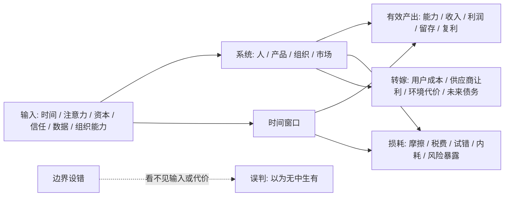
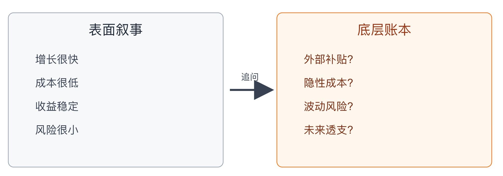

## 物理学思维筑基课: 能量守恒: 没有免费的产出, 只有被看见或没被看见的输入

### 作者
digoal

### 日期
2026-05-19

### 标签
能量守恒 , 热力学第一定律 , 输入输出 , 转化效率 , 隐性成本 , 风险收益 , 生活决策 , 产品增长 , 运营管理 , 投融资判断

----

## 背景

> 面向对象: 大学生、产品经理、运营经理、有投资需求的人  
> 核心问题: 为什么世界表面变化很快, 但判断生活、产品、运营和投融资真伪时, 总要先问“能量从哪里来、转成了什么、损耗在哪里”?  
> 先说结论: 能量守恒不是说“努力一定有回报”, 而是说在清楚边界和时间窗口后, 系统的净产出不可能凭空出现。凡是宣称低输入、零损耗、高确定性、高回报的事, 都要优先怀疑它隐藏了成本、风险、杠杆、补贴或外部转嫁。

说明: 严格说, “能量守恒”是物理学中的守恒定律和经验性基本原则, 在热力学中表现为第一定律；这里把它作为跨学科思维的“底层公理”来讲, 是为了训练判断框架, 不是把社会系统机械地等同于物理系统。

## 一张图先看懂



这张图的关键不是公式, 而是四个问题:

1. 输入是什么?
2. 转化效率如何?
3. 损耗在哪里?
4. 系统边界是不是被故意画小了?

## 求真讲法

### 它到底说了什么

能量守恒的通俗说法是: 在一个封闭系统中, 能量不会凭空产生, 也不会凭空消失, 只会从一种形式转化为另一种形式。

热力学第一定律常写成:

```text
ΔU = Q - W
```

在这个写法里:

| 符号 | 含义 | 直观解释 |
|---|---|---|
| ΔU | 系统内能变化 | 系统里面“存量能量”增加或减少 |
| Q | 外界传入系统的热量 | 外部给系统的输入 |
| W | 系统对外做的功 | 系统向外输出的有效工作 |

不同教材可能采用不同正负号约定, 但核心不变: 系统状态的改变, 必须和输入、输出、做功、损耗对应起来。

把它迁移到生活和商业里, 可以重写成:

```text
可持续产出 = 可识别输入 × 转化效率 - 显性损耗 - 隐性损耗 - 未来代价
```

这不是物理公式, 而是一个判断框架。它提醒我们: 如果一个系统长期有超常产出, 必须存在某种持续输入或高转化效率；如果你没看见, 大概率是边界画错了。

### 它是怎么来的

人类不是一开始就知道“能量”这个统一概念。早期人们分别研究机械运动、热、化学反应、电磁现象。后来科学家发现, 看似不同的现象之间可以互相转换: 燃料燃烧可以推动机器, 水位落差可以发电, 电能可以变成热和光。

能量守恒的伟大之处, 不在于它解释了某一种现象, 而在于它提供了一个跨现象的账本:

```text
机械能  <->  热能  <->  化学能  <->  电能  <->  光能  <->  质量能
```

只要边界画得足够完整, 账就必须平。如果账不平, 通常不是守恒失效, 而是你漏记了某一项: 摩擦、热散失、辐射、外部输入、测量误差, 或者系统边界之外的交换。

这也是它最适合迁移到生活、产品、运营和投资的原因: 大多数骗局、泡沫、低效努力, 本质都是“账本画错了”。

### 它依赖哪些假设

能量守恒迁移到社会系统时, 要先承认四个假设。

| 假设 | 在物理中的意思 | 迁移到现实判断时的意思 | 如果不成立 |
|---|---|---|---|
| 边界清楚 | 知道系统和外界如何交换能量 | 知道谁输入、谁受益、谁承担代价 | 会把补贴、转嫁、透支误判成利润 |
| 时间窗口足够长 | 不只看瞬间状态 | 不只看短期增长、短期收益、短期排名 | 会把借未来的钱当今天的能力 |
| 转化过程可追踪 | 能量形式变化有路径 | 增长、利润、能力提升有可解释机制 | 会相信“玄学增长”和“无风险套利” |
| 损耗不能忽略 | 摩擦和热散失真实存在 | 税费、管理成本、试错、心理消耗、风险都要入账 | 会高估净收益 |

因此, 生活和投资中的能量守恒不是一句“天下没有免费的午餐”就结束了。更准确的问法是:

```text
这顿午餐是谁付的钱?
钱是现在付, 还是未来付?
付出的不一定是钱, 会不会是时间、信用、健康、选择权、波动承受力?
```

### 常见误解

**误解一: 能量守恒等于努力守恒。**  
不是。输入多不代表有效产出多。系统还存在转化效率和损耗。同样是 100 小时学习, 有人形成模型和反馈回路, 有人只是重复低效动作。能量没有消失, 但可能变成了疲劳、焦虑和无效笔记。

**误解二: 看到高回报, 就一定违反能量守恒。**  
不一定。高回报可能来自更高效率、更稀缺资源、更好的时机、更强杠杆, 或者承担了别人不愿承担的波动。关键是解释输入和风险, 不是否定一切高收益。

**误解三: 开放系统也必须短期平账。**  
开放系统可以长期接受外部输入。例如创业公司靠融资补贴用户, 城市靠外部资源维持复杂秩序, 个人靠家庭支持完成教育积累。短期不平账不奇怪, 但要问外部输入是否可持续。

**误解四: 没有现金成本就是没有成本。**  
产品经理做一个功能, 表面没有采购成本, 但会消耗研发排期、用户注意力、系统复杂度和未来维护能力。投资者追一个热点, 表面只花了交易手续费, 实际还花了认知带宽和情绪稳定性。

## 求存讲法

### 它有什么用

能量守恒在物理中的原生作用, 是让我们用统一账本理解不同现象。它不告诉你每个过程一定如何发生, 但它会限制“什么不可能发生”。

这很重要。高手判断世界, 不一定先知道答案, 但会先排除不可能:

| 宣称 | 能量守恒式追问 |
|---|---|
| 零成本获客 | 用户注意力从哪里来? 平台流量谁在补贴? 转化损耗怎么算? |
| 无风险高收益 | 风险被谁承担? 流动性从哪里来? 杠杆在哪里? |
| 一个月能力跃迁 | 过去有没有积累? 训练强度和反馈质量如何? 是否只是包装效果? |
| 组织效率突然暴涨 | 流程是否真的变短? 还是把成本转嫁给一线、供应商或未来维护? |

底层公理的价值, 就是让你在复杂叙事里先找账本。

### 它怎么迁移到熟悉领域

#### 1. 大学生: 能力不是凭空长出来的

考试分数、项目经验、表达能力、实习机会, 都不是独立事件。它们背后有输入结构:

```text
能力产出 = 有效练习时间 × 反馈质量 × 复盘密度 - 分心损耗
```

如果一个人每天“学习 10 小时”却没有进步, 不是能量守恒失效, 而是输入没有进入有效系统: 没有题目反馈、没有输出压力、没有错误订正、没有长期记忆。

真正要看的不是“我花了多久”, 而是“这些时间被转化成了什么”。

#### 2. 产品经理: 增长不是从按钮里冒出来的

产品增长常被包装成一个新功能、一个新入口、一个新活动。但能量守恒要求你追问:

```text
新增用户 = 外部流量输入 × 触达效率 × 转化效率 × 留存质量 - 流失
```

一个按钮让点击率提升, 不代表产品价值提升。它可能只是把用户注意力从别处挪过来, 或者用更强干扰换来短期数据。真正的增长必须解释能量来源: 用户需求更强了, 分发效率更高了, 供给质量更好了, 还是只是透支了信任?

#### 3. 运营经理: 活动不是产能, 活动是能量转换器

运营活动的本质不是“热闹”, 而是把资源转换成用户行为:

```text
运营结果 = 预算 + 人力 + 用户动机 + 渠道势能 - 规则复杂度 - 执行摩擦
```

如果活动 GMV 很高, 但靠巨额补贴、压供应商账期、牺牲售后体验换来, 那不是凭空创造价值, 而是把代价藏到了别的账户。

能量守恒让运营从“看峰值”转向“看净值”: 活动后留存、复购、口碑、库存、客服压力、团队疲劳, 都是账本的一部分。

#### 4. 投融资: 超额收益不是免费午餐

投资里最危险的话, 往往是“收益高、风险低、流动性好、还能长期稳定”。这四个条件同时成立时, 必须非常警惕。

投资回报通常来自几类能量输入:

| 回报来源 | 本质输入 | 隐含代价 |
|---|---|---|
| 企业利润增长 | 组织、技术、品牌、规模效率 | 竞争、周期、管理失误 |
| 估值提升 | 风险偏好、流动性、叙事扩散 | 回撤、泡沫破裂 |
| 杠杆收益 | 借入外部资金 | 强平、利率、现金流压力 |
| 信息差 | 研究深度、冷门覆盖、认知耐心 | 时间成本、犯错成本 |
| 流动性溢价 | 愿意持有难卖资产 | 退出困难 |

所以, 投资中的能量守恒不是说“不能赚钱”, 而是说你要知道自己赚的是哪一种钱, 付的是哪一种成本。

### 它的适用范围和边界

这个模型适合用来识别三类问题:

1. 产出是否有真实输入支撑。
2. 短期结果是否透支未来。
3. 成本是否被转嫁到系统边界之外。

但它也有边界。

第一, 社会系统不是封闭系统。一个公司可以靠资本市场输血, 一个城市可以靠外部人才输入, 一个学生可以靠家庭资源支持。你不能只看局部, 要把外部输入纳入账本。

第二, 信息和组织会改变转化效率。同样的资本, 在不同管理水平下产出不同；同样的时间, 在不同反馈系统下成长不同。能量守恒不否认效率差异, 反而要求你解释效率差异。

第三, 短期价格不等于长期价值。市场价格会受情绪、流动性、监管、叙事影响。短期看起来“凭空上涨”的资产, 可能只是估值能量在重新分配。

第四, 这个框架不能替代专业分析。它只能帮你发现可疑之处, 不能直接给出买卖结论。

### 正例: 怎么用它提升能力

#### 正例一: 学生把“努力”改造成“有效能量输入”

一个大学生准备考研或找实习。旧做法是每天坐在图书馆 10 小时, 用时长安慰自己。能量守恒式做法是重画账本:

| 项目 | 旧账本 | 新账本 |
|---|---|---|
| 输入 | 学习时长 | 专注块、题目量、输出作品、面试模拟 |
| 转化器 | 看书、听课 | 做题、讲给别人听、项目交付 |
| 损耗 | 不记录 | 手机打断、无效摘抄、焦虑刷信息 |
| 产出 | 自我感觉努力 | 错题下降、作品集、表达清晰度 |

改变后, 他不再问“我学了多久”, 而是每周问三件事: 哪些输入变成了能力? 哪些输入变成了疲劳? 哪些损耗可以下周减少?

这就是把能量守恒变成学习系统。

#### 正例二: 产品经理判断一个增长方案是否真实

某产品提出“弹窗强提醒”来提高转化率。短期实验显示点击率提高 20%。如果只看表面, 方案似乎成立。

能量守恒式评审会追问:

1. 点击率提升来自新增需求, 还是来自注意力强占?
2. 用户关闭率、投诉率、卸载率有没有上升?
3. 转化后的用户 7 日留存和复购是否改善?
4. 是否牺牲了品牌信任和长期打开频次?

如果点击率提升, 但留存下降、投诉上升, 这不是创造了能量, 而是把未来信任提前烧掉。真正的好方案, 应该能解释新增产出来自更好匹配、更低摩擦或更强价值, 而不是来自骚扰。

#### 正例三: 投资者识别“高股息陷阱”

某公司股息率很高。表面看, 它像稳定现金机器。能量守恒式分析不会先问“股息率高不高”, 而会问:

1. 分红来自真实自由现金流, 还是来自举债、卖资产、减少必要投入?
2. 行业需求是否衰退?
3. 资本开支是否被压低, 未来竞争力是否受损?
4. 股价下跌导致股息率被动升高, 还是公司经营质量真的提高?

如果高股息来自透支资产负债表或减少未来投入, 那不是低风险收益, 而是把本金风险包装成现金流。

### 反例: 前提不成立会怎样

#### 反例一: 把开放系统误当成封闭系统

一个外卖平台早期快速增长, 用户补贴高、商家佣金低、骑手供给充足。外部看, 它像一个“低价、高效、增长快”的完美系统。

但如果把资本补贴、骑手收入压力、商家让利、城市流量红利都排除在账本外, 就会误以为商业模式已经自然成立。当前提“系统边界清楚”不成立时, 能量来源被隐藏, 估值判断就容易失真。

正确做法是问: 当补贴下降、监管加强、骑手成本上升、商家议价增强后, 系统还能不能平账?

#### 反例二: 把短期借力误当成长期能力

一个运营团队通过连续大促把月度 GMV 做高。管理层只看峰值, 认为团队能力跃迁。但三个月后, 用户复购下降, 售后投诉增加, 团队离职率上升。

失败原因不是“活动做错了”这么简单, 而是时间窗口假设不成立。短期 GMV 把未来库存、服务、用户信任和团队体力提前消耗了。账不是不用还, 只是延后出现。

#### 反例三: 把杠杆收益误当成投资能力

牛市里, 投资者加杠杆买入高波动资产, 收益远超市场。他可能以为自己发现了稳定方法。但真正输入的是外部借款和风险暴露, 不是纯粹能力。

当前提“损耗不能忽略”不成立时, 回撤、利息、强制平仓、心理压力都没有入账。市场一旦反向波动, 前期收益可能在很短时间内归零。

## 一个可复用的判断模板

遇到任何“高产出、低成本、快增长、高收益”的说法, 用下面这张账本扫一遍。

```text
+----------------+--------------------------------+
| 账本项目       | 必问问题                       |
+----------------+--------------------------------+
| 输入           | 时间、钱、注意力、人才从哪里来? |
| 转化机制       | 为什么这些输入能变成产出?       |
| 效率           | 比别人高在哪里? 可持续吗?       |
| 损耗           | 税费、摩擦、内耗、失败率多少?   |
| 转嫁           | 成本是否转给用户、供应商、未来? |
| 时间窗口       | 今天赚的钱, 明天要不要还?       |
| 边界           | 有没有漏掉外部补贴或外部伤害?   |
+----------------+--------------------------------+
```

再用一个更简短的版本:

```text
看到结果 -> 找输入
看到增长 -> 找来源
看到利润 -> 找成本
看到收益 -> 找风险
看到效率 -> 找机制
看到奇迹 -> 找边界
```

## 一张 SVG: 表面奇迹和底层账本

<svg viewBox="0 0 760 300" xmlns="http://www.w3.org/2000/svg" role="img" aria-label="表面奇迹和底层账本对照图">
  <rect x="20" y="30" width="320" height="230" rx="8" fill="#f6f8fa" stroke="#9aa4b2"/>
  <text x="180" y="62" text-anchor="middle" font-size="20" font-family="Arial, sans-serif" fill="#1f2937">表面叙事</text>
  <text x="60" y="105" font-size="16" font-family="Arial, sans-serif" fill="#374151">增长很快</text>
  <text x="60" y="140" font-size="16" font-family="Arial, sans-serif" fill="#374151">成本很低</text>
  <text x="60" y="175" font-size="16" font-family="Arial, sans-serif" fill="#374151">收益稳定</text>
  <text x="60" y="210" font-size="16" font-family="Arial, sans-serif" fill="#374151">风险很小</text>
  <path d="M350 145 L410 145" stroke="#374151" stroke-width="3" marker-end="url(#arrow)"/>
  <text x="380" y="130" text-anchor="middle" font-size="13" font-family="Arial, sans-serif" fill="#374151">追问</text>
  <rect x="420" y="30" width="320" height="230" rx="8" fill="#fff7ed" stroke="#f97316"/>
  <text x="580" y="62" text-anchor="middle" font-size="20" font-family="Arial, sans-serif" fill="#9a3412">底层账本</text>
  <text x="460" y="105" font-size="16" font-family="Arial, sans-serif" fill="#7c2d12">外部补贴?</text>
  <text x="460" y="140" font-size="16" font-family="Arial, sans-serif" fill="#7c2d12">隐性成本?</text>
  <text x="460" y="175" font-size="16" font-family="Arial, sans-serif" fill="#7c2d12">波动风险?</text>
  <text x="460" y="210" font-size="16" font-family="Arial, sans-serif" fill="#7c2d12">未来透支?</text>
  <defs>
    <marker id="arrow" markerWidth="10" markerHeight="10" refX="8" refY="5" orient="auto">
      <path d="M0,0 L10,5 L0,10 Z" fill="#374151"/>
    </marker>
  </defs>
</svg>
  
  

## 思考

1. 如果一个人说“我没有成本”, 他是不是只把金钱叫成本, 却没有把时间、信用、健康、选择权算进去?
2. 如果一个产品增长很快, 它是在创造新价值, 还是在更高效地分配旧流量?
3. 如果一个运营活动峰值很好看, 活动后用户、供应商、团队、库存和售后系统的状态是否也更好?
4. 如果一个投资策略长期跑赢, 它的收益来自能力、风险、杠杆、流动性牺牲, 还是某个即将消失的市场结构?
5. 如果一家公司利润率突然提高, 是效率提高, 还是少投研发、压低员工成本、推迟维护、压榨渠道?
6. 你现在最想获得的东西, 背后真正需要输入的“能量”是什么? 是时间、作品、训练、现金流、关系信任, 还是承受波动的能力?

## 最后记住

1. 能量守恒训练的不是公式记忆, 而是系统账本意识。
2. 任何长期产出, 都要有持续输入、有效转化和可承受损耗。
3. 看起来免费的东西, 往往只是成本被隐藏、延后或转嫁。
4. 高收益不一定是骗局, 但必须说清楚风险、杠杆、信息差或效率来源。
5. 判断生活、产品、运营和投资, 先别急着相信故事, 先把边界画完整。

## 参考资料

- OpenStax, [University Physics Volume 2, 3.3 First Law of Thermodynamics](https://openstax.org/books/university-physics-volume-2/pages/3-3-first-law-of-thermodynamics). 用于核对热力学第一定律的标准表述和符号约定。
- Encyclopaedia Britannica, [Conservation of energy](https://www.britannica.com/science/conservation-of-energy). 用于核对能量守恒的基本定义和历史性概念。
- The Feynman Lectures on Physics, Vol. I, [Chapter 4: Conservation of Energy](https://www.feynmanlectures.caltech.edu/I_04.html). 用于借鉴“守恒量作为统一账本”的教学思路。
- OpenStax, [College Physics, 15.1 The First Law of Thermodynamics](https://openstax.org/books/college-physics/pages/15-1-the-first-law-of-thermodynamics). 用于核对第一定律与能量守恒之间的关系。
  
#### [PostgreSQL 解决方案集合](../201706/20170601_02.md "40cff096e9ed7122c512b35d8561d9c8")
  
  
#### [德哥 / digoal's Github - 公益是一辈子的事.](https://github.com/digoal/blog/blob/master/README.md "22709685feb7cab07d30f30387f0a9ae")
  
  
#### [About 德哥](https://github.com/digoal/blog/blob/master/me/readme.md "a37735981e7704886ffd590565582dd0")
  
  

  
