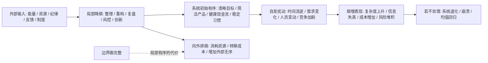
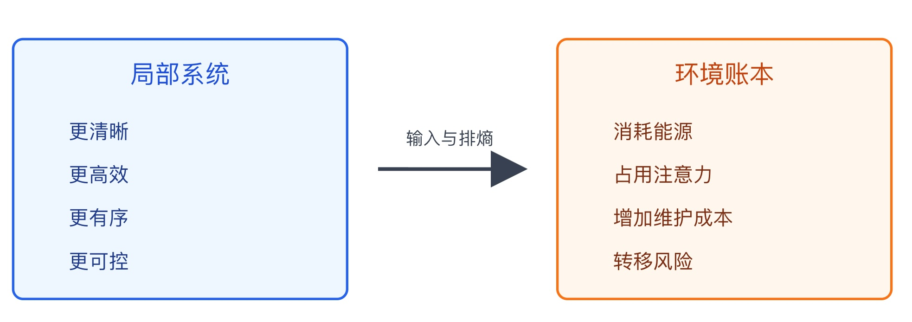

## 物理学思维筑基课: 熵增定律: 秩序不会自动维持, 混乱才是默认方向

### 作者
digoal

### 日期
2026-05-19

### 标签
熵增定律 , 热力学第二定律 , 秩序维护 , 系统退化 , 复杂度管理 , 产品债务 , 组织内耗 , 护城河侵蚀 , 长期主义 , 投资风险

----

## 背景

> 面向对象: 大学生、产品经理、运营经理、有投资需求的人  
> 核心问题: 为什么生活、组织、产品和投资组合如果不持续维护, 会自然变乱、变慢、变贵、变脆弱?  
> 先说结论: 熵增定律说的是孤立系统中自发过程的总熵不会减少。迁移到现实世界, 它提醒我们: 秩序不是默认状态, 维持秩序需要持续输入能量、信息、制度和反馈；凡是宣称“放着不管也会越来越好”的系统, 都要先怀疑它忽略了维护成本和外部输入。

说明: 严格说, “熵”在热力学和统计物理中有明确含义, 不能简单等同于“乱”。本文把熵增作为跨学科判断框架使用, 重点训练你识别系统退化、复杂度膨胀、组织内耗、产品债务和投资风险。

## 一张图先看懂



这张图先记住一句话: 熵增不是说“一切都会完蛋”, 而是说“系统不会免费保持好状态”。

## 求真讲法

### 它到底说了什么

热力学第二定律有多种等价或相关表述。用熵来说, 常见表述是:

```text
孤立系统的总熵在自发过程中不会减少。

ΔS_total >= 0
```

其中:

| 概念 | 含义 | 通俗理解 |
|---|---|---|
| 系统 | 你选定观察的对象 | 一杯水、一个房间、一个团队、一个产品 |
| 孤立系统 | 不和外界交换物质或能量 | 没有人打扫、没有外部输入、没有新资源 |
| 熵 S | 热力学状态量；统计物理中可理解为微观状态数的函数 | 同一个宏观样子背后, 可能实现它的微观排列有多少 |
| 自发过程 | 不需要外界额外做功就会发生的过程 | 热水变凉、香水扩散、房间变乱 |

统计物理中, 熵常用玻尔兹曼公式表达:

```text
S = k ln Ω
```

这里的 Ω 表示一个宏观状态对应的微观状态数量。微观状态越多, 熵越高。一个房间“很乱”的排列方式远多于“刚打扫好”的排列方式, 所以不干预时, 它更可能走向乱。

注意: “更可能”不是“每一秒都必然更乱”。第二定律讲的是宏观系统和统计趋势, 不是说任何局部、任何短时间、任何开放系统都不能变有序。

### 它是怎么来的

最直观的起点是热现象。

热水放在冷空气中会变凉, 但一杯常温水不会自发从房间里吸热, 突然变成一半冰、一半开水。香水打开后会扩散到房间, 但空气中的香水分子不会自发重新聚回瓶子。刹车会把汽车的动能变成热, 但路面和刹车片的热不会自发重新变回汽车前进的动能。

这些现象方向性很强。它们都符合一个共同特征:

```text
能量更分散
物质更混合
可用来做功的差异减少
系统更接近平衡态
```

熵增定律就是对这种方向性的高度概括。它解释了为什么时间看起来有箭头: 电影里杯子摔碎很正常, 碎片自动拼回杯子就显得荒谬。不是因为微观物理完全禁止反向运动, 而是因为反向排列需要极端特殊的微观状态, 在宏观世界几乎不会自发出现。

### 它依赖哪些假设

把熵增定律迁移到生活和投融资时, 必须先写清楚假设。

| 假设 | 在物理中的意思 | 迁移到现实判断时的意思 | 如果不成立 |
|---|---|---|---|
| 孤立或边界完整 | 统计总熵时要把系统和环境一起算 | 不能只看公司、个人或产品内部, 还要看外部资源和被转嫁的成本 | 会误以为局部有序是免费产生的 |
| 自发过程 | 没有外界额外做功时系统的自然方向 | 不管理、不整理、不迭代、不风控时系统会自然退化 | 会把“维持现状”误判为低成本 |
| 宏观统计 | 第二定律描述大量粒子和整体趋势 | 不用它解释每一个短期波动或个体事件 | 会用大规律硬套小样本 |
| 时间足够长 | 趋势需要在足够时间里显现 | 产品债、组织病、投资风险可能延迟暴露 | 会把短期稳定误判为长期安全 |
| 局部降熵需要代价 | 局部有序可以形成, 但要靠外部输入并向外排熵 | 公司、城市、个人可以变强, 但要消耗资源、制度、训练和注意力 | 会相信“自动成长”和“永续护城河” |

这就是熵增最容易被误用的地方: 它不是让人躺平, 而是要求你把局部有序背后的输入和代价看完整。

### 常见误解

**误解一: 熵增等于一切都会越来越差。**  
不是。局部系统可以变得更有序, 例如学生通过训练形成能力, 公司通过管理提升效率, 生态通过太阳能维持复杂生命。但这些局部降熵都需要外部输入, 并伴随环境中更大的熵增。

**误解二: 熵就是混乱。**  
“混乱”只是帮助入门的比喻。更准确地说, 熵与一个宏观状态对应的微观可能性数量有关, 也和能量分散、不可逆性、可用能降低有关。把熵只理解成“乱”, 容易把复杂系统讲浅。

**误解三: 熵增能直接预测股价。**  
不能。熵增能提醒你护城河会被侵蚀、组织会内耗、行业会均值回归, 但它不能告诉你某只股票明天涨跌。投资还需要财务、估值、竞争、治理、周期和价格分析。

**误解四: 稳定就没有熵增。**  
表面稳定可能来自持续维护。例如一个 App 看起来流畅, 背后可能有持续监控、重构、客服、内容审核和安全投入。你没看见维护, 不代表维护不存在。

## 求存讲法

### 它有什么用

熵增定律的原生价值, 是解释自然过程为什么有方向: 热从高温流向低温, 气体从集中走向扩散, 可用能逐渐耗散。

迁移到生活、产品、运营和投资, 它提供了一个非常硬的判断框架:

```text
凡是需要长期保持有序的系统, 都必须持续付维护成本。
```

这个框架能帮你看穿四类表面现象:

| 表面现象 | 熵增式追问 |
|---|---|
| 产品越来越大 | 功能增加的是价值, 还是复杂度和维护债? |
| 团队越来越忙 | 忙是在创造秩序, 还是被内耗和信息失真吞噬? |
| 公司利润很稳 | 稳定来自护城河维护, 还是来自少投未来? |
| 投资组合很赚钱 | 收益来自能力, 还是来自风险暂时没爆发? |

### 它怎么迁移到熟悉领域

#### 1. 大学生: 不复习, 知识会自然退化

学习不是把知识“存进去”就完事。人的记忆、理解和表达能力都会退化。你不复习, 不输出, 不练习, 不纠错, 知识就会从结构化变成碎片化。

```text
能力有序度 = 输入质量 × 复盘频率 × 输出压力 - 遗忘 - 分心 - 错误固化
```

这解释了为什么“学过”不等于“会用”。学过只是短期把信息放进系统；会用需要持续降熵: 归纳、连接、练习、反馈。

#### 2. 产品经理: 产品天然会复杂化

产品刚上线时通常很简单。随着客户需求、老板想法、竞品压力、运营活动、技术妥协不断加入, 产品会自然变复杂。

产品熵增常见表现:

```text
入口变多 -> 路径变长 -> 状态变乱 -> 规则变厚 -> 用户困惑 -> 维护成本上升
```

很多产品不是被竞争对手打败的, 而是被自己的复杂度拖慢的。每加一个功能, 不只是加一块积木, 还可能增加权限、埋点、测试、客服话术、边界状态和未来重构成本。

产品经理的核心工作之一, 不是不断加功能, 而是持续做“降熵”: 删除低价值功能、统一规则、减少路径、提高信息清晰度。

#### 3. 运营经理: 组织天然会内耗

运营系统一开始可能很敏捷: 一个人拉群、一个表格排期、一个活动快速上线。团队变大后, 信息会失真, 责任会模糊, 指标会互相打架, 流程会堆叠。

运营熵增常见路径:

```text
人变多 -> 沟通链变长 -> 目标解释变形 -> 执行偏差增大 -> 补流程 -> 更慢
```

所以管理不是“管住人”, 而是对抗组织熵增: 统一目标、减少交接、清理无效指标、复盘真实因果、把隐性经验变成可复制流程。

#### 4. 投融资: 护城河会被时间侵蚀

投资里最容易忽略的熵增, 是好公司也会退化。品牌会老化, 渠道会被重构, 技术会被替代, 管理层会路径依赖, 资本开支会不足, 组织会官僚化。

一个企业的局部有序, 来自持续投入:

| 企业有序结构 | 需要的外部输入 | 熵增侵蚀方式 |
|---|---|---|
| 品牌 | 产品体验、广告、信任维护 | 年轻用户迁移、口碑事件 |
| 技术优势 | 研发、人才、数据、工程体系 | 开源替代、架构老化 |
| 渠道优势 | 伙伴关系、履约能力、终端管理 | 平台改规则、渠道去中心化 |
| 成本优势 | 规模、流程、供应链协同 | 原材料涨价、管理复杂化 |
| 组织能力 | 激励、文化、制度、干部密度 | 官僚化、信息过滤、内斗 |

熵增定律不会告诉你哪家公司一定失败, 但它会逼你问: 这家公司的低熵结构靠什么维持? 维护成本有没有上升? 管理层是否还在做必要输入?

### 它的适用范围和边界

熵增框架适合用来判断“系统是否会自然退化”, 尤其适合看产品复杂度、组织效率、个人能力、商业护城河和投资组合风险。

但它不能被滥用。

第一, 局部降熵是可能的。学校、公司、城市、生命体都是开放系统, 可以通过外部能量和信息输入形成秩序。不要用熵增否定成长。

第二, 熵增不是道德判断。一个团队变慢, 不一定是人懒；可能是信息路径、激励结构和目标冲突导致组织熵增。先分析机制, 再评价人。

第三, 熵增不是短期预测工具。它更适合解释长期方向和维护成本, 不适合直接预测一周内的股价、活动数据或考试成绩。

第四, 降熵也有成本。过度流程化、过度控制、过度复盘, 可能让系统看似有序, 但牺牲创新和速度。真正有效的降熵, 是用更低复杂度换更高可控性。

### 正例: 怎么用它提升能力

#### 正例一: 大学生建立“反遗忘系统”

一个学生发现自己看了很多书, 但一到考试、面试、写作就想不起来。熵增式分析不会简单责怪“记性差”, 而是看系统是否缺少降熵机制。

| 环节 | 熵增表现 | 降熵动作 |
|---|---|---|
| 输入 | 只看不练, 信息堆积 | 每章写 5 句话总结 |
| 连接 | 知识点孤立 | 画概念图, 找因果链 |
| 反馈 | 不知道错在哪里 | 做题、模拟面试、让别人提问 |
| 复用 | 学完就放下 | 每周用一个旧知识解释新问题 |

这不是更努力, 而是把学习从“信息堆放”改成“结构维护”。学习系统因此从高熵碎片变成低熵模型。

#### 正例二: 产品经理用减法控制产品熵

某工具类产品的用户反馈是“功能很多, 但越来越难用”。团队原本计划继续加一个智能推荐功能。产品经理先做了一次产品熵盘点:

1. 统计低使用率入口。
2. 合并重复设置项。
3. 删除长期无人维护的实验功能。
4. 把三个相似流程统一成一个主路径。
5. 重新定义关键页面的信息优先级。

结果新功能还没加, 留存和完成率先改善了。原因不是用户突然变了, 而是产品把复杂度降下来了。这个例子成立的前提是: 用户核心需求仍然存在, 只是被产品熵遮住了。

#### 正例三: 投资者把“护城河”改成“维护账本”

投资者研究一家消费品公司。过去它有强品牌和高渠道覆盖。熵增式研究不止看历史 ROE, 还看低熵结构是否仍被维护:

| 问题 | 观察指标 |
|---|---|
| 品牌是否还年轻 | 新客占比、复购、社媒口碑、价格带变化 |
| 渠道是否还有效 | 终端动销、渠道库存、线上线下冲突 |
| 组织是否仍敏捷 | 新品周期、费用效率、管理层更替 |
| 现金流是否支持维护 | 广告投入、研发投入、资本开支、自由现金流 |

如果公司仍在持续投入, 且投入能转化为真实用户价值, 护城河可能还在。若只是靠老品牌收割, 熵增会逐渐把优势磨平。

### 反例: 前提不成立会怎样

#### 反例一: 把局部低熵误以为整体低熵

一个平台通过强补贴把用户体验做得很好: 价格低、配送快、客服响应快。用户侧看起来是低熵系统。

但如果商家利润被压低、骑手压力上升、平台持续亏损、售后成本外溢, 那只是局部降熵, 不是整体降熵。当前提“边界完整”不成立时, 你会把外部承担的熵误判为平台创造的秩序。

正确问题是: 当补贴减少、监管加强、劳动力成本上升后, 这个低熵体验还能不能维持?

#### 反例二: 把短期控制误当成长期降熵

一个运营团队为了“提高执行力”, 增加日报、周报、审批、复盘、会议。短期看, 管理者掌握的信息更多, 团队似乎更可控。

但两个月后, 一线把大量时间花在填表, 决策变慢, 创造性下降, 真实问题被包装成漂亮汇报。失败原因是前提“降熵成本低于收益”不成立。过度控制没有降低系统熵, 而是把业务复杂度转化成流程复杂度。

有效降熵应该减少无效变化和信息噪音, 而不是制造更多管理噪音。

#### 反例三: 把牛市中的组合上涨误当成低风险秩序

牛市中, 一个投资组合里所有高弹性资产都上涨。投资者以为自己构建了稳定赚钱系统。

但如果组合高度依赖流动性、估值扩张和同一个宏观因子, 它并不低熵, 只是风险还没有显形。当前提“时间足够长”不成立时, 短期上涨会掩盖结构脆弱。

一旦流动性收紧, 相关性上升, 组合里的资产可能一起下跌。真正的降熵不是持有很多名字, 而是理解风险来源是否真的分散。

## 一个可复用的熵增检查表

遇到一个人、产品、团队、公司或投资组合, 可以用这张表做体检。

| 检查项 | 要问的问题 | 熵增信号 | 降熵动作 |
|---|---|---|---|
| 边界 | 谁在输入资源? 谁在承担代价? | 成本外溢、补贴依赖 | 把外部成本纳入账本 |
| 复杂度 | 规则、流程、功能是否变多? | 路径变长、解释困难 | 删除、合并、标准化 |
| 信息 | 真实情况能否到达决策层? | 报喜不报忧、指标失真 | 建立一线反馈和反例机制 |
| 维护 | 低熵结构靠什么维持? | 只收割不投入 | 设定维护预算和复盘节奏 |
| 时间 | 风险是否被延后? | 短期漂亮、长期欠账 | 拉长观察窗口 |
| 外部变化 | 环境是否改变了原有秩序? | 旧优势失效 | 重新评估假设 |

再压缩成六句话:

```text
房间不扫会乱。
知识不用会散。
产品不删会肿。
组织不理会慢。
护城河不投会薄。
组合不查会脆。
```

## 一张 SVG: 局部降熵不是免费午餐

<svg viewBox="0 0 780 320" xmlns="http://www.w3.org/2000/svg" role="img" aria-label="局部降熵和整体熵增示意图">
  <rect x="35" y="50" width="270" height="210" rx="8" fill="#eef6ff" stroke="#2563eb" stroke-width="2"/>
  <text x="170" y="85" text-anchor="middle" font-size="20" font-family="Arial, sans-serif" fill="#1d4ed8">局部系统</text>
  <text x="80" y="130" font-size="16" font-family="Arial, sans-serif" fill="#1e3a8a">更清晰</text>
  <text x="80" y="165" font-size="16" font-family="Arial, sans-serif" fill="#1e3a8a">更高效</text>
  <text x="80" y="200" font-size="16" font-family="Arial, sans-serif" fill="#1e3a8a">更有序</text>
  <text x="80" y="235" font-size="16" font-family="Arial, sans-serif" fill="#1e3a8a">更可控</text>

  <path d="M330 155 L445 155" stroke="#374151" stroke-width="3" marker-end="url(#arrow2)"/>
  <text x="388" y="135" text-anchor="middle" font-size="14" font-family="Arial, sans-serif" fill="#374151">输入与排熵</text>

  <rect x="475" y="50" width="270" height="210" rx="8" fill="#fff7ed" stroke="#f97316" stroke-width="2"/>
  <text x="610" y="85" text-anchor="middle" font-size="20" font-family="Arial, sans-serif" fill="#c2410c">环境账本</text>
  <text x="520" y="130" font-size="16" font-family="Arial, sans-serif" fill="#7c2d12">消耗能源</text>
  <text x="520" y="165" font-size="16" font-family="Arial, sans-serif" fill="#7c2d12">占用注意力</text>
  <text x="520" y="200" font-size="16" font-family="Arial, sans-serif" fill="#7c2d12">增加维护成本</text>
  <text x="520" y="235" font-size="16" font-family="Arial, sans-serif" fill="#7c2d12">转移风险</text>

  <defs>
    <marker id="arrow2" markerWidth="10" markerHeight="10" refX="8" refY="5" orient="auto">
      <path d="M0,0 L10,5 L0,10 Z" fill="#374151"/>
    </marker>
  </defs>
</svg>  

  

## 思考

1. 你现在生活里最乱的地方, 是因为缺少输入, 还是因为系统边界画错了?
2. 一个产品越做越复杂, 是用户需求真的复杂, 还是团队没有勇气删除低价值功能?
3. 组织里哪些流程看似降熵, 实际是在制造新的信息噪音?
4. 一家公司过去的护城河, 今天还在被维护吗? 维护成本是上升还是下降?
5. 投资组合里的“分散”, 是名字数量多, 还是风险来源真的不同?
6. 如果局部有序一定要向外排熵, 你的成功是否建立在他人的无序、未来的债务或环境的代价之上?

## 最后记住

1. 熵增不是悲观主义, 而是维护成本意识。
2. 孤立系统会自发走向更高熵；开放系统可以局部降熵, 但必须持续输入并向外排熵。
3. 生活、产品、运营和投资里的很多失败, 本质是低估了复杂度、维护成本和时间侵蚀。
4. 真正的高手不是追求表面整齐, 而是用最小必要成本维持关键秩序。
5. 判断一个系统是否可靠, 不只看它今天多有序, 还要看它靠什么维持有序。

## 参考资料

- OpenStax, [Physics: 12.3 Second Law of Thermodynamics: Entropy](https://openstax.org/books/physics/pages/12-3-second-law-of-thermodynamics-entropy). 用于核对“总熵在自发过程中增加或保持不变”的基础表述。
- OpenStax, [University Physics Volume 2: 4.6 Entropy](https://openstax.org/books/university-physics-volume-2/pages/4-6-entropy). 用于核对熵作为热力学状态量及可逆、不可逆过程中的表述。
- Encyclopaedia Britannica, [Second law of thermodynamics](https://www.britannica.com/science/second-law-of-thermodynamics). 用于核对第二定律、Clausius 与熵概念的历史背景。
- Encyclopaedia Britannica, [Principles of physical science: Entropy and disorder](https://www.britannica.com/science/principles-of-physical-science/Entropy-and-disorder). 用于核对统计物理中 S = k ln W 的通俗解释。
- HyperPhysics, Georgia State University, [Second Law of Thermodynamics](https://hyperphysics.phy-astr.gsu.edu/hbase/thermo/seclaw.html). 用于交叉核对第二定律的常见表述。
  
#### [PostgreSQL 解决方案集合](../201706/20170601_02.md "40cff096e9ed7122c512b35d8561d9c8")
  
  
#### [德哥 / digoal's Github - 公益是一辈子的事.](https://github.com/digoal/blog/blob/master/README.md "22709685feb7cab07d30f30387f0a9ae")
  
  
#### [About 德哥](https://github.com/digoal/blog/blob/master/me/readme.md "a37735981e7704886ffd590565582dd0")
  
  

  
