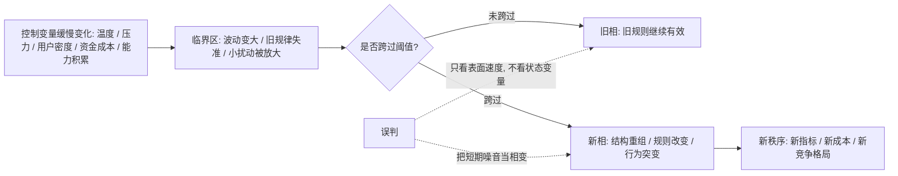
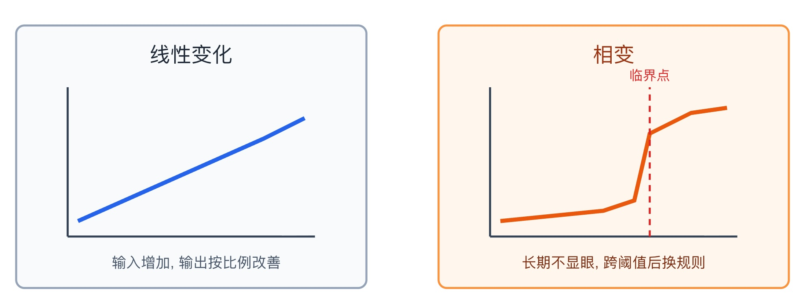

## 物理学思维筑基课: 相变理论: 真正的变化不是线性变好, 而是系统换了一套规则

### 作者
digoal

### 日期
2026-05-19

### 标签
相变理论 , 临界点 , 非线性变化 , 量变质变 , 潜热阶段 , 网络效应 , 行业重估 , 产品增长 , 学习平台期 , 投资机会

----

## 背景

> 面向对象: 大学生、产品经理、运营经理、有投资需求的人  
> 核心问题: 为什么有些努力、产品、组织和行业长期看似没变化, 却会在某个节点之后突然变强、变差、爆发或崩塌?  
> 先说结论: 相变理论提醒我们, 系统并不总是线性变化。某些关键变量持续积累到临界点后, 系统会从一种稳定状态切换到另一种稳定状态。生活、产品、运营和投资中最重要的判断, 不是只看当下涨跌, 而是识别系统是否正在接近“换规则”的临界区。

说明: 严格说, “相变”是物理和化学中的概念, 描述物质在不同相之间的转变, 例如冰变水、水变蒸汽。本文把相变作为跨学科判断框架使用, 用来训练你识别临界点、非线性变化、旧指标失效和新秩序形成, 不是说社会系统可以像水的沸点一样精确预测。

## 一张图先看懂



相变理论最重要的一句话是: 变化不是只看“变了多少”, 还要看“系统还是不是原来的系统”。

## 求真讲法

### 它到底说了什么

“相”是系统在宏观上呈现出的稳定状态。水的固态、液态、气态就是不同相。相变就是系统从一种相转到另一种相, 例如熔化、凝固、汽化、凝华。

最熟悉的例子是水:

```text
冰  --加热到熔点附近-->  水  --继续加热到沸点附近-->  水蒸气
```

注意, 相变不是普通的“变热一点”。在相变过程中, 系统的宏观性质会突然改变: 形状保持能力、流动性、密度、压缩性、导热方式都可能变。很多时候, 输入的能量不是马上表现为温度上升, 而是用于改变结构, 这就是“潜热”的直观含义。

把相变迁移到现实中, 可以写成一个判断模型:

```text
状态突变 = 控制变量持续积累 + 约束条件改变 + 反馈机制放大 + 跨过临界阈值
```

这里的“控制变量”不是固定某一个东西, 而是推动系统状态改变的关键变量: 学习中的有效练习量, 产品中的用户密度, 运营中的供给匹配效率, 投资中的渗透率、成本曲线、利率、现金流压力等。

### 它是怎么来的

相变最早来自人们对物质状态变化的观察。水在不同温度和压力下会稳定地表现为固体、液体或气体。把温度和压力画成图, 就得到相图。相图里的边界线表示不同相共存或转换的条件, 例如固液边界、液气边界。

相图的意义不只是告诉你“水什么时候开”, 而是告诉你: 系统状态由多个条件共同决定。温度重要, 压力也重要。只看一个变量, 很容易误判系统所在的相。

```text
              压力
               ↑
               |       固体
               |      /
               |     /   液体
               |    /___
               |   /    \____ 临界点
               |  /          \  气体
               +----------------→ 温度
```

后来, 相变思想被推广到更复杂的系统: 磁性材料在居里温度附近会失去铁磁性, 超导材料在特定条件下出现零电阻, 复杂系统中也会出现临界点、级联失效、网络效应、渗流阈值等现象。

这给生活和投资一个重要启发: 很多真正的大变化, 在表面突变之前, 内部结构已经变化很久。

### 它依赖哪些假设

把相变理论迁移到现实判断时, 先要说清楚假设。

| 假设 | 在物理中的意思 | 迁移到现实判断时的意思 | 如果不成立 |
|---|---|---|---|
| 存在可区分状态 | 固体、液体、气体等相有不同性质 | 系统确实有“旧状态”和“新状态”, 而不是普通波动 | 会把小变化夸大成相变 |
| 存在控制变量 | 温度、压力等变量推动状态变化 | 有关键变量持续积累, 如用户密度、技能熟练度、成本下降 | 会把随机事件误判为趋势 |
| 存在临界阈值 | 跨过相边界后宏观性质改变 | 某个阈值附近, 系统行为不再按旧规则运行 | 会用线性外推错过突变 |
| 系统内部有耦合 | 分子间作用力决定相稳定性 | 个体之间、模块之间、资金之间存在相互影响 | 若没有耦合, 变化只是局部事件 |
| 观察指标能反映状态 | 密度、热容、磁化强度等可测 | 有能区分旧相和新相的指标 | 会只看热度, 看不到结构 |
| 外部条件可持续 | 相变后新相能稳定存在 | 新用户、新技术、新资金或新制度能维持 | 会把短期冲高误判为新秩序 |

所以, 判断现实中的相变, 不能只问“有没有突然变化”, 而要问“突然变化背后有没有可解释的状态变量和新稳定结构”。

### 常见误解

**误解一: 相变就是爆发。**  
不是。爆发只是表面现象。相变强调的是系统状态改变。一次营销活动让访问量暴涨, 但用户留不住、供给没改善、单位经济模型没变, 那只是脉冲, 不是相变。

**误解二: 所有量变都会带来质变。**  
不一定。量变要引发相变, 需要关键变量接近阈值, 还要有内部耦合和反馈。一个人低质量重复 1000 小时, 未必形成能力相变；一个产品不断加功能, 未必形成网络效应。

**误解三: 临界点可以精确预测。**  
物理系统中的相变可以在严格条件下精确描述, 但社会和市场系统变量更多、边界更模糊、参与者会学习和反应。现实中更可行的是识别“临界区”, 而不是迷信某个精确点。

**误解四: 相变发生后, 旧规律立刻全部失效。**  
现实系统常有过渡期和滞后。旧结构不会瞬间消失, 新结构也未必马上稳定。产品、组织和行业常出现新旧相并存, 这也是判断最困难的阶段。

## 求存讲法

### 它有什么用

相变理论的原生作用, 是帮助我们理解物质为什么会在特定条件下发生状态突变, 以及为什么相变时会出现潜热、相边界、临界点等现象。

迁移到生活、产品、运营和投资, 它的价值是三件事:

1. 不被短期线性结果骗了。
2. 不在临界点之前过早放弃。
3. 不在相变已经发生后继续用旧指标判断。

很多人错过机会, 不是因为不努力, 而是因为用线性思维看非线性系统:

| 表面现象 | 线性解释 | 相变解释 |
|---|---|---|
| 学了很久没进步 | 我不适合 | 关键结构还没形成, 可能仍在潜热阶段 |
| 产品增长突然变快 | 运气好 | 用户密度、供给质量、分发效率可能跨过阈值 |
| 行业利润突然恶化 | 短期周期 | 竞争结构、技术成本或政策约束可能换相 |
| 资产突然重估 | 情绪炒作 | 现金流预期、利率环境、叙事共识可能切换 |

### 它怎么迁移到熟悉领域

#### 1. 大学生: 学习中的“平台期”可能是潜热阶段

学英语、编程、数学、写作时, 很多人会经历平台期: 花了很多时间, 分数或作品质量却没有明显变化。

相变理论给出的解释是: 有些输入没有立刻表现为外部成绩, 而是在内部重构认知结构。

```text
低阶阶段: 记概念、背语法、照着写代码
潜热阶段: 错误暴露、结构重组、旧方法失效
相变之后: 可以独立表达、迁移、解决新问题
```

但要注意, 不是所有平台期都值得坚持。关键要看控制变量是否正确: 是否有高质量反馈, 是否有刻意练习, 是否能解释错误, 是否开始出现小范围迁移。如果只是重复低效动作, 那不是潜热, 只是空转。

#### 2. 产品经理: 网络效应不是用户数多, 而是用户之间开始互相增值

很多产品都想要网络效应, 但网络效应不是下载量高。真正的相变发生在用户密度跨过阈值之后: 新用户加入会让老用户更有价值, 老用户活跃又会吸引新用户。

```text
冷启动期: 每个用户都像孤岛
临界区: 局部场景开始自循环
相变后: 用户、内容、供给、数据互相增强
```

产品经理要观察的不是单日新增, 而是状态变量:

| 状态变量 | 相变前 | 临界区 | 相变后 |
|---|---|---|---|
| 用户关系 | 孤立使用 | 小圈层活跃 | 跨圈层扩散 |
| 内容供给 | 依赖官方生产 | 用户开始贡献 | 供给自增长 |
| 留存 | 靠提醒和补贴 | 部分场景自然回访 | 习惯形成 |
| 获客 | 买流量为主 | 口碑出现 | 用户带用户 |
| 数据价值 | 稀疏 | 局部可用 | 反哺推荐和体验 |

如果这些变量没有变化, 只靠投放买来的增长, 就不能叫产品相变。

#### 3. 运营经理: 活动相变来自供需匹配, 不是声量峰值

运营活动常见误判是把“热闹”当“成功”。相变式运营看的是供需系统是否变了。

一个活动真正跨过临界点, 往往有这些信号:

1. 用户不再只是被奖励驱动, 而是自发传播。
2. 商家或供给方开始主动加入。
3. 规则从需要解释, 变成用户一看就懂。
4. 活动后的复购、留存、内容沉淀继续存在。
5. 单位补贴下降后, 行为仍能维持。

这说明运营从“外力推动”转向“系统自循环”。反过来, 如果补贴一停就归零, 说明没有相变, 只是用外部能量制造了短期相。

#### 4. 投融资: 行业相变发生在成本曲线、渗透率和制度约束同时改变时

投资里最有价值的相变, 往往不是价格先变, 而是产业状态先变:

```text
技术成本下降 -> 用户可负担 -> 渗透率上升 -> 规模经济增强 -> 资本和人才涌入 -> 行业规则改变
```

或者反过来:

```text
融资成本上升 -> 现金流压力增加 -> 扩张模式失效 -> 估值逻辑重定价 -> 行业出清
```

投资者要警惕两种错误。

第一, 在相变前只看利润, 看不到临界变量。例如一个新技术早期利润差, 但成本曲线持续下降、体验跨过可用阈值、生态开始形成, 旧财务指标可能低估它。

第二, 在相变后还用旧估值逻辑。例如一个行业过去靠高杠杆扩张, 当利率、监管或需求结构改变后, 原来的估值倍数可能不再适用。

### 它的适用范围和边界

相变框架适合用来分析非线性变化, 尤其适合学习平台期、产品网络效应、运营自循环、组织规模化、行业渗透率和资产重估。

但它有边界。

第一, 相变不是万能解释。很多变化只是周期波动、营销刺激、统计噪音、一次性事件。没有新稳定状态, 就不要轻易叫相变。

第二, 社会系统没有固定沸点。水在标准大气压下有明确沸点, 但行业和市场没有这么干净的条件。现实判断只能用多指标交叉验证。

第三, 相变可能向坏方向发生。组织从敏捷变官僚, 投资组合从分散变同涨同跌, 行业从高增长变内卷, 都是状态切换。

第四, 临界区风险最大。相变前后波动会变大, 旧指标会失灵, 参与者行为会互相影响。越接近临界区, 越不能只靠单一指标决策。

### 正例: 怎么用它提升能力

#### 正例一: 学生把平台期拆成可验证的临界变量

一个学生学编程三个月, 感觉自己只会照抄教程。线性思维会说“我没有进步”。相变思维会问: 哪些变量还没跨过阈值?

| 临界变量 | 相变前表现 | 训练动作 | 相变后表现 |
|---|---|---|---|
| 语法熟悉度 | 看得懂, 写不出 | 每天独立写小函数 | 不查资料能写常见结构 |
| 调试能力 | 报错就慌 | 记录错误类型和定位路径 | 能从错误信息反推原因 |
| 抽象能力 | 复制教程结构 | 重写同一个功能三次 | 能自己拆模块 |
| 迁移能力 | 只会原题 | 换数据、换场景练习 | 能解决没见过的问题 |

如果这些变量都在改善, 但作品质量暂时没大变, 他可能处在潜热阶段。正确做法不是放弃, 而是继续让关键变量接近阈值。

#### 正例二: 产品经理识别社区产品的相变

一个社区产品早期靠运营手动发内容。表面数据一般。团队没有急着下结论, 而是跟踪几个状态变量:

1. 用户是否开始互相关注。
2. 普通用户内容是否获得评论。
3. 新用户是否能在 24 小时内找到互动对象。
4. 内容消费是否从首页推荐转向关系链。
5. 核心创作者是否自发带来新用户。

某个月, 这些变量同时改善, 虽然总 DAU 还不大, 但局部网络已经形成。团队选择加大对关系链和创作者工具的投入, 而不是继续买泛流量。后来增长加速, 是因为产品已经从“内容展示工具”切换到“关系网络”。

这个正例成立的关键是: 相变判断来自结构变量, 不是来自单日数据峰值。

#### 正例三: 投资者识别行业重估前的临界区

一个投资者研究某个制造行业。过去市场认为它是周期品, 给低估值。但他发现几个变量同时变化:

| 变量 | 旧状态 | 临界变化 |
|---|---|---|
| 成本曲线 | 规模小、成本高 | 自动化和良率提升 |
| 需求结构 | 项目制波动 | 下游标准化需求增加 |
| 竞争格局 | 小厂混战 | 头部企业份额提升 |
| 现金流 | 扩张吃现金 | 周转效率改善 |
| 客户关系 | 一次性采购 | 长期框架协议增加 |

如果这些变化持续, 行业可能从“周期加工”切换到“规模制造平台”。这时估值逻辑会变。投资者仍需评估价格、财务质量和风险, 但相变框架能帮助他在财报完全显现之前提出正确问题。

### 反例: 前提不成立会怎样

#### 反例一: 把营销峰值误判为产品相变

一个 App 通过大规模投放和奖励拉新, 日活暴涨。团队宣布“产品进入爆发期”。但活动结束后, 留存快速下滑, 用户之间没有互动, 内容供给没有增加, 推荐系统也没有变好。

失败原因是前提“存在新稳定状态”不成立。日活峰值只是外部能量输入, 不是系统结构改变。真正的相变要看外力撤掉后, 系统是否仍能维持新状态。

#### 反例二: 把普通努力误判为学习相变前夜

一个学生每天刷学习视频, 认为自己正在“量变积累”。半年后能力没有提升。问题不是他不够坚持, 而是前提“控制变量有效”不成立。

视频时长不是关键控制变量。真正的变量可能是输出次数、错误纠正、主动回忆、题目难度、反馈质量。错误变量积累再多, 也不会跨过正确阈值。

#### 反例三: 把估值上涨误判为行业相变

某行业股票因为热门叙事上涨, 估值翻倍。投资者以为行业已经相变。但实际渗透率没有提高, 单位经济模型没有改善, 头部企业现金流仍差, 政策约束也没有变化。

失败原因是前提“观察指标能反映状态”不成立。价格可以先涨, 但价格本身不能证明相变。相变需要产业变量支持, 否则只是估值波动。

## 一个可复用的相变检查表

看到任何“突然爆发”“行业重估”“能力跃迁”“产品起飞”的说法, 先用这张表检查。

| 检查项 | 要问的问题 | 相变信号 | 伪相变信号 |
|---|---|---|---|
| 旧相和新相 | 系统是否出现不同稳定状态? | 行为规则改变 | 只是数据涨了一次 |
| 控制变量 | 哪些变量在持续积累? | 成本、密度、技能、渗透率持续改善 | 只有声量和情绪 |
| 临界区 | 是否出现波动放大和旧指标失准? | 小动作带来大反应 | 每次都要靠外力硬推 |
| 内部耦合 | 个体之间是否互相影响? | 用户带用户、供给带需求 | 各环节彼此孤立 |
| 新秩序 | 外力撤掉后能否维持? | 留存、复购、自循环 | 补贴停了就归零 |
| 风险 | 相变方向是否可能变坏? | 结构性改善或恶化可解释 | 只讲好故事 |

再压缩成六句:

```text
别只看速度, 要看状态。
别只看爆发, 要看阈值。
别只看结果, 要看控制变量。
别只看热度, 要看新稳定结构。
别只看上涨, 要看估值逻辑是否换了。
别只问会不会变, 要问变成什么相。
```

## 一张 SVG: 线性变化与相变的差别

<svg viewBox="0 0 820 340" xmlns="http://www.w3.org/2000/svg" role="img" aria-label="线性变化与相变差别示意图">
  <rect x="35" y="35" width="340" height="255" rx="8" fill="#f8fafc" stroke="#94a3b8" stroke-width="2"/>
  <text x="205" y="70" text-anchor="middle" font-size="20" font-family="Arial, sans-serif" fill="#1f2937">线性变化</text>
  <line x1="85" y1="240" x2="325" y2="240" stroke="#334155" stroke-width="2"/>
  <line x1="85" y1="240" x2="85" y2="95" stroke="#334155" stroke-width="2"/>
  <path d="M95 225 L140 205 L185 185 L230 165 L275 145 L315 125" fill="none" stroke="#2563eb" stroke-width="4"/>
  <text x="210" y="270" text-anchor="middle" font-size="14" font-family="Arial, sans-serif" fill="#475569">输入增加, 输出按比例改善</text>

  <rect x="445" y="35" width="340" height="255" rx="8" fill="#fff7ed" stroke="#fb923c" stroke-width="2"/>
  <text x="615" y="70" text-anchor="middle" font-size="20" font-family="Arial, sans-serif" fill="#9a3412">相变</text>
  <line x1="495" y1="240" x2="735" y2="240" stroke="#334155" stroke-width="2"/>
  <line x1="495" y1="240" x2="495" y2="95" stroke="#334155" stroke-width="2"/>
  <path d="M505 225 L555 220 L605 215 L635 205 L650 140 L690 120 L725 115" fill="none" stroke="#ea580c" stroke-width="4"/>
  <line x1="650" y1="240" x2="650" y2="95" stroke="#dc2626" stroke-width="2" stroke-dasharray="6,5"/>
  <text x="650" y="88" text-anchor="middle" font-size="13" font-family="Arial, sans-serif" fill="#dc2626">临界点</text>
  <text x="615" y="270" text-anchor="middle" font-size="14" font-family="Arial, sans-serif" fill="#7c2d12">长期不显眼, 跨阈值后换规则</text>
</svg>
  
  
  

## 思考

1. 你现在最重要的目标, 是线性任务, 还是可能存在相变的系统?
2. 你以为自己没有进步的领域, 关键控制变量真的在改善吗?
3. 一个产品增长突然加速时, 是外部流量推动, 还是用户之间开始互相增值?
4. 一个运营活动爆了, 外力撤掉后还能留下什么新结构?
5. 一个行业被重估, 是价格先涨, 还是成本曲线、渗透率、竞争格局和现金流真的换相?
6. 如果相变可能向坏方向发生, 你的生活、产品、组织和投资组合有哪些临界风险?

## 最后记住

1. 相变不是普通变化, 而是系统从一种稳定状态切换到另一种稳定状态。
2. 临界点之前, 大量输入可能表现为“潜热”, 不一定马上变成可见结果。
3. 判断相变要看控制变量、内部耦合、临界区和新稳定结构, 不能只看热度。
4. 现实系统没有精确沸点, 更适合识别临界区, 而不是迷信单点预测。
5. 最值得警惕的不是变化太慢, 而是系统已经换规则, 你还在用旧指标判断。

## 参考资料

- OpenStax, [University Physics Volume 2: 1.5 Phase Changes](https://openstax.org/books/university-physics-volume-2/pages/1-5-phase-changes). 用于核对相变、潜热与热量输入不一定导致温度变化的基础表述。
- OpenStax, [Physics: 11.3 Phase Change and Latent Heat](https://openstax.org/books/physics/pages/11-3-phase-change-and-latent-heat). 用于核对物质状态变化和相变中的能量关系。
- OpenStax, [Chemistry 2e: 10.4 Phase Diagrams](https://openstax.org/books/chemistry-2e/pages/10-4-phase-diagrams). 用于核对相图、相边界、三相点和临界点的标准解释。
- Encyclopaedia Britannica, [Phase diagram](https://www.britannica.com/science/phase-diagram). 用于核对温度、压力与稳定相之间的关系。
- Encyclopaedia Britannica, [Critical point](https://www.britannica.com/science/critical-point-phase-change). 用于核对临界点处液相和气相边界消失的表述。
  
#### [PostgreSQL 解决方案集合](../201706/20170601_02.md "40cff096e9ed7122c512b35d8561d9c8")
  
  
#### [德哥 / digoal's Github - 公益是一辈子的事.](https://github.com/digoal/blog/blob/master/README.md "22709685feb7cab07d30f30387f0a9ae")
  
  
#### [About 德哥](https://github.com/digoal/blog/blob/master/me/readme.md "a37735981e7704886ffd590565582dd0")
  
  

  
