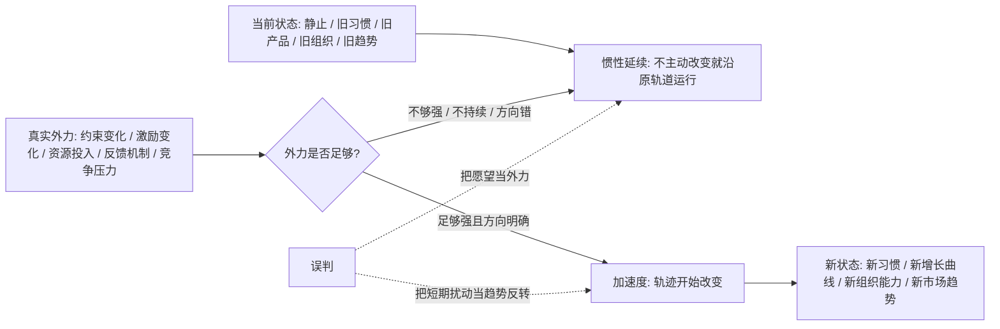
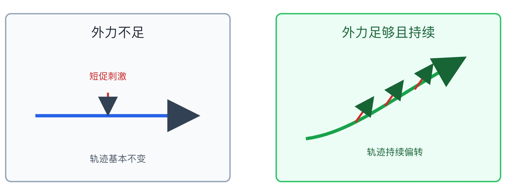

## 物理学思维筑基课: 惯性定律: 状态不会自己改变, 改变方向需要真实外力

### 作者
digoal

### 日期
2026-05-19

### 标签
惯性定律 , 牛顿第一定律 , 合外力 , 轨迹改变 , 习惯系统 , 产品迁移 , 组织转型 , 市场趋势 , 投资反转 , 决策框架

----

## 背景

> 面向对象: 大学生、产品经理、运营经理、有投资需求的人  
> 核心问题: 为什么坏习惯不会自动消失, 好产品不会自动增长, 组织不会自动转型, 市场趋势也不会因为你希望它反转就反转?  
> 先说结论: 惯性定律说的是, 在合外力为零时, 物体会保持静止或匀速直线运动。迁移到生活、产品、运营和投资, 它提醒我们: 一个系统会倾向于延续原来的状态和方向；想改变轨迹, 需要足够强、方向正确、持续时间足够的外力, 而不是愿望、口号或一次短促刺激。

说明: 严格说, 惯性定律是经典力学中的牛顿第一定律, 依赖惯性参考系等物理前提。本文把它作为跨学科判断框架使用, 重点训练你识别状态延续、路径依赖、真实外力、趋势反转和改变成本, 不是把社会系统机械等同于物体运动。

## 一张图先看懂



这张图的核心是: 状态改变不是因为“时间到了”, 而是因为有力改变了运动状态。

## 求真讲法

### 它到底说了什么

牛顿第一定律通常表述为:

```text
一个物体如果不受合外力作用, 会保持静止状态或匀速直线运动状态。
```

更物理一点说:

```text
ΣF = 0  ->  v 保持不变
```

这里的 `ΣF` 是合外力, `v` 是速度。速度不只是“快慢”, 还包括方向。因此, 如果合外力为零, 物体不会自己加速、减速或转弯。

惯性不是“喜欢不动”。惯性是物体抵抗运动状态改变的性质。静止会保持静止, 运动也会保持运动。我们日常误以为“动的东西会自然停下”, 是因为现实中到处都有摩擦力、空气阻力等外力。

把它迁移到现实世界, 可以写成:

```text
轨迹改变 = 真实外力 × 持续时间 × 方向一致性 - 阻力 - 旧惯性
```

这不是物理公式, 而是判断框架。它提醒你: 任何状态的改变都要追问外力来源、方向、强度、持续性和阻力。

### 它是怎么来的

在古代直觉里, 人们容易认为“运动需要持续推动”。比如推箱子, 不推就停, 所以好像力是维持运动的原因。

伽利略的贡献在于改变了这个直觉。他意识到, 物体停下来不是因为“运动自然消失”, 而是因为摩擦等阻力在改变它的运动状态。如果阻力越来越小, 物体就会运动得越来越久。牛顿后来把这种思想概括进他的运动定律体系。

惯性定律的深刻之处, 是它把问题倒过来了:

```text
旧直觉: 为什么物体会继续运动?
新框架: 如果没有外力, 它本来就会继续原来的运动；真正要解释的是为什么它改变了运动状态。
```

这也是它适合迁移到生活和投融资的原因。很多人看到一个人、一个组织、一个行业、一个资产价格改变了, 只看表面结果, 不问“合外力是什么”。而真正的判断从这里开始。

### 它依赖哪些假设

把惯性定律迁移到现实判断时, 必须先写清楚假设。

| 假设 | 在物理中的意思 | 迁移到现实判断时的意思 | 如果不成立 |
|---|---|---|---|
| 惯性参考系 | 在该参考系中, 牛顿第一定律成立 | 观察框架要稳定, 不能频繁换指标和口径 | 会把观察口径变化误判为状态变化 |
| 合外力为零 | 所有外力相互抵消 | 没有足够改变系统轨迹的净力量 | 会把噪音当成趋势改变 |
| 速度包含方向 | 不只看快慢, 还看运动方向 | 不只看增长速度, 还看增长质量和战略方向 | 会把高速度误判为好轨迹 |
| 摩擦真实存在 | 阻力会改变运动状态 | 组织内耗、交易成本、认知偏差、监管约束都会消耗外力 | 会低估改变成本 |
| 质量影响加速度 | 同样的力, 质量越大越难改变速度 | 越大的组织、越强的习惯、越成熟的行业越难转向 | 会高估短期政策或活动的效果 |
| 外力要持续 | 短促力只能造成有限改变 | 改变人生、产品、组织和趋势需要持续机制 | 会把一次刺激当长期转型 |

所以, 用惯性定律看现实, 不是说“一切都会维持原样”, 而是说: 如果你声称状态会改变, 请指出改变它的真实合外力。

### 常见误解

**误解一: 惯性就是不变。**  
不是。惯性是保持原有运动状态。一个正在高速扩张的公司也有惯性, 一个下跌中的行业也有惯性, 一个持续学习的人也有惯性。惯性既可能保护你, 也可能拖垮你。

**误解二: 有外力就一定改变。**  
不一定。外力可能太小、太短、方向不一致, 也可能被摩擦抵消。一次培训、一句口号、一场活动、一次降息, 未必足以改变系统轨迹。

**误解三: 趋势久了就一定反转。**  
时间本身不是外力。趋势持续越久, 可能越脆弱, 也可能越稳固。真正要看反转力量: 需求是否改变, 现金流是否断裂, 政策是否转向, 竞争结构是否重组。

**误解四: 稳定就是安全。**  
静止也可能是危险惯性。一个人长期不学习, 一个产品长期不迭代, 一个组织长期不触碰困难问题, 表面稳定, 实际是在被环境甩开。

## 求存讲法

### 它有什么用

惯性定律在物理里的原生作用, 是定义和识别无外力时的运动状态, 并让我们知道: 速度改变意味着存在合外力。

迁移到生活和投融资, 它的核心价值是帮助你做两类判断:

1. 一个状态为什么会延续?
2. 一个状态凭什么会改变?

遇到任何“马上逆袭”“产品即将爆发”“组织彻底转型”“趋势马上反转”的说法, 先问:

| 宣称 | 惯性式追问 |
|---|---|
| 我明天开始自律 | 旧习惯的阻力是什么? 新环境和反馈机制在哪里? |
| 产品下月自然增长 | 新流量、新价值、新网络效应从哪里来? |
| 团队马上提效 | 哪些流程、激励、权限和责任真的变了? |
| 股价跌多了该涨 | 反转的合外力是什么? 估值、业绩、流动性还是政策? |

惯性定律能让你少相信愿望, 多寻找净力量。

### 它怎么迁移到熟悉领域

#### 1. 大学生: 习惯不是靠想通改变, 而是靠外力系统改变

一个学生想从拖延变成自律。只靠“我以后要努力”通常没用, 因为旧状态有惯性:

```text
手机刺激 -> 注意力分散 -> 任务堆积 -> 焦虑逃避 -> 更想刷手机
```

要改变轨迹, 必须施加真实外力:

| 旧惯性 | 真实外力 |
|---|---|
| 手机随手可拿 | 手机放到宿舍外或交给同学保管 |
| 任务太大 | 拆成 25 分钟可完成的小块 |
| 没有反馈 | 每天公开记录完成量 |
| 错过一次就放弃 | 设计最低动作, 例如只做 5 分钟 |

这不是意志力鸡汤, 而是改变受力结构。环境、反馈、同伴、时间块、惩罚和奖励, 都是现实中的外力。

#### 2. 产品经理: 用户路径有惯性, 不会因为你加入口就改变

很多产品经理以为, 页面上加一个按钮, 用户就会走新路径。实际用户行为有惯性: 他们会沿着熟悉路径走, 除非新路径明显更省力、更有价值、更可信。

产品里的惯性常见于:

```text
用户习惯旧入口 -> 新入口曝光不足 -> 首次使用成本高 -> 没形成收益记忆 -> 回到旧路径
```

真正的产品外力不是“加功能”, 而是改变用户受力:

1. 降低首次使用成本。
2. 把新路径放在用户动机最强的位置。
3. 给出即时反馈。
4. 让新路径的收益足够明显。
5. 把旧路径的无效分支逐步收束。

如果没有这些外力, 新功能只是在系统里增加复杂度, 不会改变用户轨迹。

#### 3. 运营经理: 组织有惯性, KPI 不等于外力

组织的惯性比个人更强。因为组织不只是人的集合, 还有流程、权限、预算、利益分配、历史承诺和隐性规则。

一个团队说要“从拉新导向转为留存导向”, 但如果考核仍看新增、预算仍给投放、会议仍复盘曝光量、一线仍按短期 GMV 拿奖金, 那么组织不会真的转向。

组织转向需要合外力一致:

| 转型口号 | 必须配套的真实外力 |
|---|---|
| 重视留存 | KPI 改为留存、复购、生命周期价值 |
| 提升质量 | 上线门槛、缺陷责任、客服反馈进入决策 |
| 降低内耗 | 明确决策权, 减少跨层审批 |
| 鼓励创新 | 给试错预算和失败容忍边界 |

只有语言改变, 受力结构不变, 组织轨迹就不会变。

#### 4. 投融资: 趋势有惯性, 反转需要合外力

投资中最常见的错误之一, 是用“涨多了会跌、跌多了会涨”替代分析。价格当然会波动, 但趋势反转需要真实力量。

上涨趋势可能来自:

```text
业绩增长 + 估值扩张 + 流动性宽松 + 风险偏好上升 + 叙事强化
```

下跌趋势可能来自:

```text
盈利下修 + 估值收缩 + 资金撤离 + 杠杆去化 + 信心破裂
```

反转不是一句“差不多了”。你要问:

1. 盈利预期是否改变?
2. 资金方向是否改变?
3. 利率和流动性是否改变?
4. 监管或产业政策是否改变?
5. 资产负债表压力是否释放?
6. 市场共识是否已经过度单边?

惯性定律不会让你盲目追趋势, 它会让你尊重趋势, 并要求你在判断反转时拿出足够证据。

### 它的适用范围和边界

惯性框架适合分析状态延续和轨迹改变, 尤其适合习惯养成、产品路径迁移、组织转型、行业趋势、资产价格趋势。

但它也有边界。

第一, 现实系统不是物理质点。人会学习、预期会变化、政策会干预、信息会扩散。外力不是单一力, 而是多种力量叠加。

第二, 惯性不等于永远持续。任何趋势都会被外力改变, 只是改变需要条件。越是强惯性系统, 反转时可能越剧烈, 因为积累的结构性压力更大。

第三, 不要把惯性当借口。说“我有惯性”不能解释一切。惯性框架真正有用的地方, 是帮助你设计外力, 不是帮助你合理化停滞。

第四, 外力也可能把系统推向坏方向。错误激励、短期主义、过度杠杆、劣质流量, 都可能形成负向加速度。

### 正例: 怎么用它提升能力

#### 正例一: 学生用“环境外力”改变拖延轨迹

一个大学生长期拖延, 每天计划很多, 完成很少。他不再把问题归结为“我不够自律”, 而是重画受力图。

| 原状态 | 阻力 | 新外力 |
|---|---|---|
| 晚睡晚起 | 短视频、夜间聊天 | 固定同伴早饭打卡 |
| 开始困难 | 任务太大 | 每晚只列第二天第一个 25 分钟任务 |
| 容易中断 | 手机通知 | 学习时关闭通知并物理隔离 |
| 缺少反馈 | 完成感弱 | 每天记录一个可见产出 |

两周后, 他不是靠情绪高涨改变, 而是靠受力结构改变。旧惯性还在, 但新外力持续施加, 轨迹开始偏转。

#### 正例二: 产品经理让用户从旧路径迁移到新路径

一个工具产品希望用户从“手动填写”迁移到“模板生成”。一开始只是加了入口, 使用率很低。团队用惯性框架复盘:

1. 用户不知道模板能省多少时间。
2. 新入口在任务完成之后, 用户动机已经消失。
3. 模板首次配置太复杂。
4. 旧路径虽然慢, 但熟悉可靠。

于是团队调整外力: 在用户开始创建任务时推荐模板, 提供一键试用, 用示例展示节省时间, 并保留随时回退旧路径。迁移率提升的原因不是按钮更显眼, 而是新路径终于拥有足够外力克服旧习惯。

#### 正例三: 投资者尊重趋势, 但等待反转证据

某行业连续下跌, 估值已经很低。很多人说“跌这么多该反弹了”。一个投资者没有急着买入, 而是列出反转所需外力:

| 反转外力 | 可观察指标 |
|---|---|
| 需求改善 | 订单、库存、价格、产能利用率 |
| 现金流修复 | 经营现金流、债务到期压力 |
| 竞争出清 | 小企业退出、龙头份额提升 |
| 政策变化 | 补贴、监管、融资条件 |
| 资金回流 | 成交量、机构持仓、风险偏好 |

当其中几项开始同时改善, 他再评估价格是否仍有安全边际。这个例子说明: 惯性不是让人永远看空, 而是要求反转判断有证据链。

### 反例: 前提不成立会怎样

#### 反例一: 把愿望当外力

一个学生说“下学期我一定好好学习”, 但作息、同伴、手机使用、课程安排、反馈机制都没变。开学两周后, 他回到旧状态。

失败原因是前提“存在真实外力”不成立。愿望不是外力, 口号不是外力, 羞愧感也通常不是稳定外力。能改变轨迹的, 是环境约束、反馈机制、任务结构和持续行动。

#### 反例二: 把短期活动当产品增长惯性

一个产品做了七天补贴活动, 新增用户明显上升。团队以为增长惯性已经形成, 于是减少投放并等待自然增长。结果活动结束后数据迅速回落。

失败原因是前提“外力持续且方向一致”不成立。补贴提供的是短期冲量, 不是长期惯性。用户没有形成习惯, 供给没有改善, 网络效应没有出现, 所以轨迹回到原来状态。

#### 反例三: 逆势投资只因为“便宜”

一家公司股价持续下跌, 市盈率看起来很低。投资者认为“这么便宜不可能再跌”, 但没有分析下跌惯性: 主业需求下滑、债务压力上升、管理层失信、融资渠道收紧。

失败原因是前提“趋势反转有合外力”不成立。低估值本身不是外力。便宜可能是机会, 也可能是基本面继续恶化的结果。没有外力改变盈利和信心, 下跌惯性可能继续。

## 一个可复用的惯性检查表

看到任何“要改变”“会反转”“将转型”“马上增长”的说法, 用这张表检查。

| 检查项 | 要问的问题 | 有效信号 | 无效信号 |
|---|---|---|---|
| 当前状态 | 系统原来的速度和方向是什么? | 能描述原轨迹 | 只说想变好 |
| 真实外力 | 哪些力量会改变轨迹? | 资源、约束、激励、需求真实变化 | 口号、情绪、短期热度 |
| 合力方向 | 多股力量是否同向? | KPI、预算、权限、行为一致 | 上面说 A, 下面奖 B |
| 外力强度 | 力量能否克服旧惯性和阻力? | 阻力被识别并处理 | 低估摩擦和切换成本 |
| 持续时间 | 外力能持续多久? | 机制化、制度化 | 一次活动、一次会议 |
| 反证 | 什么现象说明没有改变? | 提前定义失败信号 | 只收集支持证据 |

再压缩成六句话:

```text
状态会延续, 除非有合外力。
愿望不是外力, 机制才是外力。
速度不只看快慢, 还要看方向。
趋势不因时间反转, 只因力量反转。
大系统转向慢, 因为惯性大、摩擦多。
改变不是喊出来的, 是受力结构变出来的。
```

## 一张 SVG: 外力不足时轨迹不会改变

<svg viewBox="0 0 820 340" xmlns="http://www.w3.org/2000/svg" role="img" aria-label="惯性与外力改变轨迹示意图">
  <rect x="35" y="35" width="340" height="255" rx="8" fill="#f8fafc" stroke="#94a3b8" stroke-width="2"/>
  <text x="205" y="70" text-anchor="middle" font-size="20" font-family="Arial, sans-serif" fill="#1f2937">外力不足</text>
  <line x1="80" y1="190" x2="320" y2="190" stroke="#2563eb" stroke-width="5" marker-end="url(#arrowA)"/>
  <path d="M190 155 L190 185" stroke="#dc2626" stroke-width="3" marker-end="url(#arrowA)"/>
  <text x="190" y="135" text-anchor="middle" font-size="14" font-family="Arial, sans-serif" fill="#dc2626">短促刺激</text>
  <text x="205" y="260" text-anchor="middle" font-size="14" font-family="Arial, sans-serif" fill="#475569">轨迹基本不变</text>

  <rect x="445" y="35" width="340" height="255" rx="8" fill="#ecfdf5" stroke="#22c55e" stroke-width="2"/>
  <text x="615" y="70" text-anchor="middle" font-size="20" font-family="Arial, sans-serif" fill="#166534">外力足够且持续</text>
  <path d="M490 225 C560 215, 610 170, 725 105" fill="none" stroke="#16a34a" stroke-width="5" marker-end="url(#arrowB)"/>
  <path d="M565 200 L590 165" stroke="#dc2626" stroke-width="3" marker-end="url(#arrowB)"/>
  <path d="M610 175 L635 140" stroke="#dc2626" stroke-width="3" marker-end="url(#arrowB)"/>
  <path d="M655 150 L680 115" stroke="#dc2626" stroke-width="3" marker-end="url(#arrowB)"/>
  <text x="625" y="250" text-anchor="middle" font-size="14" font-family="Arial, sans-serif" fill="#166534">轨迹持续偏转</text>

  <defs>
    <marker id="arrowA" markerWidth="10" markerHeight="10" refX="8" refY="5" orient="auto">
      <path d="M0,0 L10,5 L0,10 Z" fill="#334155"/>
    </marker>
    <marker id="arrowB" markerWidth="10" markerHeight="10" refX="8" refY="5" orient="auto">
      <path d="M0,0 L10,5 L0,10 Z" fill="#166534"/>
    </marker>
  </defs>
</svg>
  
  
  

## 思考

1. 你现在最想改变的状态, 原来的速度和方向是什么?
2. 你依赖的是愿望、焦虑和口号, 还是真实外力和机制?
3. 一个产品功能没人用, 是用户不知道, 还是旧路径惯性太强、新路径外力太弱?
4. 一个组织说要转型, 它的 KPI、预算、权限和激励是否同向改变?
5. 一个资产价格趋势要反转, 合外力来自哪里? 业绩、流动性、政策、估值还是情绪?
6. 哪些看似稳定的生活、产品、组织或投资状态, 其实只是负向惯性还没有被打破?

## 最后记住

1. 惯性不是不动, 而是保持原有运动状态: 静止会继续静止, 趋势会继续趋势。
2. 改变轨迹需要真实合外力, 不是愿望、口号或一次短促刺激。
3. 速度包含方向, 高增长但方向错误, 也是危险惯性。
4. 趋势反转需要证据链: 需求、现金流、政策、流动性、竞争结构至少要有一部分发生真实改变。
5. 判断一个系统会不会变, 先画它的受力图。

## 参考资料

- OpenStax, [University Physics Volume 1: 5.2 Newton's First Law](https://openstax.org/books/university-physics-volume-1/pages/5-2-newtons-first-law). 用于核对牛顿第一定律、合外力和惯性参考系的标准表述。
- OpenStax, [Physics: 4.2 Newton's First Law of Motion: Inertia](https://openstax.org/books/physics/pages/4-2-newtons-first-law-of-motion-inertia). 用于核对中学和大学入门层面的惯性解释。
- NASA Glenn Research Center, [Newton's Laws of Motion](https://www1.grc.nasa.gov/beginners-guide-to-aeronautics/newtons-laws-of-motion/). 用于核对“物体静止保持静止、运动保持匀速直线运动, 除非受到不平衡力”的工程化表述。
- Encyclopaedia Britannica, [Law of inertia](https://www.britannica.com/science/law-of-inertia). 用于核对惯性定律的历史脉络, 包括伽利略和牛顿的关系。
- Encyclopaedia Britannica, [Inertia](https://www.britannica.com/science/inertia). 用于核对惯性作为物体抵抗速度大小或方向改变的性质。
  
#### [PostgreSQL 解决方案集合](../201706/20170601_02.md "40cff096e9ed7122c512b35d8561d9c8")
  
  
#### [德哥 / digoal's Github - 公益是一辈子的事.](https://github.com/digoal/blog/blob/master/README.md "22709685feb7cab07d30f30387f0a9ae")
  
  
#### [About 德哥](https://github.com/digoal/blog/blob/master/me/readme.md "a37735981e7704886ffd590565582dd0")
  
  

  
