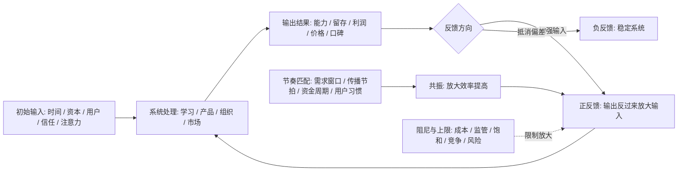
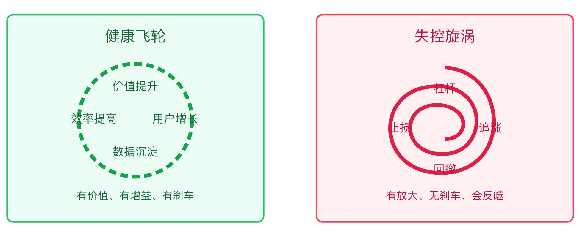

## 物理学思维筑基课: 正反馈共振: 小优势会被循环放大, 小风险也会被循环放大

### 作者
digoal

### 日期
2026-05-19

### 标签
正反馈 , 共振 , 反馈环 , 飞轮效应 , 网络效应 , 复利 , 泡沫风险 , 债务螺旋 , 运营增长 , 投资共振

----

## 背景

> 面向对象: 大学生、产品经理、运营经理、有投资需求的人  
> 核心问题: 为什么有些人、产品、组织和资产一旦起势会越来越强, 而有些问题一旦失控会越滚越大?  
> 先说结论: 正反馈是“结果反过来增强原因”, 共振是“外部驱动与系统固有节奏匹配后放大振幅”。迁移到生活、产品、运营和投资, 它提醒我们: 真正的爆发不是单点努力, 而是反馈环闭合、增益大于损耗、节奏匹配；但同一套机制也会放大泡沫、内耗、债务和风险。

说明: “正反馈”和“共振”来自不同领域。正反馈常见于控制系统、生物系统和复杂系统；共振是振动与波动系统中的物理现象。本文把二者合并成一个跨学科判断框架, 用来理解飞轮、复利、网络效应、舆情扩散和投资泡沫, 不是说社会系统能像弹簧振子一样精确计算。

## 一张图先看懂



这张图先记住一句话: 没有反馈环, 就没有飞轮；没有阻尼和上限意识, 飞轮也可能变成失控旋涡。

## 求真讲法

### 它到底说了什么

正反馈的核心是:

```text
输出的一部分回到输入端, 并让下一轮输出变得更强。
```

例如: 用户越多, 内容越多；内容越多, 新用户越愿意来；新用户越多, 内容又更多。这就是一个正反馈环。

共振的核心是:

```text
外部驱动力的频率接近系统固有频率时, 能量传入效率变高, 振幅明显增大。
```

推秋千就是最简单的例子。你不是一直用最大力气推, 而是在秋千摆到合适位置时轻轻推一下。节奏对了, 小力也能越推越高；节奏错了, 大力也会互相抵消。

把它迁移到生活和投融资中, 可以写成:

```text
系统放大 = 闭合反馈环 × 单轮增益 × 节奏匹配 × 持续时间 - 损耗 - 阻尼 - 饱和
```

这里的“增益”是每一轮反馈后系统变强的程度；“阻尼”是系统中的损耗和刹车；“饱和”是市场、注意力、资金、体力或需求的上限。

### 它是怎么来的

反馈思想来自对系统控制的观察。一个系统的输出会影响下一步输入, 于是系统不再是简单的直线因果, 而是循环因果。

```text
直线因果: A 导致 B
反馈因果: A 导致 B, B 又反过来改变 A
```

负反馈通常让系统稳定。例如体温升高后出汗, 出汗让体温下降；车速高于目标速度后巡航系统减少动力, 车速回落。

正反馈通常让系统远离原状态。例如分娩时宫缩刺激会促使催产素释放, 催产素又增强宫缩, 直到孩子出生这个终止条件出现。社会系统里, 口碑、网络效应、资产价格泡沫、债务螺旋都可能有正反馈结构。

共振则来自振动和波动系统。每个系统都有容易振动的固有节奏。外部输入如果踩在这个节奏上, 能量会一轮轮叠加；如果错开节奏, 输入会被抵消或耗散。

把二者放在一起看, 你会得到一个很强的现实判断:

```text
正反馈回答: 为什么会越滚越大?
共振回答: 为什么在这个时间点突然放大?
```

### 它依赖哪些假设

把正反馈共振迁移到现实判断时, 必须先写清楚假设。

| 假设 | 在原领域中的意思 | 迁移到现实判断时的意思 | 如果不成立 |
|---|---|---|---|
| 存在反馈环 | 输出能回到输入端 | 结果能改变下一轮资源、行为或信念 | 只是一次性效果, 不会自我放大 |
| 反馈方向为正 | 输出增强原刺激 | 增长带来更多增长, 风险带来更多风险 | 可能只是负反馈稳定系统 |
| 单轮增益大于损耗 | 放大超过摩擦和阻尼 | 留存、复购、转介绍、资本回流超过流失 | 飞轮转不起来 |
| 存在节奏匹配 | 驱动频率接近固有频率 | 传播节奏、用户习惯、市场周期、组织节拍匹配 | 大投入也可能低效 |
| 有边界和上限 | 振幅不会无限增长 | 市场规模、注意力、现金流、监管、风险承受力有限 | 会把指数阶段误判为永续增长 |
| 有终止或刹车机制 | 系统能在特定条件下停止放大 | 风控、治理、规则、负反馈能介入 | 正反馈可能变成失控 |

这就是为什么“飞轮”不是画一个循环箭头就成立。飞轮必须有可验证的闭环、增益、节奏和上限。

### 常见误解

**误解一: 正反馈一定是好事。**  
不是。“正”不是价值判断, 只是方向判断。正反馈会放大好结果, 也会放大坏结果。复利是正反馈, 债务滚雪球也是正反馈；口碑传播是正反馈, 谣言扩散也是正反馈。

**误解二: 增长快就是正反馈。**  
不一定。增长快可能来自一次性投放、补贴、政策刺激或低基数。正反馈要求输出能反过来增强下一轮输入。如果活动结束就归零, 不是正反馈, 只是外部能量脉冲。

**误解三: 共振就是大家情绪一致。**  
情绪一致可能形成共振, 但共振的关键是节奏匹配和能量叠加。产品发布、媒体传播、用户需求、资金周期、社群讨论如果在同一时间窗口同向强化, 才更接近现实中的共振。

**误解四: 飞轮一旦形成就不会停。**  
任何飞轮都有摩擦、阻尼和上限。用户会疲劳, 市场会饱和, 监管会介入, 竞争者会模仿, 资金成本会变化。忽略上限, 就会把飞轮误判成永动机。

## 求存讲法

### 它有什么用

正反馈共振在原生领域中, 帮助我们理解系统为什么会放大、振荡、失稳或高效吸收能量。

迁移到生活、产品、运营和投资, 它能帮你看懂三类事情:

1. 为什么一些优势会越积越大。
2. 为什么一些风险会越拖越严重。
3. 为什么同样的投入在某个时间点突然变得特别有效或特别危险。

它的核心问题不是“要不要努力”, 而是:

```text
你的努力有没有进入反馈环?
反馈环每一轮是在增强你, 还是消耗你?
你的节奏是否踩在系统最容易放大的位置上?
```

### 它怎么迁移到熟悉领域

#### 1. 大学生: 能力增长来自反馈环, 不是输入堆积

很多学生学习很久却没有明显进步, 是因为输入没有形成反馈环。

低反馈学习是:

```text
看书 -> 划线 -> 觉得懂了 -> 忘记
```

高反馈学习是:

```text
做题 / 写作 / 项目 -> 暴露错误 -> 得到反馈 -> 修正模型 -> 再输出
```

一旦反馈环闭合, 小优势会被放大。表达清楚的人更容易得到机会, 得到机会后练习更多, 练习更多后表达更强。反过来, 逃避输出的人得不到反馈, 错误模型长期存在, 越学越虚。

共振体现在节奏上: 考试前临时努力, 往往不如平时按遗忘曲线复习；实习前突击包装, 不如项目过程中持续沉淀作品。学习节奏和反馈节奏匹配, 才会放大。

#### 2. 产品经理: 网络效应是正反馈, 但不是所有产品都有网络效应

真正的网络效应是:

```text
用户增加 -> 供给或连接增加 -> 产品价值增加 -> 吸引更多用户
```

但很多产品只是“用户多”, 不代表正反馈成立。比如一个普通工具, 新用户加入并不会让老用户体验更好, 那就没有强网络效应。

产品经理要判断的是:

| 问题 | 有正反馈 | 没有正反馈 |
|---|---|---|
| 新用户是否提高老用户价值 | 更多互动、更多供给、更好匹配 | 只是后台数字增加 |
| 老用户是否降低新用户成本 | 口碑、内容、模板、社群帮助新用户 | 每个新用户都要重新教育 |
| 数据是否反哺体验 | 推荐更准、流程更短、风控更好 | 数据只用于报表 |
| 规模是否降低单位成本 | 履约、采购、算力、内容审核效率提升 | 规模越大越混乱 |

产品共振发生在用户需求窗口、渠道传播节奏、产品核心价值和市场叙事同时匹配时。错过节奏, 好产品也可能增长很慢；节奏对了, 小改动也可能被放大。

#### 3. 运营经理: 活动不是飞轮, 活动后留下循环才是飞轮

运营活动最容易把“热闹”误判为“飞轮”。一次直播、一次补贴、一次裂变, 都可能带来峰值, 但峰值不等于反馈环。

真正的运营飞轮是:

```text
活动触达 -> 用户参与 -> 内容/关系/数据沉淀 -> 下一次触达更准 -> 用户参与更高
```

如果活动后什么都没留下, 下一次还要从零买流量, 那就是线性消耗。如果活动留下用户分层、复购线索、内容资产、社群关系、商家供给和规则经验, 下一轮活动成本下降、转化提高, 这才是正反馈。

运营共振还要求节奏匹配: 用户什么时候有需求, 供给什么时候可用, 内容什么时候传播, 团队什么时候能交付。只在内部排期方便时发起活动, 往往踩不到用户节奏。

#### 4. 投融资: 复利、泡沫和债务螺旋都是反馈系统

投资里最重要的正反馈之一是复利:

```text
本金 -> 收益 -> 更大本金 -> 更大收益
```

但复利成立有前提: 收益能保留并再投资, 回撤可控, 时间足够长, 标的长期创造现金流。

泡沫也是正反馈:

```text
价格上涨 -> 吸引关注 -> 资金流入 -> 价格继续上涨 -> 更多人相信故事
```

债务螺旋也是正反馈:

```text
现金流紧张 -> 借更贵的钱 -> 利息增加 -> 现金流更紧张
```

投资中的共振通常出现在多股力量同向时:

| 共振因素 | 放大方式 |
|---|---|
| 基本面改善 | 盈利预期上调 |
| 流动性宽松 | 估值倍数提升 |
| 叙事扩散 | 更多资金愿意买入 |
| 仓位不足 | 追涨需求增加 |
| 政策支持 | 风险折价下降 |

危险在于: 上涨共振和下跌共振结构很像。上涨时叫戴维斯双击, 下跌时可能是盈利下修、估值收缩、资金撤离同时发生。

### 它的适用范围和边界

正反馈共振框架适合分析复利、网络效应、社群传播、运营飞轮、组织士气、资产泡沫、债务螺旋和风险传染。

但它有边界。

第一, 正反馈不是永动机。任何系统都有损耗和上限。增长越快, 越要检查用户质量、现金流、履约能力、监管风险和边际成本。

第二, 共振不等于可控。共振能提高放大效率, 但也可能带来结构性风险。桥梁、机器、组织和市场都可能因为放大过度而失稳。

第三, 反馈有延迟。延迟会让系统过度反应。产品指标滞后、财报滞后、舆情滞后、风险暴露滞后, 都可能让人以为系统还安全。

第四, 负反馈同样重要。一个长期健康系统通常不是只有正反馈, 还要有负反馈来纠偏: 风控、预算约束、用户投诉、质量门槛、止损机制、治理规则。

### 正例: 怎么用它提升能力

#### 正例一: 学生把作品变成能力飞轮

一个大学生想提升产品能力。低效做法是只看课程和文章。正反馈做法是建立作品飞轮:

```text
观察一个产品 -> 写拆解文章 -> 得到同学和从业者反馈 -> 修改框架 -> 再拆更难产品 -> 形成作品集 -> 获得实习机会 -> 接触真实项目
```

这个飞轮成立, 是因为每一轮输出都会带来下一轮更好的输入: 更好的问题、更真实的反馈、更强的机会。

如果他只收藏资料, 没有公开输出和反馈, 就没有闭环。资料越多, 甚至可能越焦虑。

#### 正例二: 产品经理验证一个飞轮是否真实

某社区产品宣称自己有内容飞轮。产品经理没有只看 DAU, 而是验证闭环:

| 环节 | 可验证指标 |
|---|---|
| 用户发布内容 | 发布率、首发成功率、创作者留存 |
| 内容吸引互动 | 评论率、收藏率、关注转化 |
| 互动激励创作者 | 二次发布率、回复率、创作者回访 |
| 内容吸引新用户 | 分享回流、新用户关注数、搜索进入 |
| 新用户变创作者 | 新用户 7 日发布率 |

如果这些指标一轮轮增强, 飞轮可能成立。若只有首页推荐带来的短期阅读, 但创作者不回访、新用户不转化, 那只是流量分发, 不是正反馈。

#### 正例三: 投资者区分复利飞轮和估值泡沫

一个投资者研究一家公司。股价涨了很多, 但他不急着下结论, 而是拆反馈环:

| 问题 | 复利飞轮信号 | 泡沫信号 |
|---|---|---|
| 增长来源 | 真实需求和复购 | 主要靠叙事和资金流 |
| 利润质量 | 现金流跟上利润 | 应收、库存、资本化膨胀 |
| 再投资回报 | 新投入能产生更高现金流 | 投入越多亏越多 |
| 竞争格局 | 规模提升护城河 | 竞争者大量涌入压低回报 |
| 估值 | 价格仍有安全边际 | 只能靠更高估值接盘 |

如果企业利润、现金流、再投资回报和竞争优势互相增强, 可能是复利飞轮。若价格上涨主要吸引更多资金追逐, 而基本面没有同步增强, 就可能是泡沫正反馈。

### 反例: 前提不成立会怎样

#### 反例一: 把打卡群误判为学习正反馈

一个学生加入学习打卡群, 每天截图学习时长。开始几天很兴奋, 但一个月后能力没有提升。

失败原因是前提“输出能增强下一轮输入”不成立。打卡只反馈了时长, 没反馈错误、理解、表达和迁移。这个系统放大的是表演型努力, 不是能力。

真正的正反馈应当是: 输出题解或文章 -> 暴露错误 -> 得到反馈 -> 修正模型 -> 下一次输出更好。

#### 反例二: 把补贴增长误判为产品飞轮

一个产品靠高额补贴拉来大量用户。团队认为用户规模越大, 产品价值越高。但补贴停止后, 用户迅速流失。

失败原因是前提“单轮增益大于损耗”不成立。补贴带来的是外部输入, 不是用户之间的互相增值。每一轮增长都要烧更多钱, 没有降低获客成本, 没有提高留存, 没有增加自然传播。

这不是飞轮, 是消耗型漏斗。

#### 反例三: 把上涨共振误判为永久趋势

某资产价格上涨, 媒体报道增加, 资金涌入, 价格继续上涨。投资者以为这是长期趋势, 加杠杆买入。

但这个正反馈依赖流动性和信心。一旦价格停止上涨, 媒体热度下降, 杠杆资金开始止损, 反馈方向会反过来:

```text
价格下跌 -> 信心下降 -> 资金流出 -> 被迫卖出 -> 价格继续下跌
```

失败原因是前提“有刹车机制和上限意识”不成立。正反馈可以向上放大, 也可以向下放大。没有风控的共振, 本质是把自己交给系统波动。

## 一个可复用的正反馈共振检查表

遇到任何“飞轮、复利、网络效应、爆发、共振、趋势强化”的说法, 用这张表检查。

| 检查项 | 要问的问题 | 真信号 | 假信号 |
|---|---|---|---|
| 闭环 | 输出是否回到输入端? | 结果改善下一轮资源或行为 | 一次性峰值 |
| 增益 | 每轮是否越转越容易? | 获客成本下降、留存上升、效率提高 | 越增长越烧钱 |
| 节奏 | 外部输入是否踩中系统节奏? | 用户需求、传播、供给和资金同向 | 内部排期自嗨 |
| 阻尼 | 损耗和摩擦有多大? | 成本、流失、投诉可控 | 指标好看但成本失控 |
| 上限 | 市场和注意力是否饱和? | 清楚知道天花板 | 线性外推到无限 |
| 刹车 | 负反馈机制是否存在? | 风控、预算、质量门槛 | 只追求放大 |
| 反向风险 | 反馈是否可能反转? | 定义反转信号 | 只讲正循环 |

再压缩成六句话:

```text
没有闭环, 就没有飞轮。
没有增益, 就只是循环。
没有节奏, 投入会互相抵消。
没有阻尼意识, 放大会变失控。
没有负反馈, 正反馈会伤人。
没有基本面, 上涨共振可能只是泡沫。
```

## 一张 SVG: 飞轮和旋涡只差一个刹车

<svg viewBox="0 0 820 360" xmlns="http://www.w3.org/2000/svg" role="img" aria-label="正反馈飞轮与失控旋涡对比图">
  <rect x="35" y="35" width="340" height="275" rx="8" fill="#ecfdf5" stroke="#22c55e" stroke-width="2"/>
  <text x="205" y="70" text-anchor="middle" font-size="20" font-family="Arial, sans-serif" fill="#166534">健康飞轮</text>
  <circle cx="205" cy="175" r="75" fill="none" stroke="#16a34a" stroke-width="5" stroke-dasharray="10,6"/>
  <text x="205" y="135" text-anchor="middle" font-size="15" font-family="Arial, sans-serif" fill="#166534">价值提升</text>
  <text x="258" y="178" text-anchor="middle" font-size="15" font-family="Arial, sans-serif" fill="#166534">用户增长</text>
  <text x="205" y="222" text-anchor="middle" font-size="15" font-family="Arial, sans-serif" fill="#166534">数据沉淀</text>
  <text x="150" y="178" text-anchor="middle" font-size="15" font-family="Arial, sans-serif" fill="#166534">效率提高</text>
  <text x="205" y="280" text-anchor="middle" font-size="14" font-family="Arial, sans-serif" fill="#166534">有价值、有增益、有刹车</text>

  <rect x="445" y="35" width="340" height="275" rx="8" fill="#fff1f2" stroke="#f43f5e" stroke-width="2"/>
  <text x="615" y="70" text-anchor="middle" font-size="20" font-family="Arial, sans-serif" fill="#be123c">失控旋涡</text>
  <path d="M615 105 C700 110, 705 245, 610 245 C520 245, 520 125, 610 130 C675 135, 670 220, 612 220 C555 220, 555 150, 610 155 C650 160, 647 200, 615 200" fill="none" stroke="#e11d48" stroke-width="5"/>
  <text x="615" y="138" text-anchor="middle" font-size="15" font-family="Arial, sans-serif" fill="#be123c">杠杆</text>
  <text x="675" y="190" text-anchor="middle" font-size="15" font-family="Arial, sans-serif" fill="#be123c">追涨</text>
  <text x="615" y="245" text-anchor="middle" font-size="15" font-family="Arial, sans-serif" fill="#be123c">回撤</text>
  <text x="555" y="190" text-anchor="middle" font-size="15" font-family="Arial, sans-serif" fill="#be123c">止损</text>
  <text x="615" y="280" text-anchor="middle" font-size="14" font-family="Arial, sans-serif" fill="#be123c">有放大、无刹车、会反噬</text>
</svg>
  
  
  

## 思考

1. 你现在投入最多的事, 有没有形成“输出增强下一轮输入”的闭环?
2. 你的学习系统放大的是能力, 还是放大了焦虑和表演型努力?
3. 一个产品说自己有网络效应, 新用户真的让老用户更有价值了吗?
4. 一次运营活动结束后, 留下的是用户资产和数据资产, 还是只留下报表峰值?
5. 你持有的资产上涨, 是现金流和竞争优势在复利, 还是资金和叙事在共振?
6. 如果反馈方向反转, 你的生活、产品、组织或投资组合有没有刹车?

## 最后记住

1. 正反馈不是好坏判断, 而是放大方向: 好事会放大, 坏事也会放大。
2. 共振不是用力最大, 而是节奏最匹配；节奏错了, 大投入也可能低效。
3. 飞轮必须有闭环、增益、节奏和可验证指标, 不是画一个循环箭头。
4. 健康系统需要正反馈推动增长, 也需要负反馈防止失控。
5. 投资中最危险的时刻, 往往是正反馈共振最漂亮、但基本面和刹车机制最薄弱的时候。

## 参考资料

- Encyclopaedia Britannica, [Feedback controls](https://www.britannica.com/technology/automation/Feedback-controls). 用于核对反馈控制系统中输入、过程、输出、感测与控制环节的基本结构。
- Encyclopaedia Britannica, [Feedback in biology](https://www.britannica.com/science/feedback-biology). 用于核对反馈作为系统响应并影响后续活动或产出的基础表述。
- OpenStax, [Anatomy and Physiology 2e: 1.5 Homeostasis](https://openstax.org/books/anatomy-and-physiology-2e/pages/1-5-homeostasis). 用于核对正反馈在分娩等生理过程中的入门示例。
- OpenStax, [University Physics Volume 1: 15.6 Forced Oscillations](https://openstax.org/books/university-physics-volume-1/pages/15-6-forced-oscillations). 用于核对驱动频率接近固有频率时发生共振、振幅增大的物理表述。
- OpenStax, [Physics: 14.4 Sound Interference and Resonance](https://openstax.org/books/physics/pages/14-4-sound-interference-and-resonance). 用于核对声学共振和能量传递效率的基础说明。
  
#### [PostgreSQL 解决方案集合](../201706/20170601_02.md "40cff096e9ed7122c512b35d8561d9c8")
  
  
#### [德哥 / digoal's Github - 公益是一辈子的事.](https://github.com/digoal/blog/blob/master/README.md "22709685feb7cab07d30f30387f0a9ae")
  
  
#### [About 德哥](https://github.com/digoal/blog/blob/master/me/readme.md "a37735981e7704886ffd590565582dd0")
  
  

  
