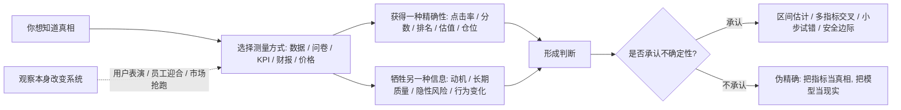
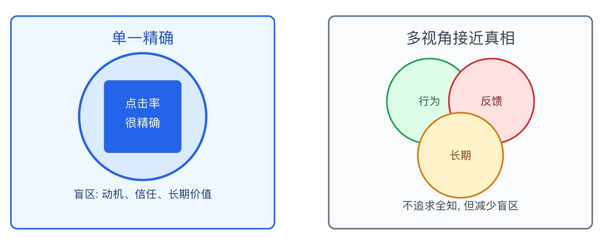

## 物理学思维筑基课: 不确定性原理: 越想把一件事测得绝对精确, 越要问你牺牲了什么

### 作者
digoal

### 日期
2026-05-19

### 标签
不确定性原理 , 海森堡 , 测量边界 , 指标失真 , 观测干扰 , 概率思维 , 安全边际 , KPI管理 , 产品指标 , 投资决策

----

## 背景

> 面向对象: 大学生、产品经理、运营经理、有投资需求的人  
> 核心问题: 为什么很多人越追求“精确答案”, 越容易误判真实世界? 为什么数据、调研、KPI 和估值模型都可能在提高一种确定性的同时, 损失另一种确定性?  
> 先说结论: 海森堡不确定性原理说的是, 在量子系统中, 某些成对物理量不能同时被任意精确地确定, 最典型的是位置和动量。迁移到生活、产品、运营和投资, 它提醒我们: 观察框架会限制你能看见什么, 测量方式会影响被测对象, 指标精确不等于真相精确；高手不是消灭不确定性, 而是知道不确定性在哪里、代价是什么、如何用概率和安全边际行动。

说明: 不确定性原理是量子力学的严格原理, 不是一句“世界很不确定”的鸡汤。本文把它作为跨学科判断框架使用, 重点训练你识别测量边界、代理指标失真、观测干扰、市场拥挤和伪精确。

## 一张图先看懂



这张图先记住一句话: 你拿到的不是“现实本身”, 而是现实被某种测量方式切出来的一部分。

## 求真讲法

### 它到底说了什么

海森堡不确定性原理最常见的版本是位置和动量的不确定性关系:

```text
Δx · Δp >= ℏ / 2
```

其中:

| 符号 | 含义 | 通俗解释 |
|---|---|---|
| Δx | 位置的不确定度 | 你对粒子在哪里的把握范围 |
| Δp | 动量的不确定度 | 你对粒子运动状态的把握范围 |
| ℏ | 约化普朗克常数 | 一个极小的自然常数 |

它说的不是“仪器不够好”, 也不只是“测量会撞到粒子”。更深层的意思是: 在量子力学里, 位置和动量这类共轭变量不能同时拥有任意精确的确定值。你把位置压得越窄, 动量的可能范围就越宽；你把动量压得越准, 位置的可能范围就越宽。

一个直观类比是波。要知道一个波的波长, 你需要观察足够长的一段波；但要把波限制在非常小的位置范围内, 它就必须由很多不同波长叠加而成。位置越局部, 动量成分越分散。

```text
位置很精确:    |x|
动量很分散:    p1 + p2 + p3 + p4 + ...

动量很精确:    ~~~~~~~~单一波长~~~~~~~~
位置很分散:    很难说它只在某一个点
```

### 它是怎么来的

20 世纪初, 物理学家发现微观世界不能完全用经典粒子图像解释。电子、光子等对象既表现出粒子性, 也表现出波动性。

如果电子只像小球, 我们也许可以想象它在某一瞬间有精确位置和精确速度。但量子力学告诉我们, 微观对象更像由波函数描述的状态。波函数可以告诉我们测量结果的概率分布, 但不支持某些物理量同时有任意精确的值。

在数学上, 位置和动量对应的算符不对易:

```text
[x, p] = iℏ
```

不用深究这个式子的技术细节, 只要知道它表达了一个核心事实: 位置和动量不是两张可以同时无限放大的高清照片。它们之间存在结构性张力。

这给现实判断一个重要启发: 很多系统不是“信息还没收集够”, 而是你的测量方式本身会让某些信息变得不可同时获得。你想把一个指标做得极准, 往往会牺牲另一个维度。

### 它依赖哪些假设

把不确定性原理迁移到现实判断时, 必须先写清楚假设。

| 假设 | 在物理中的意思 | 迁移到现实判断时的意思 | 如果不成立 |
|---|---|---|---|
| 研究对象是量子系统 | 原理严格适用于微观量子对象 | 现实迁移只是类比, 不能把社会问题量子化 | 会滑向玄学解释 |
| 变量成对且不兼容 | 位置和动量等共轭变量不能同时任意精确 | 某些目标天然存在权衡, 如短期转化和长期信任 | 会假装没有取舍 |
| 不确定性是结构性的 | 不是单纯仪器误差 | 模型和指标天然只截取现实的一部分 | 会把更精确的数据误认为完整真相 |
| 测量会选择视角 | 选择测什么就会忽略什么 | KPI、问卷、实验设计会决定你看见的世界 | 会被单一指标绑架 |
| 被观察者可能反应 | 量子测量有状态更新；社会系统会学习和回应 | 用户、员工、市场参与者会根据测量改变行为 | 指标一旦成为目标就会失真 |
| 决策需要概率表达 | 量子预测给出概率分布 | 投资、产品和人生判断多是区间和概率, 不是单点确定 | 会制造伪精确 |

所以, 现实中的“不确定性原理”不是说“什么都无法知道”, 而是说: 你必须知道自己用什么方式知道, 以及这种知道牺牲了什么。

### 常见误解

**误解一: 不确定性原理等于观测者主观创造现实。**  
不是。量子力学中的测量问题很复杂, 但不能简单说“人一看, 现实就随心改变”。社会迁移时也一样, 用户和市场会受观测影响, 但不是任由你想象。

**误解二: 不确定性只是仪器不够精密。**  
不是。更好的仪器可以减少普通测量误差, 但不能突破量子力学给出的基本限制。在现实类比中, 更好的数据系统能减少噪音, 但不能让一个指标代表全部真相。

**误解三: 既然不确定, 就不用分析。**  
相反, 不确定性要求更严谨的分析: 区间估计、多情景推演、反证机制、小规模试验、仓位控制。真正危险的是把不确定包装成确定。

**误解四: 数据越精确, 决策越正确。**  
不一定。精确的错误指标比粗糙的正确方向更危险。小数点后两位的转化率, 如果牺牲了长期留存和用户信任, 反而会制造幻觉。

## 求存讲法

### 它有什么用

不确定性原理在物理中的原生作用, 是告诉我们微观世界不是经典世界的缩小版。它限制了某些物理量可同时确定的程度, 也让量子力学以概率方式描述自然。

迁移到生活、产品、运营和投资, 它最有用的地方是帮你抵抗三种幻觉:

1. 精确幻觉: 数字很准, 所以结论一定准。
2. 全知幻觉: 只要数据够多, 就能完全知道未来。
3. 中立幻觉: 我只是观察, 不会改变被观察对象。

现实中的高手会问:

```text
这个指标精确了什么?
它模糊了什么?
被测对象会不会因为被测而改变?
我该用单点答案, 还是用概率区间行动?
```

### 它怎么迁移到熟悉领域

#### 1. 大学生: 选择一种确定性, 就会牺牲另一种确定性

大学生最常见的不确定性, 是想同时要很多东西: 高绩点、实习、竞赛、社交、考研、创业准备、兴趣探索。问题不是这些都不好, 而是时间和注意力有限。

你越追求“每条路都不落下”, 越可能导致每条路都不够深入。

```text
广度更确定 -> 深度更不确定
短期分数更确定 -> 长期能力更不确定
安全路径更确定 -> 上限空间更不确定
```

这不是让你盲目冒险, 而是让你承认取舍。与其问“我能不能全部要”, 不如问“我愿意在哪个维度承受不确定性”。

#### 2. 产品经理: 指标越被盯紧, 越可能偏离真实价值

产品经理常用点击率、转化率、留存、GMV、DAU 等指标判断产品。但指标不是用户价值本身, 只是用户价值的影子。

例如, 如果团队只盯短期转化率, 可能会:

```text
弹窗更强 -> 转化率上升 -> 打扰增加 -> 信任下降 -> 长期留存下降
```

这就是一种现实中的“测量取舍”: 你把短期行为测得很精确, 却可能让长期感受变得不可见。

产品判断应该组合多种视角:

| 你想知道 | 单一指标风险 | 更稳妥的组合 |
|---|---|---|
| 用户是否喜欢 | 只看点击率会被标题党骗 | 点击率 + 完成率 + 留存 + 负反馈 |
| 功能是否有价值 | 只看使用次数会被强制入口骗 | 使用率 + 主动复用 + 任务成功率 |
| 增长是否健康 | 只看新增会忽略质量 | 新增 + 激活 + 留存 + 获客成本 |
| 商业化是否成立 | 只看收入会忽略伤害 | 收入 + 退款 + 投诉 + 长期复购 |

#### 3. 运营经理: KPI 会改变人的行为

运营管理中, 一旦一个指标成为考核目标, 人就会围绕指标优化。这个现象和 Goodhart 定律、Campbell 定律相邻: 指标越被高强度用于控制, 越容易被操纵或扭曲。

例如, 如果客服只考核“平均响应时间”, 可能出现:

```text
快速回复模板 -> 响应时间下降 -> 问题解决率没提高 -> 用户更不满
```

如果内容运营只考核“发布数量”, 可能出现:

```text
内容数量上升 -> 质量下降 -> 用户疲劳 -> 账号权重下降
```

运营经理要做的不是放弃指标, 而是承认指标会改变行为, 所以要设计指标组、抽样质检、反作弊、用户反馈和长期指标。

#### 4. 投融资: 市场一旦观察到机会, 机会本身会改变

投资里最危险的伪精确, 是把估值模型的输出当成确定答案。一个 DCF 模型可以给出 23.47 元的目标价, 但这个数字依赖增长率、利润率、折现率、竞争格局、管理层质量和宏观环境。变量稍微改变, 结果就会大幅变化。

不确定性原理给投资者的启发有三层。

第一, 不能同时追求“精确买在最低点”和“确认基本面完全反转”。等所有人都确认, 价格往往已经反映。

第二, 一个机会被越来越多人观察和买入后, 它的预期收益会下降。公开套利会被抢跑, 冷门资产会因拥挤交易变贵。

第三, 你参与市场本身也会改变市场。大资金买入会推高价格, 卖出会冲击流动性；小资金虽然影响小, 但同样会受到市场反馈影响。

所以, 投资不是寻找绝对确定, 而是在不确定中构建有利赔率:

```text
合理区间 + 安全边际 + 仓位控制 + 情景推演 + 反证机制
```

### 它的适用范围和边界

不确定性框架适合分析数据指标、用户调研、KPI 管理、市场预期、估值模型、投资决策和人生选择。

但它有边界。

第一, 不要把量子概念滥用到宏观世界。人的选择、公司经营、市场价格不是电子位置和动量。这里的迁移是思维模型, 不是物理定律的直接套用。

第二, 不确定不等于不可知。很多事情可以通过更好数据、更长样本、更合理实验和更开放反馈来提高判断质量。承认不确定, 不是放弃求真。

第三, 不确定不等于平均下注。面对不确定, 你仍然可以根据赔率、能力圈和风险承受力做不对称选择。

第四, 观测影响系统不等于所有指标都没用。指标仍然必要, 但要知道它是工具, 不是目的。

### 正例: 怎么用它提升能力

#### 正例一: 学生用“选择账本”管理不确定性

一个大学生同时想考研、找产品实习、参加比赛、学编程。过去他每天换目标, 看起来很努力, 实际每条线都不深。

他后来用不确定性框架做选择:

| 选择 | 获得的确定性 | 放弃或承受的不确定性 |
|---|---|---|
| 主攻产品实习 | 作品集、面试能力、行业理解更确定 | 考研结果不再作为主目标 |
| 每周固定写产品拆解 | 输出能力更确定 | 短期娱乐和广泛社交减少 |
| 学基础 SQL 和数据分析 | 产品岗位竞争力更确定 | 更深算法能力暂时不追求 |

这个正例成立的关键是: 他没有消灭不确定性, 而是主动选择把不确定性放在哪里。

#### 正例二: 产品经理用多视角指标避免伪精确

某产品上线新付费弹窗, 首日付费转化率提升 18%。团队本来想全量上线。产品经理没有只看转化率, 而是加入四个反向观察:

1. 弹窗关闭率。
2. 次日留存。
3. 用户投诉。
4. 7 日续费和退款。

结果发现, 转化率提高, 但投诉和退款也明显上升。结论变成: 弹窗不是提升了价值, 而是提高了压力。

这个例子说明, 单一指标的精确可能掩盖系统真实状态。多指标不是为了复杂, 而是为了减少测量视角带来的盲区。

#### 正例三: 投资者用区间和仓位替代单点预测

一个投资者研究一家公司, 不再给自己一个“精确目标价”, 而是建立三种情景:

| 情景 | 核心假设 | 估值区间 | 动作 |
|---|---|---|---|
| 乐观 | 增长维持、利润率改善 | 高区间 | 不按乐观情景满仓 |
| 中性 | 增长放缓、利润率稳定 | 中区间 | 作为主要判断 |
| 悲观 | 竞争加剧、估值下修 | 低区间 | 预设止损和减仓条件 |

他承认自己无法精确知道未来, 所以用安全边际和仓位控制管理不确定性。这样即使判断错, 也不会因为伪确定而承受不可恢复损失。

### 反例: 前提不成立会怎样

#### 反例一: 把问卷结果当真实需求

一个产品团队问用户“你是否需要 AI 总结功能”, 大量用户回答“需要”。团队投入研发, 上线后使用率很低。

失败原因是前提“测量不会改变表达”不成立。问卷测到的是用户在被询问时的态度, 不是在真实场景下愿意付出时间、注意力或金钱的行为。更好的做法是观察真实任务、原型试用和留存。

#### 反例二: 把 KPI 精确完成当组织真实健康

一个运营团队所有人都完成了发布数量、触达次数、活动场次 KPI。月报很好看, 但用户留存下降, 投诉增加, 团队疲惫。

失败原因是前提“指标代表目标”不成立。指标成为目标后, 人会优化指标本身。组织看似精确管理, 实际把真实价值挤出了视野。

#### 反例三: 把模型目标价当投资确定性

一个投资者用模型算出某公司合理价格是 50 元, 当前 38 元, 于是重仓买入。之后行业需求下滑、折现率上升、公司利润率下降, 模型价值快速下修。

失败原因是前提“模型变量稳定且可精确预测”不成立。目标价看起来精确, 但输入变量高度不确定。把模型输出当真相, 就会用精确数字掩盖真实风险。

## 一个可复用的不确定性检查表

看到任何“数据证明了”“模型算出来”“用户说了”“市场一定会”的说法, 用这张表检查。

| 检查项 | 要问的问题 | 好信号 | 危险信号 |
|---|---|---|---|
| 测量对象 | 指标测的到底是什么? | 能说明指标和目标的关系 | 把指标直接当目标 |
| 被牺牲信息 | 精确一个维度时, 哪个维度变模糊? | 主动列出盲区 | 只展示单一好指标 |
| 观测干扰 | 被测对象会不会因测量改变行为? | 有反作弊和质检 | KPI 一考核就异常变好 |
| 样本边界 | 数据来自什么人、什么场景、什么时间? | 样本和目标场景一致 | 用小样本推全局 |
| 模型敏感性 | 关键假设变一点, 结论变多少? | 做敏感性分析 | 只给单点目标价 |
| 行动方式 | 如何在不确定中行动? | 小步试错、仓位控制、安全边际 | 一把梭、满仓确定性 |
| 反证机制 | 什么现象说明我错了? | 预设反证信号 | 只找支持证据 |

再压缩成六句话:

```text
指标不是现实, 只是切片。
精确一种信息, 常会模糊另一种信息。
被观察的人和市场会反应。
模型输出越精确, 越要检查输入假设。
不确定不是不行动, 而是用概率、区间和安全边际行动。
真正危险的不是不确定, 而是假装确定。
```

## 一张 SVG: 精确指标与完整真相的取舍

<svg viewBox="0 0 820 360" xmlns="http://www.w3.org/2000/svg" role="img" aria-label="精确指标与完整真相的取舍示意图">
  <rect x="35" y="35" width="340" height="275" rx="8" fill="#eef6ff" stroke="#2563eb" stroke-width="2"/>
  <text x="205" y="70" text-anchor="middle" font-size="20" font-family="Arial, sans-serif" fill="#1d4ed8">单一精确</text>
  <circle cx="205" cy="165" r="82" fill="#dbeafe" stroke="#2563eb" stroke-width="3"/>
  <rect x="155" y="118" width="100" height="94" rx="6" fill="#2563eb"/>
  <text x="205" y="153" text-anchor="middle" font-size="15" font-family="Arial, sans-serif" fill="#ffffff">点击率</text>
  <text x="205" y="178" text-anchor="middle" font-size="15" font-family="Arial, sans-serif" fill="#ffffff">很精确</text>
  <text x="205" y="270" text-anchor="middle" font-size="14" font-family="Arial, sans-serif" fill="#1e3a8a">盲区: 动机、信任、长期价值</text>

  <rect x="445" y="35" width="340" height="275" rx="8" fill="#f8fafc" stroke="#64748b" stroke-width="2"/>
  <text x="615" y="70" text-anchor="middle" font-size="20" font-family="Arial, sans-serif" fill="#334155">多视角接近真相</text>
  <circle cx="575" cy="145" r="55" fill="#dcfce7" stroke="#16a34a" stroke-width="2"/>
  <circle cx="655" cy="145" r="55" fill="#fee2e2" stroke="#dc2626" stroke-width="2"/>
  <circle cx="615" cy="215" r="55" fill="#fef3c7" stroke="#d97706" stroke-width="2"/>
  <text x="575" y="150" text-anchor="middle" font-size="14" font-family="Arial, sans-serif" fill="#166534">行为</text>
  <text x="655" y="150" text-anchor="middle" font-size="14" font-family="Arial, sans-serif" fill="#991b1b">反馈</text>
  <text x="615" y="220" text-anchor="middle" font-size="14" font-family="Arial, sans-serif" fill="#92400e">长期</text>
  <text x="615" y="285" text-anchor="middle" font-size="14" font-family="Arial, sans-serif" fill="#334155">不追求全知, 但减少盲区</text>
</svg>
  
  
  

## 思考

1. 你现在最相信的一个指标, 它精确了什么, 又遮住了什么?
2. 一个用户在访谈里说“我会用”, 和他在真实场景里持续使用, 中间隔着哪些不确定性?
3. 你的团队有没有把指标当目标, 导致真实价值被牺牲?
4. 你做投资决策时, 是在用区间和情景, 还是把模型单点结果当真相?
5. 一个机会被越来越多人看到后, 它的预期收益是否已经被观察和交易行为改变?
6. 你能否为自己最重要的判断写出“我可能错在哪里”?

## 最后记住

1. 不确定性原理不是“世界不可知”, 而是提醒你: 有些信息不能同时任意精确获得。
2. 数据、问卷、KPI、模型都是观察方式, 不是现实本身。
3. 被观察的人、组织和市场会根据观察方式改变行为。
4. 精确数字如果没有边界、假设和反证机制, 只是伪精确。
5. 面对生活和投资的不确定性, 最可靠的动作是区间估计、多视角验证、小步试错、安全边际和仓位控制。

## 参考资料

- OpenStax, [University Physics Volume 3: 7.2 The Heisenberg Uncertainty Principle](https://openstax.org/books/university-physics-volume-3/pages/7-2-the-heisenberg-uncertainty-principle). 用于核对位置-动量不确定性关系和量子波包解释。
- OpenStax, [College Physics 2e: 29.7 Probability: The Heisenberg Uncertainty Principle](https://openstax.org/books/college-physics-2e/pages/29-7-probability-the-heisenberg-uncertainty-principle). 用于核对入门层面的概率和波动性说明。
- Encyclopaedia Britannica, [Uncertainty principle](https://www.britannica.com/science/uncertainty-principle). 用于核对海森堡 1927 年提出、不确定性在原子尺度显著等基础表述。
- Stanford Encyclopedia of Philosophy, [The Uncertainty Principle](https://plato.stanford.edu/entries/qt-uncertainty/). 用于核对不确定性原理的哲学争议、解释边界和历史语境。
- Goodhart, C. A. E., [Problems of monetary management: the U.K. experience](https://www.econbiz.de/Record/problems-of-monetary-management-the-u-k-experience-goodhart-charles/10002525062). 用于延伸理解“指标被用于控制后会失真”的相邻社会科学问题。
- Campbell, D. T., [Assessing the Impact of Planned Social Change](https://jmde.com/index.php/jmde_1/article/view/297/294). 用于延伸理解高风险社会指标被用于决策时可能产生腐化压力和行为扭曲。
  
#### [PostgreSQL 解决方案集合](../201706/20170601_02.md "40cff096e9ed7122c512b35d8561d9c8")
  
  
#### [德哥 / digoal's Github - 公益是一辈子的事.](https://github.com/digoal/blog/blob/master/README.md "22709685feb7cab07d30f30387f0a9ae")
  
  
#### [About 德哥](https://github.com/digoal/blog/blob/master/me/readme.md "a37735981e7704886ffd590565582dd0")
  
  

  
