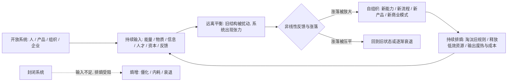
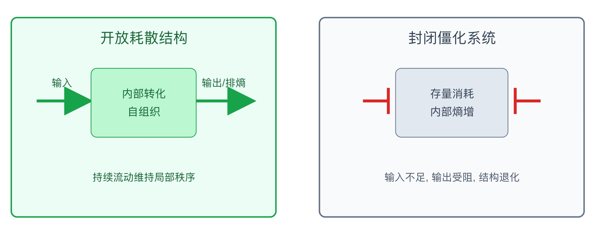

## 物理学思维筑基课: 耗散结构: 高级秩序不是封闭保存出来的, 而是开放流动中长出来的

### 作者
digoal

### 日期
2026-05-19

### 标签
耗散结构 , 非平衡热力学 , 开放系统 , 自组织 , 输入转化 , 排熵 , 组织创新 , 产品进化 , 企业生命力 , 投资判断

----

## 背景

> 面向对象: 大学生、产品经理、运营经理、有投资需求的人  
> 核心问题: 为什么个人、产品、组织和企业想长期保持生命力, 不能只靠“稳定”, 而要持续吸收外部能量、信息、人才、资本和反馈?  
> 先说结论: 耗散结构说的是, 远离平衡态的开放系统, 在持续与外界交换能量和物质时, 可能通过非线性反馈和涨落放大形成新的有序结构。迁移到生活、产品、运营和投资, 它提醒我们: 真正有生命力的系统不是封闭静止的, 而是能持续输入、转化、排熵、迭代, 并在扰动中自我重组。

说明: “耗散结构”是非平衡热力学中的概念, 由普里高津等人发展, 不能简单等同于“开放心态”或“多学习”。本文把它作为跨学科判断框架使用, 用来理解个人成长、产品进化、组织创新、城市和企业生命力。

## 一张图先看懂



这张图先记住一句话: 封闭系统追求不变, 开放系统通过持续流动维持高级秩序。

## 求真讲法

### 它到底说了什么

耗散结构可以通俗理解为:

```text
一个开放系统, 持续消耗外部能量和物质, 并把熵排到环境中, 从而在局部形成并维持有序结构。
```

典型例子包括贝纳德对流、化学振荡反应、生命体、生态系统等。一个生命体看起来很有序, 但它不是靠封闭保存秩序, 而是靠持续吃饭、呼吸、代谢、排泄、散热来维持。

耗散结构的关键不是“有序”, 而是“通过耗散维持有序”。它不是静态结构, 而是动态结构。

```text
输入流 -> 内部转化 -> 有序结构 -> 输出流 / 排熵
```

如果输入停止, 输出受阻, 或内部转化能力崩溃, 这个结构就会退化。

### 它是怎么来的

传统热力学最早研究的是接近平衡态的系统。平衡态听起来很稳定, 但从结构角度看, 它往往意味着差异消失、流动停止、可用能耗尽。

普里高津的重要贡献, 是把研究推进到“远离平衡态”的开放系统。他发现, 某些系统在持续能量和物质流中, 不但不会简单走向均匀混乱, 反而可能形成新的空间、时间或功能秩序。

一个常见直观例子是贝纳德对流。把一层液体从下面加热, 温差不大时, 热量主要通过传导散开；当温差超过某个阈值, 液体会形成有规则的对流胞。看起来像“混乱中出现秩序”, 但这个秩序依赖持续加热和散热。

```text
小温差: 热传导, 没有宏观结构
温差超过阈值: 对流胞出现, 形成有序流动
停止输入: 对流消失, 结构瓦解
```

这说明一个反直觉事实: 远离平衡不一定只带来混乱, 在合适条件下也可能带来自组织。

### 它依赖哪些假设

把耗散结构迁移到现实判断时, 必须先写清楚假设。

| 假设 | 在非平衡热力学中的意思 | 迁移到现实判断时的意思 | 如果不成立 |
|---|---|---|---|
| 系统开放 | 与外界交换能量、物质或信息 | 个人、产品、组织能吸收外部反馈、资源和人才 | 封闭后只能消耗存量, 逐渐僵化 |
| 远离平衡 | 系统存在梯度、差异和流动 | 有新需求、新竞争、新技术、新约束带来张力 | 太舒适会失去重组动力 |
| 持续输入 | 外界流入维持结构 | 学习、研发、用户反馈、资本、现金流不断补充 | 输入中断后结构难以维持 |
| 非线性反馈 | 小涨落可能被放大 | 小实验、小团队、小产品方向可能成长为新结构 | 组织若压制涨落, 创新难出现 |
| 能排熵 | 系统能把废热、低效、错误和成本排出 | 能淘汰旧流程、旧功能、错误认知和低效资产 | 只进不出会臃肿和内耗 |
| 存在边界 | 系统与环境可区分, 但有交换 | 既要开放, 又要有战略边界和筛选机制 | 无边界开放会被噪音淹没 |

所以, 耗散结构不是简单说“越开放越好”。它要求开放、筛选、转化、排熵和边界同时存在。

### 常见误解

**误解一: 耗散结构违反熵增定律。**  
不违反。局部系统可以变得更有序, 但它通过消耗能量并向环境排熵实现。把系统和环境一起看, 总熵仍然增加。

**误解二: 开放就一定进步。**  
不是。开放只是必要条件之一。输入如果是低质量信息、错误激励、劣质流量和短期资金, 反而会让系统更混乱。开放之后还要有筛选和转化能力。

**误解三: 平衡就是好状态。**  
在很多社会系统中, 完全平衡可能意味着没有差异、没有流动、没有创新。企业如果只追求稳定, 可能逐渐变成低能量、低反馈、低适应性的系统。

**误解四: 自组织等于不用管理。**  
自组织不是无组织。它需要边界、规则、反馈、资源流和淘汰机制。没有管理的开放系统, 往往不是自组织, 而是噪音堆积。

## 求存讲法

### 它有什么用

耗散结构的原生价值, 是解释为什么某些开放的非平衡系统会出现秩序、模式和复杂性。它把“熵增导致混乱”这件事补完整: 孤立系统趋向熵增, 但开放系统可以通过持续输入和排熵形成局部秩序。

迁移到生活、产品、运营和投资, 它能帮你判断一个系统有没有生命力:

| 表面问题 | 耗散结构式追问 |
|---|---|
| 个人成长停滞 | 有没有持续高质量输入和输出反馈? |
| 产品越来越重 | 是否只加功能, 不删除低效结构? |
| 组织开始官僚化 | 能否吸收一线信息, 淘汰旧流程? |
| 企业利润稳定 | 是健康现金流, 还是停止投入后的静态稳定? |
| 投资组合看似安全 | 是否暴露在同一环境里, 缺少新信息和排错机制? |

耗散结构让你不只看“当前是否有序”, 还看“这个有序靠什么流动维持”。

### 它怎么迁移到熟悉领域

#### 1. 大学生: 能力系统要持续输入, 也要持续排熵

一个学生想成长, 不能只靠收藏资料。收藏资料只是输入, 不是耗散结构。真正的能力系统要有完整流动:

```text
高质量输入 -> 主动加工 -> 输出作品 -> 外部反馈 -> 修正模型 -> 淘汰旧理解
```

如果只输入不输出, 知识会堆成信息垃圾。如果只输出不反馈, 错误会固化。如果只吸收赞美不接受批评, 系统会变得封闭。

个人成长中的“排熵”包括:

| 要排掉的东西 | 为什么要排 |
|---|---|
| 低质量信息源 | 占用注意力, 降低判断力 |
| 过期方法 | 过去有效不代表现在有效 |
| 错误自我叙事 | “我不适合”或“我已经懂了”都会阻断学习 |
| 无效社交 | 消耗能量但不带来反馈 |
| 过度目标 | 同时追太多, 系统无法形成结构 |

#### 2. 产品经理: 好产品是开放系统, 不是需求仓库

产品不是把需求越堆越多就会进化。产品要像耗散结构一样, 持续吸收外部信号, 经过内部转化, 再把低价值功能和错误假设排出去。

```text
用户反馈 / 行为数据 / 竞品变化 / 技术能力
        -> 产品判断
        -> 原型和实验
        -> 上线验证
        -> 删除、合并、重构、强化
```

产品系统健康的标志不是功能多, 而是:

1. 外部需求能进入决策系统。
2. 决策系统能区分信号和噪音。
3. 小实验能被快速验证。
4. 错误功能能被删除。
5. 成功结构能被放大。

如果一个产品只进不出, 所有需求都被加进去, 它最终不是开放, 而是被外界噪音吞噬。

#### 3. 运营经理: 组织生命力来自信息流和资源流

组织的高效不是把所有流程固定死, 而是让信息、资源、责任和反馈形成流动。

一个健康运营组织通常有这些耗散结构特征:

| 结构特征 | 现实表现 |
|---|---|
| 输入 | 一线反馈、用户声音、业务数据、外部趋势进入系统 |
| 转化 | 团队能把信号变成策略、规则和动作 |
| 输出 | 活动、内容、供给、服务被交付给用户 |
| 排熵 | 无效会议、过期 SOP、低效渠道被清理 |
| 自组织 | 小团队在清晰边界内自主试错 |

组织最危险的状态不是忙, 而是所有人都在忙着维持旧结构。旧流程不能被删除, 错误指标不能被质疑, 一线信息不能上行, 这就是排熵失败。

#### 4. 投融资: 好公司是高质量耗散结构

从投资角度看, 一家公司不是静态资产表, 而是一个能否持续吸收资源、转化资源、排除低效、形成新秩序的系统。

高质量公司通常有这样的流动:

```text
客户需求 -> 产品能力 -> 收入现金流 -> 研发和组织投入 -> 更强产品 -> 更高客户价值
```

低质量公司则可能是:

```text
融资输入 -> 补贴增长 -> 低质量用户 -> 亏损扩大 -> 更依赖融资
```

投资者要问的不是“公司现在看起来稳不稳”, 而是:

| 投资问题 | 耗散结构式判断 |
|---|---|
| 研发投入是否有效 | 是否转化成产品、专利、效率、客户价值 |
| 组织是否有活力 | 是否能吸引人才、淘汰低效、响应变化 |
| 现金流是否健康 | 是否支持持续输入, 而不是靠外部输血 |
| 护城河是否维持 | 是否持续投入, 还是吃老本 |
| 管理层是否开放 | 是否承认错误并调整资本配置 |

耗散结构强的公司, 能在变化环境中重组自己；耗散结构弱的公司, 表面稳定, 实际只是在消耗过去积累。

### 它的适用范围和边界

耗散结构框架适合分析生命系统、学习系统、产品系统、组织系统、城市、企业和生态型商业模式。

但它有边界。

第一, 它不是投资买卖公式。说一家公司像耗散结构, 不等于它一定值得买。价格、估值、现金流、竞争、治理和风险仍然必须分析。

第二, 远离平衡不是越乱越好。适度张力能激发重组, 过度冲击会让系统崩溃。个人过度焦虑、组织过度变革、企业过度扩张, 都可能超过承载力。

第三, 开放不是无边界。系统要能筛选输入, 否则会被噪音、短期诱惑和错误激励污染。

第四, 排熵不是简单裁员或砍项目。真正的排熵是清除低效结构和错误假设, 同时保留系统的核心能力和信任。

### 正例: 怎么用它提升能力

#### 正例一: 学生把自己变成开放学习系统

一个大学生想进入产品经理方向。旧做法是看很多课程, 收藏很多文章, 但没有作品。耗散结构式做法是建立学习流:

| 流程 | 动作 |
|---|---|
| 输入 | 每周研究 2 个真实产品和 1 篇行业报告 |
| 转化 | 写成产品拆解, 提炼用户、场景、指标和商业逻辑 |
| 输出 | 发布文章或做成作品集 |
| 反馈 | 找同学、老师、从业者批改 |
| 排熵 | 删除无效模板, 修正错误框架, 放弃低质量信息源 |

三个月后, 他得到的不只是知识, 而是一个能持续吸收、输出、修正的系统。这个系统比单次努力更重要。

#### 正例二: 产品经理让产品在反馈流中进化

某 B 端产品功能越来越多, 用户仍然觉得难用。团队没有继续堆需求, 而是建立产品耗散机制:

1. 每月统计低使用率功能。
2. 每两周访谈真实使用者。
3. 对高投诉流程做端到端复盘。
4. 给每个新功能设定删除条件。
5. 把成功实验沉淀成主流程。

半年后, 功能数减少, 关键任务完成率上升。原因不是团队做得更多, 而是系统开始能排熵: 低效功能被删除, 错误假设被淘汰, 外部反馈进入了产品结构。

#### 正例三: 投资者识别企业是否有自我更新能力

一个投资者研究两家公司。A 公司利润率高, 但研发下降、人才流失、管理层回避新渠道；B 公司当前利润率较低, 但现金流健康, 新产品试错快, 客户反馈能进入研发, 低效业务会及时收缩。

耗散结构视角不会简单说 B 一定好, 但会提出关键问题:

```text
A 的高利润是持续能力, 还是吃老本?
B 的投入是有效转化, 还是盲目烧钱?
```

如果 B 的投入能形成客户价值和现金流回路, 它可能是更有生命力的开放系统。如果 A 的稳定来自停止输入和拒绝排熵, 它的低熵结构可能正在老化。

### 反例: 前提不成立会怎样

#### 反例一: 把信息摄入误判为开放

一个学生每天刷行业新闻、看播客、收藏报告, 以为自己很开放。但他不写、不做、不复盘、不接受批评。

失败原因是前提“输入能被转化”不成立。输入没有进入加工和反馈系统, 只会变成信息噪音。开放不是把门打开让所有东西进来, 而是有选择地吸收并转化。

#### 反例二: 把组织扩张误判为生命力

一个公司融资后快速招人、开新业务、上新项目。表面看很有活力, 但内部没有清晰战略边界, 旧项目不关闭, 低效流程不清理, 资源争夺越来越严重。

失败原因是前提“能排熵”不成立。系统只输入资源, 不淘汰低效结构, 最终会臃肿、内耗、现金流紧张。耗散结构需要输入, 也需要输出和排熵。

#### 反例三: 把外部输血误判为自组织

某企业靠持续融资和补贴维持增长。用户质量不高, 单位经济模型不成立, 管理层把融资规模当成组织能力。

失败原因是前提“内部转化能力存在”不成立。外部输入如果不能转化为真实产品价值、客户留存和健康现金流, 系统不是耗散结构, 而是依赖输血的消耗结构。一旦外部资金流中断, 秩序会迅速退化。

## 一个可复用的耗散结构检查表

看到任何“成长、转型、生态、创新、护城河、生命力”的说法, 用这张表检查。

| 检查项 | 要问的问题 | 健康信号 | 危险信号 |
|---|---|---|---|
| 开放性 | 外部能量、信息、人才、资本能否进入? | 持续吸收高质量输入 | 封闭自嗨或低质输入泛滥 |
| 转化力 | 输入能否变成能力、产品或现金流? | 投入后有可验证产出 | 只投入, 不产出 |
| 排熵力 | 低效结构能否被清理? | 删除旧功能、淘汰旧流程、承认错误 | 只加不减 |
| 非线性反馈 | 小实验能否被放大? | 好方法能扩散, 小团队能成长 | 所有涨落被流程压平 |
| 边界 | 系统是否有筛选机制? | 知道什么不做 | 什么机会都追 |
| 承载力 | 输入和变化是否超过系统消化能力? | 节奏可持续 | 过度扩张、团队透支 |
| 现金流 | 维持结构的能量从哪里来? | 自我造血逐步增强 | 长期依赖输血 |

再压缩成六句话:

```text
封闭会僵化, 但无边界开放会混乱。
输入不是成长, 转化才是成长。
只进不出会臃肿, 排熵才有生命力。
远离平衡能产生创新, 也可能导致崩溃。
开放系统的秩序, 靠持续流动维持。
看企业别只看存量资产, 要看它能否持续自我更新。
```

## 一张 SVG: 开放流动和封闭僵化

<svg viewBox="0 0 860 360" xmlns="http://www.w3.org/2000/svg" role="img" aria-label="耗散结构中开放流动与封闭僵化对比图">
  <rect x="35" y="35" width="365" height="275" rx="8" fill="#ecfdf5" stroke="#16a34a" stroke-width="2"/>
  <text x="218" y="70" text-anchor="middle" font-size="20" font-family="Arial, sans-serif" fill="#166534">开放耗散结构</text>
  <path d="M70 150 L140 150" stroke="#16a34a" stroke-width="4" marker-end="url(#arrowGreen)"/>
  <rect x="145" y="105" width="145" height="95" rx="8" fill="#bbf7d0" stroke="#16a34a"/>
  <text x="218" y="145" text-anchor="middle" font-size="15" font-family="Arial, sans-serif" fill="#166534">内部转化</text>
  <text x="218" y="170" text-anchor="middle" font-size="15" font-family="Arial, sans-serif" fill="#166534">自组织</text>
  <path d="M290 150 L365 150" stroke="#16a34a" stroke-width="4" marker-end="url(#arrowGreen)"/>
  <text x="105" y="130" text-anchor="middle" font-size="14" font-family="Arial, sans-serif" fill="#166534">输入</text>
  <text x="328" y="130" text-anchor="middle" font-size="14" font-family="Arial, sans-serif" fill="#166534">输出/排熵</text>
  <text x="218" y="260" text-anchor="middle" font-size="14" font-family="Arial, sans-serif" fill="#166534">持续流动维持局部秩序</text>

  <rect x="460" y="35" width="365" height="275" rx="8" fill="#f8fafc" stroke="#64748b" stroke-width="2"/>
  <text x="643" y="70" text-anchor="middle" font-size="20" font-family="Arial, sans-serif" fill="#334155">封闭僵化系统</text>
  <rect x="565" y="105" width="155" height="95" rx="8" fill="#e2e8f0" stroke="#64748b"/>
  <text x="643" y="145" text-anchor="middle" font-size="15" font-family="Arial, sans-serif" fill="#334155">存量消耗</text>
  <text x="643" y="170" text-anchor="middle" font-size="15" font-family="Arial, sans-serif" fill="#334155">内部熵增</text>
  <line x1="520" y1="150" x2="555" y2="150" stroke="#dc2626" stroke-width="4"/>
  <line x1="555" y1="132" x2="555" y2="168" stroke="#dc2626" stroke-width="4"/>
  <line x1="730" y1="150" x2="765" y2="150" stroke="#dc2626" stroke-width="4"/>
  <line x1="730" y1="132" x2="730" y2="168" stroke="#dc2626" stroke-width="4"/>
  <text x="643" y="260" text-anchor="middle" font-size="14" font-family="Arial, sans-serif" fill="#475569">输入不足, 输出受阻, 结构退化</text>

  <defs>
    <marker id="arrowGreen" markerWidth="10" markerHeight="10" refX="8" refY="5" orient="auto">
      <path d="M0,0 L10,5 L0,10 Z" fill="#16a34a"/>
    </marker>
  </defs>
</svg>
  
  
  

## 思考

1. 你现在的学习系统是开放流动, 还是只是在囤积资料?
2. 一个产品不断加功能, 但不能删除旧功能, 它还能算健康开放系统吗?
3. 一个组织最该排掉的熵是什么: 无效会议、错误指标、旧流程, 还是不敢说真话的文化?
4. 一家公司当前利润很好, 但停止研发、停止吸引人才、停止听用户声音, 它的秩序还能维持多久?
5. 投资时你看到的是企业的存量资产, 还是它持续吸收资源并自我更新的能力?
6. 你自己的生活中, 哪些“稳定”其实是低能量平衡, 哪些“不稳定”反而可能是成长前的重组?

## 最后记住

1. 耗散结构不是违反熵增, 而是在开放系统中通过输入和排熵维持局部有序。
2. 生命力来自流动: 输入、转化、输出、反馈、排熵缺一不可。
3. 开放不是无边界, 高质量筛选比盲目吸收更重要。
4. 远离平衡能带来自组织, 也可能带来崩溃, 所以要看系统承载力。
5. 判断个人、产品、组织和企业, 不只看它现在多有序, 还要看它靠什么持续更新。

## 参考资料

- Nobel Prize, [The Nobel Prize in Chemistry 1977](https://www.nobelprize.org/prizes/chemistry/1977/summary/). 用于核对普里高津因非平衡热力学和耗散结构理论获得 1977 年诺贝尔化学奖。
- Nobel Prize, [Press release: The 1977 Nobel Prize in Chemistry](https://www.nobelprize.org/prizes/chemistry/1977/press-release/). 用于核对远离平衡系统中秩序可被维持或形成、贝纳德不稳定性等表述。
- Nobel Prize, Ilya Prigogine, [Time, Structure and Fluctuations](https://www.nobelprize.org/uploads/2018/06/prigogine-lecture.pdf). 用于核对普里高津关于时间、结构、涨落和远离平衡系统的原始演讲。
- Encyclopaedia Britannica, [Ilya Prigogine](https://www.britannica.com/biography/Ilya-Prigogine). 用于核对普里高津关于开放系统、外部能量和物质输入、非线性系统自组织的概述。
- Frontiers in Sustainable Cities, [Cities, Sustainability, and Complex Dissipative Systems](https://www.frontiersin.org/journals/sustainable-cities/articles/10.3389/frsc.2020.523491/full). 用于延伸理解城市等复杂开放系统如何通过与环境交换维持非平衡有序。
  
#### [PostgreSQL 解决方案集合](../201706/20170601_02.md "40cff096e9ed7122c512b35d8561d9c8")
  
  
#### [德哥 / digoal's Github - 公益是一辈子的事.](https://github.com/digoal/blog/blob/master/README.md "22709685feb7cab07d30f30387f0a9ae")
  
  
#### [About 德哥](https://github.com/digoal/blog/blob/master/me/readme.md "a37735981e7704886ffd590565582dd0")
  
  

  
