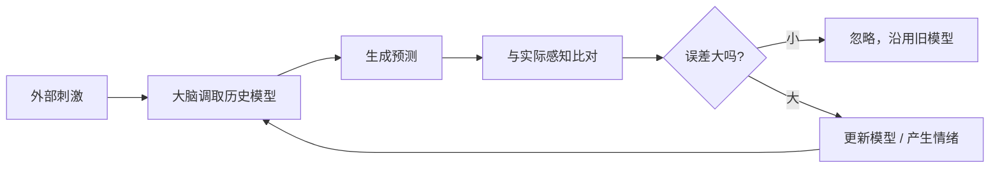
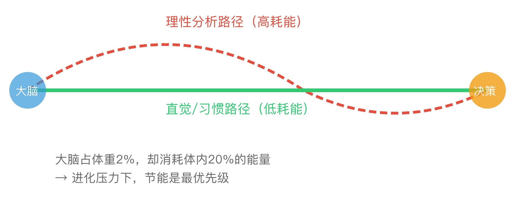
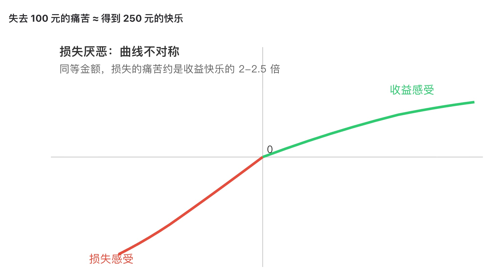
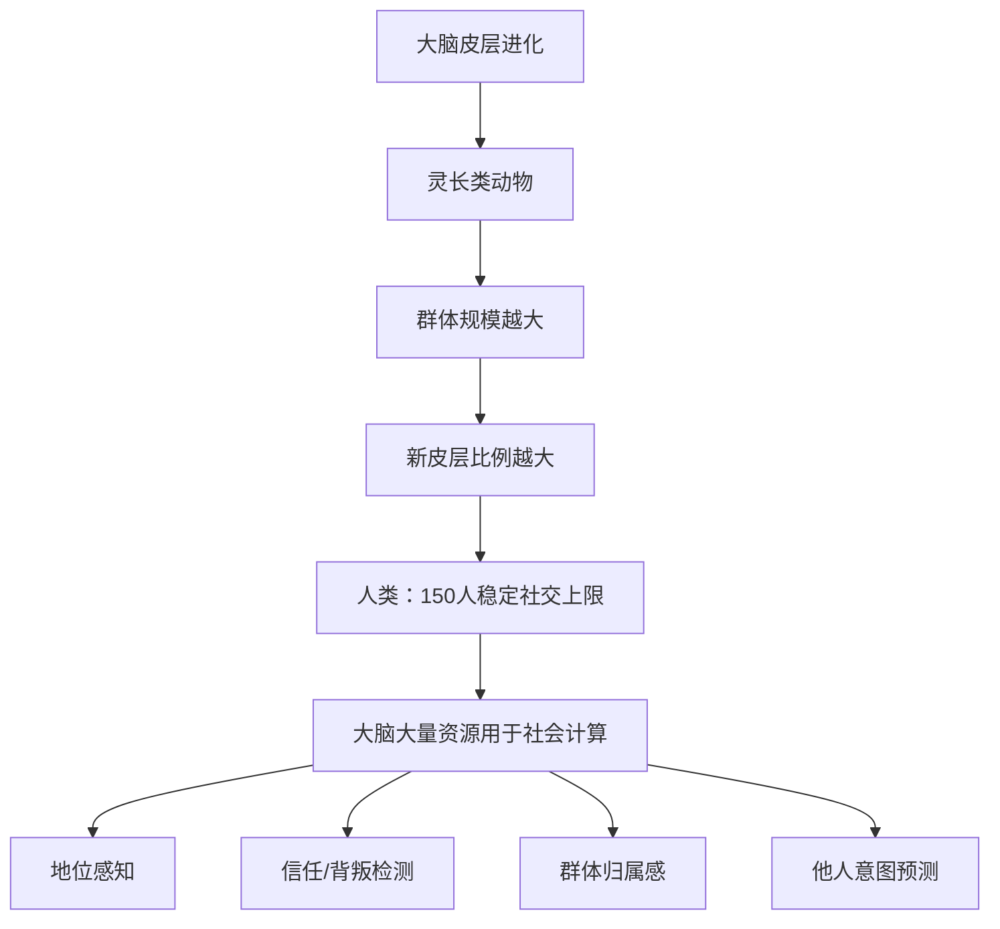
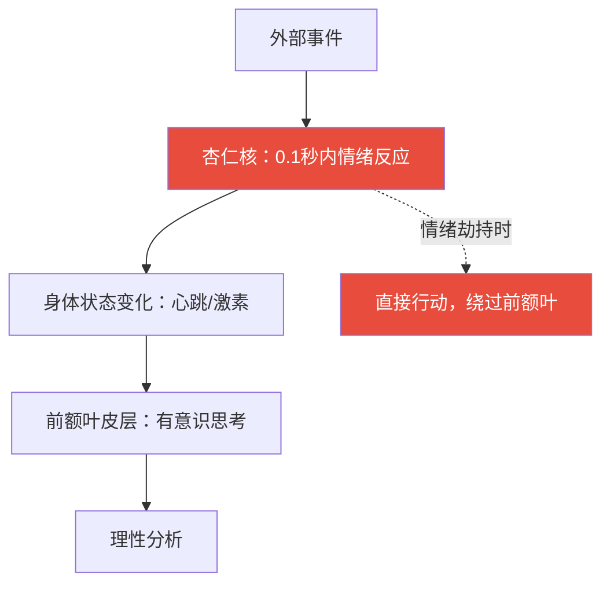
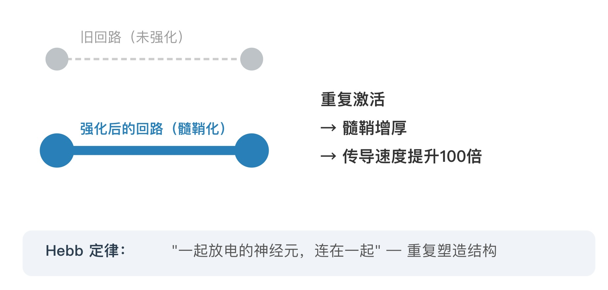
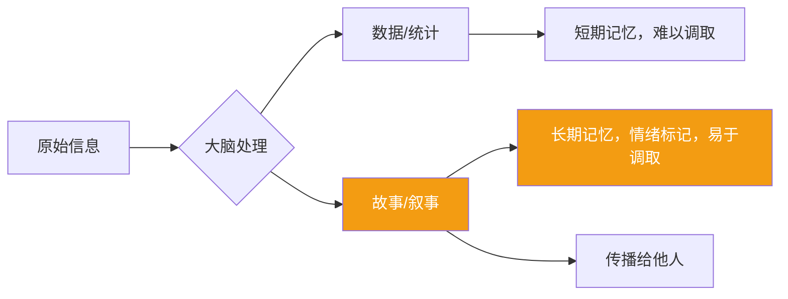
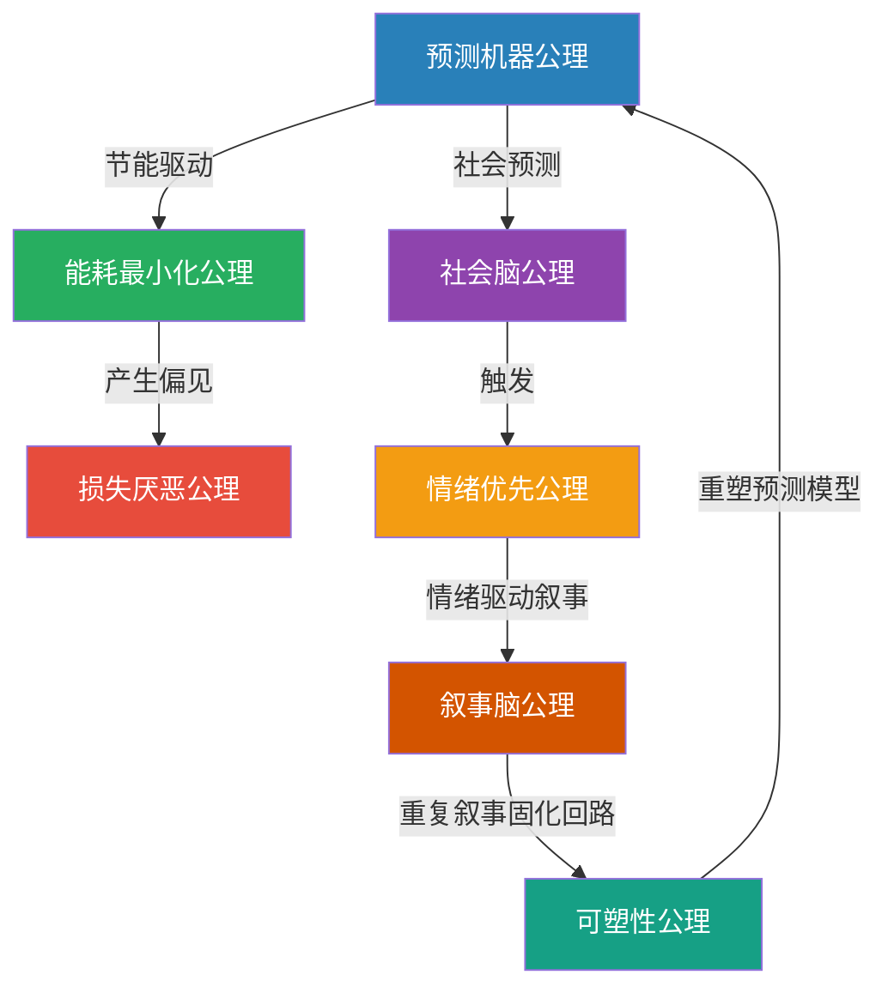

## 思维筑基课: 常用脑科学公理
  
### 作者  
digoal  
  
### 日期  
2026-05-19  
  
### 标签  
预测机器 , 能耗最小化 , 损失厌恶 , 社会脑 , 情绪优先 , 可塑性 , 叙事脑  
  
----  
  
## 背景
  
> 表面千变万化，神经回路亘古不变——读懂大脑的操作系统，才能在混沌中找到锚点。

---

## 🧭 为什么要学脑科学底层规律？

投资人看财报，要看"底层资产"而不是股价波动。  
生活决策亦然——你每天感受到的情绪、判断、偏见，都是大脑运行的"输出结果"。  
如果你不懂底层代码，你就只是在被程序运行，而不是在运行程序。

以下 **7 条脑科学底层公理**，每一条都经过神经科学实验反复验证，适用于生活、投资、创业、人际关系的每一个决策场景。

---

## 公理一：预测机器公理
### 大脑不是"反应器"，是"预测器"

**核心假设：** 大脑的首要任务不是感知现实，而是用最小能耗**预测**接下来会发生什么。

**神经机制：** 预测编码理论（Predictive Coding）。大脑持续产生"预测信号"，只有当现实与预测不符时（预测误差），才会大量消耗神经资源去更新模型。

**直觉类比：** 你走熟悉的路，基本在"自动驾驶"；走陌生的路，耗尽精力。区别不在路的难度，在于大脑有没有现成的预测模型。

### ✅ 在生活/投资中的应用

| 场景 | 表面现象 | 底层真相（预测机器） |
|------|----------|----------------------|
| 投资人看好某股票 | "我判断它会涨" | 他的大脑在用过去的经验预测，而非客观分析 |
| 第一印象很难改变 | "我就是觉得他不靠谱" | 大脑的预测模型已固化，新信息被过滤 |
| 习惯很难戒掉 | "我知道不好但就是改不了" | 大脑的预测模型已将习惯视为"正常" |
| 市场恐慌 | "大家都在抛" | 集体预测模型发生崩塌，更新成本极高 |

### ❌ 反例：假设失效时

- **黑天鹅事件**：大脑预测模型完全没有样本，无法预测 → 产生极度恐惧或麻木（2020年疫情初期）
- **专家盲点**：专家的预测模型过于强大，反而会过滤掉真正的新信号（柯达高管预测数码相机"不会成功"）

---

## 公理二：能耗最小化公理
### 大脑永远选择"最省力"的路径

<svg viewBox="0 0 600 300" xmlns="http://www.w3.org/2000/svg" font-family="sans-serif">
  <!-- 两条路径 -->
  <path d="M 50 150 Q 200 50 350 150 Q 450 200 550 150" stroke="#e74c3c" stroke-width="3" fill="none" stroke-dasharray="8,4"/>
  <path d="M 50 150 L 550 150" stroke="#2ecc71" stroke-width="4" fill="none"/>
  <!-- 标注 -->
  <text x="200" y="80" fill="#e74c3c" font-size="14">理性分析路径（高耗能）</text>
  <text x="200" y="175" fill="#2ecc71" font-size="14">直觉/习惯路径（低耗能）</text>
  <!-- 大脑图标 -->
  <circle cx="50" cy="150" r="20" fill="#3498db" opacity="0.7"/>
  <text x="37" y="155" fill="white" font-size="12">大脑</text>
  <!-- 决策点 -->
  <circle cx="550" cy="150" r="20" fill="#f39c12" opacity="0.8"/>
  <text x="535" y="155" fill="white" font-size="12">决策</text>
  <!-- 能耗标注 -->
  <text x="80" y="230" fill="#666" font-size="13">大脑占体重2%，却消耗体内20%的能量</text>
  <text x="80" y="250" fill="#666" font-size="13">→ 进化压力下，节能是最优先级</text>
</svg>
  
  

**核心假设：** 神经元放电有生物成本，大脑进化出强烈的"能耗最小化"偏好。

**神经机制：** 系统1（快思考）vs 系统2（慢思考）——丹尼尔·卡尼曼的研究证明，人类默认启动系统1（直觉、习惯、捷径），只有在意识介入时才启动系统2（理性分析）。

### ✅ 应用

- **投资中**：大多数人用"感觉"买卖，而非分析——因为分析太耗能
- **创业中**：用户永远选择"最省力"的产品路径，反人性设计必然失败
- **习惯养成**：把好习惯变成自动化（低耗能），而非每次靠意志力（高耗能）
- **说服他人**：让对方感觉"理所当然"比"给出证据"更有效

### ❌ 反例

- 当能耗最小化被滥用 → **认知偏见**（确认偏见、锚定效应、框架效应）
- 所有认知偏见的根源，几乎都是大脑在"节能模式"下产生的副产品

---

## 公理三：损失厌恶公理
### 失去 100 元的痛苦 ≈ 得到 250 元的快乐

<svg viewBox="0 0 600 300" xmlns="http://www.w3.org/2000/svg" font-family="sans-serif">
  <line x1="50" y1="150" x2="560" y2="150" stroke="#ccc" stroke-width="1"/>
  <line x1="300" y1="20" x2="300" y2="280" stroke="#ccc" stroke-width="1"/>
  <!-- 收益曲线（右上，递增但趋缓） -->
  <path d="M 300 150 Q 380 120 460 100 Q 510 90 550 85" stroke="#2ecc71" stroke-width="3" fill="none"/>
  <!-- 损失曲线（左下，陡峭） -->
  <path d="M 300 150 Q 240 195 190 230 Q 160 250 130 265" stroke="#e74c3c" stroke-width="3" fill="none"/>
  <!-- 标注 -->
  <text x="450" y="75" fill="#2ecc71" font-size="13">收益感受</text>
  <text x="95" y="275" fill="#e74c3c" font-size="13">损失感受</text>
  <text x="305" y="145" fill="#333" font-size="12">0</text>
  <!-- 不对称说明 -->
  <text x="60" y="30" fill="#333" font-size="14" font-weight="bold">损失厌恶：曲线不对称</text>
  <text x="60" y="50" fill="#666" font-size="12">同等金额，损失的痛苦约是收益快乐的 2-2.5 倍</text>
</svg>
  
  

**核心假设：** 损失和收益在神经层面激活不同强度的杏仁核反应，损失的神经激活更强烈。

**神经机制：** 前景理论（卡尼曼/特沃斯基），杏仁核对"威胁/损失"的响应优先级高于奖励回路。

### ✅ 应用

| 领域 | 利用损失厌恶 |
|------|-------------|
| 投资 | 止损比"等回本"更理性；但人类天生抗拒止损 |
| 产品设计 | "免费试用7天，随时取消"比"购买7天"转化率高3倍 |
| 谈判 | 强调"你将失去什么"比"你将获得什么"更有力 |
| 习惯 | 设置"损失型"承诺（如向厌恶的机构捐款）比奖励更有效 |

### ❌ 反例

- **过度持仓**：投资者因为损失厌恶，不愿卖出亏损股，等待"回本"——实际上成本已是沉没成本
- **错过机会成本**：害怕损失现有资源，而不敢投资新机会（创业者的最大陷阱之一）

---

## 公理四：社会脑公理
### 大脑有 1/3 的算力专门处理"人际关系"

**核心假设：** 人类是超社会性动物，大脑专门进化出处理社会信息的模块（邓巴数字：稳定社交圈≈150人）。

**神经机制：** 默认模式网络（DMN）——大脑在"休息"时默认运行的网络，主要功能是**思考他人**（他在想什么？他对我有威胁吗？）

### ✅ 应用

- **投资中**：市场本质是人的博弈，理解群体心理比理解财报更重要
- **创业中**：用户购买的是"社会认同"，不只是功能（奢侈品、名校、健身卡）
- **领导力**：给团队成员"被看见"的感受，比涨薪更能激励（社会脑的奖励）
- **信息判断**：朋友推荐的信息，大脑自动降低怀疑度——警惕"社会信任"被操控

### ❌ 反例

- **从众陷阱**：社会脑让我们默认相信群体判断 → 股市泡沫、庞氏骗局（所有人都在买！）
- **回音壁效应**：社交媒体让社会脑的"群体归属"需求被算法放大，导致信息茧房

---

## 公理五：情绪优先公理
### 情绪不是理性的对立面，是决策的前置条件

**核心假设：** 神经解剖上，情绪信号（杏仁核）比理性分析（前额叶）快 **200-300 毫秒**。情绪不是干扰，是进化留下的快速决策系统。

**神经机制：** 达马西奥的躯体标记假说——前额叶受损的病人，逻辑推理完好，却无法做任何决策，因为缺少情绪作为"快速评分器"。

**直觉类比：** 情绪是决策的"快速筛选器"，理性是"精细分析器"。没有筛选器，分析器会面对无限选项而瘫痪。

### ✅ 应用

| 场景 | 底层逻辑 |
|------|----------|
| 投资恐慌时"冷静" | 先处理情绪（杏仁核降温），再做分析；顺序反了没用 |
| 产品留存 | 产品必须触发正向情绪，用户才会"记得"回来 |
| 谈判 | 对方情绪激动时，任何理性说服都失效——先共情，后说理 |
| 自我管理 | 情绪是信号，不是噪音；学会"读懂"情绪而非压制 |

### ❌ 反例

- **情绪劫持**：杏仁核直接绕过前额叶发号施令 → 冲动交易、冲动消费、冲动决策
- **情绪压制**：强行"理性"，忽视情绪信号 → 累积情绪债务，后期爆发更激烈

---

## 公理六：可塑性公理
### 神经回路"用进废退"，你的思维模式可以被重写

<svg viewBox="0 0 600 300" xmlns="http://www.w3.org/2000/svg" font-family="sans-serif">
  <!-- 旧回路（细弱） -->
  <line x1="80" y1="80" x2="250" y2="80" stroke="#ccc" stroke-width="2" stroke-dasharray="5,3"/>
  <circle cx="80" cy="80" r="10" fill="#bdc3c7"/>
  <circle cx="250" cy="80" r="10" fill="#bdc3c7"/>
  <text x="100" y="65" fill="#999" font-size="12">旧回路（未强化）</text>
  <!-- 新回路（粗壮） -->
  <line x1="80" y1="160" x2="250" y2="160" stroke="#2980b9" stroke-width="8"/>
  <circle cx="80" cy="160" r="15" fill="#2980b9"/>
  <circle cx="250" cy="160" r="15" fill="#2980b9"/>
  <text x="100" y="145" fill="#2980b9" font-size="12" font-weight="bold">强化后的回路（髓鞘化）</text>
  <!-- 箭头：重复 → 强化 -->
  <text x="310" y="120" fill="#333" font-size="14" font-weight="bold">重复激活</text>
  <text x="310" y="145" fill="#333" font-size="14" font-weight="bold">→ 髓鞘增厚</text>
  <text x="310" y="170" fill="#333" font-size="14" font-weight="bold">→ 传导速度提升100倍</text>
  <!-- Hebb定律 -->
  <rect x="50" y="230" width="500" height="40" rx="8" fill="#f0f4f8"/>
  <text x="70" y="252" fill="#2c3e50" font-size="13" font-weight="bold">Hebb 定律：</text>
  <text x="180" y="252" fill="#555" font-size="13">"一起放电的神经元，连在一起" — 重复塑造结构</text>
</svg>
  
  

**核心假设：** 神经突触的连接强度可以通过重复激活而增强（长时程增强，LTP），大脑结构终生可变。

**神经机制：** Hebb 定律 + 神经可塑性。髓鞘化使神经信号传导速度提升 100 倍，这就是"专家直觉"的物理基础。

### ✅ 应用

- **技能习得**：刻意练习的本质是有意识地重复激活目标回路，直到髓鞘化（"肌肉记忆"其实是神经记忆）
- **思维模式改变**：认知行为疗法有效，因为它在物理上重写了神经回路
- **投资能力**：真正的投资判断力是"回路"，不是"知识"——需要大量真实决策的反馈循环
- **坏习惯戒除**：旧回路不会消失，只会被新回路"覆盖"——替代比压制更有效

### ❌ 反例

- **可塑性有窗口期**：早年的神经可塑性远高于成年，部分回路在关键期后极难重写（语言口音、情绪依恋模式）
- **自动化的代价**：高度髓鞘化的回路（专家习惯）在环境剧变时会成为障碍（出租车司机 vs Uber 时代）

---

## 公理七：叙事脑公理
### 大脑用"故事"来理解世界，而非"数据"

**核心假设：** 大脑用叙事结构（起因-发展-高潮-结局）来压缩和存储信息，故事调取比数据调取快 22 倍（斯坦福研究）。

**神经机制：** 听故事时，大脑的**镜像神经元**激活，产生"神经耦合"——听者大脑与讲者大脑同步。这是人类跨个体传递经验的核心机制。

### ✅ 应用

| 领域 | 应用 |
|------|------|
| 投资 | 市场叙事（narrative）比基本面更能短期驱动股价（比特币、AI概念股） |
| 创业 | 融资的核心是"故事"，不是商业计划书 |
| 说服 | 一个案例故事的说服力 > 十个统计数字 |
| 记忆 | 将需要记住的信息编成故事/场景，记忆效率提升数倍 |
| 品牌 | 品牌的本质是"消费者自我叙事"的一部分 |

### ❌ 反例

- **叙事陷阱**：强大的故事会覆盖真实数据 → "这家公司的故事太好了"导致高估值泡沫
- **事后叙事**：大脑擅长在事后编造因果故事（hindsight bias）→ 投资复盘中"我当时就知道"是幻觉

---

## 🗺️ 七大公理的关系图

---

## 💡 实战：如何在决策前"激活底层公理"

在做重要决策（投资、创业、人生选择）前，问自己以下 7 个问题：

1. **（预测机器）** 我的判断是基于历史模型还是真实数据？我的模型有没有过期？
2. **（能耗最小化）** 我是在用直觉还是真正分析？我愿意付出分析成本吗？
3. **（损失厌恶）** 我是在害怕损失还是追求收益？我的决策是理性权衡还是情绪回避？
4. **（社会脑）** 我受到了哪些社会压力？我的判断里有多少是"别人也这么做"？
5. **（情绪优先）** 我现在的情绪状态适合做这个决策吗？
6. **（可塑性）** 这个决定会强化什么回路？我愿意成为"重复这个决定 1000 次"的人吗？
7. **（叙事脑）** 我是被一个好故事吸引了，还是真正理解了底层逻辑？

---

## 📚 延伸阅读

| 书目 | 对应公理 | 核心价值 |
|------|----------|----------|
| 《思考，快与慢》卡尼曼 | 能耗最小化、损失厌恶 | 认知偏见全景图 |
| 《身体的情绪》达马西奥 | 情绪优先 | 情绪与理性的神经基础 |
| 《社会性大脑》邓巴 | 社会脑 | 人际关系的进化根源 |
| 《刻意练习》艾利克森 | 可塑性 | 如何有意识地重写神经回路 |
| 《故事》麦基 | 叙事脑 | 叙事结构的底层逻辑 |
| 《预测性大脑》克拉克 | 预测机器 | 最前沿的认知神经科学框架 |

---

*"了解大脑的游戏规则，不是为了操控他人，而是为了不再被自己的大脑操控。"*
  
