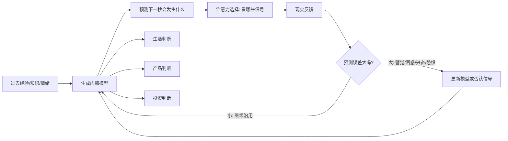

## 脑科学思维筑基课: 预测机器公理: 大脑先猜世界, 再看世界

### 作者
digoal

### 日期
2026-05-19

### 标签
预测机器 , 预测编码 , 大脑模型 , 决策判断 , 生活决策 , 产品思维 , 运营策略 , 投资预期 , 反馈机制 , 认知偏差

----

## 背景

> 面向对象: 大学生、产品经理、运营经理、有投融资需求的人  
> 核心问题: 为什么同一件事, 有人看见机会, 有人看见危险? 为什么市场、用户和自己经常不是按事实行动, 而是按预期行动?  
> 先说结论: 大脑不是被动接收现实的摄像头, 而是一台不断生成预测、比较误差、更新模型的机器。看懂这一点, 才能判断自己是在理解世界, 还是只是在复用旧模型。

## 一张图先看懂



这张图的重点不是“人会预测未来”。重点是: 大脑连“现在看到什么”, 都会被预测影响。

你以为自己先看见事实, 再形成判断。很多时候真实顺序是:

```text
旧模型 -> 预期 -> 选择性注意 -> 解释事实 -> 继续强化旧模型
```

所以, 预测机器公理不是一句鸡汤, 而是一个判断真伪的底层提醒: 当你说“我看到了事实”, 先问一句, 我是不是只看到了模型允许我看到的那部分事实?

## 求真讲法

### 它到底说了什么

预测机器公理可以表述为:

> 大脑为了在不确定世界中节省能量、快速行动, 会持续用已有模型预测外部世界和身体内部状态; 感知、情绪、注意力和行动, 都受到预测与预测误差的共同塑造。

这里有三个关键词。

第一, “模型”。模型不是数学公式才叫模型。你对某个人的第一印象、对某个行业的判断、对“努力是否有用”的信念, 都是模型。

第二, “预测误差”。现实和预期不一致时, 大脑会产生误差信号。误差太小, 大脑懒得更新; 误差太大, 大脑可能学习, 也可能防御。

第三, “行动”。大脑不仅通过改变想法来减少误差, 也会通过行动让世界符合预期。比如你认为某人不可靠, 你就会更冷淡; 对方感到被防备, 真的不再配合你。你的预测把现实推向了预测本身。

### 它是怎么来的

传统直觉把大脑想成“刺激-反应”系统:

```text
外部刺激 -> 大脑处理 -> 做出反应
```

但这个说法解释不了很多现象。

比如, 你在嘈杂环境里能听见自己的名字; 你在熟悉路线上走路时几乎不用看路; 你在市场暴跌时会把普通新闻解释成大利空; 你刚买完一款车, 突然发现路上到处都是同款车。

更合理的解释是: 大脑先用历史经验形成预测, 再把感官输入当成“校正材料”。预测编码、贝叶斯大脑、自由能原理等理论都在不同层面描述这个方向: 大脑通过比较预测和输入, 尽量降低不确定性与预测误差。

这并不表示这些理论已经解释了意识和全部认知。它们更像一套强有力的工作框架: 先把大脑看成主动建模者, 而不是被动记录仪。

### 它依赖哪些假设

| 假设 | 含义 | 不成立时会怎样 |
|---|---|---|
| 世界有一定稳定性 | 过去经验对未来有部分参考价值 | 环境突变时, 旧经验会误导判断 |
| 大脑资源有限 | 不能每秒重新计算全部事实 | 大脑会用捷径、标签、第一印象节能 |
| 误差可以被识别 | 现实反馈能被看见、记录、比较 | 没有反馈时, 模型会越来越自洽也越来越危险 |
| 人会保护自我模型 | 错的不只是观点, 还可能是身份感 | 面对反证时, 人可能否认、攻击或合理化 |
| 行动会改变环境 | 预测不仅解释世界, 还会塑造世界 | 可能出现自证预言, 尤其在人际、组织、市场中 |

这五个假设决定了“预测机器公理”的适用范围。它不是说人能准确预测未来, 而是说人总是在用预测组织经验。

### 常见误解

误解一: 预测机器等于算命。

不是。预测机器讲的是大脑如何工作, 不是人有什么神秘预知能力。大脑的预测经常错, 只是错得很快、很自然、很像事实。

误解二: 预测越准越好。

不一定。一个过于稳定的模型会让人只看见旧世界。很多专家失败, 不是因为没有模型, 而是模型太强, 强到过滤了新信号。

误解三: 有数据就能摆脱预测。

也不一定。数据本身不会说话。你选择什么指标、忽略什么样本、用什么故事解释数据, 都受模型影响。

误解四: 情绪是预测的敌人。

情绪常常是预测误差的身体信号。焦虑可能表示“我无法预测接下来会怎样”; 兴奋可能表示“现实超出预期但方向有利”; 愤怒可能表示“别人破坏了我对秩序或公平的预测”。

## 求存讲法

### 它有什么用

对个人, 它能帮你识别“我以为我在判断, 其实我在复读过去”。

对产品经理, 它能解释用户为什么不按说明书使用产品。用户不是先理解功能再行动, 而是带着旧习惯预测这个按钮、页面、价格、文案代表什么。

对运营经理, 它能解释为什么活动效果经常衰减。用户被教育后会形成预测: 什么时候打折、什么文案是套路、什么奖励值得参与。运营不是不断刺激用户, 而是管理用户预期。

对投资者, 它能解释市场为什么会在事实发生前上涨或下跌。价格交易的往往不是事实本身, 而是“事实相对预期的差异”。

### 它怎么迁移到生活、产品、运营、投资

#### 1. 生活: 先改预测, 再改行为

一个学生说“我数学不好”, 表面是描述能力, 底层是预测模型: 遇到题目 -> 我会失败 -> 早点放弃可以少受伤。

如果只讲“你要努力”, 很难有用。因为旧模型还在。更有效的做法是制造小的、连续的预测误差:

```text
我以为做不出来 -> 但这类题我做出了 1 道
我以为全靠天赋 -> 但错题归类后正确率提高
我以为自己不行 -> 但反馈显示方法有效
```

模型不是被口号推翻的, 是被稳定反馈改写的。

#### 2. 产品: 用户看到界面前, 已经带着预期进来了

用户打开一个 App 时, 不会从零开始理解。他会把它归类:

| 用户旧模型 | 他会怎么预测 | 产品设计含义 |
|---|---|---|
| 像外卖软件 | 期待搜索、筛选、评价、配送进度 | 不要把核心路径藏得太深 |
| 像办公软件 | 期待稳定、权限、可撤销、可追溯 | 少做花哨动效, 多给确定性 |
| 像投资软件 | 期待风险提示、收益波动、资产明细 | 信息层级必须清楚, 不能只强调收益 |
| 像社交软件 | 期待反馈、身份、关系链 | 冷启动要先解决“我在这里是谁” |

产品创新不是完全违反预期。真正好的创新通常是:

```text
关键路径符合旧预期 + 核心价值制造新惊喜
```

如果连基础预期都破坏, 用户会把“新”解释成“难用”。

#### 3. 运营: 运营的本质是预期管理

用户不是对奖励本身反应, 而是对“奖励是否超出预期”反应。

同样 10 元优惠券:

```text
预期是 0 元 -> 10 元是惊喜
预期是 20 元 -> 10 元是失望
预期每周都有 -> 10 元变成理所当然
预期条件复杂 -> 10 元变成套路
```

所以运营动作不能只看当期转化, 还要看它塑造了什么长期预测。过度补贴会训练用户“无券不买”; 过度标题党会训练用户“不点也罢”; 过度承诺会训练用户“不信你了”。

#### 4. 投融资: 市场交易的是“预期差”

投资中最重要的问题之一不是“这家公司好不好”, 而是:

> 当前价格里, 已经包含了什么预测?

好公司如果被极度乐观地定价, 未来只要“没那么好”就可能下跌。普通公司如果被极度悲观地定价, 未来只要“没那么差”就可能上涨。

一个简化框架:

```text
投资结果 = 真实经营变化 - 市场已有预期 - 自己模型误差
```

这就是为什么财报发布后, 有时利润增长股价却跌, 有时亏损扩大股价却涨。市场反应的不是孤立数字, 而是数字与预期之间的误差。

### 它的适用范围和边界

预测机器公理适合用来分析:

- 第一印象为什么难改变
- 用户为什么抗拒新产品
- 组织为什么路径依赖
- 市场为什么买预期、卖事实
- 自己为什么在压力下重复旧错误

但它不适合被滥用为:

- “一切都是主观的, 没有事实”
- “只要改变信念, 就能改变现实”
- “我有直觉, 所以不用证据”
- “市场都是心理, 基本面不重要”

事实仍然存在。预测机器公理只是提醒你: 人接近事实的方式, 会被旧模型强烈影响。

### 正例: 怎么用它提升能力

#### 正例一: 大学生建立学习反馈系统

目标不是每天喊“我要自律”, 而是设计反馈来更新模型。

```text
旧预测: 我不擅长统计学
行动: 每天只做 3 道同类型题
反馈: 记录错误类型, 第二天只修一个错误
新误差: 原来不是我不行, 是我混淆了抽样分布和样本分布
新模型: 我可以通过拆分概念提高正确率
```

这个过程有效, 因为它让大脑持续收到可解释、可重复、可修正的预测误差。

#### 正例二: 产品经理降低新功能学习成本

假设你做一个 AI 数据分析工具。用户旧模型是“表格软件”。如果一上来就给用户一个空白对话框, 用户可能不知道该问什么。

更好的做法是把预测接上:

```text
用户熟悉的表格 -> 自动识别字段 -> 给出可点击问题建议 -> 生成图表 -> 允许回到表格校对
```

你不是强迫用户理解 AI, 而是让用户沿着旧模型走, 在关键节点体验新能力。

#### 正例三: 投资者写“预期清单”

买入前写下三类预测:

| 类型 | 要写清楚的问题 |
|---|---|
| 公司预测 | 收入、利润、现金流、竞争格局会怎样变化 |
| 市场预测 | 当前价格隐含了乐观、悲观还是中性预期 |
| 自我预测 | 我在什么情况下会承认判断错了 |

卖出或复盘时, 不只看赚亏, 而是比较“当初预测”和“现实反馈”。这样训练的不是情绪, 而是模型。

### 反例: 前提不成立会怎样

#### 反例一: 把短视频增长经验搬到企业软件

某团队过去做消费 App, 形成模型: 强刺激、快反馈、频繁弹窗能提高活跃。后来转做企业软件, 仍然沿用这套运营方式。

结果客户反感, 因为企业软件用户的核心预测是:

```text
稳定 -> 可控 -> 少打扰 -> 可审计 -> 不出错
```

这里失败不是因为团队“不努力”, 而是因为“过去经验对未来有参考价值”这个假设不成立。场景变了, 预测模型却没变。

#### 反例二: 牛市中把运气误认为能力

一个投资者在流动性宽松、热门行业上涨时连续盈利, 于是形成模型: 我擅长选股, 回调就是加仓机会。

当宏观流动性收紧、估值体系变化时, 他仍然把下跌解释成“市场错杀”。现实持续给出误差, 但他选择否认误差, 而不是更新模型。

这就是预测机器的危险面: 模型越能保护自尊, 越难被事实修正。

## 一个可复用的判断工具

遇到生活、产品、运营、投资问题时, 用下面这张卡片逼自己拆开预测。

| 问题 | 用法 |
|---|---|
| 我现在的判断基于哪个旧模型? | 找出经验来源, 不要只说“直觉” |
| 这个模型来自什么环境? | 判断环境是否已经变化 |
| 我忽略了哪些反证? | 主动寻找预测误差 |
| 如果我是错的, 最早会出现什么信号? | 设计可验证指标 |
| 我会不会因为身份、自尊、沉没成本而拒绝更新? | 识别防御性解释 |
| 对方或市场现在预期什么? | 从“事实”转向“预期差” |
| 我的行动会不会反过来塑造现实? | 警惕自证预言 |

可以把它压缩成一句话:

> 先问模型, 再看事实; 先看预期, 再看变化; 先设反证, 再做判断。

## 思考

如果大脑是预测机器, 那么成长不是“知道更多事实”, 而是“拥有更可更新的模型”。

这对教育很重要。很多学生不是缺知识, 而是被早期失败训练出了“我不行”的预测。教育的关键不是灌输更多内容, 而是设计更好的反馈, 让学生重新预测自己。

这对产品很重要。用户不是理性阅读说明书的人, 而是带着旧经验快速归类的人。产品的第一屏、第一句话、第一次成功体验, 都是在告诉用户: 你该如何预测我。

这对投资更重要。市场里最贵的一句话是“这次不一样”, 第二贵的一句话是“这次还一样”。前者忽略历史模型, 后者拒绝更新模型。真正困难的是判断: 哪些底层公理没变, 哪些表层变量已经变了。

最后给一个反事实问题:

> 如果你今天最坚定的三个判断都是旧模型的产物, 你愿意用什么证据让自己改变想法?

回答不了这个问题, 就说明你不是在预测未来, 而是在保卫过去。

## 最后记住

1. 大脑不是摄像头, 而是预测器; 感知本身会被预期塑造。
2. 判断质量取决于模型质量, 模型质量取决于反馈质量。
3. 生活中改变自己, 不能只靠意志力, 要制造稳定的小预测误差。
4. 产品和运营的核心不是刺激用户, 而是管理用户预期。
5. 投资要看事实, 更要看事实相对市场预期的差异。

## 参考资料

- Karl Friston, [The free-energy principle: a unified brain theory?](https://www.nature.com/articles/nrn2787), Nature Reviews Neuroscience, 2010.
- Karl Friston, [Predictive coding under the free-energy principle](https://pmc.ncbi.nlm.nih.gov/articles/PMC2666703/), Philosophical Transactions of the Royal Society B, 2009.
- Andy Clark, [Surfing Uncertainty: Prediction, Action, and the Embodied Mind](https://academic.oup.com/book/7843), Oxford University Press, 2016.
- Beren Millidge, Anil K. Seth, Christopher L. Buckley, [Predictive Coding: a Theoretical and Experimental Review](https://arxiv.org/abs/2107.12979), 2021.
- Daniel Kahneman, Thinking, Fast and Slow, 2011. 用于理解预测、注意力、认知捷径和偏差之间的关系。
  
#### [PostgreSQL 解决方案集合](../201706/20170601_02.md "40cff096e9ed7122c512b35d8561d9c8")
  
  
#### [德哥 / digoal's Github - 公益是一辈子的事.](https://github.com/digoal/blog/blob/master/README.md "22709685feb7cab07d30f30387f0a9ae")
  
  
#### [About 德哥](https://github.com/digoal/blog/blob/master/me/readme.md "a37735981e7704886ffd590565582dd0")
  
  

  
