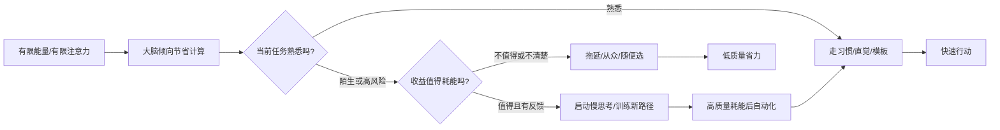

## 脑科学思维筑基课: 能耗最小化公理: 人会先走最省力的路

### 作者
digoal

### 日期
2026-05-19

### 标签
能耗最小化 , 认知负荷 , 快思考 , 慢思考 , 用户摩擦 , 产品设计 , 运营预期 , 投资纪律 , 启发式 , 决策成本

----

## 背景

> 面向对象: 大学生、产品经理、运营经理、有投融资需求的人  
> 核心问题: 为什么人明知道该学习、该复盘、该止损、该看长期, 却总是选择刷短视频、凭感觉决策、等别人给答案?  
> 先说结论: 大脑不是为了“追求真理”而进化出来的机器, 它首先要在有限能量下活下去。所以人默认选择低耗能路径: 熟悉、自动、简单、即时反馈。真正的高手不是天天和省力本能硬扛, 而是把正确行为设计成更省力。

## 一张图先看懂



这张图有两个重点。

第一, “省力”不是道德缺陷, 而是生物系统的默认策略。神经活动需要能量, 注意力也不是无限资源。

第二, 低耗能不一定低质量。专家直觉、熟练流程、优秀产品设计, 都是在把复杂行为压缩成低耗能动作。问题不在省力, 问题在于: 你省掉的是无效摩擦, 还是省掉了必要判断?

一个最简对比:

```text
坏的省力: 不想分析 -> 听消息买股票 -> 亏了怪市场
好的省力: 先建清单 -> 只分析关键变量 -> 触发条件再交易
```

## 求真讲法

### 它到底说了什么

能耗最小化公理可以表述为:

> 在没有足够动机、清晰反馈和外部约束时, 人的大脑会优先选择认知成本更低的路径; 只有当风险、奖励、意义或训练机制足够强时, 才会主动投入更高认知能耗。

这里的“能耗”不只是热量消耗, 更包括三类成本。

第一, 注意力成本。你同时只能认真处理很少的信息。复杂表格、混乱页面、长篇说明, 都会消耗注意力。

第二, 工作记忆成本。工作记忆可以理解为脑中的临时操作台。任务步骤越多、概念越乱、前后依赖越强, 越容易让人放弃。

第三, 情绪成本。承认自己错了、面对不确定性、止损、重新学习, 都需要心理能量。很多人不是不知道正确答案, 而是承受不了正确答案带来的情绪成本。

所以, “人懒”只是表层说法。底层机制是: 大脑会把每个选择都隐含地问一遍:

```text
这件事值得我消耗注意力、记忆和情绪吗?
```

如果答案不明确, 默认就会走最省力路径。

### 它是怎么来的

这个公理不是单一学科的一条定理, 更像多个领域共同指向的工作假设。

从生理上看, 大脑虽然只占人体重量的一小部分, 却消耗很高比例的能量。神经信号传递、突触活动、离子泵恢复状态, 都有真实代谢成本。Attwell 和 Laughlin 对灰质信号传递的能量预算做过经典估算, 说明神经活动并不是“免费的”。

从认知心理学看, 人在不确定判断中常用启发式。启发式就是低成本判断捷径, 比如“最近听到的事情更常见”“像好公司就更可能是好投资”“权威说的更可信”。Tversky 和 Kahneman 的研究说明, 这些捷径有时有效, 但也会系统性地产生偏差。

从学习科学看, 认知负荷理论提醒我们: 学习材料如果占用太多工作记忆, 学生就没有余力形成长期理解。对新手来说, 不是题目越难越好, 而是要把无关负荷降下来, 把能量留给真正要学的结构。

从人类行为看, Zipf 的“最小努力原则”也提出过类似观察: 人在语言、搜索、沟通和信息寻找中, 常会选择总体努力更小的路径。

这些研究不是在证明“人永远偷懒”, 而是在共同说明: 人类智能是在能量约束下运行的智能。

### 它依赖哪些假设

| 假设 | 含义 | 不成立时会怎样 |
|---|---|---|
| 认知资源有限 | 注意力和工作记忆不能无限扩展 | 复杂任务会被简化、拖延或外包给他人 |
| 低耗能路径通常够用 | 日常多数场景不值得精密计算 | 熟悉环境中直觉和习惯能提高效率 |
| 高耗能必须有理由 | 人需要奖励、风险、意义或反馈才愿意深思 | 没有反馈的学习和复盘最容易半途而废 |
| 自动化可以降低成本 | 重复训练能把慢思考变成快反应 | 技能、流程、清单能把复杂事变简单 |
| 环境会塑造选择 | 默认选项、路径长度、提示方式影响行为 | 产品和组织设计可以放大或减少人的惰性 |

这五个假设合起来, 才能正确理解能耗最小化。它不是说“越省力越好”, 而是说: 人会自然省力, 所以重要系统必须围绕这个事实设计。

### 常见误解

误解一: 能耗最小化就是懒惰。

不是。懒惰是道德评价, 能耗最小化是机制描述。一个顶级运动员在赛场上也会省力, 因为多余动作会降低成绩。

误解二: 省力一定导致低质量。

不一定。清单、模板、自动化、良好默认值, 都是在省力。高质量工作往往不是靠每次重新燃烧意志力, 而是靠把正确路径压缩成低成本流程。

误解三: 只要自律, 就能克服省力本能。

自律有用, 但不能长期替代系统设计。靠意志力每天对抗高摩擦环境, 成本太高。更好的做法是改变环境, 让正确行为更容易发生。

误解四: 用户不看说明是用户水平低。

通常不是。用户是在用低耗能策略保护自己。产品如果必须靠长说明才能使用, 就是在把成本转嫁给用户。

误解五: 投资只要多研究就会更好。

也不一定。研究如果没有问题框架, 信息越多, 认知负荷越高。最后可能看似勤奋, 实际只是用复杂信息掩盖关键判断。

## 求存讲法

### 它有什么用

能耗最小化公理的价值在于, 它能把很多“表面问题”翻译成“成本问题”。

学生不学习, 可能不是不想进步, 而是学习路径反馈太慢、挫败感太高。

用户不用功能, 可能不是功能没价值, 而是入口太深、解释太难、第一次成功太慢。

运营活动衰减, 可能不是用户变坏, 而是用户已经学会用最低成本薅羊毛, 而不是形成真实习惯。

投资者频繁犯错, 可能不是智商不够, 而是把最耗能的工作, 如独立估值、反证搜索、仓位纪律, 全部留给了情绪最差的时候。

### 它怎么迁移到熟悉领域

#### 1. 学习: 把努力拆成低耗能入口

大学生常见错误是把学习目标设成“我要彻底学懂这门课”。这个目标太大, 大脑不知道第一步是什么, 就会转向更省力的娱乐。

更好的设计是:

```text
打开教材 -> 只看 2 页 -> 标出 1 个不懂的概念 -> 查 1 个例题 -> 做 1 道同类题
```

低耗能入口不是降低标准, 而是降低启动成本。启动后再逐步加深。

#### 2. 产品: 用户永远优先选择低摩擦路径

产品经理要记住一句话:

> 用户不是在“使用你的功能”, 用户是在“完成自己的任务”。

如果你的功能路径比用户原来的办法更费力, 用户就不会迁移。哪怕你的功能更先进, 也会输给“截图发群”“Excel 手工改”“让同事帮忙”。

产品设计要问:

| 问题 | 低耗能设计方向 |
|---|---|
| 用户第一眼知道能做什么吗? | 明确主操作, 减少同级按钮 |
| 用户第一次成功要多久? | 缩短从进入到得到结果的时间 |
| 出错后能不能恢复? | 提供撤销、草稿、预览、确认 |
| 用户需要记住多少规则? | 把规则放到界面里, 不让用户背说明 |
| 老用户能不能更快? | 快捷入口、模板、历史记录、批量操作 |

好的产品不是让用户觉得“这个系统很强”, 而是让用户觉得“这件事终于不用费劲了”。

#### 3. 运营: 不要只给刺激, 要设计习惯回路

运营容易陷入一个误区: 刺激越强, 用户越活跃。

短期可能对, 长期未必。因为用户会学习最低成本策略:

```text
有券才买
有红包才来
有补贴才邀请
标题越夸张越不点
规则越复杂越不信
```

所以运营不只是做活动, 而是设计低耗能的行为回路:

```text
触发 -> 行动很简单 -> 反馈很快 -> 奖励可感知 -> 下次更容易
```

如果每次活动都需要用户重新理解规则, 就是在增加认知成本。更好的运营是让用户形成稳定预期, 再在关键节点提供小惊喜。

#### 4. 投融资: 最危险的是“省掉关键判断”

投资里的省力有两种。

好的省力是流程化: 只看能力圈内的公司, 用固定清单排除不合格机会, 提前写好买入和卖出条件。

坏的省力是外包判断: 听大 V、看群消息、追热门概念、用股价上涨证明自己正确。

一张简单图可以区分:

```text
低质量省力: 信息很多 -> 没有框架 -> 情绪决策 -> 事后找理由
高质量省力: 问题清楚 -> 指标有限 -> 条件触发 -> 复盘修正
```

投资真正耗能的地方不是看新闻, 而是承认不懂、等待机会、逆着情绪执行纪律。这些事情耗能, 所以必须提前制度化。

### 它的适用范围和边界

能耗最小化适合解释:

- 为什么人更容易坚持简单行动
- 为什么默认选项影响巨大
- 为什么复杂产品难增长
- 为什么运营补贴会训练用户预期
- 为什么投资者喜欢听故事而不是算账
- 为什么组织流程越复杂, 执行越容易变形

但它不能被滥用为:

- “用户懒, 所以只要做傻瓜式产品”
- “人会省力, 所以教育和训练没用”
- “复杂都不好, 简单一定好”
- “市场参与者都不理性, 所以基本面没意义”

边界在于: 人会为高价值、高意义、高风险、高反馈的事情投入能量。关键不是让一切都轻松, 而是把能量用在真正创造价值的地方。

### 正例: 怎么用它提升能力

#### 正例一: 大学生把学习系统设计成“低启动成本”

目标: 学好概率论。

错误做法:

```text
每天晚上 3 小时, 从头到尾完整复习
```

这个计划看起来认真, 但启动成本太高。几天后大脑会选择更省力的事情。

更好的做法:

```text
每天固定 25 分钟
只做一类题
只记录一个错误原因
每周把错误原因合并成一张表
```

这里省掉的不是学习, 而是犹豫、选择、切换和挫败。真正的认知能量被留给“理解错在哪里”。

#### 正例二: 产品经理让关键路径少一步

假设一个报销产品需要用户上传发票。旧流程是:

```text
打开 App -> 找报销入口 -> 新建单据 -> 选择类型 -> 上传图片 -> 手填金额 -> 提交
```

优化后:

```text
打开 App -> 拍发票 -> 自动识别 -> 用户确认 -> 提交
```

这不是简单地“少几个页面”, 而是减少工作记忆负担。用户不用记住报销类型、字段含义和填写顺序, 系统替他承担了结构化成本。

#### 正例三: 投资者建立“耗能前置”的决策纪律

真正好的投资流程, 应该在情绪平稳时完成高耗能部分:

| 阶段 | 该做什么 | 为什么 |
|---|---|---|
| 买入前 | 写清楚买入理由和反证条件 | 避免事后合理化 |
| 持有中 | 只跟踪少数关键变量 | 降低信息噪音 |
| 下跌时 | 按预设条件判断是否加仓或退出 | 避免恐慌中重新发明规则 |
| 卖出后 | 复盘模型错误, 不只复盘盈亏 | 训练长期判断力 |

这叫“把耗能放在前面”。不要等市场暴跌、情绪上头、群里吵翻时, 才临时要求自己理性。

### 反例: 前提不成立会怎样

#### 反例一: 用“极简产品”掩盖复杂任务

某个企业管理产品为了追求“简单”, 把审批规则、权限差异、异常处理全部隐藏。界面看起来很干净, 但一到真实业务就到处出错。

这里失败的假设是: 低耗能路径通常够用。

在高风险、强合规、多角色协作的场景里, 复杂性不是装饰, 而是任务本身。产品应该降低无关负荷, 不能删除必要结构。

#### 反例二: 投资者为了省力只买“大家都说好的公司”

某投资者不愿读财报、不愿估值、不愿比较竞争格局, 于是用一个低耗能规则: 买知名公司, 买热门赛道, 买大家都看好的龙头。

这个规则在牛市里可能赚钱, 但当估值过高或行业逻辑变化时, 他没有能力判断“好公司”和“好价格”的区别。

这里失败的假设是: 低耗能路径通常够用。投资不是日常熟悉任务, 它是高不确定、高反馈延迟、高情绪波动的任务。省掉关键判断, 就是在把风险后置。

#### 反例三: 运营把用户训练成“最低成本套利者”

一个平台长期用红包拉活跃, 用户逐渐形成习惯: 只在有红包时打开, 只做最低要求动作, 做完立刻离开。

短期数据好看, 长期真实留存变差。

这里失败的假设是: 环境会塑造选择。运营设计了低耗能路径, 但这条路径通向“套利”, 不是通向“价值使用”。

## 一个可复用的判断工具

做生活、产品、运营、投资决策前, 用下面这张表问自己。

| 问题 | 如果答案是“是”, 要警惕什么 |
|---|---|
| 我是不是在用熟悉感代替判断? | 旧经验可能不适用于新环境 |
| 我是不是因为太复杂而拖延? | 需要降低启动成本, 不是继续自责 |
| 用户是不是看不懂第一步? | 产品把认知成本转嫁给了用户 |
| 运营是不是只提高短期刺激? | 可能训练出无券不买、无利不起早 |
| 投资判断是不是来自别人总结? | 你省掉的可能正是风险识别 |
| 我有没有把关键规则提前写下来? | 情绪时刻不适合临时制定纪律 |
| 我省掉的是摩擦, 还是省掉了判断? | 前者是效率, 后者是风险 |

压缩成一句话:

> 能省掉的, 是无效摩擦; 不能省掉的, 是关键判断。

## 思考

表面变化越快, 能耗最小化越重要。

因为信息越多, 人越会寻找捷径。短视频、热搜、群消息、榜单、KOL 观点, 都在争夺人的低耗能路径。谁能让你不用思考就形成判断, 谁就能影响你的生活、消费和投资。

这也是为什么“底层公理”重要。公理不是帮你记更多现象, 而是帮你压缩世界。一个好的底层模型, 能让你用更少能量看穿更多变化。

但这里有一个反直觉点:

> 真正的高手不是永远做高耗能思考, 而是知道哪 5% 的地方必须高耗能。

大学生不需要把每一分钟都安排得满满的, 但要知道哪些概念是课程的骨架。

产品经理不需要让每个功能都极简, 但要知道用户第一次成功的路径不能复杂。

运营经理不需要每次活动都创新, 但要知道活动在训练用户什么预期。

投资者不需要研究所有公司, 但要知道什么时候自己只是在借别人的脑子偷懒。

最后问一个问题:

> 如果你把今天所有选择都列出来, 哪些“省力”是在提高效率, 哪些“省力”是在推迟代价?

能分清这两种省力, 就开始接近成熟判断。

## 最后记住

1. 人会默认选择低耗能路径, 这是机制, 不是道德缺陷。
2. 好系统不是要求人长期硬扛本能, 而是让正确行为更容易发生。
3. 产品和运营要降低无关认知负荷, 但不能删除必要判断。
4. 投资中最危险的省力, 是把独立判断外包给市场情绪和他人观点。
5. 真正的能力, 是把高价值思考训练成低成本流程。

## 参考资料

- David Attwell, Simon B. Laughlin, [An Energy Budget for Signaling in the Grey Matter of the Brain](https://pubmed.ncbi.nlm.nih.gov/11598490/), Journal of Cerebral Blood Flow & Metabolism, 2001.
- NCBI Bookshelf, [Physiology, Brain](https://www.ncbi.nlm.nih.gov/books/NBK551718/), 用于核对“大脑约占体重 2%, 消耗约 20% 能量/氧供”等基础生理描述。
- John Sweller, [Cognitive Load During Problem Solving: Effects on Learning](https://andymatuschak.org/files/papers/Sweller%20-%201988%20-%20Cognitive%20load%20during%20problem%20solving.pdf), Cognitive Science, 1988.
- Amos Tversky, Daniel Kahneman, [Judgment under Uncertainty: Heuristics and Biases](https://ui.adsabs.harvard.edu/abs/1974Sci...185.1124T/abstract), Science, 1974.
- George K. Zipf, [Human Behavior and the Principle of Least Effort](https://openlibrary.org/books/OL14729942M/Human_behavior_and_the_principle_of_least_effort), 1949.
- Daniel Kahneman, Thinking, Fast and Slow, 2011. 用于理解快思考、慢思考、启发式与偏差之间的关系。
  
#### [PostgreSQL 解决方案集合](../201706/20170601_02.md "40cff096e9ed7122c512b35d8561d9c8")
  
  
#### [德哥 / digoal's Github - 公益是一辈子的事.](https://github.com/digoal/blog/blob/master/README.md "22709685feb7cab07d30f30387f0a9ae")
  
  
#### [About 德哥](https://github.com/digoal/blog/blob/master/me/readme.md "a37735981e7704886ffd590565582dd0")
  
  

  
