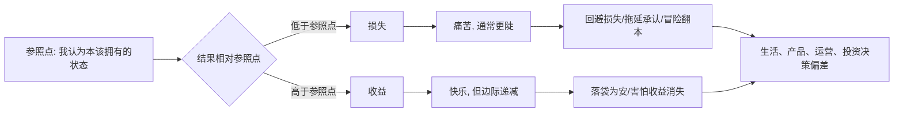

## 脑科学思维筑基课: 损失厌恶公理: 人不是怕风险, 是更怕失去

### 作者
digoal

### 日期
2026-05-19

### 标签
损失厌恶 , 前景理论 , 参照点 , 沉没成本 , 止损 , 用户权益 , 运营转化 , 投资心理 , 处置效应 , 风险决策

----

## 背景

> 面向对象: 大学生、产品经理、运营经理、有投融资需求的人  
> 核心问题: 为什么人明知道沉没成本不该影响决策, 却还是舍不得放弃? 为什么投资者容易拿不住盈利、割不掉亏损? 为什么用户对“失去权益”比“获得奖励”更敏感?  
> 先说结论: 人对损失的痛感通常强于同等收益的快感。决策不是围绕最终财富绝对值展开, 而是围绕“我相对参照点是赚了还是亏了”展开。

## 一张图先看懂



损失厌恶的关键不是“人讨厌亏钱”这么简单, 而是:

```text
同样 100 元, 从 0 到 +100 和从 0 到 -100, 心理强度不对称。
```

很多科普会说“损失痛苦约等于收益快乐的 2 到 2.5 倍”。这个说法有助于形成直觉, 但不能当成固定公式。不同金额、场景、经验和参照点下, 强度会变化。真正稳定的底层结构是: 损失通常比同等收益更能驱动行为。

一个文本版价值曲线:

```text
心理价值
  ^
  |             收益: 快乐增加, 但越往后越钝
  |           /
  |         /
  |_______/________________> 相对参照点变化
  |      /
  |     /
  |    /  损失: 痛苦下降更陡
  v
```

## 求真讲法

### 它到底说了什么

损失厌恶公理可以表述为:

> 在许多决策场景中, 人对损失、放弃、降级、错过、承认失败的敏感度, 往往大于对同等收益、升级、获得、成功的敏感度。

这里有三个关键词。

第一, “参照点”。损失不是绝对概念, 是相对概念。月薪从 8000 到 10000 是收益; 如果你原本预期 12000, 那 10000 也可能被体验成损失。

第二, “同等收益”。损失厌恶比较的是相近大小的收益和损失。例如得到 100 元和失去 100 元, 心理冲击通常不对称。

第三, “承认失败”。很多损失不是损失发生时最痛, 而是你承认它已经发生时最痛。投资者不卖亏损股, 常常不是因为亏损不存在, 而是因为卖出会把账面亏损变成心理上的“我错了”。

### 它是怎么来的

传统经济学常假设人关心最终财富。例如一个人从 100 万变成 101 万, 另一个人从 200 万变成 201 万, 都是多了 1 万。

但现实中, 人常常不是这样感受的。我们更关心变化:

```text
我比昨天多了还是少了?
我比预期多了还是少了?
我比别人多了还是少了?
我是不是失去了本来属于我的东西?
```

Kahneman 和 Tversky 在 1979 年提出前景理论, 用来描述人在风险下的真实选择。这个理论把价值建立在“收益和损失”上, 而不是最终资产总量上; 并提出价值函数在损失一侧通常更陡。

1991 年, Tversky 和 Kahneman 又在无风险选择中发展了参照依赖模型, 把损失厌恶用于解释消费选择、禀赋效应和现状偏好。禀赋效应说的是: 一旦某物被你拥有, 你往往会要求更高价格才愿意放弃它。

后来的神经经济学研究也发现, 在风险决策中, 大脑对潜在收益和潜在损失的反应并不只是对称相反。Tom、Fox、Trepel 和 Poldrack 在 2007 年的研究显示, 与价值和奖励相关的脑区活动会随潜在收益增加而增强, 随潜在损失增加而降低, 这种模式与行为上的损失厌恶相关。

这些研究共同说明: 损失厌恶不是一句“人性弱点”, 而是人类在不确定世界中保护既有资源的一种默认机制。

### 它依赖哪些假设

| 假设 | 含义 | 不成立时会怎样 |
|---|---|---|
| 人有参照点 | 决策围绕“相对得到/失去”展开 | 如果参照点变化, 同一结果会被重新解释 |
| 损失比收益更突出 | 大脑更优先处理威胁、失去和下行风险 | 在安全、低金额、娱乐化场景中可能变弱 |
| 承认损失有身份成本 | 损失不仅是钱, 还可能意味着“我错了” | 若能把错误和自尊分离, 止损会更容易 |
| 人会做心理账户 | 不同钱、时间、权益被分到不同账户 | 同样金额在不同账户里痛感不同 |
| 环境会设计参照点 | 原价、会员权益、历史收益、峰值资产都会变成参照点 | 产品、运营和市场叙事能放大或缓和损失感 |

这五个假设提醒我们: 损失厌恶不是固定按钮, 而是被参照点、身份、账户和环境共同塑造出来的行为倾向。

### 常见误解

误解一: 损失厌恶等于风险厌恶。

不等于。人面对确定收益时常常保守, 面对确定损失时反而可能冒险。比如确定亏 1000 和赌一把有机会回本, 很多人会选择赌一把。这不是单纯怕风险, 而是怕承认损失。

误解二: 损失厌恶只和钱有关。

不是。时间、面子、地位、自由、会员权益、学习投入、人际关系, 都可以变成“我已经拥有的东西”。一旦被体验成损失, 反应就会变强。

误解三: 损失厌恶一定是坏事。

不是。它能让人保护生命、资源、信誉和长期积累。没有损失厌恶, 人可能会轻率冒险。问题在于: 它有时会让人保护错误资产、错误关系、错误项目。

误解四: 知道沉没成本就能摆脱沉没成本。

通常不能。沉没成本不是知识题, 而是情绪题和身份题。你不是不知道过去的钱回不来, 你是不愿承认“当初投入可能错了”。

误解五: 用损失文案一定能提高转化。

不一定。损失框架如果过度使用, 会制造焦虑和不信任。短期可能有效, 长期可能损害品牌和用户关系。

## 求存讲法

### 它有什么用

损失厌恶能帮你解释四类常见行为。

第一, 为什么人难以放弃。放弃不是停止投入, 而是承认过去投入无法兑换未来。

第二, 为什么用户害怕降级。会员权益、历史数据、身份等级、优惠资格, 一旦变成“已拥有”, 取消就像损失。

第三, 为什么运营能用“限时、资格、即将失效”推动行动。它不是让用户看见收益, 而是让用户感到不行动会失去。

第四, 为什么投资者容易卖飞盈利、死扛亏损。盈利时害怕收益消失, 亏损时害怕亏损坐实。

### 它怎么迁移到熟悉领域

#### 1. 学习: 害怕丢脸比追求进步更强

大学生上课不提问, 表面是“不懂也无所谓”。底层可能是:

```text
提问的收益: 可能搞懂一个知识点
提问的损失: 可能显得我很笨
```

如果班级文化把提问看成暴露缺陷, 损失厌恶就会压过学习收益。更好的学习环境不是喊“大家积极一点”, 而是重新设计参照点:

```text
旧参照点: 不犯错才正常
新参照点: 暴露问题才是学习进展
```

当“提问”从丢脸变成完成任务, 学习行为才会发生。

#### 2. 产品: 试用、默认值和权益设计都在移动参照点

产品经理要理解: 用户不只是比较“买不买”, 还在比较“我会不会失去现在的状态”。

| 设计 | 用户参照点如何变化 | 风险 |
|---|---|---|
| 免费试用高级版 | 高级功能变成暂时拥有的东西 | 到期降级会产生损失感 |
| 默认保存历史记录 | 数据连续性变成资产 | 迁移成本提高, 也要保护隐私 |
| 会员等级 | 等级和身份变成参照点 | 降级会引发强烈不满 |
| 优惠券即将过期 | 不使用被感知为损失 | 过度使用会训练用户等券 |
| 取消订阅多步确认 | 放大“失去权益”的感觉 | 可能形成暗黑模式, 损害信任 |

好的产品设计不是操控用户害怕失去, 而是帮助用户看清真实得失。短期转化不能以长期信任为代价。

#### 3. 运营: “你将失去什么”比“你将得到什么”更容易触发行动

运营里常见两种表达。

```text
收益框架: 今天下单可获得 50 元优惠
损失框架: 50 元优惠将在今晚失效
```

后者通常更容易让用户行动, 因为它把“不下单”从什么都没发生, 改写成“失去 50 元资格”。

但这里有边界。如果商品本身价值不足, 损失框架只会透支信任。长期有效的运营要满足:

```text
真实价值存在 -> 参照点清晰 -> 损失提醒适度 -> 用户行动后不后悔
```

如果用户行动后发现只是套路, 下一次他会把你的提醒归类为噪音。

#### 4. 投融资: 亏损最可怕的不是金额, 是它挑战了自我模型

投资里, 损失厌恶会制造三个典型错误。

第一, 不愿止损。因为卖出亏损资产等于承认判断错了。

第二, 过早止盈。因为账面盈利一旦出现, 人会害怕它消失。

第三, 错过机会。因为新机会的不确定损失, 比旧资产的缓慢变坏更刺眼。

一个简化模型:

```text
买入价 -> 变成参照点
最高浮盈 -> 也会变成参照点
别人收益 -> 还会变成参照点
```

所以投资者真正要管理的, 不只是仓位, 还有参照点。买入价不是市场欠你的钱, 历史高点也不是你应得的财富。

### 它的适用范围和边界

损失厌恶适合分析:

- 为什么人不愿承认错误
- 为什么消费者讨厌降级、涨价和权益取消
- 为什么会员、积分、等级、连续签到有效
- 为什么投资者有处置效应
- 为什么组织继续投入失败项目
- 为什么改变现状比设计新方案更难

但它不能被滥用为:

- “只要制造焦虑就能成交”
- “用户不买是因为损失感不够强”
- “所有不放弃都是非理性”
- “止损一定正确, 坚持一定错误”
- “亏损资产都该卖, 盈利资产都该拿”

边界在于: 有些损失是短期表象, 有些坚持是长期正确。损失厌恶提醒你不要被痛感绑架, 但它不能替代基本面分析、产品价值判断和人生目标判断。

### 正例: 怎么用它提升能力

#### 正例一: 大学生把“犯错”改造成学习资产

如果错题只意味着扣分, 学生会逃避错题。可以改成:

```text
每发现一个高频错误 -> 记入错题资产表
每解决一类错误 -> 得到一个能力标签
每周复盘错误减少量 -> 看见进步
```

这等于移动参照点: 从“我不能错”变成“我不能浪费错误”。损失厌恶不再阻止学习, 反而推动学生不愿失去复盘机会。

#### 正例二: 产品经理设计“可逆操作”

用户害怕尝试新功能, 常常不是不需要, 而是怕损失现状。比如改配置、迁移数据、开启自动化, 都可能让用户担心“出错后回不去”。

降低损失感的方法:

```text
预览 -> 一键撤销 -> 保留旧版本 -> 小范围试用 -> 明确退出路径
```

这不是增加功能, 而是降低尝试的心理风险。用户一旦知道损失可控, 才愿意探索收益。

#### 正例三: 投资者把止损从情绪动作变成规则动作

止损最难发生在亏损后, 因为那时损失厌恶最强。更好的做法是在买入前写清楚:

| 买入前要写 | 作用 |
|---|---|
| 我为什么买 | 防止事后改故事 |
| 哪个事实证明我错了 | 把亏损和错误区分开 |
| 亏损多少只是波动 | 避免被噪音洗出去 |
| 什么条件必须退出 | 避免死扛 |
| 如果卖出后上涨怎么办 | 提前接受机会成本 |

关键不是机械止损, 而是提前定义“什么叫判断失效”。这样卖出就不是承认自己无能, 而是执行系统。

### 反例: 前提不成立会怎样

#### 反例一: 用“损失提醒”逼用户续费

某产品在用户取消订阅时反复提示“你将失去全部权益”“你的等级即将清零”“确认放弃专属身份吗”。短期取消率下降, 但用户在社交平台吐槽, 品牌信任受损。

这里失败的假设是: 环境会设计参照点。产品确实设计了损失感, 但没有尊重用户真实选择。损失厌恶被滥用后, 会从转化工具变成信任负债。

#### 反例二: 投资者把“长期主义”当成不止损借口

某投资者买入一家公司后, 行业竞争格局恶化、现金流变差、管理层持续损害股东利益。但他不愿卖出, 理由是“长期投资要有耐心”。

这里失败的假设是: 承认损失有身份成本。所谓长期主义, 变成保护自尊的故事。真正的问题不是价格下跌, 而是买入逻辑已经失效。

#### 反例三: 创业团队因为已经投入太多而继续错误项目

团队做了半年产品, 数据一直不好。每次复盘都说“再给一个版本机会”。真正原因不是新证据支持继续, 而是没人愿意承认过去半年可能走错。

这里失败的假设是: 人会做心理账户。过去投入被放进“不能浪费”的账户, 但理性上, 未来资源应该投向未来回报最高的方向, 不该由过去成本决定。

## 一个可复用的判断工具

遇到生活、产品、运营、投资问题时, 用下面这张表拆解损失厌恶。

| 问题 | 目的 |
|---|---|
| 我的参照点是什么? | 找出“我以为本该拥有”的东西 |
| 这个损失是真损失, 还是面子/身份损失? | 区分钱、时间、尊严和叙事 |
| 如果今天从零开始, 我还会选择它吗? | 对抗沉没成本 |
| 我是在规避亏损, 还是在规避承认错误? | 识别自我保护 |
| 用户会觉得自己失去什么? | 评估产品和运营设计的心理成本 |
| 这个损失提醒是否真实、适度、可解释? | 避免暗黑模式 |
| 我有没有提前定义退出条件? | 避免情绪时刻临时决策 |

压缩成一句话:

> 先找参照点, 再算真实得失; 先分清损失, 再决定坚持还是止损。

## 思考

表面变化越快, 损失厌恶越容易被利用。

因为每个新平台、新产品、新资产、新叙事, 都可以帮你制造一个参照点: 你本来可以更富、更自由、更先进、更受欢迎。如果你不行动, 你就在失去。

这就是许多消费、运营和投资故事的底层结构:

```text
先制造“本该拥有”
再提醒“即将失去”
最后催促“立刻行动”
```

成熟判断不是没有损失感。没有损失感的人会鲁莽。成熟判断是能追问:

> 这个损失, 是现实给我的信号, 还是别人替我设置的参照点?

对大学生来说, 你要警惕因为怕丢脸而不提问, 因为怕失败而不开始。

对产品经理来说, 你要知道用户害怕失去现状, 所以迁移、试用、配置、付款都要降低可感知损失。

对运营经理来说, 你可以提醒用户权益即将失效, 但不能把用户焦虑当作长期资产。

对投资者来说, 你必须把买入价、历史高点、别人收益从“应得之物”里剥离出来。市场不认识你的参照点。

最后问一个反事实问题:

> 如果你没有投入过时间、金钱、面子和情绪, 今天还会重新选择这件事吗?

如果答案是否定的, 你坚持的可能不是未来价值, 而是过去损失。

## 最后记住

1. 损失厌恶不是简单怕亏, 而是相对参照点的损失痛感更强。
2. 参照点会被买入价、原价、权益、身份、历史高点和他人收益塑造。
3. 产品和运营可以利用损失厌恶, 但过度制造焦虑会透支信任。
4. 投资中最危险的不是亏损本身, 而是不愿承认买入逻辑失效。
5. 判断一件事该坚持还是止损, 要问“如果从零开始, 我还会不会选它”。

## 参考资料

- Daniel Kahneman, Amos Tversky, [Prospect Theory: An Analysis of Decision under Risk](https://tesnewdev.econometricsociety.org/publications/econometrica/browse/1979/03/01/prospect-theory-analysis-decision-under-risk), Econometrica, 1979.
- Amos Tversky, Daniel Kahneman, [Loss Aversion in Riskless Choice: A Reference-Dependent Model](https://academic.oup.com/qje/article-pdf/106/4/1039/5298142/106-4-1039.pdf), Quarterly Journal of Economics, 1991.
- Daniel Kahneman, Jack L. Knetsch, Richard H. Thaler, [Anomalies: The Endowment Effect, Loss Aversion, and Status Quo Bias](https://www.aeaweb.org/articles?id=10.1257%2Fjep.5.1.193), Journal of Economic Perspectives, 1991.
- Sabrina M. Tom, Craig R. Fox, Christopher Trepel, Russell A. Poldrack, [The Neural Basis of Loss Aversion in Decision-Making under Risk](https://pubmed.ncbi.nlm.nih.gov/17255512/), Science, 2007.
- Hersh Shefrin, Meir Statman, [The Disposition to Sell Winners Too Early and Ride Losers Too Long: Theory and Evidence](https://ideas.repec.org/a/bla/jfinan/v40y1985i3p777-90.html), Journal of Finance, 1985.
- William Samuelson, Richard Zeckhauser, [Status Quo Bias in Decision Making](https://rzeckhauser.scholars.harvard.edu/publications/status-quo-bias-decision-making), Journal of Risk and Uncertainty, 1988.
  
#### [PostgreSQL 解决方案集合](../201706/20170601_02.md "40cff096e9ed7122c512b35d8561d9c8")
  
  
#### [德哥 / digoal's Github - 公益是一辈子的事.](https://github.com/digoal/blog/blob/master/README.md "22709685feb7cab07d30f30387f0a9ae")
  
  
#### [About 德哥](https://github.com/digoal/blog/blob/master/me/readme.md "a37735981e7704886ffd590565582dd0")
  
  

  
