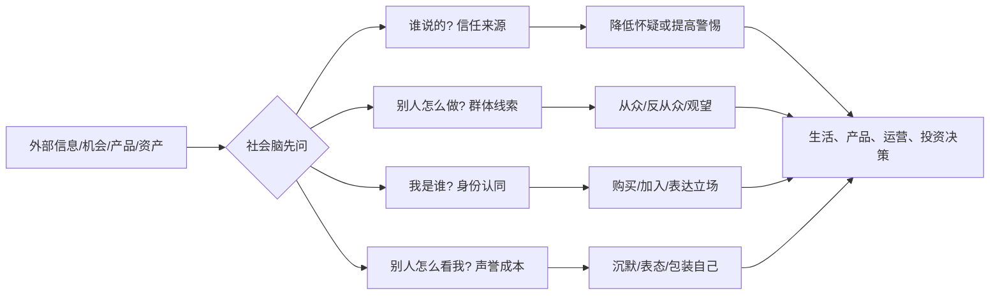

## 脑科学思维筑基课: 社会脑公理: 人先判断关系, 再判断事实

### 作者
digoal

### 日期
2026-05-19

### 标签
社会脑 , 群体心理 , 信任机制 , 身份认同 , 声誉成本 , 产品增长 , 社群运营 , 从众效应 , 信息瀑布 , 投资共识

----

## 背景

> 面向对象: 大学生、产品经理、运营经理、有投融资需求的人  
> 核心问题: 为什么朋友推荐的信息更容易被相信? 为什么产品不只是功能, 还要有身份和社交证明? 为什么投资者明知要独立思考, 仍然会被“大家都在买”带走?  
> 先说结论: 人不是孤立的大脑在处理事实, 而是在群体、身份、信任、声誉和地位里处理事实。很多判断看似理性, 底层其实先问了三个问题: 这是谁说的? 这会让我属于谁? 这会影响别人怎么看我吗?

## 一张图先看懂



社会脑公理不是说“人都不理性”。它说的是: 人类理性经常先经过社会过滤器。

```text
事实本身 -> 来源是谁 -> 群体怎么看 -> 是否符合身份 -> 是否有声誉风险 -> 我如何行动
```

如果你只看事实, 不看事实进入人脑时经过了哪些社会通道, 你就很难理解传播、消费、组织、市场和泡沫。

## 求真讲法

### 它到底说了什么

社会脑公理可以表述为:

> 人类大脑高度适应群体生活, 会持续计算他人的意图、信任度、地位关系、联盟边界和声誉后果; 因此, 许多个人决策实际是社会决策。

这里有五个关键词。

第一, “意图”。别人为什么这么说? 他是帮我, 还是利用我? 他有没有隐藏动机?

第二, “信任”。同一句话, 老师说、朋友说、陌生账号说、利益相关者说, 大脑给出的可信度不同。

第三, “地位”。人会在意自己在群体里的位置。很多消费、表达和职业选择, 都带有地位信号。

第四, “联盟”。人会区分“我们”和“他们”。一旦进入阵营判断, 事实就容易被身份过滤。

第五, “声誉”。人不只问这件事对不对, 还问说出来、买了、卖了、加入了之后, 别人会怎么看我。

### 它是怎么来的

社会脑假说认为, 灵长类尤其是人类的大脑扩张, 与复杂社会关系的处理需求有关。Dunbar 的经典工作把新皮层比例和群体规模联系起来, 并提出人类稳定社会关系规模大约在 150 左右。这个数字不应该被当成精确上限, 更适合理解为一个提醒: 亲密、稳定、可维护的社会关系受认知资源限制。

默认模式网络的研究也支持一个方向: 大脑在没有外部任务压迫时, 常会进入自我相关、回忆未来、理解他人和社会推断等活动。换句话说, 人脑“空闲”时并不空白, 它常常在模拟关系、身份和他人想法。

社会心理学中的从众研究也说明, 群体压力会改变人的公开判断。Asch 的线段实验虽然有时代和样本限制, 但它清楚展示了一个机制: 即使答案明显, 群体一致意见也会让个体产生压力。

经济学里的羊群行为和信息瀑布模型进一步解释了市场现象: 当前面的人已经做出选择, 后面的人可能会忽略自己的私有信息, 转而模仿他人。这样, 看似很多人都做了独立判断, 实际可能只是一个社会信号被层层放大。

这些证据共同指向同一件事: 人类判断不是只在事实和逻辑之间发生, 还发生在关系网络中。

### 它依赖哪些假设

| 假设 | 含义 | 不成立时会怎样 |
|---|---|---|
| 人依赖群体生存 | 信任、合作、声誉会影响资源和安全 | 在一次性匿名场景中, 社会约束会减弱 |
| 社会信息有预测价值 | 别人的选择可能包含我不知道的信息 | 如果群体也缺乏信息, 从众会放大错误 |
| 身份会过滤事实 | 人会维护“我是谁”和“我们是谁” | 身份威胁强时, 事实说服力下降 |
| 声誉成本真实存在 | 表态、购买、加入、退出都会被他人解读 | 匿名或低可见场景中, 行为可能不同 |
| 关系维护需要认知资源 | 稳定关系数量和质量受时间、注意力限制 | 社群扩大后, 信任会从关系转向规则和制度 |

这些假设决定了社会脑公理的边界。它不是说人永远盲从, 而是说: 当关系、身份和声誉进入场景, 事实会被重新加权。

### 常见误解

误解一: 社会脑等于人喜欢社交。

不是。有些人不爱热闹, 但仍然会在意信任、评价、归属和边界。社会脑不是外向性格, 而是关系计算能力。

误解二: 群体判断一定错。

不一定。群体有时能聚合分散信息, 提高判断质量。问题出在群体成员不独立、信息高度重复、声誉压力过强时。

误解三: 独立思考就是不听别人。

不是。真正的独立思考不是拒绝社会信息, 而是区分“别人提供了新证据”还是“别人只是给了我压力”。

误解四: 产品只要功能好, 社交和身份不重要。

很多产品的功能价值和社会价值混在一起。健身、学习、投资、办公、内容社区、消费品牌, 都常常同时满足任务需求和身份需求。

误解五: 投资中理解群体心理比财报更重要。

这句话容易误导。更准确的说法是: 短期价格常被群体心理推动, 长期价值仍要回到现金流、竞争力和资本配置。只看财报会忽略市场预期, 只看情绪会失去锚。

## 求存讲法

### 它有什么用

社会脑公理能把很多表面现象翻译成关系问题。

大学生不敢提问, 可能不是不会问, 而是害怕在同伴面前显得笨。

用户不转发产品, 可能不是产品没用, 而是转发会损害他的形象。

社群运营失败, 可能不是活动不够多, 而是成员之间没有信任、身份和稳定互动。

投资者追热点, 可能不是不知道风险, 而是害怕错过群体共识带来的机会, 也害怕自己显得落后。

### 它怎么迁移到熟悉领域

#### 1. 学习: 班级文化会改变学习行为

同样一个课堂, 如果默认文化是“提问说明你不懂”, 学生就会沉默。如果默认文化是“好问题能帮助全班”, 学生就更愿意暴露困惑。

学习不是纯个人行为, 它有社会成本。

```text
错误环境: 提问 -> 暴露无知 -> 被评价 -> 沉默
好环境: 提问 -> 贡献问题 -> 获得反馈 -> 更愿意学习
```

所以大学生想提升能力, 不只要找资料, 还要找能让自己暴露问题的圈子。能安全暴露无知的圈子, 比只会互相展示成果的圈子更有学习价值。

#### 2. 产品: 用户买的是任务完成, 也是身份表达

产品经理需要问两组问题。

第一组是功能问题:

| 问题 | 解释 |
|---|---|
| 用户要完成什么任务? | 工具价值 |
| 用户为什么现在做不到? | 摩擦和约束 |
| 用户第一次成功在哪里? | 激活路径 |

第二组是社会问题:

| 问题 | 解释 |
|---|---|
| 用户使用后希望别人怎么看他? | 身份价值 |
| 用户愿不愿意公开分享? | 声誉风险 |
| 谁的推荐最能降低怀疑? | 信任来源 |
| 群体里谁先用会带动别人? | 关键节点 |

如果你做的是效率工具, 社会价值可能是“专业、可靠、少出错”。如果你做的是学习产品, 社会价值可能是“我在进步、我属于认真学习的人”。如果你做的是投资产品, 社会价值可能是“我不是韭菜, 我有方法”。

#### 3. 运营: 社群不是把人拉进群, 而是建立可重复的信任关系

很多运营把社群理解成流量池, 于是每天发通知、发优惠、发链接。结果群越来越安静。

社会脑视角下, 社群至少有三层结构:

```text
信息层: 有用信息
关系层: 谁可信、谁常贡献、谁能帮我
身份层: 我为什么属于这里
```

只有信息层, 群很容易变成公告栏。关系层起来后, 成员会互相回答、互相推荐。身份层起来后, 成员会维护群体质量。

运营要设计的不是“更多触达”, 而是:

```text
可信的人 -> 稳定的互动 -> 明确的群体身份 -> 可见的贡献反馈
```

#### 4. 投融资: 市场价格里有社会信息, 也有社会噪音

投资者看到“很多聪明人都买了”, 大脑会自动降低怀疑。这是社会脑的正常反应。因为在很多生活场景里, 模仿成功者能降低试错成本。

但市场里有一个问题: 价格本身会反过来制造社会证明。

```text
上涨 -> 更多人相信 -> 更多人买入 -> 继续上涨 -> 更像真理
```

这会形成信息瀑布。每个人都以为前面的人掌握了信息, 但前面的人可能也只是看见更前面的人买了。

所以投资中要拆开两件事:

| 看到的社会信号 | 应追问的问题 |
|---|---|
| 大家都在买 | 他们知道什么新事实, 还是只在追价格? |
| 知名机构进场 | 仓位多大、成本多少、期限多长、约束是什么? |
| 社群一致看多 | 反方观点在哪里? 是否被身份压力压住? |
| 朋友强烈推荐 | 他承担风险吗? 他的信息源是什么? |
| 媒体反复报道 | 是基本面变化, 还是叙事扩散? |

社会信号可以作为线索, 不能替代估值、现金流、竞争格局和风险承受能力。

### 它的适用范围和边界

社会脑公理适合解释:

- 为什么熟人推荐转化率更高
- 为什么用户会为身份和地位付费
- 为什么社群会形成回音壁
- 为什么组织里坏消息上不去
- 为什么市场会出现羊群行为
- 为什么人害怕退出一个错误共识

但它不能被滥用为:

- “人都是从众的, 所以不用讲事实”
- “只要找 KOL 背书就能卖产品”
- “投资就是研究情绪, 基本面不重要”
- “社群越大越好”
- “用户身份感越强越好”

边界在于: 社会脑能放大信任, 也能放大错误; 能建立归属, 也能制造排斥; 能降低试错成本, 也能让人停止独立判断。

### 正例: 怎么用它提升能力

#### 正例一: 大学生主动选择高质量反馈圈

一个学生想提高表达能力。如果只自己练, 反馈少; 如果进入一个只会互相夸奖的圈子, 反馈失真; 如果进入一个能具体指出问题又不羞辱人的小组, 进步会快很多。

好圈子的标准:

| 标准 | 含义 |
|---|---|
| 允许暴露不足 | 不把问题当成丢脸 |
| 反馈具体 | 说清楚哪里好、哪里差、怎么改 |
| 成员有共同目标 | 不是互相消耗注意力 |
| 有真实输出 | 不是只聊天和表态 |
| 有基本信任 | 不用把大量精力花在防御上 |

社会脑不是只会让人从众。被设计好的社会环境, 可以让人更容易学习。

#### 正例二: 产品经理为新产品设计信任入口

假设一个产品是面向投资新手的分析工具。直接告诉用户“我们模型很强”未必有效。用户首先会问: 我凭什么信你?

更好的信任入口可能是:

```text
明确数据来源 -> 展示历史回测边界 -> 给出反例和风险提示 -> 用户可验证计算过程 -> 专业用户案例
```

这里社会脑的作用不是制造热闹, 而是降低“我是不是被忽悠”的关系风险。

#### 正例三: 投资者建立反共识机制

投资者可以在每次买入热门资产前强制写三栏:

| 栏目 | 要回答 |
|---|---|
| 群体共识 | 大家为什么看好? |
| 独立事实 | 有哪些不依赖舆论的证据? |
| 反方证据 | 如果大家都错了, 最可能错在哪里? |

这个动作不是为了反着买, 而是为了防止社会信号冒充事实。

### 反例: 前提不成立会怎样

#### 反例一: 产品只做社交证明, 没有真实价值

某产品找很多人站台, 首页放满用户数量、名人推荐、媒体报道。初期转化不错, 但用户进来后发现核心功能不好用, 留存快速下降。

这里失败的假设是: 社会信息有预测价值。背书可以降低怀疑, 但如果背书和真实体验不一致, 社会证明会反噬信任。

#### 反例二: 社群运营把归属感做成排外感

一个学习社群为了强化身份, 不断强调“我们和普通人不一样”。短期成员凝聚力上升, 长期变成互相吹捧、排斥批评、拒绝外部信息。

这里失败的假设是: 身份会过滤事实。身份感太强时, 社群会从学习系统变成防御系统。

#### 反例三: 投资者把机构持仓当成买入理由

某投资者看到知名机构持有一家公司, 直接跟买。后来股价下跌, 才发现机构成本更低、期限更长、仓位很小, 并且有对冲。

这里失败的假设是: 社会信息有预测价值。机构行为确实是社会信号, 但它不是完整决策。你看见的是动作, 没看见约束、成本和组合结构。

## 一个可复用的判断工具

遇到生活、产品、运营、投资问题时, 用这张表拆解社会脑。

| 问题 | 目的 |
|---|---|
| 这个信息是谁说的? | 识别信任来源 |
| 他为什么这么说? | 识别利益和动机 |
| 我相信的是事实, 还是关系? | 区分证据和信任 |
| 我是不是害怕被群体排除? | 识别归属压力 |
| 我是不是为了身份而购买、表达或投资? | 识别自我叙事 |
| 群体成员的信息是否独立? | 防止信息瀑布 |
| 反方观点为什么没有出现? | 识别沉默和声誉成本 |
| 如果匿名, 我还会做同样选择吗? | 区分真实偏好和声誉表演 |

压缩成一句话:

> 先问关系, 再看事实; 先拆信号, 再信共识。

## 思考

表面变化越快, 社会脑越容易被调用。

因为信息太多时, 人不可能逐条验证。于是我们自然依赖关系线索: 谁推荐的, 多少人买了, 哪个圈子在讨论, 我所在群体怎么看。

这不是愚蠢, 是节省成本。但它有代价。社会信号一旦被平台、营销、社群和市场机制放大, 就可能让人把“热闹”误认成“真实”。

产品经理要理解: 用户不是只在买功能, 还在买一个社会位置。

运营经理要理解: 社群不是流量容器, 而是信任网络。

大学生要理解: 你加入什么圈子, 会改变你觉得什么正常。

投资者要理解: 市场里的“大家都这么看”, 可能是信息, 也可能是噪音, 还可能是价格上涨制造出来的幻觉。

最后问一个反事实问题:

> 如果没有点赞、排名、群聊、朋友推荐、机构背书和别人眼光, 你还会做同样的判断吗?

如果答案变了, 说明你的判断里有很大一部分不是事实判断, 而是社会判断。

## 最后记住

1. 人类不是孤立处理事实, 而是在关系、身份、信任和声誉中处理事实。
2. 社会信号能降低判断成本, 也能放大错误共识。
3. 产品和运营要建立真实信任, 不能只堆背书和热闹。
4. 投资中要区分“别人提供了新证据”和“别人只是制造了压力”。
5. 真正的独立思考不是拒绝群体, 而是知道什么时候该信群体、什么时候该拆共识。

## 参考资料

- Robin I. M. Dunbar, [The Social Brain Hypothesis](https://www.psy.ox.ac.uk/publications/945594), Evolutionary Anthropology, 1998.
- Robin I. M. Dunbar, [The Social Brain: Mind, Language, and Society in Evolutionary Perspective](https://www.annualreviews.org/doi/10.1146/annurev.anthro.32.061002.093158), Annual Review of Anthropology, 2003.
- R. Nathan Spreng, [The brain's default network: updated anatomy, physiology and evolving insights](https://www.nature.com/articles/s41583-019-0212-7), Nature Reviews Neuroscience, 2019.
- Lucina Q. Uddin, [20 years of the default mode network: A review and synthesis](https://www.sciencedirect.com/science/article/am/pii/S0896627323003082), Neuron, 2023.
- Solomon E. Asch, Opinions and Social Pressure, Scientific American, 1955. 用于理解从众压力的经典社会心理学实验。
- Abhijit V. Banerjee, [A Simple Model of Herd Behavior](https://economics.mit.edu/sites/default/files/publications/banerjee92herd.pdf), Quarterly Journal of Economics, 1992.
- Sushil Bikhchandani, David Hirshleifer, Ivo Welch, [A Theory of Fads, Fashion, Custom, and Cultural Change as Informational Cascades](https://snap.stanford.edu/class/cs224w-readings/bikhchandani92fads.pdf), Journal of Political Economy, 1992.
  
#### [PostgreSQL 解决方案集合](../201706/20170601_02.md "40cff096e9ed7122c512b35d8561d9c8")
  
  
#### [德哥 / digoal's Github - 公益是一辈子的事.](https://github.com/digoal/blog/blob/master/README.md "22709685feb7cab07d30f30387f0a9ae")
  
  
#### [About 德哥](https://github.com/digoal/blog/blob/master/me/readme.md "a37735981e7704886ffd590565582dd0")
  
  

  
