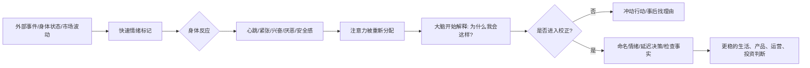

## 脑科学思维筑基课: 情绪优先公理: 先有感觉, 后有理由

### 作者
digoal

### 日期
2026-05-19

### 标签
情绪优先 , 躯体标记 , 情感启发式 , 决策系统 , 用户体验 , 运营触发 , 投资情绪 , 风险感知 , 注意力偏向 , 行为控制

----

## 背景

> 面向对象: 大学生、产品经理、运营经理、有投融资需求的人  
> 核心问题: 为什么人在恐惧、愤怒、兴奋、羞耻时, 明知道要理性, 却还是会冲动消费、冲动争吵、冲动交易? 为什么“讲道理”经常讲不进去?  
> 先说结论: 情绪不是理性的敌人, 而是决策系统的前置评分器。它先告诉你“危险、值得、讨厌、想要、别靠近”, 理性再来解释、校正和选择。真正成熟的判断不是压掉情绪, 而是先识别情绪, 再决定是否信它。

## 一张图先看懂



这张图的重点是顺序。

```text
不是: 事实 -> 理性分析 -> 情绪反应 -> 决策
更常见是: 刺激 -> 情绪标记 -> 注意力偏向 -> 理由生成 -> 决策
```

所以“我只是客观判断”这句话要小心。很多时候, 你先有了恐惧、兴奋、厌恶或安全感, 再为它找到看似合理的理由。

一个最简例子:

```text
市场下跌 -> 身体紧张 -> 注意力只看坏消息 -> 解释为“完了” -> 卖出
市场上涨 -> 身体兴奋 -> 注意力只看好消息 -> 解释为“趋势来了” -> 追高
```

## 求真讲法

### 它到底说了什么

情绪优先公理可以表述为:

> 在许多真实决策中, 情绪会先于完整理性分析给事件打上价值标签, 影响注意力、记忆、风险感知和行动倾向; 理性常常不是从零开始判断, 而是在情绪设定的方向上解释和校正。

这里有四个关键词。

第一, “价值标签”。情绪会快速告诉你: 这件事对我有利还是有害, 靠近还是远离, 继续还是停止。

第二, “身体信号”。焦虑不是一个抽象词, 它可能表现为心跳、胃部收缩、肩颈紧绷、睡不着。身体状态会反过来影响判断。

第三, “注意力偏向”。恐惧时更容易看见风险, 愤怒时更容易看见冒犯, 兴奋时更容易看见机会, 羞耻时更容易看见评价。

第四, “事后解释”。人很擅长为已经产生的感觉找理由。理由可能是真的, 也可能只是情绪的律师。

### 它是怎么来的

从神经科学看, 情绪和决策不是两个完全分离的系统。Phelps 和 LeDoux 对杏仁核研究的综述显示, 杏仁核参与威胁、恐惧学习和情绪记忆等过程, 并会影响注意和行为反应。但现代研究也提醒我们, 情绪处理不是“杏仁核一个按钮”, 而是多条脑网络共同参与。

从决策研究看, Damasio 的躯体标记假说提出: 人在复杂不确定决策中, 会借助身体和情绪信号给选项做快速标记。Bechara、Damasio 等人在爱荷华赌博任务中发现, 腹内侧前额叶受损的病人即使智力测验表现正常, 也可能在真实决策任务里持续选择短期诱惑、忽视长期后果。

从行为经济学看, Slovic 等人的情感启发式说明, 人们评估风险和收益时, 常会受到对对象的整体好恶影响。喜欢一个事物时, 容易觉得它收益高、风险低; 讨厌一个事物时, 容易觉得它收益低、风险高。

从心理学综述看, Lerner、Li、Valdesolo 和 Kassam 总结了几十年研究: 情绪是强大、普遍、可预测的决策驱动力, 有时有害, 有时有益。

这些研究共同说明: 情绪不是理性之外的噪音, 而是理性决策系统的一部分。问题不在有没有情绪, 而在你能不能识别它、校正它、利用它。

### 它依赖哪些假设

| 假设 | 含义 | 不成立时会怎样 |
|---|---|---|
| 情绪含有信息 | 情绪反映风险、价值、身体状态或经验记忆 | 若情绪来自无关来源, 判断会被污染 |
| 情绪会重分配注意力 | 情绪让某些信息更显眼, 另一些信息被忽略 | 高唤醒状态下容易只看单一线索 |
| 理性会事后解释 | 人会给感觉寻找理由 | 理由可能合理, 也可能只是合理化 |
| 身体状态参与决策 | 疲劳、饥饿、睡眠、压力会改变判断 | 状态差时, 重要决策质量下降 |
| 情绪可以被调节但不能被命令消失 | 命名、延迟、呼吸、换环境、写清单能降低强度 | 强压情绪可能让它以更隐蔽方式影响判断 |

这五个假设决定了情绪优先公理的边界。它不是说情绪永远正确, 而是说: 情绪常常先到场, 不处理它, 理性就可能只是它的解释工具。

### 常见误解

误解一: 情绪优先等于情绪正确。

不是。情绪是信号, 不是判决。烟雾报警器响了, 可能真着火, 也可能只是厨房油烟。你要检查, 不能直接砸掉报警器, 也不能不看现场就逃跑。

误解二: 理性的人没有情绪。

不是。更成熟的理性, 往往是能更早识别情绪, 并为情绪设置决策流程。没有情绪的人未必更会决策, 复杂选择中反而可能失去价值排序。

误解三: 冷静就是压制情绪。

不是。压制是“不许我有这个感觉”; 冷静是“我知道我正在有这个感觉, 但我暂时不让它直接下单、发消息、做承诺”。

误解四: 产品只要功能好, 情绪体验无所谓。

产品留存不只来自功能完成, 还来自安全感、掌控感、成就感、被理解感。功能解决任务, 情绪决定用户是否愿意回来。

误解五: 投资要完全无情。

投资不能被情绪牵着走, 但也不能没有风险感。恐惧提醒你检查下行, 兴奋提醒你检查估值, 厌恶提醒你检查偏见。关键是把情绪转化成清单, 而不是转化成交易。

## 求存讲法

### 它有什么用

情绪优先公理能解释很多表面矛盾。

大学生明知道复盘有用, 但一看错题就逃避, 因为错题触发羞耻感。

产品用户明知道功能有价值, 但一进入复杂页面就退出, 因为失控感先于理解发生。

运营活动明明优惠不大, 但倒计时、排行榜、错过提醒会触发紧迫感。

投资者明知道不能追涨杀跌, 但账户波动会直接触发恐惧和贪婪, 理由随后才来。

### 它怎么迁移到熟悉领域

#### 1. 学习: 情绪决定你能不能面对反馈

学习中最关键的不是“听懂时的舒服”, 而是“不会时能不能停留”。

很多学生逃避难题, 不是因为题目本身不可解, 而是因为题目触发了:

```text
我不会 -> 我很差 -> 别人会看不起我 -> 赶紧离开这个状态
```

更好的学习设计是把反馈去人格化:

```text
错题不是我差 -> 错题是系统给出的定位信号
低分不是身份 -> 低分是当前模型的误差报告
不会不是终点 -> 不会是下一轮训练入口
```

先降低羞耻和恐惧, 大脑才愿意把能量用在分析上。

#### 2. 产品: 用户先感到安全, 才愿意探索

产品经理经常以为用户在读功能说明。实际用户先感受:

| 情绪感受 | 用户行为 | 产品含义 |
|---|---|---|
| 安全 | 敢点击、敢上传、敢试用 | 需要隐私、撤销、预览、明确边界 |
| 掌控 | 愿意继续配置 | 需要进度、反馈、可恢复 |
| 困惑 | 停下或退出 | 需要减少选择、明确主路径 |
| 焦虑 | 反复检查或放弃 | 需要解释风险和后果 |
| 成就 | 愿意复用和分享 | 需要快速让用户完成一次有价值结果 |

一个好产品不只是“能用”, 还要让用户在关键路径上不害怕、不迷路、不后悔。

#### 3. 运营: 情绪触发可以带来行动, 也会制造反噬

运营常用情绪触发:

```text
紧迫感: 仅剩 2 小时
稀缺感: 只剩 5 个名额
归属感: 你已连续打卡 30 天
成就感: 超过 80% 同类用户
损失感: 权益即将失效
```

这些手段并非天然错误。问题在于真实价值是否匹配情绪强度。

如果情绪很强, 价值很弱, 用户行动后会后悔。后悔会被记住, 下次他会自动降低对你的信任。

所以运营要问:

```text
我是在帮助用户克服拖延, 还是在利用用户焦虑?
用户行动后, 会感谢这个提醒, 还是觉得被套路?
```

#### 4. 投融资: 账户波动会先改变身体, 再改变观点

投资里最危险的错觉是: 我是在根据事实改变观点。

有时真实过程是:

```text
价格下跌 -> 身体紧张 -> 搜索坏消息 -> 找到坏消息 -> 认为基本面恶化
价格上涨 -> 身体兴奋 -> 搜索好消息 -> 找到好消息 -> 认为逻辑兑现
```

情绪优先会让投资者在两个方向犯错。

| 情绪 | 常见动作 | 底层问题 |
|---|---|---|
| 恐惧 | 杀跌、清仓、否定长期逻辑 | 把价格波动当成事实变化 |
| 兴奋 | 追高、加杠杆、忽略估值 | 把收益快感当成判断正确 |
| 后悔 | 反复补仓、急于翻本 | 想修复自我形象 |
| 厌恶 | 拒绝重新研究亏过的资产 | 把历史痛感当成永久事实 |
| 麻木 | 不看账户、不复盘 | 情绪过载后切断反馈 |

投资纪律的本质, 是让情绪不能直接操作账户。

### 它的适用范围和边界

情绪优先适合解释:

- 为什么人在压力下会重复旧错误
- 为什么争论中事实越讲越僵
- 为什么产品第一体验决定后续使用意愿
- 为什么运营情绪触发能提升转化
- 为什么市场恐慌和狂热会自我强化
- 为什么投资者需要交易前规则

但它不能被滥用为:

- “我感觉对, 所以不用证据”
- “用户情绪重要, 所以可以制造焦虑”
- “投资只要控制情绪, 不用研究基本面”
- “所有理性分析都是情绪伪装”
- “情绪不好时什么都不能做”

边界在于: 情绪提供方向和警报, 事实提供约束, 理性提供结构。三者缺一不可。

### 正例: 怎么用它提升能力

#### 正例一: 大学生用“命名情绪”降低逃避

遇到难题时, 不要立刻说“我不行”。先写一句:

```text
我现在不是不会学, 我现在是在感到羞耻/焦虑/烦躁。
```

然后做一个小动作:

```text
只定位一个卡点 -> 只查一个概念 -> 只做一道同类题
```

命名情绪能把“我就是这样的人”改成“我正在经历一种状态”。状态可以调整, 身份很难调整。

#### 正例二: 产品经理为高风险操作设计情绪缓冲

假设用户要迁移数据、提交报销、发布内容或下单投资产品。高风险操作要提供:

| 设计 | 作用 |
|---|---|
| 预览 | 降低未知感 |
| 草稿 | 降低丢失焦虑 |
| 撤销 | 降低尝试风险 |
| 二次确认 | 防止冲动操作 |
| 风险解释 | 把恐惧转化为可理解信息 |
| 成功反馈 | 给用户确定感和完成感 |

这不是多做页面, 而是在管理用户的身体反应和风险感知。

#### 正例三: 投资者设置“情绪隔离层”

买入前写好:

```text
买入理由:
关键变量:
什么变化说明我错了:
什么下跌只是波动:
什么情绪出现时禁止交易:
```

交易中设置:

```text
大涨后 24 小时不追
大跌后 24 小时不恐慌卖
连续睡不好时不加仓
想向别人证明自己时不交易
```

这不是让你变得无情, 而是不给强情绪直接接管账户的权限。

### 反例: 前提不成立会怎样

#### 反例一: 把“情绪价值”当成产品护城河

某产品早期靠夸张文案、强刺激反馈和连续奖励让用户上瘾。数据短期很好, 但用户完成真实任务的效率没有提高, 长期疲劳后大规模流失。

这里失败的假设是: 情绪含有信息。产品制造了情绪, 但情绪没有指向真实价值。情绪刺激一旦和价值脱钩, 留存就是透支。

#### 反例二: 投资者把恐惧当成事实

某投资者买入前已经研究过公司现金流、竞争格局和估值区间。市场短期下跌后, 他身体紧张、睡眠变差, 开始不断搜索利空, 最后在低点卖出。

这里失败的假设是: 情绪会重分配注意力。他看到的“新事实”, 很多只是恐惧筛选出来的信息。真正应该做的是回到买入前的关键变量, 看事实有没有变化。

#### 反例三: 管理者在团队恐慌时继续讲道理

公司业务下滑, 团队害怕裁员。管理者开会只讲战略、指标和逻辑, 不承认大家的恐惧。结果员工表面点头, 私下传播更坏猜测。

这里失败的假设是: 情绪可以被调节但不能被命令消失。团队恐惧没被命名, 就会在地下流动。先承认不确定性和情绪, 再讲计划, 才可能恢复理性讨论。

## 一个可复用的判断工具

遇到生活、产品、运营、投资问题时, 用这张表拆解情绪优先。

| 问题 | 目的 |
|---|---|
| 我现在最强的情绪是什么? | 先命名状态 |
| 这个情绪来自当前事实, 还是来自疲劳、饥饿、压力、过去经验? | 区分相关情绪和无关情绪 |
| 它让哪些信息变得特别显眼? | 检查注意力偏向 |
| 它让我想立刻做什么? | 识别行动冲动 |
| 如果延迟 24 小时, 我还会这样判断吗? | 降低高唤醒影响 |
| 用户在关键路径上害怕什么? | 找产品摩擦 |
| 运营触发的是帮助行动, 还是制造焦虑? | 检查长期信任 |
| 投资决策有没有被账户盈亏直接驱动? | 防止价格变成情绪开关 |

压缩成一句话:

> 先命名情绪, 再检查事实; 先降唤醒, 再做决策。

## 思考

表面变化越快, 情绪越容易被误认为洞察。

市场上涨时, 兴奋会伪装成远见。市场下跌时, 恐惧会伪装成风险意识。产品增长时, 团队兴奋会伪装成战略正确。舆论愤怒时, 群体情绪会伪装成道德真理。

这就是情绪优先最危险的地方: 它来得早, 速度快, 身体感强, 让人误以为“这就是真相”。

但情绪也不是敌人。没有恐惧, 你会低估风险; 没有兴奋, 你不会探索机会; 没有厌恶, 你可能无法识别边界; 没有羞耻, 你可能不在乎社会反馈。

真正的关键不是消灭情绪, 而是给情绪安排位置:

```text
情绪负责报警
事实负责核查
理性负责建模
规则负责执行
复盘负责更新
```

最后问一个反事实问题:

> 如果我现在睡得很好、账户没有波动、没人催我、没人评价我, 我还会做同样的决定吗?

如果答案变了, 说明你现在处理的不是纯粹事实, 而是事实加情绪。

## 最后记住

1. 情绪不是理性的敌人, 而是决策系统的前置评分器。
2. 强情绪会改变注意力, 让你只看见支持当前感受的信息。
3. 产品和运营要管理用户的安全感、掌控感和后悔感, 不能只追求刺激。
4. 投资中不要让恐惧和兴奋直接操作账户, 要把它们转化成检查清单。
5. 成熟判断不是没有情绪, 而是能先命名情绪、再核查事实、最后执行规则。

## 参考资料

- Antonio Damasio, Descartes' Error: Emotion, Reason, and the Human Brain, 1994. 用于理解“情绪参与理性决策”的躯体标记假说。
- Antoine Bechara, Antonio R. Damasio, Hanna Damasio, Steven W. Anderson, [Insensitivity to future consequences following damage to human prefrontal cortex](https://pubmed.ncbi.nlm.nih.gov/8039375/), Cognition, 1994.
- Antoine Bechara, Hanna Damasio, Antonio R. Damasio, George P. Lee, [Different contributions of the human amygdala and ventromedial prefrontal cortex to decision-making](https://pubmed.ncbi.nlm.nih.gov/10377356/), Journal of Neuroscience, 1999.
- Elizabeth A. Phelps, Joseph E. LeDoux, [Contributions of the amygdala to emotion processing: from animal models to human behavior](https://pubmed.ncbi.nlm.nih.gov/16242399/), Neuron, 2005.
- Jennifer S. Lerner, Ye Li, Piercarlo Valdesolo, Karim S. Kassam, [Emotion and Decision Making](https://www.annualreviews.org/docserver/fulltext/psych/66/1/annurev-psych-010213-115043.pdf), Annual Review of Psychology, 2015.
- Paul Slovic, Melissa L. Finucane, Ellen Peters, Donald G. MacGregor, [The Affect Heuristic](https://bear.warrington.ufl.edu/brenner/mar7588/Papers/slovic-affect-heuristic-2002.pdf), European Journal of Operational Research, 2007.
  
#### [PostgreSQL 解决方案集合](../201706/20170601_02.md "40cff096e9ed7122c512b35d8561d9c8")
  
  
#### [德哥 / digoal's Github - 公益是一辈子的事.](https://github.com/digoal/blog/blob/master/README.md "22709685feb7cab07d30f30387f0a9ae")
  
  
#### [About 德哥](https://github.com/digoal/blog/blob/master/me/readme.md "a37735981e7704886ffd590565582dd0")
  
  

  
