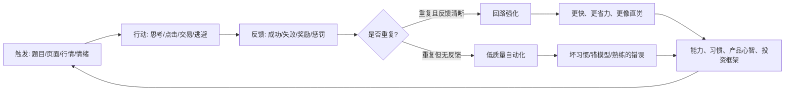

## 脑科学思维筑基课: 可塑性公理: 你重复什么, 就会变成什么

### 作者
digoal

### 日期
2026-05-19

### 标签
可塑性 , 神经回路 , 反馈循环 , 刻意练习 , 习惯养成 , 用户心智 , 运营训练 , 投资复盘 , 长时程增强 , 环境塑形

----

## 背景

> 面向对象: 大学生、产品经理、运营经理、有投融资需求的人  
> 核心问题: 为什么同样学一门课、做一份工作、投一笔钱, 有人越练越强, 有人只是把错误重复得更熟练? 为什么习惯、产品使用、用户心智和投资能力都能被训练, 也会被训练坏?  
> 先说结论: 大脑和行为系统会被重复、反馈、环境和奖励持续塑形。可塑性不是“想变就能变”, 而是“被反复激活的路径会变得更容易再次发生”。

## 一张图先看懂



可塑性的关键不是“人能改变”这么简单, 而是:

```text
重复会改变你; 但没有反馈的重复, 可能只是把错误刻得更深。
```

一个最简对比:

```text
有效塑形: 行动 -> 反馈 -> 修正 -> 再行动
无效塑形: 行动 -> 自我感觉 -> 重复 -> 越来越确信
```

所以, 可塑性既是希望, 也是风险。它让人可以变强, 也让人可以把偏见、坏习惯和错误投资框架练成“本能”。

## 求真讲法

### 它到底说了什么

可塑性公理可以表述为:

> 神经系统、行为模式和认知模型会随着重复经验、注意力、反馈、奖励和环境约束而改变; 被反复激活并得到强化的路径, 会更容易在未来被再次调用。

这里有四个关键词。

第一, “重复”。一次顿悟通常不够。真正改变系统的是可重复的激活。

第二, “反馈”。反馈告诉系统该强化什么、削弱什么。没有反馈, 重复可能只是在自我催眠。

第三, “奖励”。奖励不只是金钱, 还包括成就感、被认可、少痛苦、少麻烦。奖励决定行为是否愿意回来。

第四, “环境”。人不是在真空中改变。手机、同伴、流程、默认选项、工作制度、交易软件都会塑造你。

### 它是怎么来的

在神经科学里, Hebb 在 1949 年提出过一个影响深远的思想: 如果一个神经元反复参与激活另一个神经元, 两者之间的连接会增强。后来这常被概括为“共同放电的神经元会连接在一起”。这不是精确原句, 但很好地表达了活动依赖性学习的直觉。

1973 年, Bliss 和 Lomo 描述了长时程增强。长时程增强可以理解为: 某些突触在特定刺激后, 传递效率会持续增强。它成为理解学习和记忆细胞机制的重要模型。

成人大脑也并非固定不变。Draganski 等人在 2004 年的研究中发现, 成人学习杂耍后, 与复杂视觉运动处理相关的脑区出现可检测的结构变化。Maguire 等人对伦敦出租车司机的研究也显示, 长期导航经验与海马结构差异相关。具体因果解释要谨慎, 但这些研究都支持一个方向: 长期经验会和脑结构、脑功能相互塑造。

可塑性还不只发生在突触。近年的白质和髓鞘研究显示, 学习和神经活动可能影响髓鞘相关变化, 从而改变信号传递效率。这里要谨慎: “髓鞘化让速度提升 100 倍”可以作为理解髓鞘重要性的粗略说法, 但不同神经纤维、任务和测量条件差异很大, 不能当作固定训练公式。

同时, 可塑性有窗口和边界。敏感期研究提醒我们, 早期经验对某些系统的塑造特别强; 成年后仍能学习, 但通常更依赖明确动机、持续练习、反馈和环境设计。

### 它依赖哪些假设

| 假设 | 含义 | 不成立时会怎样 |
|---|---|---|
| 系统会被经验改变 | 经验不是只留下记忆, 还会改变未来反应倾向 | 如果任务太偶然, 很难形成稳定回路 |
| 重复会强化路径 | 经常调用的模式会更容易再次出现 | 重复错误会把错误自动化 |
| 反馈能校正方向 | 反馈越清晰, 越能知道该强化什么 | 没有反馈时, 人会强化自我感觉 |
| 奖励决定回路是否回来 | 行为后果会影响下次选择 | 奖励错位会训练出错误行为 |
| 可塑性有成本和窗口 | 改变需要能量、时间和合适条件 | 成年后能变, 但不等于轻松变 |

这五个假设决定了可塑性的实际边界。它不是万能药, 而是一个塑形机制。你不训练它, 环境也会训练它。

### 常见误解

误解一: 可塑性等于“只要努力就能成为任何人”。

不是。天赋、身体条件、资源、环境、窗口期和反馈质量都会影响上限和速度。可塑性说明能改变, 不说明没有约束。

误解二: 重复越多越好。

不一定。重复如果没有反馈, 会变成熟练的错误。一个人写了十年低质量文章, 不等于自动成为好作者; 一个投资者交易很多次, 不等于自动获得投资能力。

误解三: 坏习惯可以靠压制消失。

通常很难。旧回路不一定消失, 更常见是新回路在同一触发点上覆盖旧反应。替代路径比单纯压制更可靠。

误解四: 成年人很难改变, 所以不用改变。

成年人改变确实更需要设计, 但不是不能改。成年人的优势是目标更清楚、资源更多、能主动选择环境。

误解五: 产品只要让用户多用, 就能形成习惯。

多用不等于好习惯。如果用户每次使用只获得短刺激、低价值和高后悔, 最终形成的可能是疲劳、厌恶和卸载。

## 求存讲法

### 它有什么用

可塑性公理能帮你看清一个底层问题:

> 每一次重复, 都在投票支持某个未来的自己。

大学生每天逃避难题, 不是只浪费一天, 而是在训练“遇到困难就离开”的回路。

产品每次让用户顺利完成任务, 不是只完成一次转化, 而是在训练“这个产品可靠”的心智。

运营每次用套路刺激用户, 不是只拿到一次点击, 而是在训练“这个品牌不值得信”的回路。

投资者每次亏损后不复盘, 不是只错过一次总结, 而是在训练“情绪过去就算了”的投资人格。

### 它怎么迁移到熟悉领域

#### 1. 学习: 能力是被反馈塑形的回路

真正有效的学习不是“看了很多”, 而是形成循环。

```text
输入 -> 尝试输出 -> 暴露错误 -> 得到反馈 -> 修改模型 -> 再输出
```

大学生最常见的问题是只有输入, 没有输出; 或者只有刷题, 没有归因。

| 学习动作 | 是否产生可塑性 | 原因 |
|---|---|---|
| 只听课 | 弱 | 缺少主动调用 |
| 只划重点 | 弱 | 缺少错误暴露 |
| 做题后不复盘 | 中低 | 有重复, 但反馈没被吸收 |
| 讲给别人听 | 强 | 需要组织模型并暴露漏洞 |
| 建错题分类并重做 | 强 | 反馈明确, 可重复修正 |

学习能力不是知识堆积, 而是“遇到问题时如何调用和修正模型”的回路。

#### 2. 产品: 用户心智也是被训练出来的

用户第一次使用产品时, 大脑在学习:

```text
这个产品是否可靠?
我点这里会发生什么?
出错能不能恢复?
它懂不懂我的任务?
下次我还要不要回来?
```

产品经理要设计的是“正确回路”:

```text
触发明确 -> 行动简单 -> 反馈及时 -> 结果有价值 -> 下次更容易
```

如果用户每次打开都迷路, 就是在训练“这里很费劲”。如果每次都有不可预期弹窗, 就是在训练“这里不受控”。如果每次都能快速得到稳定结果, 就是在训练“这里值得信任”。

#### 3. 运营: 运营不是刺激用户, 是训练用户

运营动作会塑造用户预期。

```text
天天发券 -> 训练用户等券
天天标题党 -> 训练用户不信
天天逼打卡 -> 训练用户疲劳
稳定交付价值 -> 训练用户回来
公开贡献反馈 -> 训练用户参与
```

所以运营经理要问:

> 这个动作重复 100 次后, 用户会被训练成什么样?

如果答案是“更信任、更熟练、更愿意贡献”, 这是正向塑形。如果答案是“更麻木、更套利、更不信任”, 这是负向塑形。

#### 4. 投融资: 投资能力是反馈回路, 不是观点集合

很多人以为投资能力来自“知道很多观点”。更准确地说, 投资能力来自可复盘的反馈回路。

```text
假设 -> 买入/不买 -> 跟踪变量 -> 结果反馈 -> 归因 -> 更新框架
```

如果你只记录盈亏, 你训练的是情绪。如果你记录当初假设、关键变量、反证条件和结果归因, 你训练的是判断力。

投资里的可塑性有一个难点: 反馈延迟长, 噪音大。一次赚钱可能是运气, 一次亏钱也可能是过程正确但结果随机。因此投资训练不能只看单次结果, 要看长期决策质量。

### 它的适用范围和边界

可塑性适合解释:

- 为什么习惯会越来越自动
- 为什么刻意练习需要反馈
- 为什么产品首次体验很重要
- 为什么运营动作会训练用户预期
- 为什么投资能力需要交易日志和复盘
- 为什么组织文化会被重复流程塑造

但它不能被滥用为:

- “只要相信自己, 大脑就会改变”
- “重复越多越好”
- “所有人都能练到同样水平”
- “坏习惯可以瞬间重写”
- “用户被训练了, 所以可以无限操控”

边界在于: 可塑性需要能量、时间、反馈、奖励和环境。没有这些条件, 改变就会停留在愿望层面。

### 正例: 怎么用它提升能力

#### 正例一: 大学生把学习设计成反馈回路

目标: 提高专业课解题能力。

低效做法:

```text
看视频 2 小时 -> 感觉懂了 -> 第二天忘了
```

高效做法:

```text
看 20 分钟 -> 合上资料写出框架 -> 做 3 道题 -> 记录错因 -> 第二天重做错题 -> 每周归类
```

这个流程有效, 因为它不断激活“提取、犯错、修正、再提取”的回路。

#### 正例二: 产品经理设计用户习惯闭环

假设你做一个知识管理产品。不要只追求用户导入大量资料, 要让用户形成闭环:

```text
捕捉一条信息 -> 自动归类建议 -> 需要时能搜到 -> 使用后获得结果 -> 用户愿意继续沉淀
```

如果用户只收藏不使用, 产品训练的是囤积。如果用户能在真实任务中反复取用, 产品训练的是信任和依赖。

#### 正例三: 投资者建立“决策训练集”

每次重要投资决策都记录:

| 字段 | 作用 |
|---|---|
| 当时假设 | 防止事后改故事 |
| 关键变量 | 知道该跟踪什么 |
| 反证条件 | 知道何时承认错 |
| 仓位理由 | 训练风险控制 |
| 结果归因 | 区分运气和能力 |
| 下次改法 | 让反馈进入系统 |

长期看, 这比每天看更多消息更重要。消息训练焦虑, 复盘训练判断。

### 反例: 前提不成立会怎样

#### 反例一: 重复刷题但不复盘

某学生每天刷很多题, 但只看对错, 不分析错因。一个月后题量很大, 成绩提升有限。

这里失败的假设是: 反馈能校正方向。刷题提供了重复, 但反馈没有进入模型。大脑被训练成“看到题就套熟悉方法”, 而不是“判断该用什么方法”。

#### 反例二: 产品用强刺激训练出低质量习惯

某内容产品通过红点、连续弹窗和夸张推荐提高打开率。用户短期打开更多, 但每次打开后都感到浪费时间。几个月后用户卸载。

这里失败的假设是: 奖励决定回路是否回来。产品给了即时刺激, 但没有长期价值奖励。可塑性确实发生了, 只是训练出了厌恶和疲劳。

#### 反例三: 投资者把牛市经验练成永久直觉

某投资者在流动性宽松阶段靠追热点赚钱, 于是形成回路:

```text
看到热点 -> 快速买入 -> 上涨奖励 -> 更相信追热点
```

环境变化后, 这套回路继续自动启动, 但结果变成连续亏损。

这里失败的假设是: 系统会被经验改变。经验确实改变了他, 但被改变的是适合旧环境的回路。可塑性没有保证方向正确, 只保证重复会留下痕迹。

## 一个可复用的判断工具

遇到生活、产品、运营、投资问题时, 用这张表检查可塑性。

| 问题 | 目的 |
|---|---|
| 我正在重复什么行为? | 找出被训练的回路 |
| 这个行为后面有什么奖励? | 找出它为什么会回来 |
| 反馈是否清晰、及时、真实? | 判断能否校正模型 |
| 我是在强化能力, 还是强化逃避? | 区分正向和负向塑形 |
| 用户每次使用后被训练成什么? | 检查产品心智 |
| 运营动作重复 100 次会训练出什么预期? | 检查长期副作用 |
| 投资复盘记录的是假设, 还是只记录盈亏? | 判断训练的是能力还是情绪 |
| 环境变了, 旧回路还适用吗? | 防止专家惯性 |

压缩成一句话:

> 重复负责塑形, 反馈负责定向, 环境负责筛选。

## 思考

表面变化越快, 可塑性越重要, 也越危险。

因为快变化世界会不断训练你: 平台训练你的注意力, 产品训练你的默认动作, 社群训练你的观点边界, 市场训练你的贪婪和恐惧。

你以为自己在自由选择, 但很多选择只是过去重复留下的自动反应。

这也是为什么底层公理重要。公理能帮你反过来设计自己:

```text
我想成为什么样的人?
那种人会重复什么行为?
这种行为需要什么反馈?
我应该进入什么环境?
我应该远离什么奖励?
```

对大学生来说, 你不是在准备一次考试, 你是在训练面对困难的方式。

对产品经理来说, 你不是在做一次转化, 你是在训练用户如何理解产品。

对运营经理来说, 你不是在做一次活动, 你是在训练用户如何回应品牌。

对投资者来说, 你不是在做一次买卖, 你是在训练未来的判断回路。

最后问一个反事实问题:

> 如果你把今天的行为重复 1000 次, 你会变成更强的人, 还是更熟练地犯同一种错?

这个问题比“我今天有没有努力”更重要。

## 最后记住

1. 可塑性不是励志口号, 而是重复、反馈、奖励和环境共同塑造系统。
2. 重复会强化回路, 但没有反馈的重复会强化错误。
3. 坏习惯通常不能靠压制消失, 更可靠的是设计替代回路。
4. 产品和运营的每次触达, 都在训练用户心智和预期。
5. 投资能力来自可复盘的反馈回路, 不是来自看过多少观点。

## 参考资料

- Donald O. Hebb, The Organization of Behavior: A Neuropsychological Theory, 1949. 用于理解活动依赖性学习和 Hebb 学习思想。
- Terje Lomo, [The discovery of long-term potentiation](https://pmc.ncbi.nlm.nih.gov/articles/PMC1693150/), Philosophical Transactions of the Royal Society B, 2003. 回顾 Bliss 与 Lomo 对 LTP 的发现。
- Bogdan Draganski et al., [Changes in grey matter induced by training](https://www.nature.com/articles/427311a), Nature, 2004.
- Eleanor A. Maguire et al., [Navigation-related structural change in the hippocampi of taxi drivers](https://web-archive.nli.org.il/National_Library/20170719080936mp_/www.ncbi.nlm.nih.gov/pubmed/10716738), PNAS, 2000.
- K. Anders Ericsson, Ralf T. Krampe, Clemens Tesch-Romer, [The Role of Deliberate Practice in the Acquisition of Expert Performance](https://philpapers.org/rec/ERITRO-4), Psychological Review, 1993.
- Eric I. Knudsen, [Sensitive periods in the development of the brain and behavior](https://pubmed.ncbi.nlm.nih.gov/15509387/), Journal of Cognitive Neuroscience, 2004.
- Douglas Fields, [A new mechanism of nervous system plasticity: activity-dependent myelination](https://www.nature.com/articles/nrn4023), Nature Reviews Neuroscience, 2015.
  
#### [PostgreSQL 解决方案集合](../201706/20170601_02.md "40cff096e9ed7122c512b35d8561d9c8")
  
  
#### [德哥 / digoal's Github - 公益是一辈子的事.](https://github.com/digoal/blog/blob/master/README.md "22709685feb7cab07d30f30387f0a9ae")
  
  
#### [About 德哥](https://github.com/digoal/blog/blob/master/me/readme.md "a37735981e7704886ffd590565582dd0")
  
  

  
