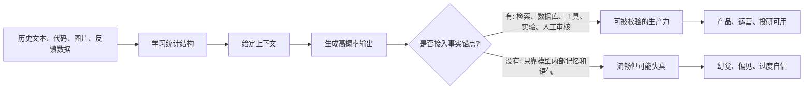
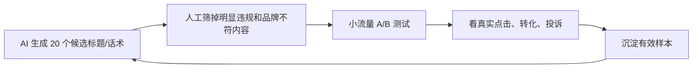

## AI 领域思维筑基课: 随机鹦鹉公理: 流畅不是可信, 相关不是理解

### 作者
digoal

### 日期
2026-05-19

### 标签
随机鹦鹉 , 大语言模型 , Token预测 , AI幻觉 , 事实校验 , 产品判断 , 运营决策 , 投资分析 , 认知偏差 , AI公理

----

## 背景

> 面向对象: 大学生、产品经理、运营经理、有投资需求的人  
> 核心问题: 为什么 AI 说得越像人, 我们越容易误判它的能力、风险和商业价值?  
> 先说结论: “随机鹦鹉”不是说大模型没有用, 而是提醒我们: 当一个系统主要靠学习历史文本分布来生成回答时, 它可以非常流畅地复述、组合和类推, 却不必然拥有人的意图、经验、责任感和事实锚点。判断 AI, 先看它有没有可靠的“世界校验”, 不要只看它说得像不像真的。

## 一张图先看懂



一个更短的判断式:

```
语言流畅度 != 事实正确性
上下文相关性 != 真正理解
像专家的语气 != 专家的责任
```

## 求真讲法

### 它到底说了什么

“随机鹦鹉”这个比喻来自自然语言处理和 AI 伦理研究。它批评的是一种常见误判: 看到模型能生成连贯、礼貌、专业的文本, 就以为它像人一样理解了世界。

这里的“随机”不是乱说, 而是概率意义上的随机: 模型根据训练中学到的统计规律, 在一批可能的下一个 token 里选择输出。这里的“鹦鹉”也不是贬低工具价值, 而是强调: 复述和组合语言, 不等于拥有真实经验、交流意图、价值承诺和外部世界模型。

可以把这条公理写成一句话:

> 当 AI 的输出主要来自历史数据分布和当前上下文的概率补全时, 它的第一能力是“生成看起来合理的表达”, 不是“保证表达对应真实世界”。

这句话对生活、产品、运营、投资都很关键。因为现实世界里, 最危险的不是明显荒唐的回答, 而是“听起来非常像真的错误回答”。

### 它是怎么来的

2017 年 Transformer 架构把注意力机制推到主流位置, 让模型可以更有效地处理长序列。2020 年 GPT-3 展示了大规模语言模型的少样本能力, 很多人开始把流畅文本生成理解为“通用智能”的证据。

2021 年, Emily M. Bender、Timnit Gebru、Angelina McMillan-Major 和 Shmargaret Shmitchell 在 FAccT 论文《On the Dangers of Stochastic Parrots: Can Language Models Be Too Big?》中提出“stochastic parrots”这个警示性比喻。论文关心的不只是模型会不会答错, 还包括更大的问题: 训练数据偏见、资源消耗、语言覆盖不平等、以及人类会把机器生成文本误读为有意图的交流。

从技术上看, 很多大语言模型的预训练目标可以简化理解为: 给定前文, 预测接下来最可能出现的 token。现代系统还会加入指令微调、人类反馈、强化学习、工具调用、多模态输入和长上下文, 所以“只会预测下一个词”已经不是完整描述。但它仍然抓住了一个底层事实: 模型输出的基础材料来自数据分布, 不是来自亲身经验和责任承担。

### 它依赖哪些假设

这条公理成立, 依赖几个前提:

| 前提 | 如果成立 | 如果不成立 |
|---|---|---|
| 模型主要从历史数据学习语言和世界规律 | 输出会继承数据里的知识、偏见和盲区 | 如果系统有强外部校验, 错误可被纠正 |
| 生成目标优先追求“像合理回答” | 语气会比事实校验更稳定 | 如果明确要求引用、计算、检索, 可靠性会上升 |
| 模型没有人的生活经验和责任关系 | 它不会自然承担后果 | 如果接入人类审核和制度责任, 风险可被管理 |
| 用户容易把流畅文本当成理解 | 错误会更容易被相信 | 如果用户有验证习惯, 误判会下降 |

所以“随机鹦鹉公理”不是一句绝对否定, 而是一条风险识别规则: 当系统缺少事实锚点时, 你要默认它在“生成可信语气”, 而不是“交付可信事实”。

### 常见误解

误解一: “随机鹦鹉”就是 AI 完全没用。  
不对。计算器也不“理解”数学, 但它在明确规则内非常有用。大模型在写作、总结、分类、生成候选方案、代码辅助、客服草稿、学习陪练上都可以有高价值。关键是知道它适合做什么, 不适合单独决定什么。

误解二: 只要模型会推理, 就不再是随机鹦鹉。  
也不对。推理能力可以是真实存在的能力表现, 但这不自动等于事实可靠。一个模型可以在数学题上链式推理很强, 同时在引用论文、判断近期新闻、分析小公司财务时自信出错。

误解三: 模型说“我查到资料显示”, 就说明它查过。  
不一定。除非系统明确接入搜索、数据库、文件、日志或可审计工具, 否则“我查到”可能只是语言模式。运营报告、投研结论、法律建议、医疗建议尤其不能只看语气。

误解四: 多模态和 Agent 会彻底消除这个问题。  
不会。多模态让模型获得更多输入形式, Agent 让模型可以调用工具和执行动作, 但语言生成层仍然可能把不确定内容包装得很确定。工具降低风险, 不等于风险消失。

## 求存讲法

### 它有什么用

这条公理最大的用处是帮你建立一个反直觉习惯:

> 面对 AI, 先问“它的事实锚点在哪里”, 再问“它说得好不好”。

没有这条习惯, 人会被表面能力带走。大学生会把生成答案当成学习本身, 产品经理会把 demo 当成可交付产品, 运营经理会把漂亮文案当成增长策略, 投资者会把“AI 原生叙事”当成护城河。

### 它怎么迁移到熟悉领域

#### 对大学生: AI 是陪练, 不是替考大脑

用 AI 学习时, 最有价值的用法不是“直接要答案”, 而是让它生成不同解释、反例、练习题和检查清单。因为学习的目标不是拿到一段流畅文字, 而是在你脑中建立可迁移的结构。

好的提问方式:

```
请先给出直觉解释, 再列出必要前提, 最后给我 3 个反例。
如果你不确定某个事实, 请标出来, 不要编来源。
```

坏的提问方式:

```
帮我写一篇论文, 要专业一点。
```

前者把 AI 当成思维训练器, 后者把 AI 当成替代判断的外包工。

#### 对产品经理: Demo 流畅不等于产品可靠

AI 产品最容易在 demo 阶段显得惊艳, 因为 demo 问题通常分布清楚、边界友好、失败成本低。真实产品不同: 用户输入混乱、数据权限复杂、业务规则经常变化、错误会带来退款、投诉、合规和品牌风险。

产品经理评估 AI 功能时, 不要只问:

```
这个模型能不能答?
```

而要问:

```
它什么时候会答错?
答错后谁发现?
发现后怎么纠正?
纠正数据会不会进入下一轮改进?
哪些动作必须人工确认?
```

如果这些问题没有答案, 产品就只是“会说话的界面”, 不是可靠系统。

#### 对运营经理: 文案相关不等于用户真实会买

AI 很擅长生成看起来合理的标题、卖点、活动话术和用户画像。但运营要面对的不是“语言是否顺”, 而是“行为是否改变”。用户点击、留存、复购、投诉、转介绍, 才是现实反馈。

因此运营使用 AI 的正确姿势是: 让它批量生成候选方案, 再用小流量实验验证。不要让它直接替代市场判断。

一个运营闭环应该长这样:



#### 对投资者: 护城河不在“会聊天”, 而在“能校验”

投融资里, “随机鹦鹉公理”可以直接变成尽调问题:

| 你听到的融资叙事 | 应追问的底层问题 |
|---|---|
| 我们用 AI 理解用户 | 用户行为数据从哪里来? 是否独家? 是否能闭环验证? |
| 我们替代专家 | 出错成本谁承担? 有没有专家审核和责任边界? |
| 我们接入最强模型 | 模型供应商变了以后, 你的差异化还剩什么? |
| 我们有行业知识库 | 知识库是否更新? 是否可追溯? 是否覆盖真实长尾问题? |
| 我们是 AI Agent | Agent 能执行哪些动作? 有无权限边界、日志和回滚机制? |

真正有价值的 AI 公司, 往往不是“把模型包一层界面”, 而是掌握了某个高价值场景里的数据、流程、反馈和责任系统。模型越通用, 应用公司的护城河越要从“会生成”转向“会验证、会执行、会沉淀”。

### 它的适用范围和边界

适用范围:

- 评估 AI 生成内容的可信度。
- 判断 AI 产品是否有真实业务闭环。
- 识别投资叙事里的“能力夸大”。
- 设计需要事实准确性的 AI 工作流。
- 训练自己不要被流畅表达欺骗。

边界:

- 它不能证明模型“完全不理解”。理解本身有哲学和认知科学争议, 现代模型内部也可能形成复杂表征。
- 它不能否定模型在分布内任务上的高价值。翻译、摘要、代码补全、结构化抽取等任务可以非常有效。
- 它不能替代具体评测。不同模型、不同任务、不同工具链的可靠性差异很大, 必须实测。
- 它不能说明“人类就一定可靠”。人也会编造、偏见和过度自信。区别在于人类通常处在社会责任、经验记忆和后果约束中。

### 正例: 怎么用它提升能力

正例一: 大学生用 AI 学微观经济学。  
他不问“帮我写作业答案”, 而问“请解释机会成本, 给 3 个生活例子, 再给 2 个容易混淆的反例”。随后他拿教材定义核对, 自己重写一遍。这里 AI 负责生成角度, 教材和自我复述负责校验。前提“有外部事实锚点”成立, 所以 AI 提升了学习效率。

正例二: 产品经理做智能客服。  
她没有直接让模型自由回答所有问题, 而是把回答限制在企业知识库、订单系统、退换货政策和工单日志内。高风险动作必须用户二次确认, 模型回答附带来源链接。这里 AI 的流畅表达被业务数据约束, 所以可上线。

正例三: 运营经理做活动标题测试。  
他让 AI 生成 50 个标题, 人工筛选后投放小流量实验, 用转化率和投诉率决定放量。这里 AI 不负责判断“哪个一定有效”, 只负责扩大候选空间。真实用户行为承担校验。

正例四: 投资者看 AI 应用公司。  
她不被“我们接入最强大模型”打动, 而追问: 客户数据是否能持续回流? 错误是否能被捕捉? 工作流是否越用越深? 如果答案清晰, 公司可能有复利; 如果只有 prompt 和界面, 就容易被大模型厂商或同行复制。

### 反例: 前提不成立会怎样

反例一: 学生把 AI 生成的论文引用直接提交。  
失败原因不是“学生不会用 AI”这么简单, 而是“事实锚点”前提不成立。模型可能生成格式正确但不存在的论文、作者和页码。流畅性掩盖了可验证性的缺失。

反例二: 产品团队把聊天机器人接到退款权限。  
如果模型误解用户意图, 或被提示注入诱导, 它可能执行错误退款、泄露规则或绕过流程。失败原因是“语言生成系统没有足够权限边界和回滚机制”。

反例三: 运营团队让 AI 生成“行业趋势报告”, 直接作为老板决策依据。  
如果没有搜索、数据源、样本说明和时间戳, 报告可能只是把常见行业套话重新组合。失败原因是“历史文本相关性”被误当成“当前市场真实性”。

反例四: 投资者因为某公司“AI 会理解企业知识”而高估估值。  
如果这家公司没有独家数据、客户反馈闭环、模型评测体系和交付责任, 那么“理解企业知识”只是营销话术。失败原因是“会说行业黑话”被误当成“形成护城河”。

## 思考

随机鹦鹉公理真正尖锐的地方在于: 它不只批评机器, 也批评人类自己。我们为什么会相信流畅表达? 因为在人类社会里, 能把话说清楚的人通常真的理解一部分内容, 也通常要为自己说的话承担后果。但 AI 打破了这个线索: 它能复制“专家表达的外形”, 却不必然复制“专家判断的来源”和“专家承担的责任”。

这会带来一个长期变化: 未来真正稀缺的能力, 不是写一段像样文字, 而是提出好问题、识别前提、找到事实锚点、设计验证闭环、承担最终判断。

可以继续追问几个问题:

1. 如果一段内容无法追溯来源, 但写得非常好, 你应该给它多少信任?
2. 如果 AI 的回答和你的直觉一致, 你会不会更懒得验证?
3. 如果一个 AI 产品的价值来自“减少人工判断”, 那它有没有设计“错误被发现”的机制?
4. 如果一家公司说自己有 AI 护城河, 它的护城河是在模型、数据、流程、客户关系, 还是只在演示话术?
5. 当生成内容无限便宜后, 哪些能力会升值: 表达、验证、分发、信任, 还是责任?

## 最后记住

1. 随机鹦鹉公理不是说 AI 没用, 而是说“流畅输出”不能自动等于“真实理解”。
2. 评估 AI 的第一问题不是“它会不会说”, 而是“它如何校验自己说的东西”。
3. 学习、产品、运营、投研都要把 AI 放进闭环: 生成候选, 外部验证, 人类负责。
4. 没有事实锚点的 AI, 越专业、越自信、越需要警惕。
5. AI 时代的核心竞争力会从“生产内容”转向“判断内容、验证内容、承担后果”。

## 参考资料

- Emily M. Bender, Timnit Gebru, Angelina McMillan-Major, Shmargaret Shmitchell, 2021, [On the Dangers of Stochastic Parrots: Can Language Models Be Too Big?](https://dl.acm.org/doi/10.1145/3442188.3445922), FAccT 2021.
- Ashish Vaswani et al., 2017, [Attention Is All You Need](https://arxiv.org/abs/1706.03762), Transformer 架构原始论文。
- Tom B. Brown et al., 2020, [Language Models are Few-Shot Learners](https://arxiv.org/abs/2005.14165), GPT-3 论文。
- Laura Weidinger et al., 2021, [Ethical and social risks of harm from Language Models](https://arxiv.org/abs/2112.04359), 大语言模型风险分类。
- 本文同时参考了用户提供的 `/Users/digoal/Downloads/ai_axioms.md` 中“AI Agent 时代的底层公理”框架, 并按 `axiom-explainer` 的“求真讲法、求存讲法、思考”结构重写扩展。
  
#### [PostgreSQL 解决方案集合](../201706/20170601_02.md "40cff096e9ed7122c512b35d8561d9c8")
  
  
#### [德哥 / digoal's Github - 公益是一辈子的事.](https://github.com/digoal/blog/blob/master/README.md "22709685feb7cab07d30f30387f0a9ae")
  
  
#### [About 德哥](https://github.com/digoal/blog/blob/master/me/readme.md "a37735981e7704886ffd590565582dd0")
  
  

  
