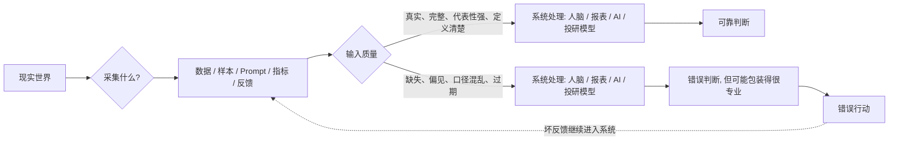
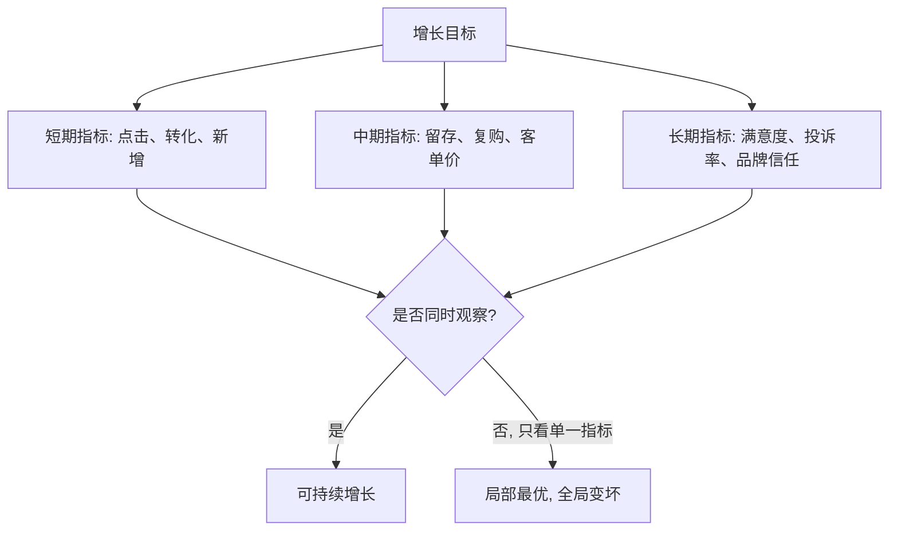

## AI 领域思维筑基课: GIGO 公理: 输入不干净, 输出再聪明也会变形

### 作者
digoal

### 日期
2026-05-19

### 标签
GIGO , 数据质量 , 输入质量 , AI治理 , 机器学习 , 指标设计 , 产品决策 , 运营分析 , 投资尽调 , 反馈闭环

----

## 背景

> 面向对象: 大学生、产品经理、运营经理、有投资需求的人  
> 核心问题: 为什么很多人明明用了更强的模型、更复杂的系统、更漂亮的报表, 最后还是做出错误判断?  
> 先说结论: GIGO 是 Garbage In, Garbage Out, 中文常译为“垃圾进, 垃圾出”。它不是一句技术口号, 而是一条决策公理: 任何信息处理系统的输出质量, 都被输入的真实性、代表性、完整性、定义清晰度和反馈质量约束。模型、工具、经验和聪明才智可以放大好输入, 也会放大坏输入。

## 一张图先看懂



一个极简公式:

```
输出质量 <= 输入质量 x 处理能力 x 校验强度

如果输入质量接近 0,
再强的处理能力也只能把错误包装得更像正确。
```

## 求真讲法

### 它到底说了什么

GIGO 最早流行于计算机和数据处理领域, 意思是: 如果输入给程序的数据是错误的、缺失的、偏的或定义混乱的, 程序即使完全按逻辑运行, 也会输出错误或误导性的结果。

放到今天, 它不只适用于计算机。人脑、组织、报表、AI 模型、推荐系统、投资模型、绩效考核, 都是“信息处理系统”。它们都绕不开同一个约束:

> 系统不能稳定产出比输入更真实的结论, 除非它额外接入了更可靠的校验机制。

这里的“垃圾”不只是脏数据。更准确地说, 垃圾输入包括:

| 垃圾输入类型 | 看起来像什么 | 真正问题 |
|---|---|---|
| 错误数据 | 数字填错、来源不明、过期信息 | 不真实 |
| 缺失数据 | 只看成功案例, 不看失败样本 | 不完整 |
| 偏置样本 | 只问核心用户, 不问流失用户 | 不代表整体 |
| 口径混乱 | “活跃用户”每个部门定义不同 | 不可比较 |
| 错误标签 | 把“消费金额”当成“健康需求” | 代理指标错 |
| 诱导性 Prompt | 问题里已经暗示结论 | 输出被带偏 |
| 坏反馈 | 只奖励点击, 不看满意度 | 系统学坏 |

所以 GIGO 的现代版可以说成:

> 坏数据、坏问题、坏指标、坏反馈, 会共同制造坏结论。

### 它是怎么来的

GIGO 的准确起源并不完全确定, 通常认为它来自早期计算机和程序设计实践。早期程序员很快发现: 计算机并不会因为“看起来很高级”就理解人的真实意图。它只会根据输入和规则执行。如果输入数字错了、格式错了、假设错了, 结果也会错。

后来, 这条经验从程序设计扩展到统计、数据库、商业分析和机器学习。到了 AI 时代, GIGO 变得更重要, 因为 AI 不只是计算, 还会生成自然语言解释。坏输入经过 AI 包装后, 可能不再像垃圾, 而像一份专业报告。

机器学习研究里有一个相关概念叫 data cascades, 可以译为“数据级联”。意思是早期数据问题没有被发现, 会沿着模型训练、评估、部署、业务决策一路传导, 最后变成系统性失败。很多组织喜欢做模型、做大屏、做智能化, 但不愿意做数据定义、采集、标注、清洗、版本管理和反馈闭环, 这正是 GIGO 的组织版。

### 它依赖哪些假设

GIGO 是一条工程和决策公理, 不是数学定理。它成立依赖这些前提:

| 前提 | 为什么重要 | 如果不成立会怎样 |
|---|---|---|
| 输入携带了系统判断所需的信息 | 系统只能处理它拿到的信号 | 输入里没有关键变量, 输出只能猜 |
| 输入和目标之间有稳定关系 | 用历史推未来需要关系稳定 | 环境变了, 老数据会误导 |
| 输入定义一致 | 可比较才可计算 | 各部门数字口径不同, 报表会制造假冲突 |
| 输入样本有代表性 | 样本要覆盖真实人群和场景 | 只看幸存者, 会高估成功率 |
| 系统有校验机制 | 错误需要被发现和纠正 | 错误会进入下一轮反馈, 越滚越大 |

这也是为什么 GIGO 不等于“数据越干净越好”。真正的高质量输入, 不是表面整齐, 而是适合目标、来源可信、定义清楚、覆盖关键场景、能被校验。

### 常见误解

误解一: GIGO 只适用于计算机。  
不对。你每天刷到的信息、听到的建议、选择的样本、相信的指标, 都是你大脑的输入。输入长期偏, 判断也会偏。

误解二: 有了强 AI, 输入质量就没那么重要。  
不对。强 AI 能补全表达、发现模式、生成方案, 但不能凭空知道你没有提供、也没有接入工具校验的事实。坏数据进入强模型, 往往会得到更像真的坏结论。

误解三: 数据清洗就是删除异常值。  
不对。异常值有时是错误, 有时是最重要的信号。投资里的极端风险、运营里的高价值用户、系统里的罕见故障, 都可能藏在异常值里。清洗不是让数据变漂亮, 而是让数据更符合真实问题。

误解四: 大样本一定能解决 GIGO。  
不一定。如果样本采集方式有系统偏差, 样本越大, 只是让错误更稳定。比如只调查愿意填写问卷的用户, 样本再大也可能低估沉默用户的不满。

误解五: 输入好, 输出就一定好。  
也不对。GIGO 只说坏输入会压低输出上限, 不保证好输入自动产生好结果。还需要正确模型、合理指标、专业判断和反馈校验。

## 求存讲法

### 它有什么用

GIGO 的用处是让你在复杂世界里先抓底层入口:

> 别急着争结论, 先审输入。

当一个判断听起来很高级时, 先问:

- 数据从哪里来?
- 样本包括谁, 排除了谁?
- 指标怎么定义?
- 有没有反例和失败样本?
- 信息是否过期?
- 结论有没有被真实行动验证?

这套问题比“我感觉对不对”更可靠, 也比“这个模型厉不厉害”更接近本质。

### 它怎么迁移到熟悉领域

#### 对大学生: 你的认知质量取决于信息食谱

如果你只看短视频摘要, 不读原文; 只看支持自己观点的内容, 不看反方证据; 只问 AI 要结论, 不追问来源和前提, 你的大脑就在吃“信息垃圾食品”。

学习中的 GIGO 不是“资料越多越好”, 而是:

```
好教材 + 原始定义 + 例题训练 + 反例校验 + 自己复述
```

比

```
碎片观点 + 二手总结 + 情绪评论 + 未核实答案
```

更能形成稳定能力。

#### 对产品经理: 用户需求不是用户说了什么, 而是输入链是否完整

产品经理经常会听到“用户说想要这个功能”。但用户访谈本身也会 GIGO: 你问了谁? 在什么场景问? 用户说的是愿望、抱怨、真实付费意愿, 还是被问题引导出来的礼貌回答?

更可靠的产品输入链应该包括:

| 输入来源 | 能回答的问题 | 盲区 |
|---|---|---|
| 用户访谈 | 为什么痛苦 | 容易样本少、表达偏 |
| 行为日志 | 用户实际做什么 | 不知道动机 |
| 客服工单 | 高频阻塞点 | 偏向不满意用户 |
| 付费和流失数据 | 用户愿意为什么付钱 | 需要时间积累 |
| 可用性测试 | 功能是否用得懂 | 实验环境可能失真 |

产品判断不能只靠一种输入。单一输入越顺耳, 越要小心。

#### 对运营经理: 指标输入决定运营会优化什么

如果运营只看点击率, 系统会奖励标题党。只看新增用户, 会忽略留存。只看 GMV, 可能牺牲利润和复购。只看转化率, 可能压榨老用户信任。

运营的 GIGO 常常不是数据错, 而是指标错。指标一旦成为奖励, 就会改变人的行为。坏指标进入组织, 输出的不是坏报表, 而是坏动作。

一个更稳的运营输入框架:



#### 对投资者: 尽调的第一性问题是输入质量

投融资里, 最贵的错误往往不是估值模型算错, 而是输入本身错了。比如市场规模来自不适用口径, 增长率来自短期补贴, 留存率只统计核心用户, 毛利率没有算履约和获客成本, AI 能力来自演示数据而非真实生产数据。

看一家 AI 或数据驱动公司, GIGO 可以转成一组尽调问题:

| 尽调对象 | 要问的输入问题 |
|---|---|
| 市场规模 | 口径是什么? 是可服务市场, 还是宏观大盘数字? |
| 用户增长 | 增长来自自然需求, 渠道投放, 还是补贴套利? |
| AI 模型 | 训练和评测数据是否来自真实业务场景? |
| 数据护城河 | 数据是否独家、合法、持续、可反馈? |
| 财务指标 | 是否剔除了不可持续收入和一次性成本? |
| 管理层叙事 | 是否有反证、失败案例和客户流失解释? |

如果输入质量不清楚, 再精细的 DCF、可比公司估值、增长曲线, 都只是“精密地错误”。

### 它的适用范围和边界

适用范围:

- 学习: 判断资料、答案、观点和 AI 解释是否可信。
- 产品: 判断需求、用户反馈、实验数据是否能支撑决策。
- 运营: 判断指标是否会诱导错误动作。
- 投资: 判断商业计划书、财务数据、市场研究和 AI demo 是否可靠。
- 组织管理: 判断绩效、OKR、报表是否反映真实业务。

边界:

- GIGO 不是“必须先完美数据再行动”。现实中很少有完美输入, 更常见的是边行动边提高输入质量。
- GIGO 不是“越干净越好”。过度清洗可能删掉少数但关键的真实信号。
- GIGO 不是“模型不重要”。同样输入下, 好模型、好流程、好专家仍然会产出更好结果。
- GIGO 不是“历史数据永远可靠”。环境变化时, 过去的好输入可能变成今天的坏输入。

### 正例: 怎么用它提升能力

正例一: 大学生准备职业选择。  
他没有只看“某行业年薪百万”的短视频, 而是同时收集招聘 JD、校友访谈、行业报告、实习体验、岗位淘汰率和自己的能力匹配。这里“输入代表性”前提更成立, 所以职业判断更稳。

正例二: 产品经理做 AI 知识库问答。  
她先统一知识库口径, 标注过期文档, 给答案附来源, 把用户差评问题回流到知识库维护流程。这里“输入定义清楚、可追溯、可更新”前提成立, 所以模型输出可控。

正例三: 运营经理优化会员转化。  
他不只看首单转化率, 还看 30 天留存、退款率、投诉率、复购率。最后发现高压弹窗提高了短期转化, 但伤害长期复购。这里“反馈指标完整”前提成立, 所以避免了局部最优。

正例四: 投资者评估 AI 公司。  
她要求看真实客户数据、上线后错误率、人工介入比例、客户续费率、数据权限合同和模型评测集, 而不是只看路演 demo。这里“输入来自真实生产环境”前提成立, 所以能更接近公司真实价值。

### 反例: 前提不成立会怎样

反例一: 学生用 AI 背论文观点。  
他把 AI 生成的观点当成教材结论, 没核对原文定义。考试遇到边界条件时答错。失败原因是“输入来源可信”前提不成立, 二手生成内容替代了原始定义。

反例二: 产品团队只访谈重度用户。  
重度用户要求更多高级功能, 团队投入半年开发, 结果新用户更难上手, 转化下降。失败原因是“样本代表性”前提不成立, 少数熟练用户被误当成整体市场。

反例三: 运营团队只考核拉新。  
团队为了新增用户大量发券, 数据看起来增长, 但用户薅完即走, 老用户觉得不公平, 利润恶化。失败原因是“反馈指标完整”前提不成立, 单一指标制造了错误激励。

反例四: 投资者相信平台的 GMV 高增长。  
后来发现增长主要来自补贴、刷单和低毛利品类, 真实留存和现金流都很弱。失败原因是“输入真实性和口径一致”前提不成立, 表面规模掩盖了经济质量。

反例五: 医疗算法用费用预测健康需求。  
研究者曾发现, 某些医疗风险算法用医疗成本作为健康需求的代理变量, 可能把历史医疗服务可及性差异带入模型。失败原因是“代理指标等于真实目标”前提不成立。看似中性的输入, 可能编码了社会结构偏差。

## 思考

GIGO 真正残酷的地方在于: 人们通常不缺计算能力, 缺的是面对输入质量的诚实。坏输入经常不是自然发生的, 而是由组织激励制造的。老板喜欢好看的增长, 团队就提交好看的指标; 投资人喜欢大市场, 创业者就引用最大的口径; 用户喜欢确定答案, AI 就给出确定语气。

所以 GIGO 不只是数据问题, 也是诚实问题、激励问题和权力问题。谁定义输入, 谁就部分定义了结论。谁控制指标, 谁就部分控制了组织行为。谁只给你看筛选后的样本, 谁就在塑造你的未来判断。

可以继续追问:

1. 你最近相信的一个观点, 它的原始输入是什么?
2. 你的信息来源里, 有没有系统性缺席的人和失败案例?
3. 你正在优化的指标, 会不会奖励短期正确、长期错误的行为?
4. 一个 AI 产品如果没有数据闭环, 它的“智能”能持续多久?
5. 一项投资如果核心输入被推翻, 估值模型还有没有意义?

## 最后记住

1. GIGO 不是技术黑话, 而是判断世界的入口公理: 输入质量决定输出上限。
2. 垃圾输入不只是错误数据, 还包括偏样本、坏指标、乱口径、过期信息和诱导性问题。
3. AI 会放大输入质量: 好输入变成高效率, 坏输入变成高置信错误。
4. 产品、运营、投资的第一步不是争结论, 而是审数据来源、样本代表性、指标定义和反馈闭环。
5. 真正可靠的系统不是从不出错, 而是能发现坏输入、修正坏输入、阻止坏输入继续污染下一轮判断。

## 参考资料

- TechTarget, [Garbage in, garbage out (GIGO)](https://www.techtarget.com/searchsoftwarequality/definition/garbage-in-garbage-out), 对 GIGO 在计算机、数据科学和 AI 中的通用定义。
- Google for Developers, [Data quality and interpretation](https://developers.google.com/machine-learning/guides/data-traps/quality), 机器学习数据质量、偏差和解释陷阱。
- Timnit Gebru et al., 2021, [Datasheets for Datasets](https://cacm.acm.org/research/datasheets-for-datasets/), Communications of the ACM, 关于数据集来源、用途和责任文档化。
- Nithya Sambasivan et al., 2021, ["Everyone wants to do the model work, not the data work": Data Cascades in High-Stakes AI](https://research.google/pubs/everyone-wants-to-do-the-model-work-not-the-data-work-data-cascades-in-high-stakes-ai/), CHI 2021, 关于高风险 AI 中数据问题如何级联放大。
- Ziad Obermeyer et al., 2019, [Dissecting racial bias in an algorithm used to manage the health of populations](https://escholarship.org/uc/item/6h92v832), Science, 关于代理变量和历史偏差如何影响算法决策。
- NIST, [AI Risk Management Framework](https://www.nist.gov/itl/ai-risk-management-framework), 关于可信 AI 风险管理、偏差和评估的框架。
- 本文同时参考了用户提供的 `/Users/digoal/Downloads/ai_axioms.md` 中“AI Agent 时代的底层公理”框架, 并按 `axiom-explainer` 的“求真讲法、求存讲法、思考”结构重写扩展。
  
#### [PostgreSQL 解决方案集合](../201706/20170601_02.md "40cff096e9ed7122c512b35d8561d9c8")
  
  
#### [德哥 / digoal's Github - 公益是一辈子的事.](https://github.com/digoal/blog/blob/master/README.md "22709685feb7cab07d30f30387f0a9ae")
  
  
#### [About 德哥](https://github.com/digoal/blog/blob/master/me/readme.md "a37735981e7704886ffd590565582dd0")
  
  

  
