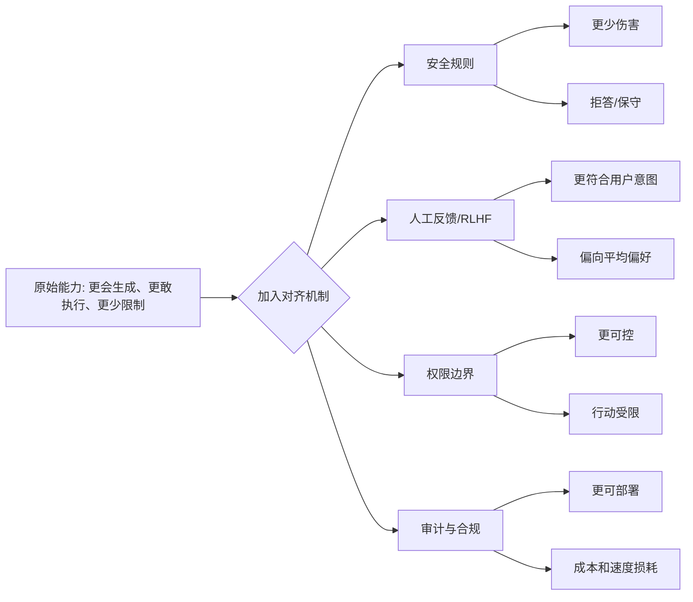

## AI 领域思维筑基课: 对齐税公理: 越要安全可控, 越要付出自由度成本

### 作者
digoal

### 日期
2026-05-19

### 标签
对齐税 , AI安全 , RLHF , 权限控制 , 合规成本 , 产品安全 , Agent治理 , 风险管理 , 投资分析 , AI公理

----

## 背景

> 面向对象: 大学生、产品经理、运营经理、有投资需求的人  
> 核心问题: 为什么一个系统越想“安全、合规、听话、可控”, 往往越慢、越保守、越贵, 有时还没那么好用?  
> 先说结论: 对齐税是为了让 AI 或组织行为符合人类目标、规则和责任边界而付出的成本。这个成本可能表现为能力下降、响应变慢、拒答变多、审核变重、上线变慢、创新空间变小。但对齐税不是纯损失: 在高风险场景里, 它是把能力变成可用产品、可信组织和可投资资产的必要价格。

## 一张图先看懂



一个简单判断式:

```
可部署能力 = 原始能力 - 失控风险 - 对齐成本 + 信任收益

对齐太少: 强但危险
对齐太多: 安全但笨重
好的产品: 在具体场景里找到可承受的对齐税
```

## 求真讲法

### 它到底说了什么

“对齐”指让 AI 系统的行为尽量符合人的真实意图、价值边界、法律要求和业务责任。比如不要泄露隐私, 不要帮助欺诈, 不要胡乱给医疗建议, 不要越权执行高风险操作。

“税”不是政府收税, 而是代价。你为了获得安全、合规、可解释、可审计, 必须付出某些成本。这个成本可能是:

| 对齐成本 | 在 AI 产品里的表现 | 在组织和投资里的表现 |
|---|---|---|
| 能力成本 | 模型拒答、回答更保守、创意变弱 | 公司为了合规放弃部分高利润业务 |
| 时间成本 | 多一层审核, 上线变慢 | 决策流程变长 |
| 金钱成本 | 安全评测、红队测试、人工标注、合规团队 | 管理费用和交付成本上升 |
| 体验成本 | 用户觉得“不够聪明”“管太多” | 客户转向更开放但风险更高的替代品 |
| 机会成本 | 不能进入某些灰色场景 | 增长速度不如激进竞争者 |
| 责任成本 | 需要日志、追踪、解释和申诉机制 | 管理层必须承担后果 |

所以对齐税公理可以写成:

> 当一个系统从“尽可能完成任务”转向“在边界内可靠完成任务”时, 它必然要在能力、速度、成本、自由度和责任之间重新分配资源。

这不是 AI 独有。汽车有刹车、安全带和限速规则; 银行有 KYC 和反洗钱; 药品有临床试验; 公司有财务审计。这些都会增加成本, 但没有它们, 系统越强, 事故越大。

### 它是怎么来的

在大语言模型早期, 纯预训练模型主要学习“下一个 token 怎么接”。它可能很会续写, 但不一定遵循用户意图, 也可能生成有害、偏见或不真实内容。

InstructGPT 论文提出用人类反馈强化学习, 即 RLHF, 来让模型更会遵循指令。大致流程是: 人类写示范答案, 再比较多个模型回答的好坏, 训练奖励模型, 最后让模型朝人类更偏好的方向优化。研究显示, 经过这种方式训练的小模型, 在人类偏好评估中可以比更大的原始 GPT-3 更受欢迎。

Anthropic 后来提出 Constitutional AI, 用一组原则帮助模型自我修正回答, 再用 AI 反馈替代一部分人类反馈。这说明对齐方法会演进, 对齐税不一定永远很高。

但底层张力仍然存在: 人类真实目标复杂、含糊、会冲突。用户想要“有帮助”, 社会还要求“无害”; 用户想要“回答快”, 企业还要求“可审计”; 投资人想要“增长快”, 监管还要求“风险可控”。当目标不止一个时, 系统就不可能只朝单一能力最大化。

### 它依赖哪些假设

对齐税不是严格数学定理, 更像工程和组织管理中的公理。它成立依赖这些前提:

| 前提 | 为什么会产生税 | 前提不成立时 |
|---|---|---|
| 原始能力和安全边界存在冲突 | 限制危险行为会同时挡住部分正常需求 | 如果任务低风险、边界清楚, 税会很低 |
| 人类目标难以完整写成规则 | 规则越多, 误杀和漏放都可能发生 | 如果目标可形式化, 税可显著降低 |
| 错误有外部成本 | 出错会伤害用户、品牌、合规和现金流 | 如果失败成本极低, 可少交对齐税 |
| 系统能力越强, 行动后果越大 | 越能执行, 越需要权限和审计 | 如果系统只能建议不能执行, 税较低 |
| 市场和监管会惩罚事故 | 安全投入能换来信任和牌照 | 如果市场只奖励短期增长, 公司会逃税 |

这也解释了为什么同一个 AI 模型, 在不同场景里的对齐税完全不同。写营销标题的税很低; 自动批准贷款、诊断疾病、执行转账、控制机器人, 税就很高。

### 常见误解

误解一: 对齐税就是“安全让模型变笨”。  
不完整。对齐可能让模型在某些自由生成任务上变保守, 但也可能提升指令遵循、减少有害输出、提高企业可用性。它不是单向损失, 而是能力结构重分配。

误解二: 开源模型没有对齐税。  
不对。开源模型可以减少供应商限制, 但企业真正上线时仍要承担权限、审计、隐私、合规和事故责任。你可以不在模型层交税, 也要在产品层、组织层或法律层交税。

误解三: 对齐越强越好。  
不对。过度对齐会导致“拒答优先”“流程过重”“用户体验差”。如果系统为了避免所有风险而什么都不做, 它就失去产品价值。

误解四: 对齐只是技术问题。  
不对。很多对齐问题来自目标冲突和责任分配。比如客服 AI 是优先安抚用户、保护公司利润、遵守法规, 还是承认错误? 这不是只靠模型参数能解决的。

误解五: 对齐税一定会越来越高。  
不一定。更好的评测、权限设计、工具调用、可解释性、红队测试、合成数据和原则训练, 都可能降低单位安全成本。但只要能力扩大、责任扩大, 对齐需求也会扩大。

## 求存讲法

### 它有什么用

对齐税公理的实用价值是: 让你不被两个极端骗走。

一个极端是“只看能力”: 这个模型真强, 这个 Agent 真会干活, 这个公司增长真快。问题是, 如果没有边界, 强能力会带来强事故。

另一个极端是“只看安全”: 什么都要审批, 什么都不能做, 任何风险都不碰。问题是, 如果税太重, 系统没有竞争力, 用户会离开, 公司会被更高效的对手替代。

真正成熟的判断是:

> 先看任务风险, 再决定该交多少对齐税。

### 它怎么迁移到熟悉领域

#### 对大学生: 自由和约束不是敌人

学习中也有对齐税。你想快速写完论文, 但学校要求引用规范、查重、实验记录和伦理审查。这些规则会让你慢一点, 却让你的成果更可信。

如果完全不交税, 你可能用 AI 拼出一篇流畅文章, 但引用虚假、逻辑松散、无法答辩。如果税太重, 你可能把大量时间花在格式和流程上, 反而没有真正思考。

合理做法是: 对低风险任务用 AI 快速生成草稿; 对核心论证、数据、引用和结论亲自校验。把对齐税交在会影响信用的地方。

#### 对产品经理: 安全边界是产品能力的一部分

AI 产品不是“模型越放开越好”。如果智能客服能自动退款、改地址、查隐私、承诺赔偿, 它就必须有权限边界、日志、二次确认和人工兜底。

产品经理要把对齐税设计成分层:

| 风险等级 | AI 可以做什么 | 对齐税 |
|---|---|---|
| 低风险 | 总结、改写、分类、推荐候选 | 低: 基础提示和抽检 |
| 中风险 | 生成客户回复、报价建议、运营方案 | 中: 来源、审核、版本记录 |
| 高风险 | 退款、封号、授信、医疗/法律建议 | 高: 权限控制、人工确认、审计追踪 |
| 不可接受风险 | 违法、欺诈、危险操作 | 必须拒绝或转人工 |

这张表的关键不是“限制 AI”, 而是让 AI 在正确的风险层级里释放能力。

#### 对运营经理: 增长也有对齐税

运营最常见的问题是: 为了短期转化, 牺牲长期信任。标题党、过度弹窗、虚假稀缺、诱导续费、骚扰短信, 都是“不交对齐税”的增长方式。

它们短期可能有效, 长期会把用户信任、品牌资产和监管空间消耗掉。

运营中的对齐税包括:

```
增长动作前: 合规检查、品牌口径、用户承诺边界
增长动作中: 投诉监控、退订入口、频控机制
增长动作后: 留存、复购、退款、差评和投诉复盘
```

如果只看点击和转化, 你会觉得这些都是负担。如果看长期现金流, 它们是保护复利的保险。

#### 对投资者: 对齐税决定商业模式质量

投资 AI 公司时, 很多人只看“能力有多强”。但真正要看的是“能力能不能低成本、低事故、可持续地交付给客户”。

对齐税可以变成尽调清单:

| 尽调问题 | 看什么 |
|---|---|
| 这个 AI 做错一次的代价多大? | 客诉、赔偿、监管、品牌、生命财产风险 |
| 公司如何降低对齐税? | 数据闭环、权限设计、自动评测、人工审核效率 |
| 对齐税由谁承担? | 公司、客户、用户、保险、监管还是外包团队 |
| 对齐税是否随规模下降? | 越多客户越自动化, 还是越多客户越多人力密集 |
| 安全是否形成壁垒? | 合规资质、行业流程、可信数据、审计体系 |
| 竞争对手能否通过少交税短期抢市场? | 灰色增长、低价交付、监管套利 |

好公司不是没有对齐税, 而是能把对齐税工程化, 让单位风险成本随规模下降。差公司要么逃税, 最后爆雷; 要么税太重, 永远规模化不了。

### 它的适用范围和边界

适用范围:

- 判断 AI 模型为什么有时拒答、保守或变慢。
- 设计 AI Agent 的权限、审核和回滚机制。
- 评估企业 AI 产品能否从 demo 走向生产。
- 分析运营增长是否牺牲长期信任。
- 判断投资标的的真实可规模化能力。

边界:

- 对齐税不是为低质量体验找借口。拒答混乱、规则粗糙、误伤正常用户, 是设计问题。
- 对齐税不是越高越安全。复杂流程可能制造新的错误和责任盲区。
- 对齐税不是只由模型承担。产品权限、业务流程、组织激励和法律责任都参与对齐。
- 对齐税不是固定常数。随着技术、流程和监管成熟, 同一类任务的税率会变化。

### 正例: 怎么用它提升能力

正例一: 大学生用 AI 写论文初稿。  
他让 AI 生成结构和反方观点, 但引用、数据、关键论证全部查原文。这里“核心信用环节需要校验”的前提成立, 所以对齐税交得有效: 速度提高, 学术风险可控。

正例二: 产品经理上线企业知识库助手。  
助手可以回答制度问题, 但涉及薪酬、裁员、合同和客户隐私时必须给来源并转人工。这里“风险分层”前提成立, 所以既保留效率, 又避免高风险误答。

正例三: 运营团队做大促。  
团队没有用虚假倒计时和夸大承诺, 而是限制推送频率、明确退款规则、监控投诉率。短期转化少一点, 但复购和品牌信任更稳定。这里“长期信任有价值”的前提成立。

正例四: 投资者评估垂直 AI SaaS。  
她发现公司虽然模型不是最强, 但有行业合规流程、客户数据闭环、自动质检、人工审核平台和事故赔付机制。这里“对齐税可工程化并随规模下降”的前提成立, 反而构成壁垒。

### 反例: 前提不成立会怎样

反例一: 学生完全依赖 AI 生成论文。  
AI 写得很流畅, 但引用不存在, 数据没有来源, 答辩时无法解释。失败原因是“低风险草稿”和“高信用成果”被混为一谈, 对齐税交错了位置。

反例二: 产品团队把 Agent 直接接入生产系统。  
为了展示自动化能力, Agent 可以修改订单、发优惠券、改客户资料, 但没有权限分级和回滚。一次错误批量发券造成损失。失败原因是“系统只能建议不能执行”的低税前提不成立。

反例三: 运营团队追求极致转化。  
他们用诱导续费和夸张承诺拉高短期收入, 后续投诉、退款和监管关注上升。失败原因是“市场只奖励短期转化”的假设不成立, 用户信任和监管成本最终反噬。

反例四: 投资者高估“无审核 AI 平台”的利润率。  
平台早期毛利很好, 因为几乎不做内容安全、版权审核和客户风险控制。规模扩大后事故频发, 被迫增加审核团队和合规投入, 利润率塌陷。失败原因是“对齐税可以长期不交”的前提不成立。

反例五: 企业过度对齐导致产品不可用。  
一个内部 AI 助手为避免风险, 对大量正常问题都拒答, 用户回到手工流程。失败原因是“安全规则越严越好”的前提不成立。过高对齐税会杀死产品价值。

## 思考

对齐税背后有一个更深的问题: 人类想要的从来不是单一目标。我们既要效率, 又要公平; 既要自由, 又要安全; 既要增长, 又要长期信任; 既要模型强大, 又要模型不乱来。

任何系统只要足够强, 就必须面对价值冲突。越强的工具, 越不能只问“能不能做”, 还要问“该不该做、谁负责、错了怎么办”。这就是对齐税的本质: 强能力进入真实社会之前, 必须为社会复杂性付费。

可以继续追问:

1. 你正在使用的 AI 工具, 哪些限制是合理安全, 哪些只是粗糙拒答?
2. 一个产品为了增长少交了哪些对齐税? 这些税未来会不会以投诉、监管、流失的形式补交?
3. 如果一个 AI 公司说自己“无需人工审核也能规模化”, 它是否低估了真实世界的复杂性?
4. 在投资中, 安全和合规到底是成本, 还是进入高价值行业的门票?
5. 当监管变严时, 哪些公司会被拖慢, 哪些公司会因为早交对齐税而获得壁垒?

## 最后记住

1. 对齐税是让能力服从人类目标、责任和边界所付出的代价。
2. 对齐税不只表现为模型变保守, 还包括审核、权限、合规、解释、追责和机会成本。
3. 税太低会失控, 税太高会失去产品价值; 关键是按风险分层交税。
4. AI 产品从 demo 到生产, 最大挑战往往不是“能不能答”, 而是“错了怎么办”。
5. 投资时要看公司能否把对齐税工程化, 让安全成为规模化壁垒, 而不是利润率黑洞。

## 参考资料

- Long Ouyang et al., 2022, [Training language models to follow instructions with human feedback](https://arxiv.org/abs/2203.02155), InstructGPT/RLHF 代表性论文。
- OpenAI, 2022, [Aligning language models to follow instructions](https://openai.com/index/instruction-following/), 关于 InstructGPT 和 RLHF 的官方说明。
- Anthropic, 2022, [Constitutional AI: Harmlessness from AI Feedback](https://arxiv.org/abs/2212.08073), 用原则和 AI 反馈降低部分人工对齐成本。
- OpenAI, 2023, [GPT-4 Technical Report](https://cdn.openai.com/papers/gpt-4.pdf), 包含安全评测、RLHF 和红队测试相关说明。
- Dario Amodei et al., 2016, [Concrete Problems in AI Safety](https://arxiv.org/abs/1606.06565), 关于奖励黑客、负面副作用、分布转移等 AI 安全问题。
- AI Safety & Security Directory, 2026, [Alignment Tax](https://aisecurityandsafety.org/en/glossary/alignment-tax/), 对“对齐税”作为能力、安全、成本权衡概念的定义。
- 本文同时参考了用户提供的 `/Users/digoal/Downloads/ai_axioms.md` 中“AI Agent 时代的底层公理”框架, 并按 `axiom-explainer` 的“求真讲法、求存讲法、思考”结构重写扩展。
  
#### [PostgreSQL 解决方案集合](../201706/20170601_02.md "40cff096e9ed7122c512b35d8561d9c8")
  
  
#### [德哥 / digoal's Github - 公益是一辈子的事.](https://github.com/digoal/blog/blob/master/README.md "22709685feb7cab07d30f30387f0a9ae")
  
  
#### [About 德哥](https://github.com/digoal/blog/blob/master/me/readme.md "a37735981e7704886ffd590565582dd0")
  
  

  
