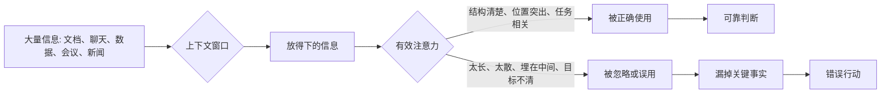
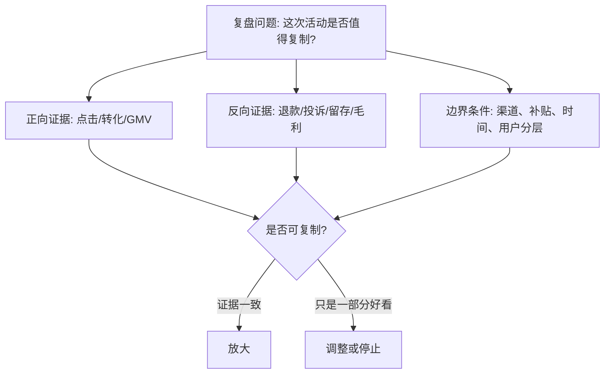

## AI 领域思维筑基课: 上下文窗口公理: 放得下不等于用得上

### 作者
digoal

### 日期
2026-05-19

### 标签
上下文窗口 , 有效上下文 , Lost in the Middle , 注意力机制 , RAG , 长文档分析 , 产品协作 , 运营复盘 , 投资研究 , AI公理

----

## 背景

> 面向对象: 大学生、产品经理、运营经理、有投资需求的人  
> 核心问题: 为什么材料都给了、会议都开了、报告都读了、AI 也喂了长文档, 最后仍然漏掉关键事实?  
> 先说结论: 上下文窗口是系统一次能“看到”的信息范围, 但有效上下文是系统真正能“使用”的信息范围。无论是 AI、人脑、团队会议还是投研决策, 信息越长、越杂、越无结构, 关键内容越容易被稀释。真正的能力不是无限塞材料, 而是把关键证据放在正确位置、保留清晰结构、持续刷新焦点。

## 一张图先看懂



一个短公式:

```
有效上下文 = 可见信息 x 任务相关性 x 位置权重 x 结构清晰度

窗口变大, 不等于有效上下文等比例变大。
```

## 求真讲法

### 它到底说了什么

在大语言模型里, 上下文窗口指模型一次生成回答时能接收和处理的 token 范围。token 可以粗略理解为文本被拆分后的基本单位, 可能是一个字、一个词的一部分、一个标点或一段编码。

但这条公理的重点不是“窗口有多大”, 而是:

> 能被放进窗口的信息, 不一定会被模型稳定、准确、等权重地使用。

这和人类很像。你可以把 200 页材料发给一个人, 但他真正记住的可能是第一页结论、最后一页建议、图表标题、老板强调的话, 以及和自己任务最相关的几段。中间大量信息虽然“在场”, 但没有进入有效判断。

所以“上下文窗口公理”可以写成:

> 任何信息处理系统都有有限的有效注意力。信息进入窗口只是第一步, 只有被定位、压缩、结构化、反复激活的信息, 才更可能影响输出。

### 它是怎么来的

Transformer 架构让模型通过注意力机制在序列中查找相关信息。2017 年的《Attention Is All You Need》奠定了这个方向。后来大语言模型的上下文窗口不断扩大, 从几千 token 到几十万、上百万 token。

但长窗口带来一个新问题: 模型能接收更多信息, 不代表它能同样好地使用所有位置的信息。2023 年论文《Lost in the Middle: How Language Models Use Long Contexts》系统研究了这个现象。研究发现, 在多文档问答和键值检索任务中, 相关信息位于上下文开头或结尾时, 模型通常更容易利用; 相关信息埋在中间时, 性能会下降。这就是常说的“Lost in the Middle”。

后续研究和工程实践不断尝试缓解这个问题, 比如更好的位置编码、检索增强生成、上下文重排、摘要压缩、记忆系统、多轮分块推理。但这些方法没有推翻公理, 只是说明: 有效上下文需要设计, 不能靠堆长度自然解决。

### 它依赖哪些假设

| 前提 | 为什么影响有效上下文 | 前提不成立时 |
|---|---|---|
| 系统注意力有限 | 不能同等处理所有信息 | 如果任务极简单、信息很短, 问题不明显 |
| 信息位置会影响使用概率 | 开头、结尾、被强调处更容易被用到 | 如果模型或流程能做位置无关检索, 影响会下降 |
| 信息需要结构化 | 标题、摘要、层级、标签能帮助定位 | 如果材料无结构, 关键事实容易被淹没 |
| 任务目标决定相关性 | 同一材料对不同问题的重要性不同 | 如果问题不清, 系统不知道该关注什么 |
| 长上下文会引入噪声 | 无关内容会稀释判断 | 如果检索和筛选很强, 噪声可被压低 |

这条公理不说“长上下文没用”。它说的是: 长上下文只有在筛选、排序、摘要、引用、复核这些机制配合下, 才能稳定变成有效能力。

### 常见误解

误解一: 窗口越大, 模型越聪明。  
不对。窗口大只是能接收更多材料, 不是自动更会推理。一个人书架更大, 不代表他读得更懂。

误解二: 我把材料都发给 AI, 它就应该都记得。  
不对。材料在窗口里, 不代表每个细节都被同等关注。关键约束、数据口径、反例和风险提示最好单独提取并放在靠近问题的位置。

误解三: 只要使用 RAG, 上下文窗口问题就消失了。  
不对。RAG, 即检索增强生成, 能把相关文档取出来, 但如果检索错、排序错、片段过多、问题不清, 仍然会把垃圾或噪声塞进窗口。

误解四: 人类没有上下文窗口问题。  
不对。人的工作记忆、注意力和会议耐心更有限。很多团队不是缺信息, 而是缺“让关键信息在正确时刻出现”的机制。

误解五: 总结越短越好。  
不一定。过度摘要会删掉关键边界条件。好的摘要不是把信息压到最短, 而是保留任务所需的证据、假设、结论和不确定性。

## 求存讲法

### 它有什么用

上下文窗口公理让你在信息爆炸时代建立一个基本判断:

> 管理信息, 不是把所有东西保存起来, 而是让关键事实在决策时能被正确调用。

这条公理能解释很多常见失败:

- 学生复习资料很多, 但考试时想不起关键定义。
- 产品需求文档很厚, 但开发仍然误解核心边界。
- 运营复盘报表很全, 但团队只记住了最显眼的增长数字。
- 投资报告几十页, 但真正影响收益的是中间一条被忽略的风险假设。
- AI Agent 聊了几十轮, 后面忘了最初的限制条件。

### 它怎么迁移到熟悉领域

#### 对大学生: 复习不是堆资料, 是构建可调用上下文

很多学生复习时喜欢收集资料、截图、收藏课程、保存笔记。但考试需要的是“可调用知识”, 不是“曾经看过”。如果定义、公式、例题、反例都散在不同地方, 大脑就像一个没有索引的长上下文。

更稳的学习结构是:

```
一页总纲: 这章解决什么问题
核心定义: 每个概念一句话
典型题型: 输入是什么, 输出是什么
易错边界: 哪些条件不成立会错
自测问题: 不看答案能不能复述
```

这不是为了让笔记更漂亮, 而是为了让关键知识在需要时能被检索出来。

#### 对产品经理: PRD 的价值不在长度, 在关键上下文是否突出

产品需求文档如果把背景、用户故事、竞品截图、老板意见、接口说明、边界情况全堆在一起, 开发和设计会自然抓住最显眼的信息, 而不是最重要的信息。

更好的 PRD 不是更长, 而是把上下文分层:

| 信息层级 | 应该放什么 | 目的 |
|---|---|---|
| 第一屏 | 目标、非目标、核心约束、成功指标 | 防止方向误读 |
| 主体 | 用户场景、流程、状态、异常边界 | 支撑设计和开发 |
| 附录 | 调研记录、竞品截图、历史讨论 | 保留证据但不干扰主线 |
| 决策日志 | 为什么这样取舍 | 防止未来重复争论 |

产品管理的本质之一, 就是管理团队共同上下文。

#### 对运营经理: 复盘要防止“显眼指标劫持注意力”

运营复盘最容易被开头的大数字带偏。比如 GMV 增长 30%, 大家就觉得活动成功; 但中间可能藏着退款率上升、老用户流失、投诉增加、毛利下降。

运营复盘应该把“主结论”和“反证”放在同一屏:



如果反证埋在 30 页 PPT 的中间, 它在组织决策中就等于不存在。

#### 对投资者: 长报告最大的风险是“证据位置错配”

投研材料常常很长, 但投资决策通常由少数关键变量决定: 增长是否可持续, 毛利是否真实, 现金流是否健康, 管理层是否可信, 行业周期是否反转, 估值是否已经透支。

上下文窗口公理要求投资者做两件事:

1. 把投资假设压缩成 3 到 5 条关键命题。
2. 把支持证据和反证证据放在同一张表里。

例如:

| 投资命题 | 支持证据 | 反证/风险 | 需要跟踪的信号 |
|---|---|---|---|
| 公司增长可持续 | 续费率高、客单价提升 | 增长依赖补贴或大客户 | 净收入留存、获客成本 |
| AI 产品有壁垒 | 有独家数据闭环 | 只是套壳通用模型 | 客户数据回流、错误率下降 |
| 估值有安全边际 | 现金流改善 | 利润来自一次性收入 | 自由现金流、毛利结构 |

如果你无法把长报告压缩成这种表, 说明你不是信息不够, 而是有效上下文没有建好。

### 它的适用范围和边界

适用范围:

- AI 长文档问答、RAG、Agent 多轮任务。
- 学习笔记、考试复习、论文写作。
- 产品需求文档、会议纪要、项目协作。
- 运营复盘、增长实验、指标看板。
- 投研报告、尽调材料、投资备忘录。

边界:

- 上下文窗口不是唯一瓶颈。模型能力、数据质量、任务设计、工具调用也会影响结果。
- 长上下文不是坏事。法律、科研、代码库、尽调材料确实需要长上下文, 但必须配合索引和分层。
- 摘要不是万能。摘要可能遗漏少数关键事实, 因此高风险决策要能回溯原文。
- 开头和结尾更重要不是绝对规律。不同模型、任务和提示方式会有差异, 但位置偏差足够常见, 值得在工程和管理中防范。

### 正例: 怎么用它提升能力

正例一: 大学生复习线性代数。  
他没有把所有课件合成一个大文件反复看, 而是做一页“概念地图”, 把向量空间、线性相关、秩、特征值之间的关系画出来, 每个概念配一个反例。这里“结构清晰、关键内容可调用”的前提成立, 所以复习效率上升。

正例二: 产品经理让 AI 分析 80 页访谈。  
她不是一次性问“用户需求是什么”, 而是先让 AI 按用户类型、场景、痛点、反例分块摘要, 再把高频痛点和关键原话放到最终问题附近。这里“分块、排序、靠近问题”的前提成立, 所以 AI 更可能用到关键信息。

正例三: 运营经理做月度复盘。  
他把增长、利润、留存、投诉放在同一页, 并把“是否可复制”作为唯一主问题。团队不会被单个漂亮指标带走。这里“任务目标明确、反证靠前”的前提成立。

正例四: 投资者写投资备忘录。  
她把 60 页材料浓缩成“买入理由、卖出条件、关键反证、下次复核日期”。每次财报后先检查这些变量, 而不是重新被新闻流带着跑。这里“关键命题持续激活”的前提成立。

### 反例: 前提不成立会怎样

反例一: 学生把所有资料丢给 AI 要总结。  
AI 生成了一份流畅摘要, 但漏掉老师反复强调的边界条件。考试题正好考边界, 学生答错。失败原因是“关键条件被结构化突出”的前提不成立。

反例二: 产品团队 PRD 过长。  
核心约束“不能影响老用户流程”埋在文档中间, 开发实现时没看到, 上线后老用户投诉。失败原因是“重要信息在决策时被有效调用”的前提不成立。

反例三: 运营复盘只看第一页增长。  
大促 GMV 很漂亮, 但退款率和低毛利问题在后面附录。团队复制活动后利润恶化。失败原因是“反证和主结论同屏出现”的前提不成立。

反例四: 投资者读完长研报后只记住目标价。  
研报中间写着“增长依赖单一大客户续约”, 但这个风险没有进入投资备忘录。大客户流失后股价下跌。失败原因是“核心风险被持续激活”的前提不成立。

反例五: AI Agent 多轮任务忘记最初限制。  
用户一开始说“不要修改生产数据”, 但 30 轮对话后 Agent 根据最新请求执行了写操作。失败原因是“关键约束需要重复注入或权限固化”的前提不成立。

## 思考

上下文窗口公理揭示了一个信息时代的悖论: 信息越多, 人越容易以为自己更接近真相; 但如果没有结构、索引和焦点, 更多信息只会制造更多噪声。

真正稀缺的不是资料, 而是有效注意力。谁能决定什么信息放在第一页, 什么风险必须同屏呈现, 什么指标被反复追踪, 谁就在影响组织和个人的未来判断。

可以继续追问:

1. 你最近一次错误判断, 是因为不知道信息, 还是因为关键信息没有在决策时出现?
2. 你的学习笔记、PRD、复盘、投研材料, 第一屏是否写清了目标、边界和反证?
3. 你给 AI 的长上下文里, 哪些内容必须被使用? 它们有没有靠近问题?
4. 会议中真正影响决策的信息, 是证据最强的, 还是出现位置最显眼的?
5. 如果未来模型能读 1 亿 token, 人类还需要摘要、索引和判断吗?

## 最后记住

1. 上下文窗口是“放得下”的范围, 有效上下文才是“用得上”的范围。
2. 长上下文不等于强理解; 关键内容如果埋在中间、缺少结构, 仍然会被忽略。
3. 对 AI、学习、产品、运营、投资来说, 重要信息要前置、分层、标注、靠近问题并可回溯。
4. 反证和风险如果不和主结论同屏出现, 在真实决策里就很容易消失。
5. 信息爆炸时代的核心能力不是囤材料, 而是管理注意力和构建可调用上下文。

## 参考资料

- Ashish Vaswani et al., 2017, [Attention Is All You Need](https://arxiv.org/abs/1706.03762), Transformer 和注意力机制的代表性论文。
- Nelson F. Liu et al., 2023/2024, [Lost in the Middle: How Language Models Use Long Contexts](https://arxiv.org/abs/2307.03172), 关于长上下文中位置信息利用差异的实证研究。
- Nelson F. Liu et al., 2024, [Lost in the Middle: How Language Models Use Long Contexts](https://direct.mit.edu/tacl/article/doi/10.1162/tacl_a_00638/119630/Lost-in-the-Middle-How-Language-Models-Use-Long), TACL 发表版本。
- Marzena Karpinska et al., 2024, [Evaluating Language Model Context Windows: A "Working Memory" Test and Inference-time Correction](https://arxiv.org/abs/2407.03651), 关于长上下文工作记忆测试与推理时修正方法。
- Machel Reid et al., 2024, [Gemini 1.5: Unlocking multimodal understanding across millions of tokens of context](https://arxiv.org/abs/2403.05530), 关于百万级多模态上下文能力的技术报告。
- 本文同时参考了用户提供的 `/Users/digoal/Downloads/ai_axioms.md` 中“AI Agent 时代的底层公理”框架, 并按 `axiom-explainer` 的“求真讲法、求存讲法、思考”结构重写扩展。
  
#### [PostgreSQL 解决方案集合](../201706/20170601_02.md "40cff096e9ed7122c512b35d8561d9c8")
  
  
#### [德哥 / digoal's Github - 公益是一辈子的事.](https://github.com/digoal/blog/blob/master/README.md "22709685feb7cab07d30f30387f0a9ae")
  
  
#### [About 德哥](https://github.com/digoal/blog/blob/master/me/readme.md "a37735981e7704886ffd590565582dd0")
  
  

  
