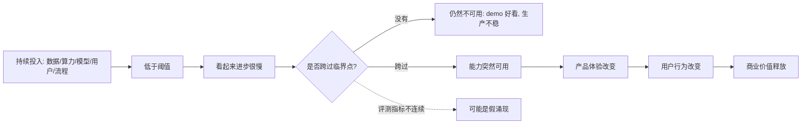
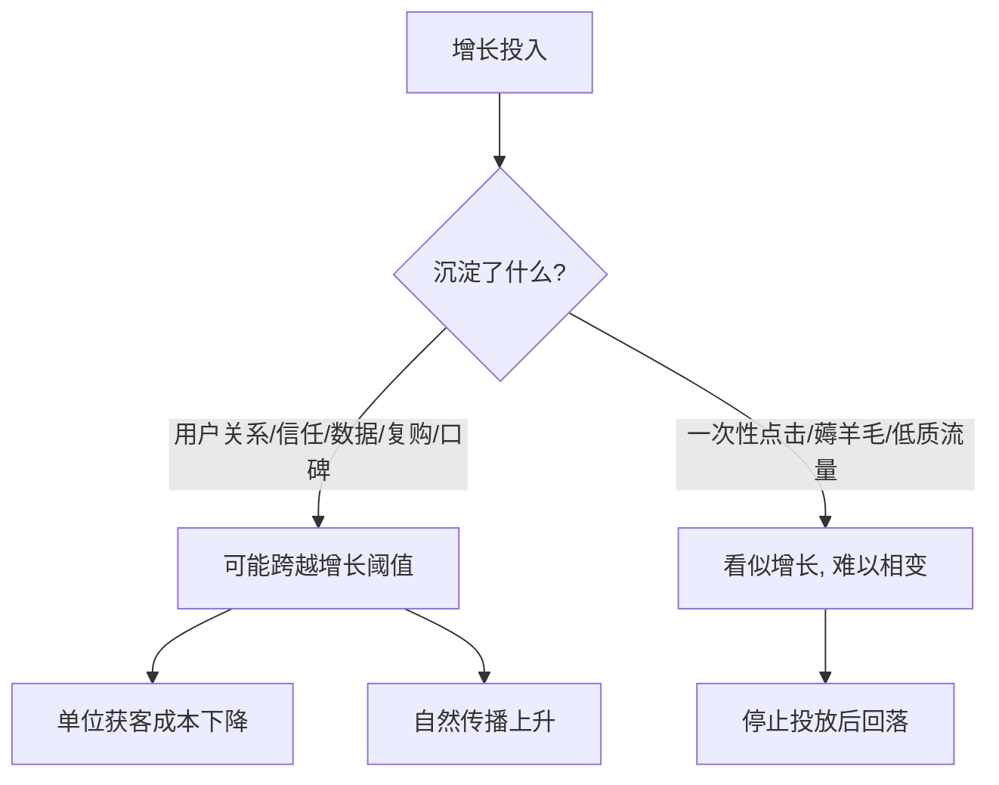

## AI 领域思维筑基课: 涌现相变公理: 量变不总是平均兑现, 常在阈值后突然可用

### 作者
digoal

### 日期
2026-05-19

### 标签
涌现相变 , 规模定律 , 能力阈值 , 大语言模型 , AI评测 , 产品增长 , 运营策略 , 投资判断 , 技术扩散 , AI公理

----

## 背景

> 面向对象: 大学生、产品经理、运营经理、有投资需求的人  
> 核心问题: 为什么有些能力长期看起来“差一点”, 但跨过某个门槛后突然变得可用? 为什么投融资里最容易误判的, 往往是“还没到阈值”和“刚刚过阈值”的项目?  
> 先说结论: 涌现相变指系统规模、数据、算力、组织密度、用户网络或资本投入累积到某个临界点后, 表现不再只是线性改善, 而是出现新的可用能力、新的商业形态或新的竞争格局。但 AI 里的“涌现”要谨慎判断: 有些是真能力跨阈值, 有些只是评测指标造成的错觉。

## 一张图先看懂



一个短公式:

```
表面进步: 1, 2, 3, 4, 5
可用性变化: 不可用, 不可用, 勉强可用, 突然可用, 规模化可用

关键不是“有没有进步”, 而是“有没有跨过可用阈值”。
```

## 求真讲法

### 它到底说了什么

“涌现”原本是复杂系统里的概念, 指整体出现了单个部分不具备的性质。比如单个水分子没有“湿”的感觉, 但大量水分子在一定条件下形成了液体性质。相变则是物理学里的概念, 比如水在特定压强下达到沸点后从液态变成气态。

放到 AI 和商业里, “涌现相变公理”可以写成:

> 当系统的关键变量持续累积到临界区间后, 输出能力可能从“量的改善”变成“质的可用”, 但这个阈值常常事前难以精确预测, 事后又容易被过度神化。

在大语言模型中, 人们观察到一些能力似乎只在模型规模足够大时才明显出现, 比如少样本学习、复杂指令遵循、链式推理、代码生成、多步数学等。2022 年论文《Emergent Abilities of Large Language Models》把这类现象系统化讨论。

但 2023 年《Are Emergent Abilities of Large Language Models a Mirage?》提醒我们: 一些“突然出现”的能力, 可能来自评测指标的选择。比如用“完全正确才得 1 分, 否则 0 分”的指标, 会把连续进步画成突然跳变。换成更细的连续指标, 有些涌现会变成平滑曲线。

所以本文采用一个更稳的版本:

> 涌现相变不是保证“神奇能力突然诞生”, 而是提醒我们: 系统存在可用阈值。低于阈值时, 进步可能没有商业意义; 高于阈值后, 同样的进步会被市场、产品和用户行为迅速放大。

### 它是怎么来的

AI 里的涌现相变, 与 scaling law, 即规模定律, 密切相关。2020 年《Scaling Laws for Neural Language Models》发现语言模型性能会随着模型规模、数据量和训练计算量呈现相对规律的改善。2022 年 Chinchilla 论文进一步指出, 在固定算力预算下, 参数量和训练数据需要更平衡地扩展, 不是只把模型做大就够。

这些研究告诉我们两件事:

| 观察 | 含义 |
|---|---|
| 底层损失常常随规模平滑下降 | 基础能力可能是连续改善 |
| 下游任务表现可能突然跨过可用线 | 用户感知和商业价值可能非线性释放 |

这就像手机摄像头。传感器、算法和算力每年都在进步, 但用户真正感到“可以替代普通相机”的时刻, 是跨过某个体验阈值后才出现的。底层指标可能平滑改善, 但市场感知会突然变化。

### 它依赖哪些假设

| 前提 | 为什么重要 | 前提不成立时 |
|---|---|---|
| 存在关键阈值 | 没跨阈值时, 能力不能稳定兑现 | 如果任务本来线性收益, 就不会明显相变 |
| 多个变量共同累积 | 模型、数据、算力、产品流程缺一不可 | 单点变强但系统没变, 只能做 demo |
| 评测接近真实任务 | 才能判断能力是否真正可用 | 指标错会制造假涌现 |
| 用户行为会响应能力变化 | 能力跨阈值后才有商业释放 | 如果用户无需求, 能力涌现也难变现 |
| 竞争和成本允许扩散 | 新能力要能被部署和传播 | 如果成本太高, 相变只停留在实验室 |

这条公理不是说“投入越大一定会成功”。它只说: 当系统存在阈值结构时, 平均线性思维会误判真实变化。

### 常见误解

误解一: 涌现就是玄学。  
不对。涌现不是说能力凭空出现, 而是说很多底层连续变化, 在输出层和用户感知层会表现为非线性跃迁。

误解二: 只要规模变大, 就一定涌现。  
不对。规模需要和数据质量、训练方法、任务设计、产品闭环匹配。盲目堆参数、堆人、堆钱, 可能只是在低效率地烧资源。

误解三: 没有看到效果, 就说明方向错了。  
不一定。可能是方向错, 也可能是还没跨阈值。区别在于是否有可验证的中间指标, 以及关键瓶颈是否清楚。

误解四: 一看到能力跳变, 就说明出现了真正智能。  
不一定。跳变可能来自任务指标、数据泄漏、提示方式、样本选择或评测口径。要区分“评测相变”和“现实可用相变”。

误解五: 涌现只属于 AI。  
不对。生活习惯、学习能力、社交网络、产品增长、品牌信任、组织协作、产业链成熟, 都可能出现阈值效应。

## 求存讲法

### 它有什么用

涌现相变公理帮你避免两类误判:

第一类是低估。你看到一个东西长期不成熟, 就以为它永远没用。结果它跨过阈值后, 用户行为突然改变, 原有判断失效。

第二类是高估。你看到一个 demo 突然惊艳, 就以为它已经跨过商业阈值。结果真实场景一复杂, 成本、稳定性、合规和用户习惯都没过线。

更稳的判断方式是:

> 不问“有没有进步”, 而问“离可用阈值还差哪几个变量”。

### 它怎么迁移到熟悉领域

#### 对大学生: 能力积累常常先沉默, 后兑现

学习时, 很多能力不是每天平均回报。背单词、刷数学题、练编程、写论文, 前期常常觉得“我怎么还是不会”。但当基本概念、题型经验、错误反馈和表达训练积累到一定程度后, 你会突然发现自己能独立解题、读懂论文、写出完整程序。

这不是鸡汤, 而是阈值结构:

```
概念不足 -> 看题像乱码
概念够了但练习少 -> 能听懂, 不会做
练习够了但反思少 -> 会做熟题, 怕变形
反例和迁移够了 -> 开始真正掌握
```

所以不要只看一天的效率, 要看关键变量有没有一起增长。

#### 对产品经理: MVP 和规模化产品之间有可用阈值

产品 demo 能跑, 不代表产品跨过可用阈值。尤其是 AI 产品, 用户会先被新奇感吸引, 但真正决定留存的是稳定性、准确率、延迟、成本、权限、安全、工作流嵌入。

产品经理要定义“相变指标”:

| 阶段 | 看起来像进步的指标 | 真正的阈值指标 |
|---|---|---|
| Demo | 能回答、界面好看、老板觉得惊艳 | 真实用户能完成任务 |
| 内测 | 使用次数增加 | 重复使用、错误可接受 |
| 上线 | 注册和试用增长 | 留存、付费、工单下降 |
| 规模化 | 客户数增加 | 单位交付成本下降、客户成功可复制 |

如果没有阈值指标, 团队会把“热闹”误认为“相变”。

#### 对运营经理: 增长不是线性加广告费

运营里的相变常见于信任、网络效应和内容供给。一个社区前 1000 个用户可能很冷清, 到某个密度后, 用户开始互相回答、互相传播, 平台活性突然上升。一个品牌长期做内容, 前期转化一般, 但当认知和信任累积到某个点, 转介绍开始明显增加。

但也要反过来看: 不是所有增长都能相变。补贴拉来的用户、标题党拉来的点击、一次性热点带来的流量, 可能没有沉淀关键变量。

运营要问:



#### 对投资者: 最大机会和最大陷阱都在阈值附近

投融资中, 涌现相变尤其重要。因为市场定价常常低估“刚要跨阈值”的公司, 也高估“看起来跨阈值但其实没跨”的公司。

投资者要区分三种状态:

| 状态 | 表面现象 | 判断重点 |
|---|---|---|
| 远低于阈值 | 技术很早、用户很少、商业闭环弱 | 是否有足够时间和资源继续累积 |
| 临近阈值 | 指标波动大, 有爆发苗头 | 哪个瓶颈决定能否跨过去 |
| 已跨阈值 | 增长、留存、成本结构同时改善 | 是否可持续, 是否已被估值透支 |

对 AI 公司尤其要问:

- 这个能力是模型能力跨阈值, 还是 demo 精心挑选?
- 真实客户场景是否跨过可用阈值?
- 成本是否跨过商业阈值?
- 合规、安全和交付是否跨过规模化阈值?
- 数据飞轮是否已经启动, 还是每个客户都要重新定制?

### 它的适用范围和边界

适用范围:

- AI 模型能力、Agent 能力、垂直 AI 产品。
- 学习、技能训练、职业成长。
- 社区、平台、品牌、内容和网络效应。
- 投资中的技术扩散、产业链成熟、公司规模化。
- 组织管理中的协作效率和流程成熟。

边界:

- 涌现相变不是预测魔法。它告诉你要找阈值, 不保证你能精确知道阈值在哪里。
- 不是所有系统都有明显相变。有些事情就是平滑积累, 不会突然爆发。
- 不是所有爆发都可持续。短期热点、补贴、政策窗口、财务口径变化, 都可能伪装成相变。
- 评测相变不等于现实相变。实验指标跨阈值, 还要经过成本、稳定性、用户习惯和监管验证。

### 正例: 怎么用它提升能力

正例一: 大学生学编程。  
他没有因为前两个月写不出完整项目就放弃, 而是追踪关键变量: 语法、数据结构、调试能力、阅读文档、项目拆分。第三个月开始能独立做小工具。这里“多个关键变量共同累积”的前提成立, 所以能力跨过了可用阈值。

正例二: 产品经理判断 AI 客服能否上线。  
她不看单次演示, 而看真实问题覆盖率、错误率、人工转接率、平均处理时长、客户满意度和高风险问题拦截率。当这些指标同时过线, 才逐步放量。这里“现实任务评测接近真实场景”的前提成立。

正例三: 运营经理做内容账号。  
他没有只追热点, 而是持续沉淀用户画像、栏目结构、私域关系和复购路径。半年后自然转发开始上升, 获客成本下降。这里“投入沉淀为信任和关系”的前提成立。

正例四: 投资者评估产业机会。  
她发现某类 AI 应用过去失败, 不是需求不存在, 而是模型准确率、推理成本、企业数据接入和合规流程都没过线。现在这些变量同时改善, 行业可能进入临界区。这里“瓶颈变量同步变化”的前提成立。

### 反例: 前提不成立会怎样

反例一: 学生把短期无感误判为无用。  
背单词两周看不到明显进步就放弃, 但真正阅读能力需要词汇、语法、语境和阅读量共同跨阈值。失败原因是“能力线性兑现”的前提不成立。

反例二: 产品团队把 AI demo 当成产品相变。  
演示中模型回答很好, 但上线后遇到长尾问题、脏数据、权限限制和延迟成本, 用户不再使用。失败原因是“评测场景等于真实场景”的前提不成立。

反例三: 运营团队把补贴增长当成网络效应。  
活动期用户数暴涨, 停止补贴后迅速流失。失败原因是“增长沉淀为关系和信任”的前提不成立, 流量没有跨过自循环阈值。

反例四: 投资者把估值上涨当成产业相变。  
公司股价因为 AI 概念上涨, 但收入质量、毛利、客户续费和数据闭环没有同步改善。失败原因是“资本市场叙事等于商业阈值跨越”的前提不成立。

反例五: 创业公司盲目追求规模。  
团队认为“只要用户够多就会出现网络效应”, 于是烧钱拉新。但用户之间没有互动需求, 产品也没有数据飞轮。失败原因是“规模本身会自动涌现价值”的前提不成立。

## 思考

涌现相变最容易让人兴奋, 也最容易让人犯错。因为它给了人一种诱惑: 只要再投一点钱、再堆一点规模、再熬一段时间, 奇迹就会出现。

但真正成熟的相变思维不是相信奇迹, 而是拆解阈值。你要知道系统有哪些关键变量, 哪个变量是瓶颈, 哪些指标只是表面热闹, 哪些指标真正说明“可用性”改变了。

可以继续追问:

1. 你正在做的事, 是平滑积累型, 还是阈值相变型?
2. 如果它需要跨阈值, 关键变量是哪几个?
3. 你看到的爆发, 是真实能力跨阈值, 还是指标设计造成的幻觉?
4. 一个 AI 产品的能力相变, 是否已经转化成用户留存、成本下降和付费意愿?
5. 投资中, 你买的是即将跨阈值的系统, 还是已经被市场过度定价的故事?

## 最后记住

1. 涌现相变不是神秘魔法, 而是系统跨过可用阈值后的非线性表现。
2. 底层能力可能平滑改善, 但用户感知和商业价值常常在阈值后突然释放。
3. AI 里的涌现要区分真能力、评测幻觉和 demo 选择偏差。
4. 产品、运营、投资都要找“阈值指标”, 不要只看热闹指标。
5. 最好的相变判断不是喊趋势, 而是拆瓶颈、看变量、等证据。

## 参考资料

- Jason Wei et al., 2022, [Emergent Abilities of Large Language Models](https://arxiv.org/abs/2206.07682), 系统讨论大语言模型中的涌现能力。
- Rylan Schaeffer, Brando Miranda, Sanmi Koyejo, 2023, [Are Emergent Abilities of Large Language Models a Mirage?](https://arxiv.org/abs/2304.15004), 讨论部分涌现现象可能来自评测指标选择。
- Jared Kaplan et al., 2020, [Scaling Laws for Neural Language Models](https://arxiv.org/abs/2001.08361), 研究模型规模、数据量、计算量和语言模型损失之间的规模定律。
- Jordan Hoffmann et al., 2022, [Training Compute-Optimal Large Language Models](https://arxiv.org/abs/2203.15556), Chinchilla 论文, 强调参数量和训练数据的算力最优配比。
- Jason Wei et al., 2022, [Chain-of-Thought Prompting Elicits Reasoning in Large Language Models](https://arxiv.org/abs/2201.11903), 关于链式思维提示在大模型推理中的作用。
- 本文同时参考了用户提供的 `/Users/digoal/Downloads/ai_axioms.md` 中“AI Agent 时代的底层公理”框架, 并按 `axiom-explainer` 的“求真讲法、求存讲法、思考”结构重写扩展。
  
#### [PostgreSQL 解决方案集合](../201706/20170601_02.md "40cff096e9ed7122c512b35d8561d9c8")
  
  
#### [德哥 / digoal's Github - 公益是一辈子的事.](https://github.com/digoal/blog/blob/master/README.md "22709685feb7cab07d30f30387f0a9ae")
  
  
#### [About 德哥](https://github.com/digoal/blog/blob/master/me/readme.md "a37735981e7704886ffd590565582dd0")
  
  

  
