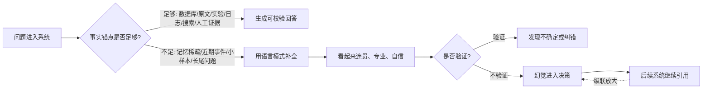
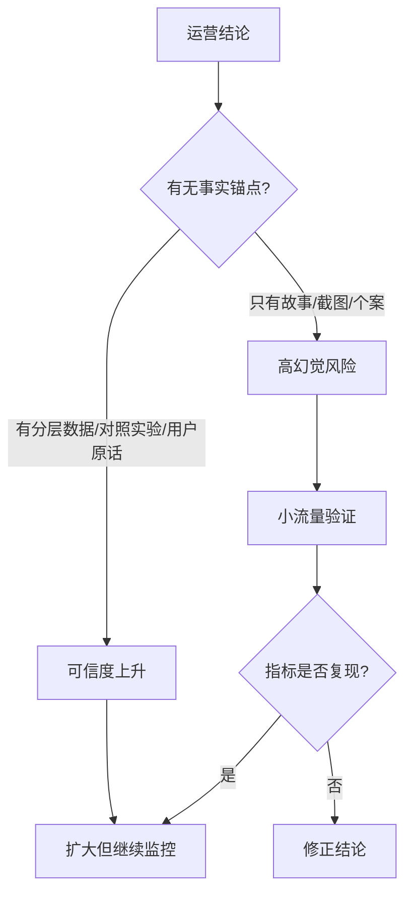

## AI 领域思维筑基课: 幻觉守恒公理: 没有事实锚点, 系统会用流畅叙事补洞

### 作者
digoal

### 日期
2026-05-19

### 标签
幻觉守恒 , AI幻觉 , 事实锚点 , RAG , 信息核查 , 引用验证 , 产品知识库 , 运营归因 , 投资研究 , AI公理

----

## 背景

> 面向对象: 大学生、产品经理、运营经理、有投资需求的人  
> 核心问题: 为什么 AI 越会说, 人越容易相信错答案? 为什么生活、运营和投资里也常出现“听起来很对, 其实没证据”的判断?  
> 先说结论: 幻觉守恒不是物理定律, 而是一条决策警戒线: 当问题缺少可靠事实锚点、训练数据稀疏、输入信息不完整、验证机制缺失时, 系统不会自然停在“不知道”, 而常会用最像真的叙事补上空白。幻觉不能靠语气消灭, 只能靠证据、检索、引用、交叉验证和责任机制压低。

## 一张图先看懂



一个短公式:

```
幻觉风险 = 知识稀疏度 x 问题开放度 x 输出压力 x 验证缺口

越缺证据、越要立刻给答案、越没人复核, 幻觉越容易变成决策依据。
```

## 求真讲法

### 它到底说了什么

在 AI 语境里, 幻觉通常指模型生成了看似合理、语气自信, 但事实不正确、无依据或与来源不一致的内容。它可能表现为编造论文、编造法律条文、编造公司数据、错误总结原文、把过期信息当作当前事实, 或在不知道时给出确定答案。

“幻觉守恒”这四个字不是说幻觉数量严格守恒, 而是强调一个更实用的规律:

> 如果系统没有可靠事实锚点, 又被要求给出完整答案, 幻觉不会自动消失, 只会换一种形式出现: 从模型回答转移到摘要、报告、Agent 步骤、运营结论或投资叙事里。

这条公理也适用于人类。人面对信息缺口时, 也会用故事补洞。老板要结论, 员工会补叙事; 市场要增长故事, 公司会补 TAM; 投资者要确定性, 研报会补“长期空间”; 用户要快速答案, AI 会补“看似专业的解释”。

幻觉最危险的地方不是“错”, 而是“错得像对”。明显胡说容易被发现, 自信、完整、格式正确、符合预期的错误最难防。

### 它是怎么来的

自然语言生成模型从早期摘要系统开始就有“忠实性”和“事实性”问题。2020 年 ACL 论文《On Faithfulness and Factuality in Abstractive Summarization》系统研究了神经摘要会生成与原文不一致的内容。

大语言模型出现后, 这个问题更明显。模型不仅会总结, 还会回答开放问题、写报告、给建议、生成引用。2023 年以后, 多篇综述把 LLM 幻觉分成知识冲突、事实错误、来源不一致、推理错误、引用错误等类型。

RAG, 即检索增强生成, 是常见缓解方法。它让模型在回答时检索外部文档, 不只依赖参数记忆。但 RAG 也不是万能药: 检索错、文档过期、片段冲突、引用不严, 仍然会让幻觉进入回答。

所以这条公理的核心不是“模型很差”, 而是:

> 生成系统天然擅长补全, 但事实正确需要额外的约束系统。

### 它依赖哪些假设

| 前提 | 为什么会产生幻觉 | 前提不成立时 |
|---|---|---|
| 模型以生成合理文本为核心能力之一 | 它会优先形成连贯回答 | 如果任务是严格检索或计算, 风险下降 |
| 问题缺少事实锚点 | 没有可验证来源约束输出 | 如果有原文、数据库、日志、实验, 幻觉可被压低 |
| 用户期待完整答案 | “不知道”在交互中常被惩罚 | 如果允许标注不确定性, 风险下降 |
| 训练数据有空白或过期 | 长尾、小众、近期事实覆盖不足 | 如果数据实时可靠, 风险下降 |
| 后续流程不复核 | 错误会被继续引用 | 如果关键节点有验证, 幻觉不易级联 |

这也解释了为什么幻觉在以下场景更高发: 近期新闻、小公司数据、冷门论文、法律条款、医疗细节、财报口径、私人信息、内部制度、长文档中被埋的细节。

### 常见误解

误解一: 更大的模型就没有幻觉。  
不对。大模型通常更强, 但只要缺少事实锚点, 仍可能产生自信错误。能力提升会降低某些错误, 也可能让错误更难被普通人识别。

误解二: 让模型“不要幻觉”就够了。  
不够。提示词能改善行为, 但不能凭空提供事实。关键问题要接入来源、检索、引用、计算、数据库或人工复核。

误解三: RAG 可以彻底消灭幻觉。  
不对。RAG 把风险从“模型记忆是否正确”转移到“检索是否正确、材料是否可靠、引用是否忠实、冲突是否处理”。风险降低, 但没有消失。

误解四: 幻觉只发生在 AI 里。  
不对。人类组织也会幻觉。比如用一个漂亮故事解释增长, 用少数访谈代表用户, 用短期股价证明战略正确, 用幸存案例证明方法有效。

误解五: 只要回答有引用, 就可信。  
不一定。引用可能不存在, 也可能存在但不支持结论。真正可信的是“结论能被引用内容逐句支撑”。

## 求存讲法

### 它有什么用

幻觉守恒公理的实用价值是让你形成一个工作习惯:

> 凡是会影响行动的结论, 都要追问事实锚点。

不要只问“它说得对不对”, 而要问:

- 这句话的来源是什么?
- 来源是否真的支持结论?
- 信息是否过期?
- 有没有反证?
- 如果错了, 损失有多大?
- 是否需要人工或工具复核?

在低风险场景, 幻觉可以被当作创意成本。比如写广告草稿、发散选题、模拟观点。但在高风险场景, 幻觉就是决策污染。

### 它怎么迁移到熟悉领域

#### 对大学生: AI 可以帮你想, 不能替你查

学习时, AI 很适合解释概念、生成练习、给出反例、模拟答辩。但如果涉及论文引用、历史事实、法律条文、实验数据、具体页码, 就必须回到原文。

一个稳妥流程:

```
让 AI 解释 -> 标出关键事实 -> 找原文或教材核对 -> 自己复述 -> 再让 AI 挑错
```

不要把“AI 生成的参考文献”当作真实文献。格式越像真的, 越要查 DOI、作者、期刊和原文内容。

#### 对产品经理: AI 功能要区分“生成体验”和“事实责任”

产品经理设计 AI 功能时, 不能只看回答是否自然。要把功能分成两类:

| 功能类型 | 幻觉容忍度 | 设计要求 |
|---|---|---|
| 创意生成 | 较高 | 允许多版本, 标注为草稿 |
| 文案改写 | 中等 | 保留原意, 人工确认 |
| 知识问答 | 低 | 必须引用来源 |
| 客服承诺 | 很低 | 接入制度和订单系统 |
| 医疗/法律/金融建议 | 极低 | 专家审核、免责声明、证据链 |

AI 产品的核心不是“减少幻觉到 0”, 而是让不同风险等级的功能有不同验证强度。

#### 对运营经理: 热点、用户画像和增长归因最容易幻觉化

运营工作里, 幻觉常常不是模型编的, 而是团队自己编的。比如:

- 一个爆款标题成功了, 就说“用户喜欢焦虑感”。
- 一次活动增长了, 就说“补贴策略有效”。
- 几个用户访谈提到价格, 就说“用户核心痛点是便宜”。
- 某渠道转化高, 就说“这个渠道用户质量好”。

这些都可能是叙事补洞。运营要用实验和数据拆穿幻觉:



运营结论必须能被复现, 不能只靠一个漂亮故事。

#### 对投资者: 投研幻觉比 AI 幻觉更贵

投资里最常见的幻觉不是模型胡说, 而是人类用叙事填补不确定性:

| 投研幻觉 | 常见话术 | 应追问 |
|---|---|---|
| 市场空间幻觉 | 这是万亿市场 | 可服务市场是多少? 公司能拿多少? |
| 护城河幻觉 | 有 AI 就有壁垒 | 数据、分发、客户、流程哪个不可复制? |
| 增长幻觉 | 高增长说明需求强 | 是否靠补贴、渠道、一次性大客户? |
| 管理层幻觉 | 创始人很有愿景 | 过去承诺兑现了吗? 资本配置如何? |
| 财务幻觉 | 利润率会自然提升 | 单位经济模型是否已经验证? |

AI 会让投研幻觉更便宜: 几分钟生成一份结构完整、语言专业、图表漂亮的报告。但如果输入和事实核查不足, 它只是把不确定性包装成确定性。

投资者需要把结论拆成证据链:

```
结论 -> 关键假设 -> 支持证据 -> 反证 -> 待验证信号 -> 错了怎么办
```

没有这条链, 再漂亮的报告也是幻觉容器。

### 它的适用范围和边界

适用范围:

- AI 问答、摘要、引用、报告生成、Agent 自动执行。
- 学习中的论文、教材、事实和考试答案核对。
- 产品中的知识库、客服、金融、医疗、法律和企业内部问答。
- 运营中的用户画像、增长归因、热点判断和活动复盘。
- 投资中的行业研究、财务分析、估值假设和公司叙事。

边界:

- 幻觉守恒不是说所有生成内容都不可信。低风险创意、草稿、头脑风暴可以允许一定幻觉。
- 幻觉不是只能靠人工解决。检索、数据库、引用、约束解码、自检、多模型交叉验证都能降低风险。
- 幻觉风险不是固定的。任务、模型、数据、提示词、工具链和复核流程都会改变风险。
- 不能因为怕幻觉就拒绝使用 AI。正确做法是把 AI 放在适合的位置, 并为高风险结论建立验证链。

### 正例: 怎么用它提升能力

正例一: 大学生写文献综述。  
他让 AI 生成主题框架, 但所有论文都在 Google Scholar、学校数据库或期刊官网核对, 并逐段检查引用是否支持结论。这里“事实锚点和原文核对”的前提成立, AI 提升了效率而没有替代验证。

正例二: 产品经理做企业知识库助手。  
助手回答每个制度问题时必须给出文档来源、更新时间和相关条款; 找不到来源时回答“不确定, 转人工”。这里“引用约束和不确定性出口”的前提成立, 幻觉被压低。

正例三: 运营经理判断活动效果。  
她没有接受 AI 的一句“用户更偏好限时优惠”, 而是用 A/B 测试、用户分层、退款率和复购率验证。这里“结论必须复现”的前提成立。

正例四: 投资者使用 AI 读财报。  
他让 AI 提取风险点和财务变化, 但所有关键数字都回到原始财报表格核对, 并写下卖出条件。这里“高影响结论回到原始来源”的前提成立。

### 反例: 前提不成立会怎样

反例一: 学生直接提交 AI 生成的参考文献。  
参考文献格式完整, 但论文不存在或内容不支持观点。失败原因是“格式正确等于来源真实”的前提不成立。

反例二: 产品团队让客服 AI 自由解释退款政策。  
模型为了给用户满意答复, 编造了不存在的例外条款。失败原因是“模型会自然遵守真实制度”的前提不成立。

反例三: 运营团队用 AI 总结社媒评论。  
AI 把少数高赞评论概括为“主流用户需求”, 团队据此改活动方向, 转化下降。失败原因是“高可见样本代表整体用户”的前提不成立。

反例四: 投资者相信 AI 生成的行业报告。  
报告引用了过期市场规模、混合了不同国家口径, 还把竞争对手已下线产品当作现状。失败原因是“语言专业等于信息当前可靠”的前提不成立。

反例五: Agent 把一次幻觉当事实继续执行。  
Agent 先编造了一个客户折扣政策, 后续又据此生成邮件、更新 CRM、通知销售。失败原因是“中间结论无需事实核查”的前提不成立, 幻觉发生了级联。

## 思考

幻觉守恒公理最值得警惕的地方是: 它会迎合人的心理。人不喜欢不确定, 组织不喜欢没有结论, 市场不喜欢说“不知道”, 投资者不喜欢承认自己看不清。于是系统会奖励那些能快速给出完整故事的人和工具。

AI 只是把这个问题放大了。过去写一份貌似专业但证据不足的报告需要几天, 现在几分钟就能生成。内容生产的成本下降后, 事实核查的价值反而上升。

可以继续追问:

1. 你最近相信的一个结论, 有原始来源吗?
2. 这个结论如果错了, 会影响行动还是只是聊天?
3. 你是在验证事实, 还是在寻找支持自己观点的材料?
4. 你的团队有没有奖励“快速给结论”, 却惩罚“我还不确定”?
5. 如果 AI 生成报告的成本接近 0, 你靠什么区分研究和幻觉?

## 最后记住

1. 幻觉守恒不是说错误无法减少, 而是说没有事实锚点时, 错误会换形式进入系统。
2. AI 最危险的幻觉不是荒唐回答, 而是格式正确、语气专业、符合预期的错误。
3. RAG、搜索和引用能降低风险, 但不能替代对来源是否支持结论的核查。
4. 产品、运营、投资中的高影响结论, 必须有证据链: 来源、口径、反证、复核和责任。
5. 信息时代真正稀缺的不是生成答案, 而是承认不确定、找到证据、校验结论。

## 参考资料

- Joshua Maynez et al., 2020, [On Faithfulness and Factuality in Abstractive Summarization](https://aclanthology.org/2020.acl-main.173/), 关于摘要系统事实性和忠实性问题的研究。
- Patrick Lewis et al., 2020, [Retrieval-Augmented Generation for Knowledge-Intensive NLP Tasks](https://arxiv.org/abs/2005.11401), RAG 代表性论文。
- Potsawee Manakul, Adian Liusie, Mark J. F. Gales, 2023, [SelfCheckGPT: Zero-Resource Black-Box Hallucination Detection for Generative Large Language Models](https://arxiv.org/abs/2303.08896), 关于黑盒模型幻觉检测的方法。
- Lei Huang et al., 2023, [A Survey on Hallucination in Large Language Models: Principles, Taxonomy, Challenges, and Open Questions](https://arxiv.org/abs/2311.05232), 大语言模型幻觉分类、成因和缓解综述。
- Ziwei Ji et al., 2022, [Survey of Hallucination in Natural Language Generation](https://arxiv.org/abs/2202.03629), 自然语言生成幻觉问题综述。
- 本文同时参考了用户提供的 `/Users/digoal/Downloads/ai_axioms.md` 中“AI Agent 时代的底层公理”框架, 并按 `axiom-explainer` 的“求真讲法、求存讲法、思考”结构重写扩展。
  
#### [PostgreSQL 解决方案集合](../201706/20170601_02.md "40cff096e9ed7122c512b35d8561d9c8")
  
  
#### [德哥 / digoal's Github - 公益是一辈子的事.](https://github.com/digoal/blog/blob/master/README.md "22709685feb7cab07d30f30387f0a9ae")
  
  
#### [About 德哥](https://github.com/digoal/blog/blob/master/me/readme.md "a37735981e7704886ffd590565582dd0")
  
  

  
