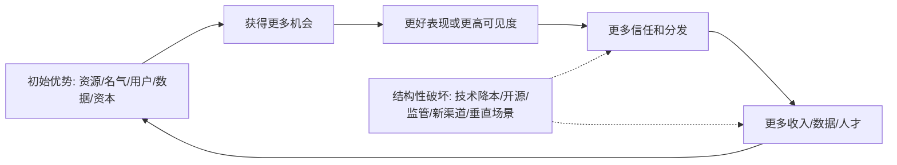
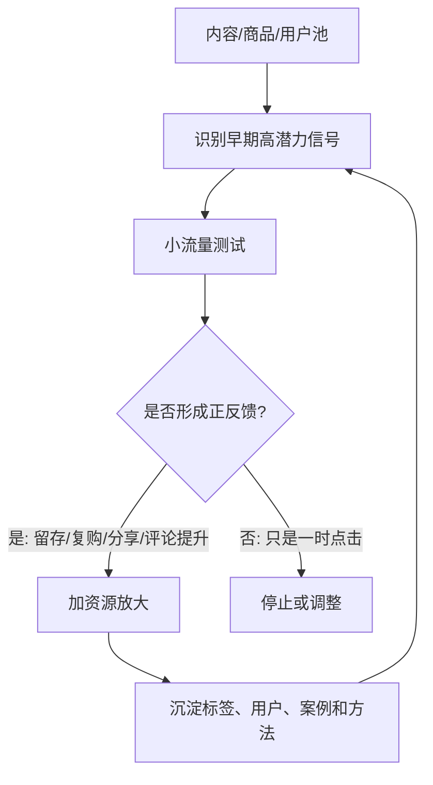

## AI 领域思维筑基课: 马太效应公理: 优势会自我放大, 除非结构被打破

### 作者
digoal

### 日期
2026-05-19

### 标签
马太效应 , 累积优势 , 网络效应 , 规模经济 , 数据飞轮 , 产品护城河 , 运营增长 , 投资分析 , 路径依赖 , AI公理

----

## 背景

> 面向对象: 大学生、产品经理、运营经理、有投资需求的人  
> 核心问题: 为什么同样努力、同样产品、同样公司, 起点稍微不同, 后面的差距会越来越大? 为什么投融资里“谁已经领先”常常比“谁现在最好”更重要?  
> 先说结论: 马太效应说的是累积优势: 已经拥有资源、声誉、用户、数据、资本或分发的人, 更容易获得新的资源、声誉、用户、数据、资本和分发。它不是命运论, 而是提醒我们: 世界很多竞争不是线性公平赛跑, 而是反馈回路。判断未来, 要看优势能否复利, 也要看打破优势的结构变量是否出现。

## 一张图先看懂



一个短公式:

```
未来优势 = 初始优势 x 反馈强度 x 持续时间 - 结构性破坏

如果反馈回路强, 小优势会变大差距。
如果结构被打破, 大优势也会衰减。
```

## 求真讲法

### 它到底说了什么

马太效应常被概括为“强者愈强, 弱者愈弱”。这个说法容易让人误解成宿命论。更准确地说, 它描述的是累积优势机制:

> 初始优势会提高下一轮获得资源的概率; 下一轮资源又会强化优势, 形成正反馈。

这条公理在很多地方都能看到:

- 学术界: 有名科学家更容易获得关注、引用、经费和学生。
- 学习中: 基础好的人更容易听懂新课, 新课又继续强化基础。
- 产品中: 用户多的平台更容易吸引供给, 供给多又吸引更多用户。
- 运营中: 爆款内容获得更多推荐, 更多推荐又制造更大爆款。
- 投资中: 龙头公司更容易获得客户、人才、融资、供应链议价权和市场信任。
- AI 中: 头部公司更容易获得算力、数据、人才、用户反馈和生态伙伴。

马太效应不是说领先者永远赢, 而是说: 在存在正反馈的系统里, 领先者的优势会被系统自动放大。要击败领先者, 不能只靠“我也很努力”, 通常要找到反馈链的断点。

### 它是怎么来的

“马太效应”这个概念由社会学家 Robert K. Merton 在 1968 年讨论科学奖励系统时提出。Merton 观察到, 同样的科研贡献, 已经有声望的科学家往往更容易获得荣誉和认可, 而无名科学家的贡献更容易被忽视。这就是科学界的累积优势。

后来, 这个概念被扩展到教育、收入、平台、网络、商业竞争和技术扩散。网络科学里有一个相近机制叫 preferential attachment, 可译为“优先连接”: 新节点更倾向连接到已经有很多连接的节点。Barabási 和 Albert 在 1999 年用这个机制解释许多网络为什么会出现少数超级节点。

经济学里, W. Brian Arthur 研究递增收益和路径依赖。意思是某些行业不是越竞争越平均, 而是早期选择、用户规模、学习曲线、生态配套会让领先路径越来越难被替代。

AI 时代的马太效应更明显, 因为几个正反馈叠在一起:

| 正反馈 | 在 AI 里的表现 |
|---|---|
| 算力反馈 | 收入越多, 越能买算力训练和推理 |
| 数据反馈 | 用户越多, 反馈越多, 产品越好 |
| 人才反馈 | 项目越领先, 越能吸引顶尖人才 |
| 生态反馈 | 开发者、插件、企业客户围绕头部平台建设 |
| 品牌反馈 | 用户更愿意相信头部模型和头部公司 |
| 资本反馈 | 估值越高, 越容易融资和并购 |

### 它依赖哪些假设

| 前提 | 为什么会强化马太效应 | 前提不成立时 |
|---|---|---|
| 资源可以转化为下一轮优势 | 钱、数据、人才、用户能继续提高竞争力 | 如果资源不能转化, 领先会浪费 |
| 用户或合作方偏好头部 | 头部更容易获得信任和分发 | 如果用户重视差异化, 小玩家有机会 |
| 存在网络效应或规模经济 | 越大越有成本或体验优势 | 如果规模不降本, 大未必强 |
| 切换成本较高 | 用户不容易离开已有生态 | 如果迁移很便宜, 领先不稳 |
| 规则不频繁重置 | 领先者可以持续复利 | 如果技术、监管、渠道变化, 旧优势会折损 |

所以马太效应不是“有优势就必胜”。它成立的关键是: 优势能不能进入反馈回路。

### 常见误解

误解一: 马太效应说明普通人没机会。  
不对。它说明普通人不能只靠平均努力打头部, 要找结构性切入点: 新渠道、新技能、新场景、新组合、新规则。

误解二: 龙头一定值得投资。  
不一定。龙头如果估值过高、增长放缓、监管压力上升、技术路径被替代, 也可能回报很差。投资看的是未来优势复利, 不是过去名气。

误解三: 小公司永远打不过大公司。  
不对。小公司可以在头部不重视的垂直场景、低端市场、新分发渠道、开源生态或新技术范式里建立局部马太效应。

误解四: 马太效应只靠资本。  
不对。声誉、信任、数据、分发、学习速度、组织流程和用户关系都能形成累积优势。

误解五: 免费补贴能制造马太效应。  
不一定。补贴能买来规模, 但如果没有留存、网络关系、数据沉淀和成本下降, 补贴结束后规模会消散。

## 求存讲法

### 它有什么用

马太效应公理的实用价值是让你在复杂竞争里先问:

> 这个优势会不会带来下一轮更大的优势?

如果答案是“会”, 你看到的是复利系统。如果答案是“不会”, 你看到的可能只是一次性领先。

判断生活、产品、运营、投资, 都可以用这组问题:

- 当前优势是什么?
- 优势能否转化为更多资源?
- 资源能否继续提升体验或效率?
- 竞争者追赶时, 领先者是否同步变强?
- 有没有新规则会重置竞争?

### 它怎么迁移到熟悉领域

#### 对大学生: 早期基础会放大学习差距

学习里的马太效应非常明显。数学基础好的人, 更容易学懂物理、计算机、经济学; 英语阅读好的人, 更容易获取一手资料; 写作好的人, 更容易表达成果, 获得机会。

这不是说起点低就没机会, 而是说要优先补“会产生复利的基础能力”:

```
阅读能力 -> 获取更好信息
写作能力 -> 表达和沉淀思考
数学/逻辑 -> 理解复杂系统
编程/AI 工具 -> 放大执行效率
长期信用 -> 获得合作机会
```

不要把时间平均分给所有事情。先建立能继续产生机会的能力。

#### 对产品经理: 用户规模只有形成反馈回路才是护城河

产品经理常说“我们用户很多”。但用户多不一定是马太效应。关键是用户多以后, 产品会不会自然变得更好、更便宜、更难替代。

| 用户增长后沉淀了什么 | 是否可能形成马太效应 |
|---|---|
| 更多供给和更多需求匹配 | 强, 如平台和市场 |
| 更多行为数据改善推荐 | 强, 如内容和电商 |
| 更多协作关系和历史记录 | 强, 如企业软件 |
| 只是更多注册账号 | 弱 |
| 只是补贴来的短期流量 | 弱 |
| 只是一次性下载 | 弱 |

产品护城河不是“我现在有用户”, 而是“用户越多, 产品越好; 产品越好, 用户越多”。

#### 对运营经理: 分发资源会自然偏向已验证赢家

运营平台通常会把更多流量给表现好的内容、达人、商品和广告。于是爆款更容易继续爆, 头部达人更容易继续涨, 高转化商品更容易获得更多曝光。

运营人员要做两件事:



不要平均分配资源。运营的责任不是“公平对待每个内容”, 而是识别哪些对象值得放大, 同时避免被虚假指标骗走。

#### 对投资者: 护城河就是可持续的马太效应

投资里, 马太效应常常表现为护城河。好公司不是只领先一次, 而是每一轮竞争后更强。

| 护城河类型 | 马太效应机制 | 需要警惕 |
|---|---|---|
| 网络效应 | 用户越多, 对其他用户越有价值 | 是否多归属、是否可迁移 |
| 成本优势 | 规模越大, 单位成本越低 | 是否被新技术降本打破 |
| 品牌信任 | 信任越强, 获客越便宜 | 是否透支品牌 |
| 数据飞轮 | 使用越多, 数据越好, 产品越准 | 数据是否独家且可用 |
| 生态锁定 | 开发者和客户围绕平台投入 | 是否被开放标准削弱 |
| 资本优势 | 融资成本低, 可并购和扩张 | 是否资本纪律变差 |

投资者最重要的判断不是“这家公司现在是不是第一”, 而是:

```
第一名的位置, 会让它未来更容易继续第一吗?
```

如果会, 估值可以有溢价。如果不会, 头部也可能只是暂时领先。

### 它的适用范围和边界

适用范围:

- 学习、职业成长、个人品牌和人脉网络。
- 内容平台、社交网络、交易平台、企业软件。
- AI 模型、AI 应用、数据平台、开发者生态。
- 投资中的龙头公司、成长股、平台型公司和基础设施。
- 运营中的流量分配、达人孵化、商品放量和私域沉淀。

边界:

- 马太效应不是永恒垄断。技术范式变化、监管、开源、低端颠覆、新渠道会重置格局。
- 大不等于强。没有反馈回路的大规模只是高成本。
- 快不等于复利。一次性爆发如果不沉淀资产, 很快会回落。
- 头部不等于好投资。价格过高时, 好公司也可能不是好资产。
- 小玩家不是没机会, 但要避开头部反馈最强的战场。

### 正例: 怎么用它提升能力

正例一: 大学生优先提升英语和写作。  
他发现这两项能力能带来更好资料、更好表达、更好实习和更多合作机会, 于是持续投入。这里“能力能转化为下一轮机会”的前提成立, 小进步变成复利。

正例二: 产品经理做开发者平台。  
平台吸引更多开发者后, 插件变多; 插件变多后, 用户更多; 用户更多后, 开发者更愿意投入。这里“供需双方互相强化”的前提成立, 马太效应形成。

正例三: 运营经理孵化内容账号。  
她没有平均推所有内容, 而是找出高完播、高收藏、高复访的选题, 持续加资源, 并沉淀成栏目。这里“流量反馈沉淀为方法和用户认知”的前提成立。

正例四: 投资者研究 AI 基础设施龙头。  
他发现公司规模带来采购议价、客户信任、生态兼容和研发投入, 这些优势又继续提高市场份额。这里“资源转化为下一轮优势”的前提成立。

### 反例: 前提不成立会怎样

反例一: 学生只追逐短期证书。  
证书很多, 但没有转化成基础能力、作品、实习或信用。失败原因是“资源能转化为下一轮优势”的前提不成立。

反例二: 产品团队把注册用户当护城河。  
用户注册后不产生数据、不建立关系、不形成切换成本, 竞品补贴一下就迁走。失败原因是“用户规模会增强产品价值”的前提不成立。

反例三: 运营团队用投放制造虚假头部。  
某商品靠广告冲到榜首, 但复购差、退款高、评价低, 停投后销量崩。失败原因是“曝光会沉淀真实需求”的前提不成立。

反例四: 投资者盲买行业龙头。  
公司确实是第一, 但行业技术路线被开源方案和新架构改变, 客户迁移成本下降。失败原因是“规则不重置”的前提不成立。

反例五: AI 创业公司正面挑战基础模型巨头。  
它没有算力、数据、分发、生态或独特场景, 只说模型也能做得差不多。失败原因是“努力可抵消头部反馈回路”的前提不成立。

## 思考

马太效应最容易让人产生两种错误情绪: 起点低的人觉得无望, 起点高的人觉得必胜。两者都错。

低起点不是终局, 但必须承认系统不是平均回报。你要找能产生复利的能力、关系和场景, 不要在头部反馈最强的地方硬拼。高起点也不是护身符, 因为优势一旦不能转化为下一轮优势, 或外部规则重置, 领先会迅速变成包袱。

真正成熟的马太效应思维是:

> 尊重累积优势, 寻找反馈回路, 警惕路径依赖, 等待结构性破坏。

可以继续追问:

1. 你现在投入的能力, 会不会带来下一轮更好的机会?
2. 你的产品用户越多, 产品真的越好吗?
3. 你的运营放量, 是在放大真实需求, 还是放大噪声?
4. 你投资的龙头公司, 领先优势是否还在复利?
5. 哪些新技术、新渠道、新规则可能打破现有头部的马太效应?

## 最后记住

1. 马太效应的本质是累积优势: 优势带来机会, 机会继续放大优势。
2. 不是所有领先都是护城河; 只有能进入反馈回路的领先才有复利价值。
3. 学习、产品、运营、投资都要找“下一轮优势从哪里来”。
4. 头部优势会被技术降本、开源、监管、新渠道和垂直专业化打破。
5. 普通人和小公司不要在头部反馈最强的地方硬拼, 要找新规则和局部复利点。

## 参考资料

- Robert K. Merton, 1968, [The Matthew Effect in Science](https://www.science.org/doi/10.1126/science.159.3810.56), Science, 提出科学奖励系统中的马太效应。
- Robert K. Merton, 1988, [The Matthew Effect in Science, II: Cumulative Advantage and the Symbolism of Intellectual Property](https://garfield.library.upenn.edu/merton/matthewii.pdf), Isis, 进一步讨论累积优势。
- W. Brian Arthur, 1994, [Increasing Returns and Path Dependence in the Economy](https://press.umich.edu/Books/I/Increasing-Returns-and-Path-Dependence-in-the-Economy2), 关于递增收益和路径依赖的代表性著作。
- Albert-László Barabási and Réka Albert, 1999, [Emergence of Scaling in Random Networks](https://pubmed.ncbi.nlm.nih.gov/10521342/), Science, 讨论优先连接和复杂网络中的尺度分布。
- Carl Shapiro and Hal R. Varian, 1999, [Information Rules](https://www.hbs.edu/faculty/Pages/item.aspx?num=142), 关于信息经济、网络效应和锁定的经典商业分析。
- 本文同时参考了用户提供的 `/Users/digoal/Downloads/ai_axioms.md` 中“AI Agent 时代的底层公理”框架, 并按 `axiom-explainer` 的“求真讲法、求存讲法、思考”结构重写扩展。
  
#### [PostgreSQL 解决方案集合](../201706/20170601_02.md "40cff096e9ed7122c512b35d8561d9c8")
  
  
#### [德哥 / digoal's Github - 公益是一辈子的事.](https://github.com/digoal/blog/blob/master/README.md "22709685feb7cab07d30f30387f0a9ae")
  
  
#### [About 德哥](https://github.com/digoal/blog/blob/master/me/readme.md "a37735981e7704886ffd590565582dd0")
  
  

  
