## 德说-第477期, 学科分类方法, 如何组建及蒸馏AI核心智囊团  
  
### 作者  
digoal  
  
### 日期  
2026-05-19  
  
### 标签  
AI , 学科分类 , 底层公理 , 代表人物 , 蒸馏  
  
----  
  
## 背景  
  
这世界的表面变化太快, 但是各个领域或学科的底层公理或规律则保持“不变”.  
  
如果只看到表面现象, 无法判断真伪, 无法预言未来. 给生活、投融资、创业等带来了巨大的麻烦.  
  
以上思路我在 [《德说-第474期, 人生最重要的事15: 在快速变化的世界中的生存法则》](../202605/20260515_01.md)  中谈到过, 但是未提及学科的分类方法, 应该按什么顺序掌握哪些学科底层公理, 也未扩展到与AI结合用AI蒸馏智囊团的细节.  
  
今天就来补充缺失的这部分.  
  
按这个思路, 我们应该重点学习哪些学科? 应该按什么顺序学习? 基于这个思路, 如果要组建一支智囊团, 覆盖每个重要学科, 应该蒸馏哪些代表性人物? 如何蒸馏这些人?  
  
-----  
  
# 一、学科是如何分类的  
  
  
  
**一、主流学科分类框架**  
  
常见的分类方式有三种：  
  
-   **按研究对象/领域**  
    -   **自然科学**：研究自然现象（物理、化学、生物等）。  
    -   **社会科学**：研究社会现象与人类行为（经济学、社会学、政治学等）。  
    -   **人文学科**：研究人类文化与精神世界（哲学、历史、文学等）。  
    -   **形式科学**：研究抽象形式系统（数学、逻辑学）。  
    -   **应用/专业学科**：以解决实际问题为导向（医学、工程学、管理学等）。  
  
-   **按知识性质（比格兰模型）**  
    -   **硬科学-软科学**：看范式共识度。硬科学（如物理学）共识高，软科学（如社会学）流派多。  
    -   **纯科学-应用科学**：看与实践的距离。纯科学（如数学）追求理论，应用科学（如营销学）追求实用。  
    -   两两组合，可得四个象限：硬-纯（物理学）、硬-应用（工程学）、软-纯（哲学）、软-应用（教育学）。  
  
-   **按研究方法**  
    -   **实验/实证科学**：通过可重复实验和量化数据验证（物理学、AI领域等）。  
    -   **诠释/思辨学科**：依赖逻辑推演和文本解读（哲学、法学等）。  
  
  
**二、实用性分类建议**  
  
与“人”相关的学科有哪些，从“人”这个核心逐层向外展开：  
  
**1. 研究底层世界的基石——形式科学与自然科学**  
这是最“硬核”的基础，为其他学科提供工具和世界观。  
  
-   **形式科学（工具基础）** ： **数学**。  
-   **自然科学（物理世界）** ： **物理学**、**生物学**。  
    -   *说明*：“健康学”的基础主要来自生物学，可归入此类，但更偏应用。  
  
**2. 理解“人”本身——关于心智、大脑与健康的科学**  
这是你清单的特色，聚焦个体的人。  
  
-   **心智研究**： **心理学**。  
-   **生物基础研究**： **脑科学**。  
-   **身心状态应用**： **健康学**（可看作心理学、脑科学、生物学的综合应用领域）。  
  
**3. 探索“人与抽象世界”——关于思想与方法的学科**  
这关乎我们如何思考、存在和设计。  
  
-   **思辨与存在**： **哲学**。  
-   **人造系统设计**： **AI领域**（有很强的形式科学和应用科学双重属性，可单列或归入此层）。  
  
**4. 研究“人与人的关系”——社会科学**  
个体组成群体后，涌现出的复杂现象。  
  
-   **宏观行为与系统**： **经济学**、**政治学**、**社会学**。  
-   **微观行为与互动**： **营销学**（可看作心理学、社会学在经济场景的应用）。  
  
**5. 实现“群体目标”——应用与专业学科**  
整合前述知识，以达成特定目标。  
  
-   **组织效能目标**： **管理学**。  
-   **国家安全目标**： **军事学**。  
  
**6. 贯穿始终的方法论透镜**  
这门学科本身不是研究某个具体对象，而是一种看待世界的方式。  
  
-   **复杂动力学**：这是一把强有力的“透镜”，可以研究从物理学、生物学到经济学、社会学等几乎所有层次涌现出的复杂现象。  
  
  
最后，有几个点值得留意：  
  
-   **学科交叉是常态**：比如**认知科学**，就是**心理学**、**脑科学**、**AI领域**和**哲学**的交叉路口。复杂动力学的强项也正在于此。  
-   **领域**和**学科**的区别： **AI领域**和**健康学**更像是问题驱动的研究领域，而非有清晰边界的传统学科。**军事学**、**管理学**、**营销学**也高度综合，很难单纯归类。  
  
-----  
  
# 二、最应该掌握的学科及顺序  

  
  
“如何以不变应万变”? 不被表象迷惑，去寻找那些不变的底层逻辑，这正是从“看热闹”到“看门道”的关键转变。  
  
基于这个目标，学习重点不应该再是某个孤立的“学科”，而是那些能帮你解释、预测和改造世界的 **“元知识”和“硬科学”** 。  
  
学习体系分为三个层级和一条贯穿始终的方法论。  
  
## 第一部分：核心学科与学习顺序  
  
这个顺序遵循从“基础工具”到“核心实体”再到“应用领域”的逻辑，每一层都建立在前一层的基础之上。  
  
### 层级一：认知世界的“底层操作系统”（必须最先学习）  
  
这部分知识是其他一切学科的元语言，不掌握它们，后续学习就是空中楼阁。  
  
1.  **数学 (尤其是概率论与统计学)**  
    *   **重要性**：它是描述宇宙最精确的语言，也是逻辑推演的极致。管理不确定性是现代人最重要的能力，而概率论是唯一能描述和量化不确定性的数学分支。统计学则让你能从数据中提取信息，看穿各种统计骗局。  
    *   **学习目标**：不是成为数学家，而是建立**概率思维**和**量化思维**。能理解“期望值”、“条件概率”、“大数定律”、“正态分布”等概念，并能将它们用到日常决策和预测中。  
  
2.  **物理学 (尤其是经典力学与热力学)**  
    *   **重要性**：它揭示了物质世界最底层的运行规律，其思想深刻地影响了经济学、社会学等领域。  
    *   **关键概念**：  
        *   **经典力学**：教会你“均衡”、“系统”、“反馈回路”（牛顿第三定律的反作用力），让你理解任何系统在力量作用下的变化。  
        *   **热力学**：其四大定律，特别是**熵增定律**，是宇宙的终极法则。它能让你深刻理解，为什么组织会走向无序，创新需要不断做功，以及“永动机”为何不可能。这对投资和创业极其重要。  
  
### 层级二：理解“人”与“系统”的核心实体科学  
  
有了基础工具，再来看我们这个世界的核心主体：人，以及由人构成的系统。  
  
3.  **生物学与脑科学 (进化论是基石)**  
    *   **重要性**：进化论是社会科学和心理学的基础。它解释了人性和人类行为的底层代码。  
    *   **核心思想**： **自然选择、适者生存**。理解了它，你才会明白为什么人类会贪婪、恐惧、从众、短视。这些“不变”的人性，是营销学、经济学和投资学的基础。脑科学则从生理层面解释这些机制，让洞察更坚实。  
  
4.  **心理学 (社会心理学与认知心理学)**  
    *   **重要性**：这是离实践最近的核心学科。如果物理学是“外部世界”的规律，心理学就是“内部世界”（心智）的规律。  
    *   **关键模型**：查理·芒格强调的“人类误判心理学”就是典型。掌握认知偏误、社会认同、损失厌恶等概念，你就有了看透市场情绪、商业决策和生活骗局的心智武器。你清单里的营销学，其根基就是心理学。  
  
5.  **复杂动力学 / 复杂性科学**  
    *   **重要性**：这是串联以上所有知识的“终极框架”，也是你清单里最具远见的学科。我们生活的经济系统、企业组织、城市交通、互联网生态，全部都是复杂适应系统，其行为无法用简单的线性公式预测。  
    *   **核心思想**： **涌现、非线性、自组织、适应性、幂律分布**。它会彻底改变你的世界观：明白了“涌现”，你就知道自上而下的计划为何失效，自下而上的试错和创新为何重要；理解了“幂律分布”，你就会在投融资中放弃追求平均回报，转而识别和拥抱极少数能带来指数级回报的机会。  
  
### 层级三：应用于特定领域，解释与预测  
  
有了上面两层武器，你再回看经济学、社会学、政治学、军事学、管理学等，就能看到别人看不到的深度。  
  
6.  **经济学 (奥地利学派与行为经济学)**  
    *   **重要性**：传统经济学基于“理性人”假设，很美观但不实用。你需要重点学习**奥地利学派**，它强调人的行动、主观价值、价格作为信息载体和商业周期的形成，非常贴近真实世界。**行为经济学**则是心理学和经济学的结合，它研究“非理性人”的真实行为，对营销和投资极具指导意义。这样，你就能用“不变的人性 + 非线性的系统观”去分析经济问题。  
  
7.  **人文哲学、军事学与管理学的补充说明**  
    *   **哲学**：它不是一层独立的学科，而是贯穿始终的思辨精神和逻辑训练。阅读亚里士多德、波普尔、塔勒布等人的著作，比学习某个哲学体系更重要。  
    *   **军事学与管理学**：它们是最后的应用层级。用复杂性科学和进化论的视角去读《孙子兵法》、克劳塞维茨的《战争论》、德鲁克的管理学，你会发现它们的内核惊人地一致：都是在充满不确定性的复杂系统中，如何通过战略、组织和文化来适应并争取胜利。  
    *   **营销学**：本质上就是心理学、经济学在特定商业场景下的应用。  
  
  
  
## 第二部分：精简后的学习路径图（建议顺序）  
  
这个体系很庞大，建议遵循以下路径，螺旋式前进：  
  
1.  **入门组合（建立世界观基石）** ：  
    *   **《人类简史》**：快速建立“人类靠虚构故事大规模协作”这一核心概念。  
    *   **《枪炮、病菌与钢铁》**：用地理-生物-进化论解释世界不平等的巨著。  
    *   **《思考，快与慢》**：系统学习双系统理论，了解人类的认知偏误。  
  
2.  **硬核核心（掌握不变的规律）** ：  
    *   **概率论**：找一本大学教材或通俗读物（如《简单统计学》），掌握基础概念。  
    *   **进化论**：读理查德·道金斯的《自私的基因》，从基因的视角理解人性。  
    *   **热力学**：读一本关于熵的通俗读物（如《生命是什么》的一部分），理解大势。  
    *   **复杂系统**：读梅拉妮·米歇尔的《复杂》，这是最好的入门书，没有之一。  
  
3.  **融会贯通（看透现实世界）** ：  
    *   **行为经济学/奥地利学派**：读丹·艾瑞里的《怪诞行为学》，再读哈耶克的《通往奴役之路》。  
    *   **历史与军事**：带着以上所有视角，去读修昔底德的《伯罗奔尼撒战争史》或罗马史，看人性、政治、偶然性如何交织。  
    *   **实践与反思**：把你学到的模型带入到你的投资决策、创业思考中。比如，你的创业计划，在复杂系统视角下，最重要的可能不是详细的五年计划，而是快速试错、反馈迭代的机制。  
  
**最后总结一下：**  
真正需要学习的不再是单门学科，而是这套 **“以数学为语言，物理学和生物学为定律，心理学为人性底座，复杂性科学为世界观”** 的认知体系。这套系统让你拥有一个强大的“内部模型”，当外部世界快速变化时，这个模型可以帮助你过滤噪音，识别出那些不变的底层结构，从而做出更好的判断和预言。  
  
**社会学、管理学、营销学、政治学**等，都是检验和运用这个“底层模型”的高阶应用场景。  
  
-----  
  
# 三、组建各学科顶级智囊团  

  
  
组建智囊团，不是追求名气，而是追求思想的多样性和互补性，让他们的思维模型在你的大脑里开会。基于上面梳理的框架，我将每个领域的代表性人物“蒸馏”出来，并说明他们能为你的决策系统贡献什么。  
  
## 一、底层操作系统：规则制定者  
  
这层提供最硬的思维工具和宇宙观。  
  
-   **数学与不确定性 (概率论)**  
    -   **灵魂人物: 皮埃尔-西蒙·拉普拉斯**  
    -   **蒸馏思想: 概率是常识的数学化。** 他提出的贝叶斯定理的雏形，是你所有决策的元逻辑：先有一个先验判断，然后根据新证据不断更新你的信念。你的大脑就是一台贝叶斯推理机。  
    -   **现代补充: 纳西姆·塔勒布**。他是概率思想的实践大师，提供“黑天鹅”、“反脆弱”、“遍历性”等强悍的思维工具，让你在极度不确定的世界里生存得更好。  
  
-   **物理学 (能量与系统)**  
    -   **灵魂人物: 艾萨克·牛顿 + 路德维希·玻尔兹曼**  
    -   **蒸馏思想:**  
        -   **牛顿**: **机械宇宙与均衡。** 贡献了系统思维、反馈回路（作用力与反作用力）、均衡是特例而非常态。理解它，是为了超越它。  
        -   **玻尔兹曼**: **熵与不可逆性。** 他揭示了宇宙的方向：一切系统都自发趋向无序。这解释了为何组织会腐朽，为何成功必然孕育失败，为何你必须不断做功来维持秩序。  
  
## 二、核心实体：理解“人”的代码  
  
这层破解人性和系统行为的基因。  
  
-   **生物学 (演化算法)**  
    -   **灵魂人物: 查尔斯·达尔文**  
    -   **蒸馏思想: 盲目的变异 + 非随机的选择 = 适应性。** 这是宇宙中最强大的算法，没有之一。它解释了技术进步、商业模式迭代和观念传播。智囊团里必须有他，时刻提醒你： **不是最强壮或最聪明的生存，而是最能适应变化的生存。** 创业就是一场演化实验。  
  
-   **脑科学 (生理硬件)**  
    -   **灵魂人物: 安东尼奥·达马西奥**  
    -   **蒸馏思想: 情绪是理性的基础。** 他的“躯体标记假说”颠覆了身心二元论，证明没有情绪的参与，人无法做出任何理性决策。这让你从根本上理解客户、员工和合作伙伴的行为，不再迷信纯粹的理性。  
  
-   **心理学 (心智软件)**  
    -   **灵魂人物: 丹尼尔·卡尼曼**  
    -   **蒸馏思想: 你的大脑有两套系统。** 系统1（快）直觉、冲动、省电；系统2（慢）理性、懒惰、耗能。他为你提供了一张详尽的人类认知偏误地图（前景理论、损失厌恶等），是识别市场错误和商业决策陷阱的火眼金睛。  
  
## 三、涌现与系统：大局观的塑造者  
  
这层让你拥有上帝视角，看透复杂系统的运作规律。  
  
-   **复杂动力学 (系统哲学)**  
    -   **灵魂人物: 弗里德里希·哈耶克**  
    -   **蒸馏思想: 价格是信号，知识是分散的。** 他是复杂性科学在社会科学领域的先驱。他让你明白，没有任何中央计划者能掌握全部信息，秩序是“涌现”出来的，不是设计出来的。这打脸所有自上而下的狂妄计划，为市场经济、分布式创新提供了终极辩护。  
  
-   **经济学 (交换的逻辑)**  
    -   **灵魂人物: 亚当·斯密**  
    -   **蒸馏思想: 自利即公益。** 他的“看不见的手”和“分工理论”，是理解商业社会运行的基石。复杂系统视角下的斯密，让你理解微观动力如何产生宏观秩序。可以搭配 **托马斯·索维尔** 作为现代补充，他是应用经济学思维洞察社会真相的大师。  
  
-   **社会学 (群体的涌现)**  
    -   **灵魂人物: 古斯塔夫·勒庞**  
    -   **蒸馏思想: 群体降智。** 一个人是理性的，一群人则可能变成非理性的“乌合之众”。他给出了群体心理的经典模型，无论是理解市场泡沫、社会运动还是团队行为，都极为深刻。  
  
## 四、应用与博弈：实践中的谋略家  
  
这层是在真实世界复杂博弈中的行动指南。  
  
-   **军事学 (战略的精髓)**  
    -   **灵魂人物: 孙武 (孙子)**  
    -   **蒸馏思想: 先胜而后战，避实而击虚。** 孙子兵法不是教你打仗，而是教你如何在不确定的复杂博弈中，通过信息、地利、时机和心理来获取绝对优势。他关于“道天地将法”的“五事”模型，是顶级CEO的战略框架。  
  
-   **管理学 (组织的构造)**  
    -   **灵魂人物: 彼得·德鲁克**  
    -   **蒸馏思想: 管理是激发人的善意与潜能。** 他超越了“管理是控制”的机械思维，指出组织是社会的器官，其唯一目的是创造顾客。他将知识工作者视为资产而非成本，这是信息时代所有组织文化的原点。  
  
-   **哲学 (批判的解毒剂)**  
    -   **灵魂人物: 卡尔·波普尔**  
    -   **蒸馏思想: 可证伪性才是科学。** 他为你提供了一把剃刀，可以干净利落地分清科学与伪科学。任何“永远正确”的理论都是骗局。在智囊团中，他是最冷静的批判者，不断对你的核心假设提出质疑：“你这个判断，能被什么事证明是错的？” 这能避免致命的盲点。  
  
  
  
## 超级智囊团  

  
  
现在，把这些人都请到你的决策桌前，想象一下他们如何发表意见：  
  
**当你需要做一个重大投资决策时：**  
  
-   **孙子**会提醒你：“这个赛道的‘地形’（竞争格局）如何？我们有没有先胜的把握？”  
-   **卡尼曼**会递给你一张清单：“请检查，你是不是被‘过度乐观’或‘羊群效应’影响了？”  
-   **哈耶克**会在一旁提问：“你所依赖的那些‘关键信息’，是集中规划的，还是市场自发涌现的信号？”  
-   **达尔文**则低语：“不要把宝押在单一预测上，让你的投资组合具备多样性，这样才有抵抗黑天鹅的演化解。”  
-   最后，**波普尔**会厉声质问：“你最核心的投资逻辑，在什么情况下会被证明是错的？说出来，然后去反向寻找证据。”  
  
这个智囊团，本质上是将这十几位先哲的思维模型内化，形成一套强大的并行处理系统。他们让你在纷繁变化的表象中，拥有一套坚如磐石的判断基准。这比任何单一专家的意见都珍贵百倍。  
  
-----  
  
# 四、如何蒸馏智囊团  
  
女娲.skill: https://github.com/alchaincyf/nuwa-skill  
  
`huashu-nuwa` , `darwin-skill` : 女娲skill造人(蒸馏), 达尔文skill进化.  
```
cd ~/.codex/skills
git clone --depth 1 https://github.com/alchaincyf/nuwa-skill
git clone --depth 1 https://github.com/alchaincyf/darwin-skill

cp -r nuwa-skill ~/.claude/skills/
cp -r darwin-skill ~/.claude/skills/
```
  
  
## 安装  
  
```bash  
npx skills add alchaincyf/nuwa-skill  
```  
  
然后在 Claude Code 里：  
  
```  
> 蒸馏一个保罗·格雷厄姆  
> 造一个张小龙的视角Skill  
> 帮我做一个段永平的Skill  
```  
  
造完之后直接调用：  
  
```  
> 用芒格的视角帮我分析这个投资决策  
> 费曼会怎么解释量子计算？  
> 切换到Naval，我在纠结三件事  
```  
  
  
  
## 女娲蒸馏了什么  
  
蒸馏各领域最强的人，需要提取比日常工作习惯更深的东西。女娲提取五层：  
  
| 层次 | 说明 |  
|---|---|  
| **怎么说话** | 表达DNA——语气、节奏、用词偏好 |  
| **怎么想** | 心智模型、认知框架 |  
| **怎么判断** | 决策启发式 |  
| **什么不做** | 反模式、价值观底线 |  
| **知道局限** | 诚实边界 |  
  
工作习惯可以靠流程文档传递，但让芒格和马斯克面对同一个问题做出不同判断的，是认知框架。女娲提取的是认知操作系统。  
  
### 诚实边界  
  
每个Skill都明确标注做不到什么：  
  
- 蒸馏不了直觉——框架能提取，灵感不能  
- 捕捉不了突变——截止到调研时间的快照  
- 公开表达 ≠ 真实想法——只能基于公开信息  
  
**一个不告诉你局限在哪的Skill，不值得信任。**  
  
  
  
## 已蒸馏人物  
  
女娲已蒸馏了13位人物 + 1个主题。每个都是独立的、可直接安装使用的Skill：  
  
### 人物Skill  
  
| 人物 | 领域 | 独立仓库 | 一键安装 |  
|------|------|---------|---------|  
| 🔥 **Paul Graham** | 创业/写作/产品/人生哲学 | [paul-graham-skill](https://github.com/alchaincyf/paul-graham-skill) | `npx skills add alchaincyf/paul-graham-skill` |  
| 🔥 **张一鸣** | 产品/组织/全球化/人才 | [zhang-yiming-skill](https://github.com/alchaincyf/zhang-yiming-skill) | `npx skills add alchaincyf/zhang-yiming-skill` |  
| 🔥 **Karpathy** | AI/工程/教育/开源 | [karpathy-skill](https://github.com/alchaincyf/karpathy-skill) | `npx skills add alchaincyf/karpathy-skill` |  
| 🔥 **Ilya Sutskever** | AI安全/scaling/研究品味 | [ilya-sutskever-skill](https://github.com/alchaincyf/ilya-sutskever-skill) | `npx skills add alchaincyf/ilya-sutskever-skill` |  
| 🔥 **MrBeast** | 内容创造/YouTube方法论 | [mrbeast-skill](https://github.com/alchaincyf/mrbeast-skill) | `npx skills add alchaincyf/mrbeast-skill` |  
| 🔥 **特朗普** | 谈判/权力/传播/行为预判 | [trump-skill](https://github.com/alchaincyf/trump-skill) | `npx skills add alchaincyf/trump-skill` |  
| ⭐ **乔布斯** | 产品/设计/战略 | [steve-jobs-skill](https://github.com/alchaincyf/steve-jobs-skill) | `npx skills add alchaincyf/steve-jobs-skill` |  
| **马斯克** | 工程/成本/第一性原理 | [elon-musk-skill](https://github.com/alchaincyf/elon-musk-skill) | `npx skills add alchaincyf/elon-musk-skill` |  
| **芒格** | 投资/多元思维/逆向思考 | [munger-skill](https://github.com/alchaincyf/munger-skill) | `npx skills add alchaincyf/munger-skill` |  
| **费曼** | 学习/教学/科学思维 | [feynman-skill](https://github.com/alchaincyf/feynman-skill) | `npx skills add alchaincyf/feynman-skill` |  
| **纳瓦尔** | 财富/杠杆/人生哲学 | [naval-skill](https://github.com/alchaincyf/naval-skill) | `npx skills add alchaincyf/naval-skill` |  
| **塔勒布** | 风险/反脆弱/不确定性 | [taleb-skill](https://github.com/alchaincyf/taleb-skill) | `npx skills add alchaincyf/taleb-skill` |  
| **张雪峰** | 教育/职业规划/阶层流动 | [zhangxuefeng-skill](https://github.com/alchaincyf/zhangxuefeng-skill) | `npx skills add alchaincyf/zhangxuefeng-skill` |  
  
### 主题/岗位/角色 Skill  
  
| 主题 | 领域 | 独立仓库 | 一键安装 |  
|------|------|---------|---------|  
| **X导师** | X/Twitter运营全栈 | [x-mentor-skill](https://github.com/alchaincyf/x-mentor-skill) | `npx skills add alchaincyf/x-mentor-skill` |  
  
人物Skill蒸馏一个人的思维方式；主题Skill蒸馏一个领域的方法论。每个仓库都包含完整的调研数据和效果示例对话。  
  
想蒸馏不在列表里的人或主题？安装女娲，说「蒸馏一个XXX」就行。  
  
  
  
## 达尔文.skill：让所有Skill持续进化  
  
https://github.com/alchaincyf/darwin-skill  
  
女娲造 Skill，**[达尔文](https://github.com/alchaincyf/darwin-skill)** 让 Skill 进化。  
  
受 Karpathy autoresearch 启发，达尔文.skill 用自主实验循环批量优化所有Skill：8维度评估、棘轮机制（只保留改进，自动回滚退步）、独立子agent评分。女娲的 Phase 5 双Agent精炼就内置了达尔文的评估体系，这也是女娲生成的Skill质量高的原因之一。  
  
```bash  
npx skills add alchaincyf/darwin-skill  
```  
  
  
  
## 工作原理  
  
输入一个名字后，女娲做四件事：  
  
**1. 六路并行采集**——著作、播客/访谈、社交媒体、批评者视角、决策记录、人生时间线，6个Agent同时跑，各自存档。  
  
**2. 三重验证提炼**——一个观点要被收录为心智模型，必须：跨2+个领域出现过（不是随口一说）、能推断对新问题的立场（有预测力）、不是所有聪明人都会这么想（有排他性）。三个都过才收录。  
  
**3. 构建Skill**——3-7个心智模型 + 5-10条决策启发式 + 表达DNA + 价值观与反模式 + 诚实边界，写入SKILL.md。  
  
**4. 质量验证**——拿3个此人公开回答过的问题测试，方向一致才通过。再用1个他没讨论过的问题测试，Skill应该表现出适度不确定而非斩钉截铁。  
  
完整方法论在 `references/extraction-framework.md`。  
  
  
#### [PostgreSQL 解决方案集合](../201706/20170601_02.md "40cff096e9ed7122c512b35d8561d9c8")
  
  
#### [德哥 / digoal's Github - 公益是一辈子的事.](https://github.com/digoal/blog/blob/master/README.md "22709685feb7cab07d30f30387f0a9ae")
  
  
#### [About 德哥](https://github.com/digoal/blog/blob/master/me/readme.md "a37735981e7704886ffd590565582dd0")
  
  

  
