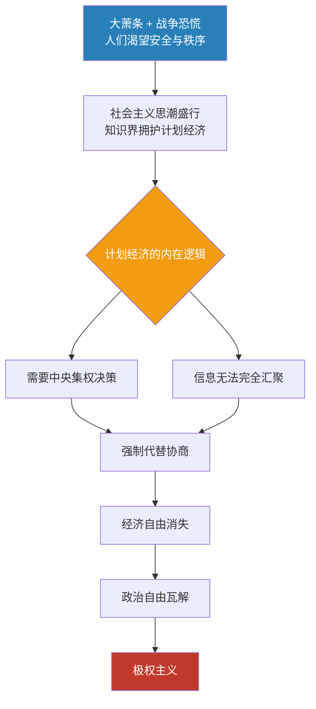

## 《通向奴役之路》读书笔记  
  
### 作者  
digoal  
  
### 日期  
2026-05-19  
  
### 标签  
读书笔记 , 通向奴役之路  
  
----  
  
## 背景  

---
书名: 《通向奴役之路》  
作者: [英] 弗里德里希·哈耶克（F. A. Hayek）  
译者: 滕維藻 / 朱宗風 / 張楚勇  
出版社: 商務印書館（香港）有限公司  
出版年份: 2017（原著 1944）  
笔记日期: 2026-05-20  
豆瓣链接: https://book.douban.com/subject/1077528/  
标签: [古典自由主义, 政治哲学, 经济学, 极权主义批判, 必读经典]  
---
  
  

> **一句话**：好意铺就的路，也可能通向地狱——集体主义的美好愿景，如何一步步侵蚀个人自由，走向专制。
> **适合谁读**：关心自由、权力与秩序之间关系的读者；任何对"政府应该做多少"有疑问的人。
> **阅读难度**：⭐⭐⭐☆☆
> **推荐指数**：⭐⭐⭐⭐⭐

---

## 一、时代坐标：这本书从哪里来？

1944年，二战尚未结束。整个西方世界正处于一种奇特的精神状态——一边在浴血抵抗纳粹德国的法西斯铁蹄，一边却有越来越多的知识分子热情拥抱社会主义，认为苏联式的计划经济才是未来。

在这个氛围里，一个奥地利移民在伦敦经济学院的书桌上写出了这本书。哈耶克目睹了纳粹崛起的全过程，他有一个旁观者没有的判断：**纳粹德国的专制，不是资本主义的极端形态，而是社会主义计划逻辑走到终点的必然结果。**

这个判断在当时是异端。当爱因斯坦支持社会主义纲领、罗斯福夫人赞扬斯大林的时候，哈耶克站出来说：你们走错了方向。不是因为社会主义者坏，而是因为这条路的终点，不是你们想去的地方。

他把书献给"所有党派的社会主义者"——这是一种刀锋般的挑衅，也是一种真诚的忧虑。他不攻击人，他攻击的是一种思维方式。

书于1944年3月在伦敦出版，首印2000册一个月内售罄，之后几乎在整个战时纸张短缺的情况下持续加印。凯恩斯——哈耶克在经济学上最大的论敌——读完后专门致信，说在道德和哲学层面被深深说服。

```
时间线：

1899 ── 哈耶克生于维也纳
1931 ── 迁居英国，执教伦敦经济学院
1929-33 ── 大萧条，资本主义信誉崩塌，社会主义热潮涌起
1933 ── 希特勒上台，哈耶克亲历纳粹兴起全程
1938 ── 发表《自由与经济制度》，埋下本书种子
1941-43 ── 躲避空袭间隙，在剑桥撰写此书
1944.3 ── 《通向奴役之路》在伦敦出版，一炮打红
1974 ── 获诺贝尔经济学奖，思想影响达到顶峰
```

---

## 二、核心命题：作者在说什么？

### 命题一：计划经济必然走向专制，不是意外，是逻辑

这是全书最核心、也最具争议的论断。

哈耶克的推理链条是这样的：计划经济要有效运作，就需要一个中央机构来做决策。但社会中存在无数分散的、无法被任何人完全掌握的信息（谁需要什么、什么时候需要、愿意付多少代价）。没有人能汇总这些信息，所以计划者不可避免地要用强制代替协商，用命令代替价格。为了让计划得以执行，越来越多的领域需要被纳入管控。于是，政治权力必然向集中的方向演化，直到没有任何角落可以逃脱。

他打了个比方：经济自由和政治自由是同一株树的两根枝杈。你砍掉经济自由，政治自由也撑不了多久。

### 命题二：法治之下的自由，才是真正的自由

哈耶克不是无政府主义者，这一点常被误读。他承认政府有其必要的角色，但他划了一道清晰的线：**法治（Rule of Law）vs. 人治（Rule of Men）**。

法治意味着规则是普遍的、事先公布的、不针对特定人的——政府自己也要遵守。人治则是当权者可以为了"更高目标"随时改变规则、绕过程序。计划经济要实现其目标，必然依赖人治。而人治一旦合法化，保护个人权利的一切屏障便形同虚设。

### 命题三：最坏的人往往爬到权力顶端

这是书中最犀利的一个章节观点。在一个计划经济体制里，谁最容易上位？哈耶克的回答令人不安：是那些最不择手段的人，是最愿意牺牲他人利益来换取权力的人。

因为一个有道德洁癖的领导人，往往不愿意强迫别人服从，不愿意压制异见，不愿意用谎言动员群众。但计划经济偏偏需要这些。于是，体制会系统性地筛选出最适合它运转的人——而这些人，恰恰是你最不希望掌权的人。

---

## 三、论证地图：作者怎么说服你的？



哈耶克的论证策略很独特——他不只是抽象推演，他大量援引历史事实：

**德国的案例**：他详细论证，纳粹主义的兴起，是德国社会主义传统（俾斯麦式的国家干预主义）走向极端的产物，而非资本主义催生的怪胎。许多纳粹的早期支持者，正是从社会主义营垒里转化来的。

**英国的警示**：他指出，1940年代英国知识界鼓吹的计划经济理念，与当年德国的那些想法惊人相似。他在给英国同胞看一面镜子：你们现在的位置，就是德国三十年前站过的地方。

**价格机制的角色**：他从经济学出发，解释价格信号为什么是分散信息传递的最优机制——这个论证，是他后来整个知识论体系（"知识的分散性"）的雏形。

论证的弱点也存在——他几乎从不区分"程度"，仿佛只要迈出计划的第一步，就必然滑向深渊。批评者称此为"滑坡谬误"。但哈耶克的反驳是：不是说每一步都一样，而是说趋势一旦开启，自我纠正的机制会被逐步拆除。

---

## 四、前提假设与边界：什么情况下这不成立？

### 假设一：人性中有寻租和扩权的冲动，且权力会放大这一冲动

这个假设大体可信，但程度因文化、制度、历史而差异显著。北欧国家的实践表明，强大的政府干预与个人自由之间，在某些条件下可以共存。哈耶克对此有解释（他们依然保留了法治核心和竞争机制），但他的论证在这里显得不那么有力。

### 假设二：价格机制是协调分散信息的最优解

这在大多数常规商品市场里是对的。但在外部性极强的领域（气候变化、公共卫生、基础科研），市场本身会失灵。哈耶克对这些"市场失灵"有所承认，但框架内没有系统处理。

### 假设三：集体主义必然压制个体

历史上确有反例——如某些公民社会运动，通过集体行动捍卫了个体权利。哈耶克区分了"自发秩序"（由下而上的合作）与"强制计划"（由上而下的管控），但这个区分在实践中有时并不清晰。

**这本书的适用边界**：对于警惕威权倾向、反思"用好意推行强制"的冲动，哈耶克的分析至今有力。但将其作为"任何政府干预都是危险"的教条，则是一种过度延伸。

---

## 五、思想谱系：这本书在哪个传统里？

哈耶克站在一个古老的传统里，并给了它20世纪的新铠甲。

**上游**：苏格兰启蒙运动（休谟、亚当·斯密），强调自发秩序、市场的非人格协调机制；英国古典自由主义（洛克、穆勒），强调个人权利对国家权力的优先性；奥地利经济学派（门格尔、米塞斯），关注市场信息与企业家精神。

**同代对话**：与凯恩斯的论战贯穿他整个学术生涯。凯恩斯认为市场会失灵，政府必须干预；哈耶克认为政府干预会制造更大的扭曲。他们的争论，是20世纪经济学最重要的争论，至今未有定论。

**下游影响**：撒切尔夫人和里根执政时，将哈耶克的理念变成了政策实践——减税、私有化、去监管。1980年代的新自由主义浪潮，可以看作这本书写出40年后的政治回响。后来兴起的公共选择学派（布坎南）、制度经济学，都在和哈耶克对话。

```
[休谟·斯密]──[古典自由主义]──[奥地利学派]
                                      │
                                   [哈耶克]
                                      │
              ┌───────────────────────┼───────────────────┐
         [撒切尔·里根]          [公共选择学派]        [当代自由意志主义]
```

---

## 六、我学到了什么？

读完这本书，有三个东西久久盘旋不去。

**第一，警惕"好意"带来的傲慢。** 哈耶克让我理解了一件让人不舒服的事：历史上最严酷的压迫，往往不是由坏人执行的，而是由相信自己在做正确事情的人推动的。计划经济的早期推动者，大多数都是真心希望消除贫困、实现平等的人。但他们低估了一件事：我们对"什么对人类最好"的判断，永远是不完全的，而将这种不完全判断强制推行给所有人，代价可能是灾难性的。这不是在为不平等辩护，而是在说：手段本身有其内在逻辑，不由你的初心决定。

**第二，"知识的分散性"是一个极深刻的洞见。** 没有任何一个人、一个机构、一个委员会，能够汇集全社会分散在无数个体经验里的知识。这不只是一个经济学命题，它是一个认识论命题：我们对复杂系统的控制能力，系统性地被高估了。这个洞见用来反思的不只是经济政策，还包括公司管理、教育体制、城市规划……凡是"由上向下设计"的地方，哈耶克的这个警告都适用。

**第三，自由需要主动捍卫，不捍卫就会慢慢磨损。** 书里有一句话让我印象深刻：自由不是一种可以被动拥有的状态，它需要持续的警觉和抵抗。侵蚀自由的往往不是一次剧变，而是无数次"为了安全"、"为了效率"、"为了更崇高的目标"的小小妥协。每次妥协单独看都合理，累积起来就是另一个世界。

---

## 七、举一反三：这个框架还能用在哪？

**企业管理**：哈耶克的"知识分散性"完美解释了为什么过度集权的公司管理会失败——CEO永远不如一线员工更了解客户真实需求。"赋能"文化背后，藏着哈耶克的逻辑。

**互联网平台治理**：当算法和平台公司试图"设计"用户行为时，他们在做一种小规模的计划经济。内容推荐、算法分发，都是在用有限的信息做"最优化"——而哈耶克会告诉你，这里面有多少你以为自己知道、但其实不知道的东西。

**公共政策设计**：为什么"一刀切"政策经常失败？因为各地情况千差万别，中央难以掌握全部信息。允许地方试验、保留多元路径，是哈耶克式的思维在政策领域的应用。

---

## 八、批判与反思

哈耶克是一位思想巨人，但这本书不是无懈可击的。

**"滑坡论"的弱点**：他的核心论证有一种"要么全有要么全无"的气质——仿佛只要政府干预，就必然走向极权。但北欧国家的实践反驳了这个简单结论：高税收、强福利与政治自由和经济活力可以并存。哈耶克后来也承认政府在某些领域的合法角色，但这本书本身的行文过于决绝。

**历史分析的选择性**：他把纳粹解释为社会主义的产物，这个论断在历史学界颇有争议。纳粹主义的兴起是多因素合力的结果，一战后的创伤、凡尔赛条约的屈辱、反犹主义传统……这些在哈耶克的框架里几乎缺席。把希特勒的上台归因于"计划经济逻辑"，是一种过度简化。

**对"自由"的定义过于单一**：他几乎完全等同于"消极自由"（免于强制的自由），而对"积极自由"（实质性地实现自身潜力的能力）几乎视而不见。一个赤贫者拥有"免于强制"的自由，但他真的自由吗？这个问题，哈耶克没有认真回答。

**时代已经变化**：2008年金融危机、2020年疫情，都提示我们完全不受监管的市场同样会制造灾难。哈耶克的警告对于政府权力扩张仍然有效，但将其奉为防止一切政府干预的圣经，是在错误地使用一个正确的洞见。

---

## 九、金句与记忆点

**1. "在长远，我们是自己命运的主宰；在短期，我们就是自己所创造观念的俘虏。"**
→ 说的是：今天困住我们的，是昨天我们接受的那些看法。改变未来，先改变今天的观念。

**2. "通向奴役之路是由美好的愿望铺就的。"**
→ 初心不等于结果。衡量一种制度安排，不能只看它想实现什么，要看它的内在逻辑会导向哪里。

**3. "竞争是迄今为止人类发现的唯一能在不需要强制或任意干预的情况下协调人类活动的方法。"**
→ 竞争不是"弱肉强食"，它是一种去中心化的协调机制——没有人在主导，但整体却能运转。

**4. "一个富人得势的世界，仍然比一个只有得势的人才能致富的世界要好。"**
→ 不平等有两种：市场竞争产生的不平等，与权力分配产生的不平等。第二种更危险，因为它没有纠错机制。

**5. "经济自由是政治自由的基础和条件。"**
→ 这两者不是分开的两件事。当政府控制你的生计，它也控制了你的选择空间和发声能力。

**6. "那些将一切归因于外部环境的人，通常是那些从未真正检视过自己想法前提的人。"**
→ 知识分子特别容易犯的错：相信自己洞察了真理，却从未质疑过推导这个"真理"的起点。

**7. "推动人类思想进步的力量，不在于每个人都能思考，而在于每一种观点都可以被批评。"**
→ 思想自由的核心不是"允许人想"，而是"允许人反驳"。异见是思想免疫系统。

---

## 十、延伸阅读

**1. 《自由宪章》（The Constitution of Liberty）—— 哈耶克**
本书的深化版，他在这里把《通向奴役之路》的政论性论断，发展成了系统的政治哲学理论。比本书更严谨，也更难读。

**2. 《开放社会及其敌人》—— 卡尔·波普尔**
哈耶克的好友，以不同的切入点——科学哲学和历史决定论——对极权主义进行了同等有力的批判。两书合读，相得益彰。

**3. 《论自由》（On Liberty）—— 约翰·斯图亚特·穆勒**
哈耶克思想的上游，英国自由主义的奠基文本。比哈耶克更关心"积极自由"，可以用来与哈耶克形成对话。

**4. 《第二性》或《极权主义的起源》—— 汉娜·阿伦特**
阿伦特从另一个角度分析了极权主义如何摧毁人的尊严与自由。两者没有交集，但读完哈耶克之后读阿伦特，会对"极权究竟是什么"有更立体的理解。

**5. 《资本主义与自由》—— 米尔顿·弗里德曼**
哈耶克的继承者，文字更简洁，论点更直接。如果想要一个更易读的"哈耶克式"论证，弗里德曼是好的入口。

---

*笔记写于 2026-05-20 | 综合公开资料与深度思考整理*
*本书繁体中文版由商務印書館（香港）出版，收录滕維藻、朱宗風、張楚勇三位译者的译文，是华语世界重要的哈耶克译本之一。*
  
  
#### [PostgreSQL 解决方案集合](../201706/20170601_02.md "40cff096e9ed7122c512b35d8561d9c8")
  
  
#### [德哥 / digoal's Github - 公益是一辈子的事.](https://github.com/digoal/blog/blob/master/README.md "22709685feb7cab07d30f30387f0a9ae")
  
  
#### [About 德哥](https://github.com/digoal/blog/blob/master/me/readme.md "a37735981e7704886ffd590565582dd0")
  
  

  
