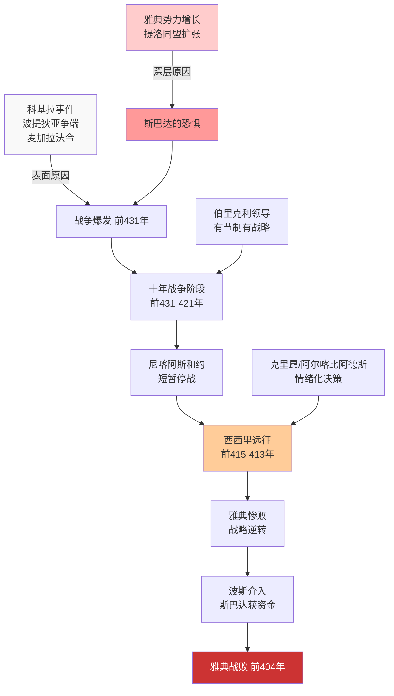

## 《伯罗奔尼撒战争史》读书笔记
  
### 作者  
digoal  
  
### 日期  
2026-05-19  
  
### 标签  
读书笔记 , 伯罗奔尼撒战争史  
  
----  
  
## 背景  

---
书名: 《伯罗奔尼撒战争史》  
作者: [古希腊] 修昔底德（Thucydides）  
译者: 何元国  
出版社: 中国社会科学出版社  
出版年份: 2017-12-31  
笔记日期: 2025-05-20  
豆瓣链接: https://book.douban.com/subject/27197930/  
标签: [古希腊, 历史, 战争, 国际关系, 政治哲学, 修昔底德陷阱]  
---

  

> **一句话**：两千五百年前一个被流放的雅典将军，用他目睹的那场文明自戕写出了人类永恒的权力教科书。
> **适合谁读**：对历史、国际关系、政治哲学感兴趣的读者；尤其是正在思考"大国冲突是否可以避免"的人
> **阅读难度**：⭐⭐⭐⭐☆（人名地名繁多，需配合地图，但演说辞极为精彩）
> **推荐指数**：⭐⭐⭐⭐⭐

---

## 一、时代坐标：这本书从哪里来？

公元前460年前后，修昔底德出生于雅典的一个显贵家族。他成年的时代正是雅典最辉煌的黄金时代——帕台农神庙在伯里克利的主持下拔地而起，苏格拉底在广场上辩论，希腊悲剧在戏台上演。然后，战争来了。

公元前431年，以雅典为首的提洛同盟与以斯巴达为首的伯罗奔尼撒同盟之间爆发了一场旷日持久的大战，持续整整二十七年，直至公元前404年雅典彻底战败。修昔底德不只是旁观者——他曾是这场战争中雅典的十位将军之一。公元前424年，他因未能及时救援安菲玻里城而被放逐，流亡二十年，直到战争结束才回到雅典。

这段流亡经历反而成全了他。游荡于希腊各城邦之间，他得以同时接触双方的史料，听取不同立场的陈述。正是这种局外人的距离感，造就了书中令人叹服的客观冷静。

他在战争之初便意识到这将是人类有史以来规模最大的战争，于是开始系统地搜集资料，倾尽后半生完成了这部约七十万字的编年史——尽管最终因其猝死，全书止于前411年，未能收尾。

```
时间轴
─────────────────────────────────────────────────────
公元前490   波斯战争，雅典斯巴达携手御敌
              │
公元前477   提洛同盟成立，雅典帝国崛起
              │
公元前460   修昔底德出生
              │
公元前431   伯罗奔尼撒战争爆发
              │
公元前430   雅典大瘟疫，伯里克利逝世
              │
公元前424   修昔底德被放逐
              │
公元前415   西西里远征（雅典战略大错误）
              │
公元前404   雅典战败，帝国覆灭
              │
公元前400   修昔底德约卒于此时，全书未竟
─────────────────────────────────────────────────────
```

---

## 二、核心命题：作者在说什么？

修昔底德没有开宗明义地列出论点，但整部书贯穿着三个深刻而清醒的判断。

### 观点一：战争的真正原因藏在表象之下

这是全书最著名、影响最深远的洞见。斯巴达对雅典宣战，表面理由是科基拉事件、波提狄亚争端、麦加拉法令等一系列具体摩擦。修昔底德对这些摩擦都详细记录了，但他随即说出了那句被后世反复引用的话：这些不过是借口，"使战争不可避免的真正原因，是雅典势力的增长以及由此在斯巴达引起的恐惧"。

这是一种彻底世俗化的历史观。没有神意，没有命运，只有权力对比的变化和由此衍生的心理反应：恐惧（fear）、利益（interest）、荣誉（honor）。修昔底德把推动战争的深层动力归结为这三种人性力量，在那个诸神还主宰着历史叙事的时代，这是极为超前的见识。

### 观点二：民主与帝国是天然的张力结构

修昔底德笔下的雅典是一个内在充满矛盾的政体。伯里克利那篇脍炙人口的《葬礼演说》，把雅典民主制度的辉煌说得令人动容——法律面前人人平等，开放包容，以内心勇气而非强制命令驱动公民。

然而同一部书里，雅典对米洛斯岛居民的回答同样出自雅典人之口："强者可以做他们能够做的一切，而弱者只能忍受他们必须忍受的一切。"这是赤裸裸的帝国逻辑。

修昔底德没有回避这个矛盾——美丽的民主在内，赤裸的强权在外。他让双方的话都原原本本出现在书里，让读者自己去面对这个令人不舒服的事实：雅典那令人向往的民主，是建立在对盟友的压榨和剥削之上的。

### 观点三：领袖个人的质量决定战争的走向

伯里克利活着的时候，雅典打得有节制——不主动出击，发挥海上优势，不让战争失控。伯里克利死后，继任者们各有私心，相互竞争民众的欢心，最终用克里昂的冲动和阿尔喀比阿德斯的野心，把雅典拖进了西西里这个无底洞。

西西里远征是全书叙事的高潮，也是修昔底德分析权力失控的最佳案例。尼喀阿斯的顾虑是对的，但阿尔喀比阿德斯更善于煽动公民大会的情绪。两万雅典士兵就这样踏上了一场注定失败的冒险，战争的转折点就此形成。

修昔底德隐含的判断是：民主的弱点在于，它在情绪高涨时会做出灾难性的决策，而伟大的领导人是防止这种失控的最后防线。

---

## 三、论证地图：修昔底德是如何说服你的？



修昔底德的论证策略非常独特：他大量使用**演说辞**来呈现各方立场。伯里克利的葬礼演说、米洛斯对话、科林斯使者在斯巴达的发言……这些演说辞是否是原话，修昔底德自己都坦承是根据他的判断重构的，但它们让历史人物的思维逻辑活了起来。

读者不是被作者告知谁对谁错，而是被引导着亲历每一场辩论，自己做出判断。这种叙事手法比平铺直叙的结论更有说服力，也更诚实。

值得一提的是：修昔底德的证据意识极为严格。他明确区分"我亲眼所见"与"听说"，对无法核实的信息保持距离。这在两千五百年前是极为罕见的史学自觉。

---

## 四、前提假设与边界：什么情况下这不成立？

### 假设一：人性恒常不变

修昔底德相信，历史之所以有价值，是因为"人性总是如此"——面对相似的处境，人总会做出相似的反应。这是他那句"永久的财富"背后的哲学基础。

但这个假设受到了相当的挑战。核武器的出现从根本上改变了大国直接对抗的代价计算，全球经济相互依存让战争的成本急剧上升。修昔底德时代的斯巴达和雅典之间没有核威慑，没有WTO，没有相互持有的国债。

### 假设二：战争是结构性的，个体无法改变

书中的逻辑倾向于认为，一旦权力格局发生根本性变化，冲突就趋于不可避免。但历史上也有不少案例（英德、英美、法德战后和解）证明，制度设计、领导人意志和国际机制可以打破这种结构性宿命。

本书中文版译者何元国教授本人就撰文指出，"修昔底德陷阱"这个概念在学术上存在过度简化的问题——一场战争如此，并不意味着以后的战争都必然如此。

### 假设三：城邦的逻辑等同于民族国家的逻辑

古希腊城邦和现代国家有本质差异：人口规模、技术水平、意识形态动员方式完全不同。用城邦冲突去直接类比核大国博弈，存在明显的历史类比陷阱。

---

## 五、思想谱系：这本书在哪个传统里？

修昔底德的横空出世，是对前辈希罗多德叙事传统的一次革命性超越。希罗多德笔下还有诸神的意志、神谕的预示；修昔底德的历史里，只有人的选择和结构性力量。他把哲学家追求逻辑真理的方法论引入了历史研究，被后世誉为"历史科学之父"。

```
思想影响脉络

修昔底德（前5世纪）
    │
    ├── 马基雅维利（16世纪）—— 权力政治的现实主义鼻祖
    │
    ├── 霍布斯（17世纪）—— "人对人是狼"，自然状态理论
    │
    ├── 摩根索（20世纪）—— 《国家间政治》，现实主义国关理论
    │
    ├── 沃尔兹（20世纪）—— 结构现实主义，《人、国家与战争》
    │
    └── 艾利森（21世纪）—— "修昔底德陷阱"概念，《注定一战？》
```

在国际关系理论中，修昔底德是现实主义学派当之无愧的源头。他的核心命题——国家行为由权力和利益驱动，而非道德和意识形态——构成了现实主义分析框架的基本假设。几乎每本国关教科书的第一章都会引用他。

---

## 六、我学到了什么？

读这本书最大的冲击，是意识到所谓"历史教训"常常是被我们选择性地使用的。每一方都在从历史中寻找支持自己立场的叙事：雅典人引用自己抗击波斯的功绩；斯巴达人强调维护希腊秩序的责任；双方都言之凿凿，都合情合理，都在为自己已经决定要做的事情寻找借口。

修昔底德早就看穿了这一点。他记录那些演说辞，不是为了告诉我们谁更有道理，而是为了展示：**语言是权力的服装，而不是权力的约束**。

其次，西西里远征这个案例让我深刻理解了"过度延伸"的危险。雅典在本可接受的局面下贸然扩大战线，不是因为战略上的必要，而是因为公民大会的情绪被煽动起来了，领导层在竞争民众欢心的过程中相互抬价，没有人愿意成为那个说"不"的人。这是民主决策在战争这种极端环境下的致命弱点——至今仍然适用。

第三个收获：修昔底德对"公正"的解构让人不舒服，但非常必要。米洛斯对话里，雅典人直接告诉米洛斯人：我们谈的不是公正，公正只存在于实力相当的双方之间，实力悬殊时强者做他们能做的，弱者承受他们必须承受的。这是一种令人不安的诚实。国际关系中把"公正""人权""秩序"挂在嘴边的大国，往往同时在别处做着完全相反的事——修昔底德两千五百年前就说清楚了。

---

## 七、举一反三：这个框架还能用在哪？

**商业竞争中的"市场霸主恐惧"**：一个市场中，当新兴竞争者开始威胁头部玩家时，头部玩家的反应往往不只是竞争，而是恐惧驱动下的不理性打压。谷歌、Meta收购竞争对手的逻辑，和斯巴达打压雅典盟友的逻辑，结构上惊人地相似。

**组织内的"派系战争"**：任何大型组织里，一个部门快速壮大时，其他部门会本能地产生防御反应。明面上的冲突是资源分配，暗底下是恐惧和利益。修昔底德的分析框架在这里同样适用。

**个人关系的权力结构**：两段关系之间（无论是友谊还是合作）一旦出现明显的势差变化，都会触发类似的张力。那个"正在崛起"的一方往往还在期待旧有关系继续，而另一方的内心已经开始布防。

---

## 八、批判与反思

书中最值得质疑的，恰恰是"修昔底德陷阱"这个被后人无限放大的命题。

修昔底德本人的意思是：**这场战争**的深层原因是雅典崛起和斯巴达恐惧。他并没有说这是铁律，更没有说新兴大国与现有霸主必然开战。将他的历史分析提升为普世规律，是后来者（尤其是艾利森）的演绎，不是修昔底德自己的主张。有趣的是，负责中文版翻译的何元国教授也专门撰文批评"修昔底德陷阱"的滥用——译者对这本书的理解，比那些只引用一句话的政客和评论员深得多。

另一个局限性是：修昔底德的叙述止于公元前411年，他去世时战争已经结束。我们读到的是一部未竟之作。斯巴达最终赢得战争，但其后迅速衰败；雅典战败，却在文化和思想上影响了全人类。历史的最终账单，比修昔底德所能记录的更加复杂。

还有一点：修昔底德尽管追求客观，但他终究是雅典人，是精英阶层。书中几乎不见奴隶的声音，不见普通士兵的内心世界，不见女性的存在。这部"永久的财富"记录的，是那个时代的权力层对战争的感知，而不是战争对所有人的影响。

---

## 九、金句与记忆点

**1.「我的著作并不想赢得听众一时的奖赏，而是想成为永远的财富。」**
这是修昔底德在卷一开篇的自我定位，也是他对历史写作的最高要求：不媚时，不迎合，只求真。两千五百年后我们还在读这本书，他做到了。

**2.「使战争不可避免的真正原因，是雅典势力的增长以及由此在斯巴达引起的恐惧。」**
整部书的灵魂句子。剥去一切借口，结构性的权力转移才是冲突的根源。这是修昔底德的现实主义宣言。

**3.「强者可以做他们能够做的一切，而弱者只能忍受他们必须忍受的一切。」（米洛斯对话）**
这句话有多令人不舒服，就有多接近国际关系的真相。雅典人对米洛斯人说这话时，没有任何愧意。

**4. 伯里克利的葬礼演说**
雅典民主的最美辩护词：法律面前人人平等，政治上任人唯贤，生活上自由开放，精神上爱好美丽。这段话是世界上最早的民主宣言之一，两千五百年后仍被无数政治家引用。

**5.「公正的基础是双方实力均衡。」**
这是对"国际公正"最残酷、最准确的描述。没有实力均衡，谈公正是奢侈品。

**6. 西西里远征的决策过程**
一个关于"集体情绪如何压倒理性判断"的经典案例：尼喀阿斯说了所有正确的担忧，阿尔喀比阿德斯给了民众他们想听的话，结果是公民大会选择了阿尔喀比阿德斯。民主的好与坏，在这个案例里同时显形。

**7. 修昔底德的叙事纪律**
他会明确区分"我亲眼见到的"和"据说"。这种认识论的谦逊，是他区别于神话史诗叙事者最关键的地方，也是现代历史学的开端。

---

## 十、延伸阅读

**1.《历史》——希罗多德**
同时代的另一位历史学家，修昔底德有意与之区别。希罗多德更具可读性，更有神话色彩；对比阅读，能看清两种历史观的根本差异。

**2.《注定一战？》（Destined for War）——格雷厄姆·艾利森**
"修昔底德陷阱"概念的系统阐发。艾利森考察了16个新兴大国挑战现有霸主的历史案例，结论引人深思，争议也同样巨大。读完本书后，读艾利森会有更清醒的批判意识。

**3.《国家间政治》——汉斯·摩根索**
现实主义国际关系理论的奠基之作。修昔底德奠定的分析框架，在摩根索这里得到系统化的理论建构。国关入门必读。

**4.《伯里克利传》——普鲁塔克**
《伯罗奔尼撒战争史》中最重要的人物传记。普鲁塔克的写法更有温度，补充了修昔底德叙述中缺失的私人维度。

**5.《西西里远征》——唐纳德·卡根**
专门研究这场战争中最戏剧性事件的历史著作。配合原著第六、七卷阅读，能更深入理解雅典帝国覆灭的内在逻辑。

---

*笔记写于 2025-05-20 | 基于修昔底德原著（何元国译本）、豆瓣书评、学术资料及深度思考整理*
*本书何元国译本（中国社会科学出版社，2017）是目前中文版本中注释最为详尽的学术译本，译者为专研古希腊史的武汉大学教授，并有希腊雅典大学和牛津大学访学经历，可信度高。*
  
  
#### [PostgreSQL 解决方案集合](../201706/20170601_02.md "40cff096e9ed7122c512b35d8561d9c8")
  
  
#### [德哥 / digoal's Github - 公益是一辈子的事.](https://github.com/digoal/blog/blob/master/README.md "22709685feb7cab07d30f30387f0a9ae")
  
  
#### [About 德哥](https://github.com/digoal/blog/blob/master/me/readme.md "a37735981e7704886ffd590565582dd0")
  
  

  
