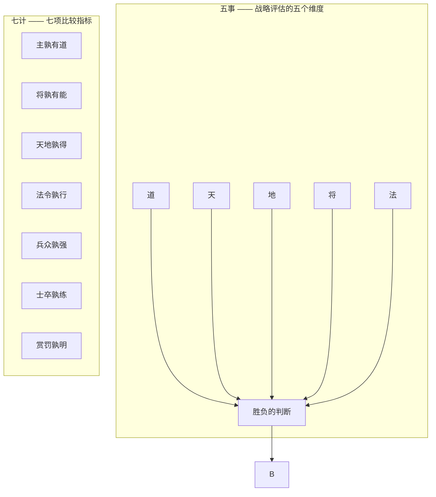

## 《孙子兵法》读书笔记  
  
### 作者  
digoal  
  
### 日期  
2026-05-19  
  
### 标签  
读书笔记 , 孙子兵法  
  
----  
  
## 背景  

---
书名: 《孙子兵法》  
作者: 孙武（春秋）  
译注: 陈曦  
出版社: 中华书局  
出版年份: 2011  
笔记日期: 2026-05-20  
豆瓣链接: https://book.douban.com/subject/出版年份/  
豆瓣评分: 9.4  
标签: [军事, 古典兵法, 战略, 管理, 哲学]  
---

  

> **一句话**：以智取胜、不战而屈人之兵的战略哲学，是一部关于如何在复杂对抗中以最小代价获取最大胜利的智慧之作。  
> **适合谁读**：企业管理者、创业者、战略决策者、对中国传统智慧感兴趣者  
> **阅读难度**：⭐⭐☆☆☆（古文需注释，现代译本通俗易懂）  
> **推荐指数**：⭐⭐⭐⭐⭐  
  
---

## 一、时代坐标：这本书从哪里来？

### 春秋末期的战争与思想

公元前545年至前470年，中国正处于春秋战国交替的大变革时期。周王室衰微，诸侯争霸，近五百年的春秋时代爆发了近五百场战役，平均每年1.5场高强度战争。正是在这样战火纷飞的年代，诞生了人类历史上最伟大的军事著作之一。

孙武出身齐国军事世家（田氏后裔），因齐国内乱避祸吴国。吴王阖闾即位后，经伍子胥"七荐孙子"，孙武以兵法十三篇面世，被拜为将军。此后他辅佐吴王，西破强楚，北慑齐晋，南服越国，其中最经典的战例便是公元前506年的**柏举之战**——以三万吴军千里奔袭，五战五捷，攻破二十万楚军，直捣郢都，创造了军事史上以少胜多的奇迹。

### 这本书要解决什么问题

《孙子兵法》不是一本教人如何杀人取城的技术手册，而是一部探讨**如何以最小代价获取最大胜利**的战略哲学。孙武开篇即言：

> "兵者，国之大事，死生之地，存亡之道，不可不察也。"

这句话奠定了整部书的基调：**慎战**。战争是关乎国家存亡的大事，不可轻启，但一旦不得不战，就要追求完胜。

---

## 二、核心命题：孙武在说什么？

《孙子兵法》十三篇系统阐述了一个核心战略思想体系，可以用以下三个层次概括：

### 1. 全胜思想：不战而屈人之兵

孙武将战争境界分为四个层次：

```
┌─────────────────────────────────────────────┐
│            战争境界金字塔                    │
├─────────────────────────────────────────────┤
│  最上 │ 伐谋 —— 以谋略胜                    │
│       │   "上兵伐谋，其次伐交"              │
│       │   最高境界：让敌人根本不打算打      │
├──────┼─────────────────────────────────────┤
│  次上 │ 伐交 —— 以外交胜                    │
│       │   瓦解敌方联盟，分化孤立            │
├──────┼─────────────────────────────────────┤
│  中层 │ 伐兵 —— 以军事行动胜                │
│       │   野战歼敌，消灭有生力量            │
├──────┼─────────────────────────────────────┤
│  最下 │ 攻城 —— 硬碰硬                      │
│       │   "其下攻城"，不得已而为之          │
└─────────────────────────────────────────────┘
```

孙武追求的是"**全胜**"——用最小的代价达成最大的战略目标。这与两千年后的克劳塞维茨《战争论》形成鲜明对比：克劳塞维茨强调"战争是政治的延续"，追求彻底消灭敌人；而孙武则认为最高明的战争是"使敌国不服"而非"灭其国"。

### 2. 知己知彼：信息决定胜负

孙武在《谋攻篇》中写道：

> "知彼知己，百战不殆；不知彼而知己，一胜一负；不知彼，不知己，每战必殆。"

这可能是《孙子兵法》中最著名的一句话。但孙武的"知"绝非简单的情报收集，而是一套系统的**五事七计**分析框架：



"五事"是静态分析——道（政治是否清明）、天（天时）、地（地利）、将（将领素质）、法（军法制度）。"七计"则是动态比较——敌我双方在七个维度上的对比。这种系统化的战略分析方法，比现代管理学中的SWOT分析早了两千三百年。

### 3. 灵活应变：兵无常势，水无常形

《孙子兵法》第十三篇《虚实篇》中最精彩的一句：

> "兵无常势，水无常形，能因敌变化而取胜者，谓之神。"

孙武用水的意象来阐述他的战争哲学：水没有固定的形状，根据地形而流淌；真正高明的将领没有固定的战术，根据敌情而变化。这句话的潜台词是：**任何教条化的军事学说都是危险的**。

如何做到灵活应变？孙武提出两个关键原则：

- **致人而不致于人**：调动敌人而不被敌人调动，掌握战场主动权
- **避实击虚**：避开敌人的强势点，攻击其薄弱环节

> "夫兵形象水，水之形，避高而趋下；兵之形，避实而击虚。"

---

## 三、论证地图：孙武怎么说服你的？

### 十三篇的逻辑架构

《孙子兵法》十三篇并非杂乱无章，而是一个逻辑严密的系统：

| 篇名 | 核心议题 | 逻辑位置 |
|------|----------|----------|
| 计篇 | 战略计算 | **开战前** —— 庙算定计 |
| 作战篇 | 战争成本 | **动员阶段** —— 速战速决 |
| 谋攻篇 | 全胜之道 | **战略层面** —— 不战而屈 |
| 形篇 | 实力对比 | **实力基础** —— 先为不可胜 |
| 势篇 | 奇正相生 | **战术层面** —— 以正合，以奇胜 |
| 虚实篇 | 主动权 | **核心抓手** —— 致人而不致于人 |
| 军争篇 | 机动力 | **战场机动** —— 迁直之计 |
| 九变篇 | 随机应变 | **临机决策** —— 通于九变 |
| 行军篇 | 战场管理 | **战场控制** —— 处军相敌 |
| 地形篇 | 地形运用 | **地理利用** —— 知己知地 |
| 九地篇 | 战略环境 | **不同环境** —— 九地之变 |
| 火攻篇 | 特殊战术 | **特殊手段** —— 火攻慎用 |
| 用间篇 | 情报体系 | **信息根基** —— 先知敌情 |

从"计"到"间"，从庙算到情报，孙武构建了一个完整的军事决策闭环。

### 核心论证逻辑

孙武说服人的方式很特别：他首先承认战争是"诡道"，然后论证为什么诡道必须建立在扎实的基础之上。

**第一层**：战争充满不确定性，"知彼知己"是前提
**第二层**：但信息永远不完备，所以要"先胜而后求战"
**第三层**：实力是基础，"胜兵先胜而后求战，败兵先战而后求胜"
**第四层**：在实力基础上，通过奇正变化、虚实调度取得优势
**第五层**：所有战术都要服务于"全胜"这个终极目标

孙武的核心逻辑是：**实力是必要条件，智慧是充分条件**。没有实力的智慧是空谈，没有智慧的实力是蛮勇。

---

## 四、前提假设与边界：什么情况下这不成立？

### 隐含假设

1. **"道"——政治合法性是战争的根本**
   孙武在五事中把"道"放在首位，要求"令民与上同意，可与之死，可与之生"。这一假设在现代企业竞争中依然成立——没有共同愿景的团队难以打硬仗。但对于没有政治目标的纯商业竞争，这个维度需要重新定义。

2. **信息可知论**
   孙武假设通过"用间"（情报工作）可以"先知敌情"。然而现代战争中，信息的获取和反获取构成一个动态博弈。信息过载同样可以导致决策瘫痪。

3. **成本效益分析框架**
   《孙子兵法》的核心逻辑是把战争视为一种需要计算成本收益的活动。但这个框架无法解释那些"不惜代价"的战争——无论是抗日战争中的持久战，还是商业竞争中的"战略性亏损"。

### 边界与局限

1. **孙武没有系统论述战争伦理**
   作为一个现实主义者，孙武专注于"如何胜"，对"何时该战、何时不该战"的伦理讨论相对薄弱。后世儒家对此多有批评。

2. **对技术与武器重视不足**
   《孙子兵法》几乎不讨论具体武器和战术细节，这在冷兵器时代尚可理解，但在现代战争和科技竞争中显然不够。克劳塞维茨花了大量篇幅讨论"战争中的摩擦"，而孙武更像是站在战略高度俯瞰战场。

3. **过度依赖将领个人能力**
   孙武把战争胜负的关键寄托在"将"身上，强调"知兵之将，民之司命，国家安危之主也"。这种"精英史观"忽视了军队组织和制度建设的长期作用。

---

## 五、思想谱系：这本书在哪个传统里？

### 在中国

```
先秦诸子 ─┬─ 儒家（孔子、孟子）
          ├─ 道家（老子、庄子）
          ├─ 法家（商鞅、韩非）
          └─ 兵家 ──┬─ 孙子（孙武）
                    ├─ 吴子（吴起）
                    ├─ 孙膑（孙膑兵法）
                    └─ 尉缭子
```

《孙子兵法》是中国兵家思想的奠基之作，但它对中国文化的影响远超军事领域。曹操、李世民、朱元璋等帝王都对其推崇备至；毛泽东的"游击战"思想也深受其影响；甚至围棋、商战、为人处世等领域都可见其智慧。

### 在世界

1772年，法国传教士钱德明神父将《孙子兵法》译成拉丁文，这是西方世界的第一个译本。20世纪以来，《孙子兵法》的影响远超军事领域：

- **军事**：海湾战争中，美军将《孙子兵法》列为军官必读书
- **商业**：日本企业家将其奉为经营圣经；美国商学院用它来讲战略管理
- **体育**：多位NBA教练公开引用《孙子兵法》
- **心理战**：美国 CIA 将其列为情报人员必读书

有意思的是，《孙子兵法》可能是中国古典著作中被翻译最多的，在英语世界的知名度可能超过《论语》。

---

## 六、我学到了什么？

### 最重要的三个收获

**1. 慎战比善战更重要**

孙武虽然是"兵家至圣"，但他最核心的思想其实是"慎战"。"非利不动，非得不用，非危不战"——没有好处不动，没有取胜把握不用，没有危急形势不战。这让我重新理解了一个道理：**真正的战略家不是研究如何打仗，而是研究如何避免打仗**。

在现代社会，这意味着在做重大决策之前，先问自己：有没有非打不可的理由？有没有其他解决方案？一旦决定行动，是否有足够的资源支撑到胜利？

**2. 系统分析是决策的基础**

孙武的"五事七计"框架在今天依然不过时。任何重大决策之前，我们都需要问：政治/环境是否支持？执行者的能力是否胜任？资源是否充足？制度是否健全？

这其实就是现代管理学说的"战略规划"，只不过孙武用更精炼的语言表达了出来。

**3. 变化是唯一的不变**

"兵无常势，水无常形"——没有什么策略是可以一招鲜吃遍天的。真正的高手不是掌握了多少固定套路，而是能够根据形势的变化随时调整策略。这对于现代社会的快速变化尤为重要。

---

## 七、举一反三：这个框架还能用在哪？

### 商业竞争

孙武的"知己知彼"和"避实击虚"在商战中应用最广。Netflix当年避开与微软在客厅硬件上的竞争，转而深耕流媒体内容，正是"避实击虚"的现代演绎。特斯拉早期选择高端小众市场而非与通用福特正面竞争，也是同样的逻辑。

### 组织管理

"令之以文，齐之以武"——用愿景凝聚人心，用制度约束行为。这是现代企业文化的核心命题。管理者需要回答：我们的"道"是什么？员工是否认同这个"道"？没有共识的团队，制度再严格也难以打硬仗。

### 个人发展

"致人而不致于人"——掌握主动权而不是被动应对。在职业发展中，这意味着主动规划自己的职业路径，而不是被工作推着走。"知己知彼"则提醒我们：了解自己的优势和局限，比盲目模仿他人更重要。

---

## 八、批判与反思

### 哪里我不同意？

**对"诡道"的过度推崇**

孙武说"兵者，诡道也"，这在军事上无可厚非，但在现代社会的合作伦理中可能有问题。把对手当敌人、把竞争当战争的管理哲学，可能破坏商业生态中的信任基础。毕竟，商业竞争与军事战争的根本区别在于：战争中你死我活，商业中却可以多方共赢。

**忽视了"非理性力量"**

孙武的论证建立在"人是理性的，会计算利弊"这个假设上。但现实中，无论是战场上的"哀兵必胜"，还是商场上的"烧钱换市场"，都说明非理性因素往往决定胜负。《孙子兵法》对心理因素的分析（如"三军可夺气"）点到即止，缺乏系统性论述。

**时代局限**

《孙子兵法》写于两千五百年前，其背后的战争形态（冷兵器、面对面厮杀、后勤限制）早已改变。照搬其具体战术是不现实的，但其哲学内核——慎战、知彼、灵活应变——依然有效。

---

## 九、金句与记忆点

1. **"兵者，国之大事，死生之地，存亡之道，不可不察也。"**
   开篇明义。战争关乎生死存亡，决策者必须慎之又慎。这句话提醒我们：重大决策前要充分评估风险。

2. **"知彼知己，百战不殆；不知彼而知己，一胜一负；不知彼，不知己，每战必殆。"**
   信息是决策的基础。了解自己是自知，了解对手是他知，两者缺一不可。

3. **"上兵伐谋，其次伐交，其次伐兵，其下攻城。"**
   最高明的胜利是让对手放弃抵抗的念头，次一等是瓦解其联盟，再次一等是消灭其有生力量，最下策才是硬攻城池。

4. **"兵无常势，水无常形，能因敌变化而取胜者，谓之神。"**
   没有固定的战略战术，能根据形势灵活调整的人才是高手。

5. **"夫兵形象水，水之形，避高而趋下；兵之形，避实而击虚。"**
   用水的意象说明战略的精髓：避开阻力最小的路径，攻击对手最薄弱的地方。

6. **"胜兵先胜而后求战，败兵先战而后求胜。"**
   胜利者是因为先创造了必胜的条件才去打仗，失败者是因为先打了仗才期望侥幸获胜。

---

## 十、延伸阅读

1. **《战争论》克劳塞维茨**
   与《孙子兵法》并称东西方军事理论的巅峰，但两人的思想取向截然不同：克劳塞维茨强调暴力最大化，孙武强调以智取胜。对读可以看到东西方战略文化的根本差异。

2. **《五轮书》宫本武藏**
   日本剑术大师的著作，与《孙子兵法》同样短小精悍，却体现了完全不同的文化气质——更强调"当下"和"直觉"，与孙武的系统分析形成互补。

3. **《战略研究》李德·哈特**
   英国战略家，提出"间接路线"战略，与孙武的"以迂为直"高度契合。西方战略传统的代表作。

4. **《从优秀到卓越》吉姆·柯林斯**
   现代管理学研究，对照孙武的"五事七计"，可以看到两千年前的战略框架如何被现代管理学重新诠释。

---

*笔记写于 2026-05-20 | 基于公开资料与深度思考整理*
   
  
#### [PostgreSQL 解决方案集合](../201706/20170601_02.md "40cff096e9ed7122c512b35d8561d9c8")
  
  
#### [德哥 / digoal's Github - 公益是一辈子的事.](https://github.com/digoal/blog/blob/master/README.md "22709685feb7cab07d30f30387f0a9ae")
  
  
#### [About 德哥](https://github.com/digoal/blog/blob/master/me/readme.md "a37735981e7704886ffd590565582dd0")
  
  

  
