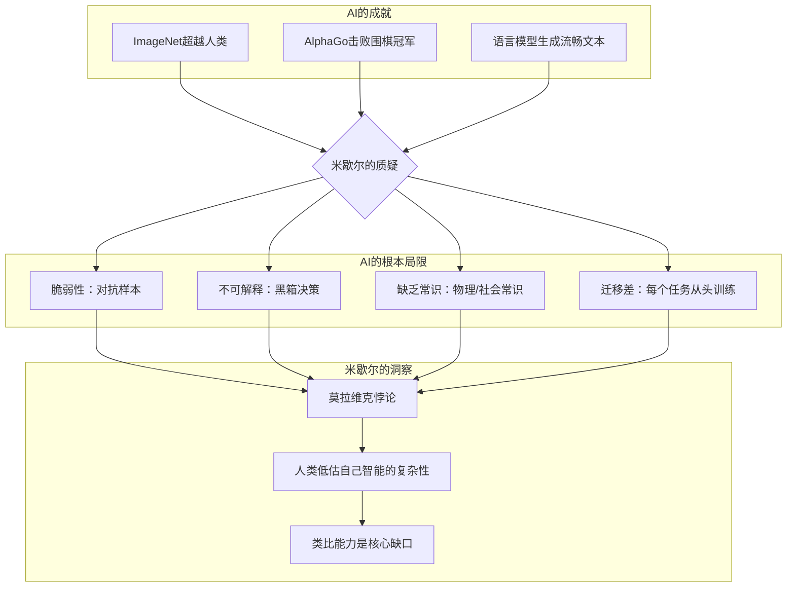

## 《AI 3.0》读书笔记  
  
### 作者  
digoal  
  
### 日期  
2026-05-19  
  
### 标签  
读书笔记 , AI 3.0  
  
----  
  
## 背景  

---
书名: 《AI 3.0》  
作者: [美] 梅拉妮·米歇尔（Melanie Mitchell）  
译者: 王飞跃 / 李玉珂 / 王晓 / 张慧  
出版社: 四川科学技术出版社·湛庐  
出版年份: 2021  
笔记日期: 2026-05-20  
豆瓣链接: https://book.douban.com/subject/35219053/  
豆瓣评分: 7.8  
标签: [人工智能, 机器学习, 深度学习, 科技前沿, 复杂系统]  
---

  

> **一句话**：人工智能在特定领域已经超越人类，但在通用智能、常识理解和迁移能力上仍与人类相距甚远——我们高估了AI的进步，却低估了人类智能的深度。  
> **适合谁读**：对AI感兴趣的普通读者、科技行业从业者、想了解AI真实能力边界的决策者  
> **阅读难度**：⭐⭐⭐☆☆（技术解释深入浅出，但部分章节需要一定背景知识）  
> **推荐指数**：⭐⭐⭐⭐☆  
  
---

## 一、时代坐标：这本书从哪里来？

### AI热潮中的冷思考

2019年，深度学习革命正席卷全球。AlphaGo击败李世石、AlphaFold破解蛋白质折叠难题、人脸识别无处不在——媒体头条充斥着"AI即将超越人类"的惊呼。正是在这个节点上，一位在AI领域深耕三十年的科学家决定写一本"冷静"的书。

梅拉妮·米歇尔（Melanie Mitchell）是波特兰州立大学计算机科学教授、圣塔菲研究所客座教授，师从《哥德尔、艾舍尔、巴赫》（GEB）作者侯世达。她研究遗传算法、复杂系统和人工智能，是少有的兼具技术深度和科普能力的研究者。

她写这本书的动机很简单：**她自己对AI的真实进展感到困惑**。作为从业者，她看到媒体和公众对AI的狂热期待；作为科学家，她深知当前的局限性。这种"当局者迷"的矛盾，促使她写下这本"为思考人类而写的AI指南"。

```
┌──────────────────────────────────────────────────────────────┐
│                    2019年前后的AI热潮                        │
├──────────────────────────────────────────────────────────────┤
│  2016 │ AlphaGo击败李世石，引发AI超越人类的担忧             │
│  2017 │ Transformer架构提出，NLP领域突飞猛进                │
│  2018 │ BERT发布，GPT系列开始酝酿                           │
│  2019 │ 《AI 3.0》出版——正是在这个AI狂潮的顶点            │
└──────────────────────────────────────────────────────────────┘
```

### 这本书要解决什么问题

《AI 3.0》试图回答一个简单却重要的问题：**AI现在到底能做什么？我们对它的期待合理吗？**

米歇尔通过四个具体领域——视觉识别、游戏博弈、自然语言处理、常识判断——系统评估AI的能力边界。她的结论是：AI在狭义任务上已经令人惊叹，但在真正需要理解、迁移和类比的智能上，仍然遥不可及。

---

## 二、核心命题：米歇尔在说什么？

### 观点一：我们正在被AI炒作收割

米歇尔认为，公众对AI的理解被两个极端误导：

1. **媒体的过度乐观**：每隔几年就会出现"AI即将达到人类水平"的预言，然后预言落空，AI进入下一个寒冬
2. **对人类智能的低估**：我们觉得下棋、解数学题很"难"，觉得走路、说话很"简单"——这个直觉完全是错的

她引用计算机科学家莫拉维克（Hans Moravec）的经典悖论：

> **莫拉维克悖论**：对人类来说困难的任务（如逻辑推理），对计算机而言很简单；对人类来说简单的任务（如识别猫狗、灵活抓取物体），对计算机而言却极其困难。

这句话背后的含义是：**人类智能的核心不是逻辑，而是那些几百万年进化出来的"本能"——感知、运动、常识理解。这些恰恰是AI最难攻克的领域。**

### 观点二：深度学习是强大的，但有根本性局限

2010年代的AI爆发主要来自深度学习。ImageNet竞赛上，卷积神经网络（ConvNets）的错误率从26%降到3.5%，低于人类水平。米歇尔详细分析了深度学习成功的背后因素：

```
深度学习成功的真正原因：
┌─────────────────────────────────────────────────────────────┐
│  1. 海量标注数据（ImageNet有1400万张标注图像）              │
│  2. 并行计算硬件（GPU/TPU）                                │
│  3. 互联网时代的数据红利                                    │
└─────────────────────────────────────────────────────────────┘
```

但这些成功背后藏着四个根本性局限：

| 局限 | 说明 | 例子 |
|------|------|------|
| **缺乏可靠性** | 深度学习系统对微小干扰极其脆弱 | 图像加几个像素噪点，AI就会把猫识别成汽车 |
| **缺乏可解释性** | 我们不知道网络为什么做出某个决策 | 医生无法理解AI为什么诊断出某种疾病 |
| **缺乏常识** | AI不理解物理世界的基本常识 | AI不知道"把水倒进杯子里，水会停留在杯中" |
| **环境复杂** | 真实世界比实验室数据混乱得多 | 自动驾驶在复杂天气、陌生路况下表现急剧下降 |

### 观点三：通往通用智能需要什么？

米歇尔认为，当前AI缺的不是更多数据或更强算力，而是**类比**这个核心能力。她写道：

> "我们倾向于高估人工智能的进步，而低估人类自身智能的复杂性。"

类比是人类智能的核心：当我们遇到新问题时，会自动寻找与已有经验的相似性，然后"照葫芦画瓢"。这种能力让人类能够**迁移学习**——在一个领域学到的知识，可以应用到完全不同的领域。

但当前AI的迁移能力极其有限：一个在ImageNet上训练好的视觉系统，很难直接用于医学影像诊断；一个精通围棋的AI，下国际象棋可能还需要从零训练。

---

## 三、论证地图：米歇尔怎么说服你的？

### 四个领域的案例解剖

米歇尔选择了四个AI热门领域逐一"解剖"，展示什么叫"进步惊人但问题同样惊人"：

**1. 视觉识别：ConvNets的崛起与脆弱性**

2012年，深度学习在ImageNet挑战上一鸣惊人。卷积神经网络通过层层筛选，从像素中提取特征，最终达到甚至超过人类的识别率。

但米歇尔揭示了硬币的另一面：

- 对抗样本攻击：只要在图像上添加人眼几乎看不见的噪点，就能让AI把一切识别成任何东西
- 分布外泛化失败：AI在ImageNet上表现完美，但面对真实世界的光照变化、遮挡、变形时，能力急剧下降

**2. 游戏博弈：从深蓝到AlphaGo**

1997年，深蓝击败卡斯帕罗夫，靠的是穷举搜索和大师级国际象棋知识。2016年，AlphaGo击败李世石，靠的是深度强化学习和自我对弈。

米歇尔分析了AlphaGo的技术细节，指出其成功的关键不是"通用智能"，而是**巨大搜索空间+明确规则+无限自我对弈数据**。这恰恰说明：AI擅长的是"规则清晰、反馈及时、可以模拟"的任务。

问题在于：现实世界几乎没有任何任务符合这个描述。

**3. 自然语言处理：从词向量到GPT**

米歇尔写作本书时，GPT-2刚刚发布，还没有GPT-3和ChatGPT。她详细解释了词向量（word embeddings）技术——把词语映射到高维向量空间，让语义相似的词在向量空间中距离相近。

她预见到语言模型的潜力，但也指出根本问题：**语言模型并不"理解"语言**。它们学习的是词语之间的统计关联，而不是它们所指代的现实世界。模型可以说"水是液体"，但它并不真正理解"液体"意味着什么。

**4. 常识判断：AI最遥远的距离**

这是全书最深刻的部分。米歇尔展示了一系列对人类而言理所当然，但对AI来说却极其困难的"常识问题"：

```
如果我把一个瓶子放在桌子上，然后把它放进盒子里，
然后把盒子移到另一个房间，瓶子在哪里？

（正确答案：在盒子里，在另一个房间。
大多数AI系统的答案：桌子上——因为它看到瓶子原本在桌子上。）
```

这种对"物体恒存性"（object permanence）的理解，对三岁小孩来说都不是问题，却是AI的噩梦。

### 论证逻辑总结



米歇尔的论证方式是"以子之矛攻子之盾"：先用AI的成就让你惊叹，然后用具体的失败案例让你清醒，最后提出真正需要解决的问题。

---

## 四、前提假设与边界：什么情况下这不成立？

### 前提假设

1. **"理解"需要某种形式的内部表征**
   米歇尔假设真正的智能需要"理解"世界，而不是仅仅统计模式匹配。这个假设是有争议的——也许未来的AI可以通过足够复杂的统计模型"涌现"出某种理解。

2. **常识是智能的必要条件**
   米歇尔认为没有常识的AI永远无法达到人类水平。但"常识"本身是什么？人类自己也说不清楚。我们真的需要先定义智能，才能判断AI是否具备智能吗？

3. **类比是核心能力**
   米歇尔把类比作为人类智能的核心。但这是唯一的路径吗？也许AI可以用完全不同的方式达到类似效果。

### 时代局限

《AI 3.0》出版于2019年（英文原版），距今已过去六七年。在此期间：

- **GPT-3/ChatGPT/GPT-4**：大型语言模型展现出惊人的few-shot学习能力和跨领域迁移能力
- **AlphaFold 2/3**：解决了蛋白质折叠这个"常识"之外的专业领域问题
- **多模态模型**：开始整合视觉、语言、音频等多种模态

米歇尔的批评在原则上仍然有效——LLM仍然缺乏真正的"理解"，仍然会犯低级错误——但AI的能力边界确实在以她无法预见的速度扩展。

---

## 五、思想谱系：这本书在哪个传统里？

### 米歇尔的学术脉络

```
侯世达（Douglas Hofstadter）——《GEB》作者
         │
         ▼ 研究方向：类比、创造力、意识的本质
         │
         ▼ 培养学生
         │
梅拉妮·米歇尔 ──→ 复杂系统、遗传算法、AI
                    │
                    ├──《复杂》（Complexity: A Guided Tour）
                    └──《AI 3.0》
```

米歇尔的学术基因来自侯世达，而侯世达的研究传统则来自人工智能的**符号主义学派**——认为智能的核心是符号操作和逻辑推理。尽管深度学习革命颠覆了这个范式，米歇尔仍然保持着对"理解"和"类比"的执念。

### 与主流AI观点的对话

| 观点 | 符号主义 | 连接主义 | 米歇尔的立场 |
|------|---------|---------|-------------|
| 智能核心 | 逻辑规则 | 神经网络 | **类比与迁移** |
| 学习方式 | 手工编码 | 数据驱动 | **两者都需要** |
| 可解释性 | 白盒 | 黑盒 | **必须可解释** |
| 目标 | 通用AI | 窄域应用 | **先解决常识问题** |

她的立场既不是纯粹乐观的"联结主义崇拜"，也不是悲观否定派。她是一个**现实的理想主义者**——承认AI的成就，但坚持认为核心问题远未解决。

---

## 六、我学到了什么？

### 最重要的三个收获

**1. "简单"与"困难"的反转**

莫拉维克悖论彻底改变了我的认知。我以前觉得下棋很难，AI攻克下棋让我觉得AI已经接近人类。但米歇尔让我意识到：**下棋对AI来说是"简单"的问题，因为规则明确、信息完备、反馈及时。而人类那些"不费吹灰之力"的事情——走路、识别表情、理解笑话——其实才是智能的精华。**

这个认知反转让我重新思考"什么是AI真正需要解决的问题"。

**2. AI炒作的三种套路**

读这本书让我识别出AI炒作的常见模式：

- **"在特定benchmark上超越人类"**：但benchmark是静态的，真实世界是动态的
- **"看，AI能生成X了！"**：生成能力和理解能力是两码事
- **"通用人工智能就在眼前"**：每年都有人这么说，然后每年都落空

**3. 对"理解"的重新定义**

米歇尔让我思考：到底什么是"理解"？一个能正确识别图像中猫的神经网络，和一个真正"看到"猫的猫奴，有什么本质区别？

也许答案在于**因果关系**：我们理解"如果我推这个杯子，它会移动"，但AI只是在统计相关性上学会了"杯子和移动经常一起出现"。这种区别在大多数情况下不重要，但在关键时刻——自动驾驶的紧急决策、医学诊断的边缘病例——可能就是生死之差。

---

## 七、举一反三：这个框架还能用在哪？

### 投资决策

在评估AI公司时，不要被"我们的AI准确率达到95%"蒙蔽。要问：

- 这个准确率是在什么数据集上测量的？
- 分布外数据的表现如何？
- 系统失效时的备选方案是什么？
- 决策过程是否可解释？

米歇尔的方法论——先评估AI的失败模式，再判断它的真正能力——同样适用于投资尽调。

### 教育评估

我们评价学生的方式，和评价AI的方式惊人地相似：考试、benchmark、标准化测试。但米歇尔提醒我们：在一个狭窄benchmark上表现优秀，不等于真正掌握了知识。

真正的学习能力，应该体现在**迁移**上——把学到的原理应用到从未见过的场景。这才是人类教师应该培养的核心能力，也是AI教育产品最难复制的东西。

### 技术新闻消费

面对每天铺天盖地的AI突破新闻，用米歇尔的框架过滤：

1. 这个突破是在什么任务上？规则明确吗？
2. 有没有测试"分布外"泛化能力？
3. 失败案例是什么样的？失败的代价比成功收益更重要吗？
4. 是真正的"理解"，还是statistical correlation？

---

## 八、批判与反思

### 哪里我不同意？

**对LLM的判断可能低估了它们**

米歇尔写作时，GPT-3尚未发布，ChatGPT更是连影子都没有。她对语言模型的批评——"不理解语言，只是不统计相关性"——在GPT-4时代可能需要修正。

现代LLM展现出令人惊讶的推理能力（chain-of-thought prompting）、few-shot学习、甚至某种形式的"思维"。虽然米歇尔的根本论点——它们缺乏真正的理解——可能仍然正确，但AI的能力边界已经比她描述的更加模糊。

**过于依赖"常识"作为智能的标准**

米歇尔把"常识"作为AI无法逾越的鸿沟。但也许这条线画错了位置：人类专家（医生、律师、工程师）也缺乏"普通人"的常识，他们拥有的是**领域特定的深度知识**。

也许未来的AI不需要"常识"，只需要在足够多的领域拥有足够深的专长。当AI在大多数领域都能达到"专家"水平时，"缺乏常识"还重要吗？

**忽视了具身智能（Embodied AI）的发展**

《AI 3.0》几乎没有讨论机器人学和具身智能。但2020年代最大的突破可能正是来自这个方向——当AI能够像人类一样拥有身体、与物理世界交互时，"常识"问题可能会以一种完全不同的方式得到解决。

---

## 九、金句与记忆点

1. **"我们倾向于高估人工智能的进步，而低估人类自身智能的复杂性。"**
   这句话是全书的基调。AI的进步是真实的，但我们人类觉得理所当然的那些能力（走路、说话、理解笑话），实际上是数百万年进化的结晶。

2. **"对人类来说困难的任务（如逻辑推理），对计算机而言很简单；对人类来说简单的任务（如感知、运动），对计算机而言却极其困难。"——莫拉维克悖论**
   这个悖论揭示了人类智能和机器智能的本质差异：人类智能的核心不是逻辑，而是那些"不费力"的事情。

3. **"困难的问题是简单的，简单的问题是困难的。"——史蒂芬·平克**
   引用自平克对莫拉维克悖论的总结。写代码证明定理很难，但三岁小孩都知道"东西没了就是没了"——但恰恰是后者让AI头疼。

4. **"夫兵形象水，水之形，避高而趋下；兵之形，避实而击虚。"——孙子兵法**
   米歇尔没有引用这句话，但她的论证逻辑与此高度一致：AI的"实"是规则明确的任务，"虚"是需要常识理解的场景。

5. **"我们应该感到害怕的不是智能机器，而是'愚笨'的机器，即那些没有能力独立做决策的机器。"**
   这是米歇尔对AI风险的独特判断：不是超级智能，而是不可靠的自动化系统，才是真正的危险。

6. **"类比是人类智能的核心。"**
   从侯世达到米歇尔，类比能力被认为是人类智能的关键。当AI能够真正进行类比，而不是简单地模式匹配时，才是真正的突破。

---

## 十、延伸阅读

1. **《哥德尔、艾舍尔、巴赫》（GEB）侯世达**
   米歇尔的导师之作，也是AI领域最深刻的著作之一。探讨意识、逻辑和音乐中的自指结构。难度很高，但回报巨大。

2. **《生命3.0》迈克斯·泰格马克**
   另一位顶级AI研究者对AI未来的展望。立场比米歇尔更乐观，讨论了AI可能带来的存在性风险。与《AI 3.0》对照阅读，可以看到光谱两端的观点。

3. **《复杂》梅拉妮·米歇尔**
   米歇尔自己写的复杂性科学入门，同样深入浅出。《AI 3.0》可以看作是《复杂》中某些思想的AI专题延伸。

4. **《人工智能：一种现代方法》罗素 & 诺维格**
   AI领域的标准教科书，系统覆盖了AI的所有主要方向。比《AI 3.0》技术性强得多，但如果你想深入理解AI的技术细节，这是最好的起点。

---

*笔记写于 2026-05-20 | 基于公开资料与深度思考整理*
  
  
#### [PostgreSQL 解决方案集合](../201706/20170601_02.md "40cff096e9ed7122c512b35d8561d9c8")
  
  
#### [德哥 / digoal's Github - 公益是一辈子的事.](https://github.com/digoal/blog/blob/master/README.md "22709685feb7cab07d30f30387f0a9ae")
  
  
#### [About 德哥](https://github.com/digoal/blog/blob/master/me/readme.md "a37735981e7704886ffd590565582dd0")
  
  

  
