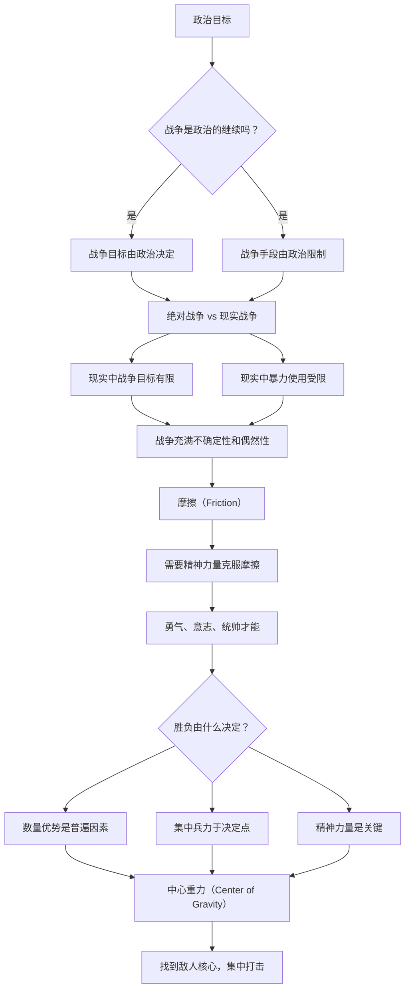

## 《战争论》读书笔记  
  
### 作者  
digoal  
  
### 日期  
2026-05-19  
  
### 标签  
读书笔记 , 战争论  
  
----  
  
## 背景  
  
---
书名: 《战争论》  
作者: [德] 卡尔·冯·克劳塞维茨（Carl von Clausewitz）  
译者: 中国人民解放军军事科学院  
出版社: 解放军出版社  
出版年份: 2005  
笔记日期: 2026-05-20  
豆瓣链接: https://book.douban.com/subject/1003008/  
豆瓣评分: 9.1  
标签: [军事, 战略, 战争哲学, 西方兵学, 普鲁士]  
---

  

> **一句话**：战争是政治的继续，是迫使敌人服从我们意志的暴力行为；战争中人的精神力量——勇气、意志、统帅才能——才是决定胜负的关键。  
> **适合谁读**：对战略感兴趣的读者、企业管理者、军事历史爱好者、想理解竞争本质的人  
> **阅读难度**：⭐⭐⭐⭐☆（理论性强，涉及大量历史战例，部分论述较为抽象）  
> **推荐指数**：⭐⭐⭐⭐⭐  

---

## 一、时代坐标：这本书从哪里来？

### 拿破仑战争时代的产物

卡尔·冯·克劳塞维茨（1780-1831）出生于普鲁士马格德堡，12岁从军，13岁就参加了对法作战。他亲历了拿破仑战争的惨烈：1806年，他在奥尔施泰特会战中被法军俘虏；1812年，他因反对普鲁士与拿破仑结盟而辞职，转投俄军抗法；1815年，他在利尼会战中担任布吕歇尔军团参谋长。

这场改变欧洲的战争彻底塑造了克劳塞维茨的军事思想。拿破仑用前所未有的方式——全民动员、大规模机动作战、集中优势兵力——颠覆了旧式战争的一切规则。克劳塞维茨既是这场革命的见证者，也是思考者：战争为什么会这样？它的本质规律是什么？

```
克劳塞维茨生平与写作背景：
┌─────────────────────────────────────────────────────────────┐
│  1780年 出生于普鲁士                                      │
│  1792年 12岁参军，参加了对法战争                          │
│  1806年 被法军俘虏，亲眼见证普军腐败导致的失败             │
│  1809年 在军事改革委员会工作，协助沙恩霍斯特改革           │
│  1812年 普鲁士与拿破仑结盟后，转投俄军抗法                │
│  1818年 任柏林军官学校校长（此年开始系统研究战争理论）     │
│  1831年 去世，留下未完成的《战争论》                      │
│  1832年 《战争论》由其妻子玛丽整理出版                    │
└─────────────────────────────────────────────────────────────┘
```

### 这本书要解决什么问题

克劳塞维茨写作《战争论》的目标宏大而清晰：**建立一套关于战争本质的理论**。在他之前，西方军事理论大多是经验性的条令汇编；而他要做的是像牛顿用数学解释物理世界一样，用哲学和逻辑揭示战争的规律。

他关注的核心问题是：

1. 战争的本质是什么？它与政治是什么关系？
2. 战争的胜负由什么决定？
3. 如何在充满不确定性的战场上做出正确决策？

值得注意的是，《战争论》是一部**未完成的著作**。克劳塞维茨在1831年去世时只完成了八篇中的前六篇和第七篇的一部分。最后一篇"战争计划"完全没有写完。这使得书中的思想呈现出一种"开放性"——某些论点没有最终定论，后人可以继续诠释和争论。

---

## 二、核心命题：克劳塞维茨在说什么？

### 命题一：战争是政治的继续

这是克劳塞维茨最著名的命题，也是被引用最广泛的论断：

> "战争无非是国家政治通过另一种手段的继续。"

理解这句话需要区分两个层次：

**第一层**：政治目的决定战争目标。战争不是凭空发生的，它源于国家之间的政治矛盾。当外交手段无法解决这些矛盾时，就诉诸武力。因此，战争的规模和方向应该由政治目标决定，而不是反过来。

**第二层**：战争是政治交往的延续。战争爆发后，它本身仍然是一种"政治交往"，只是使用了暴力这种特殊手段。克劳塞维茨说："战争是政治交往通过另一种手段的实现，是用剑代替笔的政治。"

这个命题的深层含义是：**军事必须服从于政治**。如果军事目标超越了政治目标的需要，就是盲目追求胜利；如果政治目标需要军事手段却不愿付出代价，就是不切实际的幻想。

### 命题二：绝对战争与现实战争的双重性

克劳塞维茨区分了两种战争形态：

```
┌─────────────────────────────────────────────────────────────┐
│  绝对战争（Abstract War）                                  │
│  ─────────────────────────────────────────────────────     │
│  理论上纯粹的战争形态：                                      │
│  · 目标：彻底打垮敌人                                      │
│  · 手段：无限使用暴力，直到实现目标                         │
│  · 逻辑：一旦开战，就没有止境，直到敌人被消灭              │
│  · 本质：二元对立，非此即彼                                │
├─────────────────────────────────────────────────────────────┤
│  现实战争（Real War）                                       │
│  ─────────────────────────────────────────────────────     │
│  实际发生的战争：                                           │
│  · 受政治条件限制，战争目标有限                             │
│  · 受物质条件限制，暴力使用有边界                           │
│  · 受人性限制，战争充满偶然性和概然性                       │
│  · 本质：政治权衡后的产物                                  │
└─────────────────────────────────────────────────────────────┘
```

克劳塞维茨认为，绝对战争是逻辑上的"理想形态"，但在现实中，政治目的总是会对战争进行约束。真正的战争往往是在绝对战争和有限战争之间的某个位置。

这个区分对于理解战争至关重要：有人把战争推向极端（拿破仑），有人试图限制战争（正统派），而克劳塞维茨认为两者都是战争这个连续体的不同位置。

### 命题三：精神力量是战争的核心要素

克劳塞维茨最深刻的洞察之一是：战争中物质的因素只是"刀柄"，而精神因素才是"真正锋利的刀刃"。

> "物质的原因和结果不过是刀柄，精神的原因和结果才是贵重的金属，才是真正锋利的刀刃。"

他所说的精神力量包括：

- **勇气**：面对危险的心理承受能力
- **意志**：坚持到底、不达目的不罢休的决心
- **统帅才能**：在混沌中做出正确决策的能力
- **军队武德**：集体的战斗精神和纪律性

克劳塞维茨尤其强调**统帅的决定性作用**。在战争中，最高级别的精神力量集中在指挥员身上。一个伟大的统帅能够通过个人品质改变整个战争的走向。这种对"英雄"的强调，使他的思想与后来强调制度化、专业化的军事理论形成张力。

---

## 三、论证地图：克劳塞维茨怎么说服你的？

### 核心论证结构

克劳塞维茨的论证遵循一个严密的逻辑链条：



### 关键概念解析

**1. 摩擦（Friction）**

克劳塞维茨用"摩擦"这个概念来描述战争中理想与现实之间的差距：

> "在战争中，一切都很简单，但最简单的事情做起来却非常困难。"

摩擦包括：

- 体力消耗：部队行军、作战导致的疲惫
- 情报不完整：无法确知敌人的位置和意图
- 意外事件：天气、疾病、迷路等不可预测因素
- 协同困难：多支部隊配合的复杂性

克劳塞维茨说："在战争中，理论上一蹴而就的事情，在现实中却需要无穷的努力。"这就是摩擦的力量。克服摩擦需要精神力量——毅力、耐心、随机应变的能力。

**2. 中心重力（Center of Gravity）**

克劳塞维茨提出，每个敌国都有其"重心"——那股支撑其战争能力的核心力量。打败敌人的关键在于找到并攻击这个重心。

拿破仑战争中，法军的重心是拿破仑本人；普鲁士的重心是军队；俄国的重心是广袤的领土带来的后勤困难。这个概念启发了后来的"战略重心"思想。

**3. 概然性和偶然性**

克劳塞维茨认为，战争不是一门精确的科学，而更多是一种"概然性"的计算。指挥官不是在绝对确定的情况下做决策，而是在概率和风险中寻找最优解。

> "在战争中的所有情报都是不确定的。指挥官必须在这种不确定性中做出决定。"

这与现代管理学中的"决策 under uncertainty"概念高度一致。

---

## 四、前提假设与边界：什么情况下这不成立？

### 前提假设

1. **战争是国家的行为**
   克劳塞维茨的理论建立在国家之间的战争基础上。在今天看来，这个假设已经不够——非国家行为体（恐怖组织、跨国集团、网络黑客）发动的冲突同样重要。

2. **暴力是战争的核心手段**
   克劳塞维茨强调暴力和军事力量。但在现代战争和商业竞争中，"不流血的战争"（经济制裁、网络攻击、舆论战）越来越重要。

3. **统帅的个人能力至关重要**
   克劳塞维茨非常强调统帅的作用，这反映了19世纪军队的特点。但在现代战争和大型组织中，系统、制度和流程的作用已经超过了个人英雄主义。

### 边界与局限

**时代局限**：克劳塞维茨生活在前工业时代，他的战争经验来自拿破仑战争。核武器、网络战、无人机等现代战争形态已经完全改变了战争的技术基础。

**未完成的书**：由于克劳塞维茨英年早逝，《战争论》后半部分没有完成。这使得某些论点缺乏充分展开，后人只能通过遗稿和笔记来推测他的原意。

**对民众战争的低估**：克劳塞维茨在生前已经预见到民众战争的兴起，但他的理论核心仍然是以国家军队为中心。他的思想对后来的人民战争理论（如毛泽东的军事思想）产生了深远影响，但这并非他的本意。

---

## 五、思想谱系：这本书在哪个传统里？

### 克劳塞维茨的哲学渊源

克劳塞维茨深受德国古典哲学的影响，尤其是**黑格尔的辩证法**。他用正反合的逻辑来理解战争的矛盾性：战争既有"绝对"的一面（无限使用暴力），也有"现实"的一面（受政治约束）；进攻和防御是对立的，但防御中包含着进攻的可能性。

```
西方军事思想谱系：
┌─────────────────────────────────────────────────────────────┐
│  古代：修昔底德（《伯罗奔尼撒战争史》）                    │
│       ↓                                                    │
│  近代：马基雅维利（《战争的艺术》）                        │
│       ↓                                                    │
│  拿破仑战争：克劳塞维茨（《战争论》）← 现代军事理论奠基    │
│       ↓                                                    │
│  19世纪：约米尼（《战争艺术概论》）                        │
│       ↓                                                    │
│  20世纪：利德尔·哈特、杜黑（空军战略）、核战略理论        │
│       ↓                                                    │
│  现代：信息战、网络战、混合战争理论                        │
└─────────────────────────────────────────────────────────────┘
```

### 与《孙子兵法》的对话

在读过《孙子兵法》之后，再读《战争论》，可以清晰地看到东西方军事思想的不同气质：

| 比较维度 | 《孙子兵法》 | 《战争论》 |
|---------|-------------|-----------|
| 时代 | 公元前5世纪 | 19世纪 |
| 战争目的 | 慎战、不战而屈人 | 战争是政治的继续 |
| 核心理念 | "全胜"——最小代价获取最大胜利 | "打垮敌人"——彻底胜利 |
| 对暴力的态度 | 有限使用，追求"诡道" | 绝对战争=无限暴力 |
| 关注焦点 | 战略、谋略、将领素质 | 战争本质、哲学基础 |
| 战争与政治 | 战争服务于国家安全 | 战争是政治的极端形式 |
| 方法论 | 简洁、格言式 | 严密、论证式 |

这种差异反映了两种不同的文化心态：中国人讲究"中庸之道"，倾向于用智慧而非蛮力解决问题；西方近代思想则强调主体与客体的对立，战争是你死我活的零和博弈。

**但两者也有深刻的共鸣**：都强调"知己知彼"；都重视统帅的才能；都认为战争需要系统分析而不是蛮勇。

---

## 六、我学到了什么？

### 最重要的三个收获

**1. 理解"摩擦"的概念**

克劳塞维茨的"摩擦"概念是我读这本书最大的收获之一。这个概念揭示了为什么理论与实践之间总是存在巨大鸿沟：任何计划在执行过程中都会遇到无数预料之外的障碍。

在工作中，我发现这个概念极其有用。当一个项目进展不顺时，我们倾向于责怪"执行力"或"态度"，但克劳塞维茨告诉我：这其实是摩擦的必然结果——计划本身没有错，现实本来就比理论复杂。正确的应对方式不是制定更完美的计划，而是培养克服摩擦的能力（韧性、应变、团队协作）。

**2. 政治目标决定手段**

克劳塞维茨说"战争是政治的继续"，这个命题的深层含义是：**手段必须服务于目标**。在商业竞争中，这个原则同样适用：当你追求某个战略目标时，你选择的手段（价格战、产品创新、渠道拓展）应该与你的政治目标（市场份额、品牌定位）一致，而不是简单地模仿竞争对手或追逐最新潮流。

更深刻的是：当你发现自己在执行中迷失了方向——忘了当初为什么开始——这可能意味着你的"政治目标"本身需要重新审视。

**3. 精神力量的重要性**

克劳塞维茨对精神力量的强调打破了我对"理性决策"的迷信。在战争中（以及在商业竞争中），纯粹理性的分析是不够的——你还需要勇气去执行、需要意志力去坚持、需要领导力去凝聚团队。

他说："物质的原因和结果不过是刀柄，精神的原因和结果才是真正锋利的刀刃。"这句话让我重新思考：在评估一个组织的竞争力时，我们往往过于关注物质资源（资金、技术、人才），而忽视了精神资源（文化、信念、士气）。

---

## 七、举一反三：这个框架还能用在哪？

### 商业竞争

克劳塞维茨的框架在商业战略中有惊人的应用价值：

- **竞争是"和平时期的战争"**：企业与竞争对手之间的关系，在某些方面确实符合克劳塞维茨的描述——目标是击败对手，手段包括价格战、创新战、人才战。

- **"摩擦"在商业中无处不在**：任何商业计划在执行中都会遇到预料之外的障碍。好的战略不是那些在纸面上看起来完美的计划，而是那些能够适应摩擦、能够在混乱中坚持前进的计划。

- **"中心重力"战略**：在商业竞争中，找到对手的核心优势（"重心"），然后寻找可以打击这个重心的方式——也许是颠覆其商业模式，也许是挖走其核心人才。

### 组织管理

克劳塞维茨关于统帅与军队关系的论述，对组织管理也有启发：

- **领导者的精神力量**：在困难时刻，团队需要的不仅是技能，更是精神力量——领导者是否能保持冷静？是否能激励士气？是否能做出正确决策？

- **克服组织摩擦**：组织内部也存在摩擦——部门之间的协调成本、信息传递的失真、变革的阻力。好的管理者应该像克劳塞维茨说的那样，认识到这些摩擦是不可避免的，同时培养组织克服摩擦的能力。

### 个人决策

在个人层面，"战争是政治的继续"这个命题可以转化为：**你的每一个行动，都应该是你人生目标的延续**。如果你发现自己每天忙忙碌碌却不知道为什么要做这些事，这可能意味着你的"政治目标"不清晰——你需要停下来重新思考你真正想要的是什么。

---

## 八、批判与反思

### 哪里我不同意？

**英雄史观的局限性**

克劳塞维茨过度强调统帅和将领的作用，这反映了19世纪的个人英雄主义。但在现代战争中，制度、组织、系统的重要性已经超过了个人。普鲁士军事理论家**约米尼**（Jomini）就比克劳塞维茨更早地强调了组织体系和后勤的重要性。

**对核战争的困境**

克劳塞维茨的理论无法解释核时代的威慑逻辑。在核武器出现后，"彻底打垮敌人"变成了自杀行为。核大国之间的"恐怖平衡"创造了一种新的战争形态——在这种形态中，"战争是政治的继续"这个命题变成了悖论：真正的核战争没有政治目标，因为战争本身就意味着相互毁灭。

**忽视经济和技术因素**

克劳塞维茨在分析战争时，主要关注政治和精神因素，对经济和技术因素的重视不足。恩格斯在《反杜林论》中就批评过这种倾向。克劳塞维茨之后的军事理论——从马汉的海权论到杜黑的空军论——都更强调技术和经济的基础性作用。

**"现实战争"理论的悲观主义**

克劳塞维茨的"现实战争"理论有一种内在的悲观色彩：绝对战争是纯粹的暴力，但现实战争总是被政治目标限制。这种张力使得他的理论有时显得模糊——你无法确定他到底是想强调战争的绝对性还是相对性。

---

## 九、金句与记忆点

1. **"战争无非是国家政治通过另一种手段的继续。"**
   克劳塞维茨最著名的命题。它揭示了战争与政治的根本关系：战争不是孤立的现象，而是政治的延续。

2. **"物质的原因和结果不过是刀柄，精神的原因和结果才是贵重的金属，才是真正锋利的刀刃。"**
   克劳塞维茨对精神力量的经典论述。技术、兵力、资源只是工具，使用这些工具的意志和精神才是决定性因素。

3. **"在战争中，一切都很简单，但最简单的事情做起来却非常困难。"**
   "摩擦"概念的形象表述。理论与实践之间的鸿沟是战争的根本特征之一。

4. **"战争是充满不确性的领域，在危险的黑暗中，照亮道路的微光是概然性。"**
   战争不是精密科学，而是概率游戏。指挥官必须在不确定性中做出决策。

5. **"要想不断地战胜意外事件，必须具有两种特性：一是在这种茫茫的黑暗中仍能发出内在的微光以照亮真理的智力；二是敢于跟这种微光前进的勇气。"**
   面对不确定性，需要智力和勇气两种品质：分析局势的智慧，以及行动起来的勇气。

6. **"勇敢的犹豫不决"**
   克劳塞维茨提出的一个悖论式的概念：在信息不完整时，有时"果断地犹豫"比盲目行动更好——给自己更多时间收集信息，同时保持行动的决心。

7. **"追求完美的想法，是一个好计划的最大敌人。"**
   过度追求完美计划会导致拖延和错过时机。在战争中（以及商业中），接受"足够好"的计划并立即执行，往往优于等待"完美"计划。

---

## 十、延伸阅读

1. **《孙子兵法》孙武**
   与《战争论》并称东西方军事理论的巅峰。对照阅读可以看到两种完全不同的战争哲学——一种追求"全胜"，一种追求"打垮"；一种强调"诡道"，一种强调"实力"。

2. **《战争艺术概论》约米尼**
   与克劳塞维茨同时代的瑞士军事理论家。约米尼更强调军事组织的系统性（后勤、训练、条令），与克劳塞维茨对"精神力量"的强调形成互补。

3. **《海权论》马汉**
   19世纪末美国军事理论家马汉的代表作，将克劳塞维茨的框架应用到海洋战略，提出"海权决定国家命运"的理论。对理解地缘政治有重要价值。

4. **《战略论：间接路线》利德尔·哈特**
   英国战略家批评克劳塞维茨的"直接路线"（正面强攻），提出"间接路线"（通过迂回、威慑、瓦解敌人意志来取胜）。这两种战略思维的对话，对理解商业竞争也很有启发。

5. **《毛泽东选集》毛泽东**
   毛泽东的军事思想深受克劳塞维茨影响，但又有创新——他发展了"人民战争"理论，强调群众路线和持久战。在某种意义上，这是对克劳塞维茨理论的重要补充和发展。

---

*笔记写于 2026-05-20 | 基于公开资料与深度思考整理*
  
  
#### [PostgreSQL 解决方案集合](../201706/20170601_02.md "40cff096e9ed7122c512b35d8561d9c8")
  
  
#### [德哥 / digoal's Github - 公益是一辈子的事.](https://github.com/digoal/blog/blob/master/README.md "22709685feb7cab07d30f30387f0a9ae")
  
  
#### [About 德哥](https://github.com/digoal/blog/blob/master/me/readme.md "a37735981e7704886ffd590565582dd0")
  
  

  
